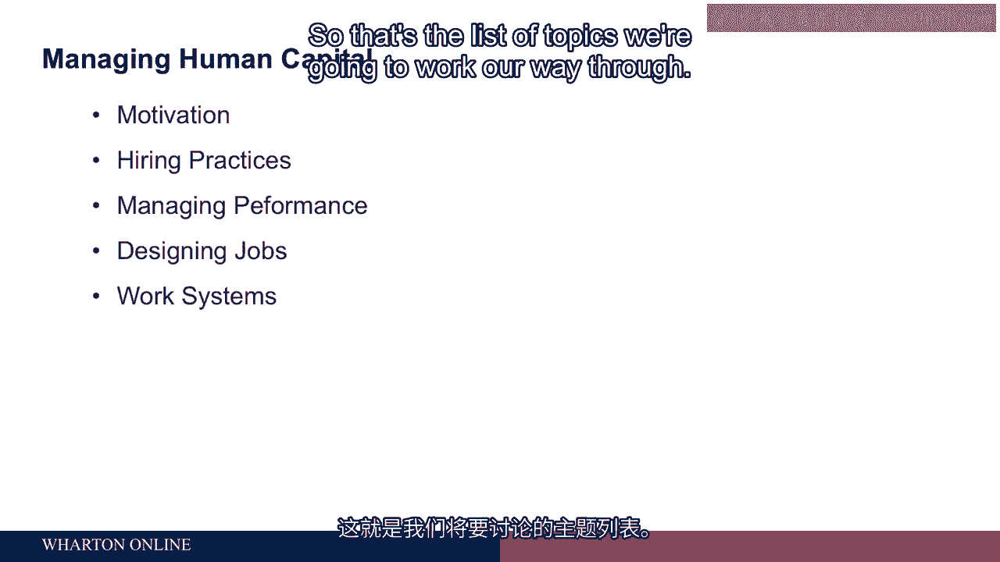
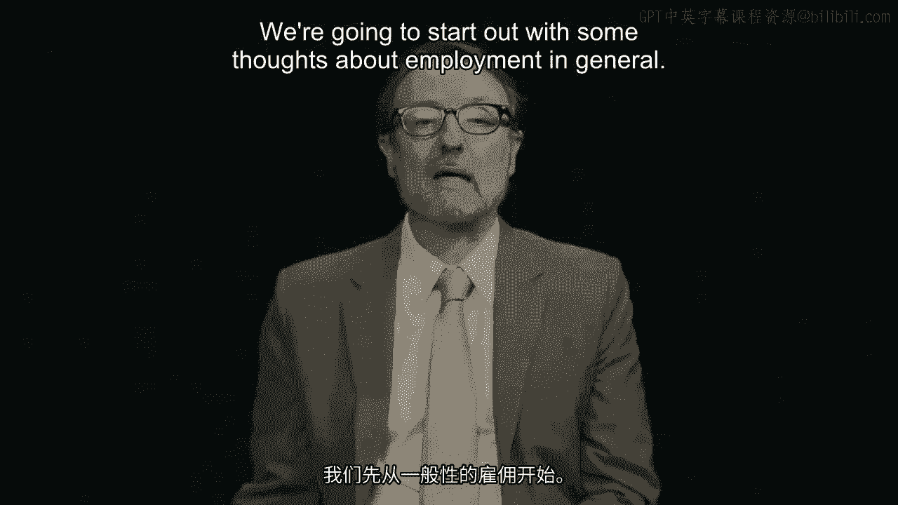
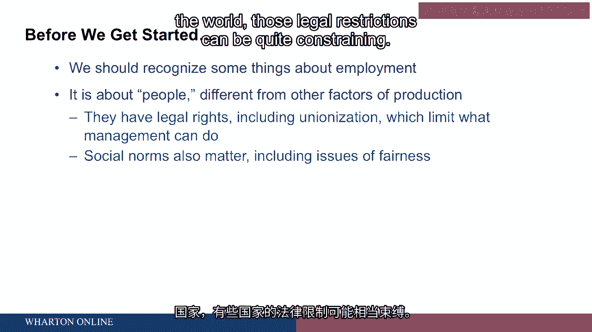
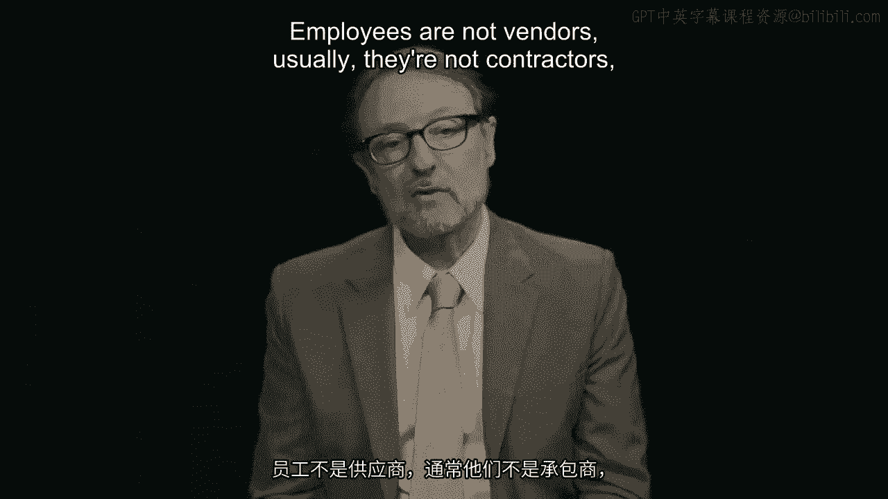

# 沃顿商学院《商务基础》｜Business Foundations Specialization｜（中英字幕） - P79：2_简介.zh_en - GPT中英字幕课程资源 - BV1R34y1c74c

 Hello folks， my name is Peter Capelli。

 I'm a professor of management here at the Wharton School。 I've been here for a long time。

 When I first got here， there was a Republican president in office and it wasn't a Bush。

 So that gives you some sense of how long I've been here at the Wharton School。

 We're going to talk about managing human capital in this program。

 We're going to talk about a bunch of different parts of that that are fundamental， no matter。

 where you are around the world。 These issues play out more or less the same way。

 We're going to start out talking about motivation， how to get people to do the kinds of things。

 organizations or employers need them to do， how to reward people as a part of that。

 Hiring practices， how to do that the right way。 Managing performance and particularly the issue of performance appraisals。

 We're going to talk about designing jobs， how to do a better job。

 Training work that is meaningful and improves people's motivation。

 And work systems that improve performance fit with the strategy of an organization and。

 make everything better off。 So that's the list of topics we're going to work our way through。

 We're going to start out with some thoughts about employment in general。

 That is when you are hiring people。 How do we think about that？

 The first thing to remember is we're talking about people here and particularly for folks。

 who have more of a technical orientation or an economics orientation。

 It's easy to think about factors of production and imagine that they're all kind of the same。

 But they're not。 We're talking about employment。 We're talking about hiring and managing。

 We're talking about people。 And the reason that's different just from a practical concern is that people have legal。

 rights。 And in most countries of the world those rights include unionization。

 the ability to bargain， with the employer。 And basically it means force the employer to do things the employees want。

 And so the ability of management is not unlimited。

 Depending where you are around the world those legal restrictions can be quite constraining。

 The US has probably among the developed countries the most favorable legal environment for employers。

 They can do more things the way they want to do them than they could in other countries。

 But even in the US there are lots of constraints on what you can do。

 Most of the constraints have to do with discrimination against protected groups。

 In the US you see these legislation in the European Union， other countries as well。

 Basically that means you can't discriminate against women minorities。 That means ethnic minorities。

 religious groups， people because of their religious orientation。 And a lot of countries now age。

 So that means in the US people over 40 different countries maybe a little higher。

 What that means in practice is that you can't take employment actions， hiring pay promotions。

 anything that affects people materially in ways that have a particular impact against。

 those protected groups。 And depending on what country you're in the burden is on you to prove that you're not。

 doing that。 If it turns out that most of the people laid off are women for example the burden on the。

 employer is to show that that was done in a way that was fair and was not intended to。

 be discriminatory and instead was based on something sort of objective。

 So in addition to laws we have social norms that matter as well。

 And those norms are really ones concerning questions of fairness。

 And that means the leaders of businesses， the leaders of political leaders of government。

 are held accountable to the way they treat their employees independent of whether they're。

 violating the law。 So this is all by way of kind of a caveat to the things that we're going to talk about。

 You don't have unlimited power as a manager， as an owner。 The way you manage your people。

 the way you might with how you buy computers or how you。

 assemble parts or something like that or deal with vendors。 Employees are not vendors usually。

 they're not contractors， they got a bunch of different。

 rights。 So bear that in mind when we start talking about the important issues around managing。

 people。 [BLANK_AUDIO]。

