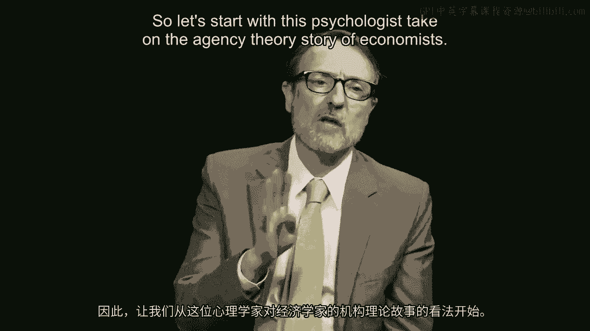
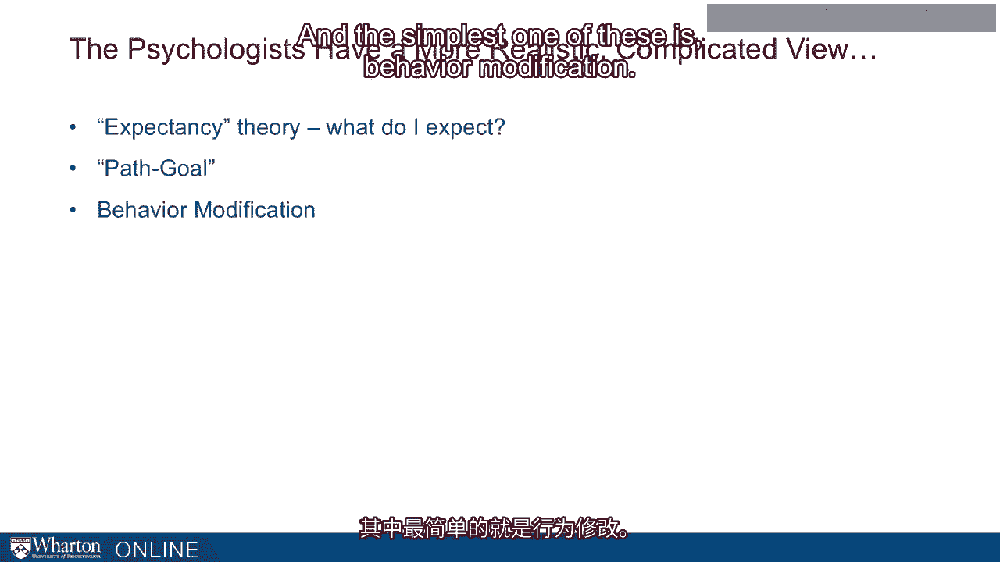
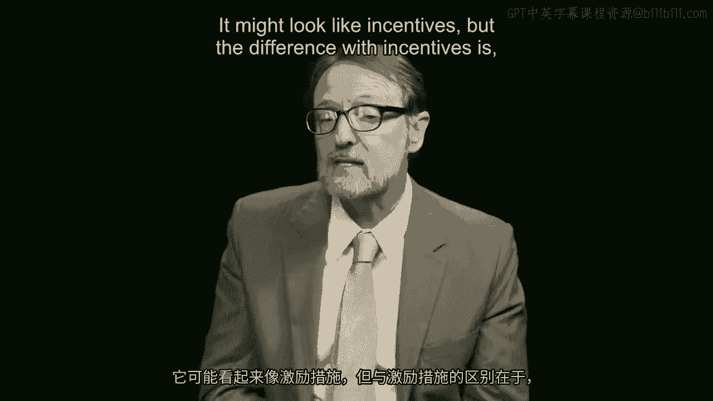
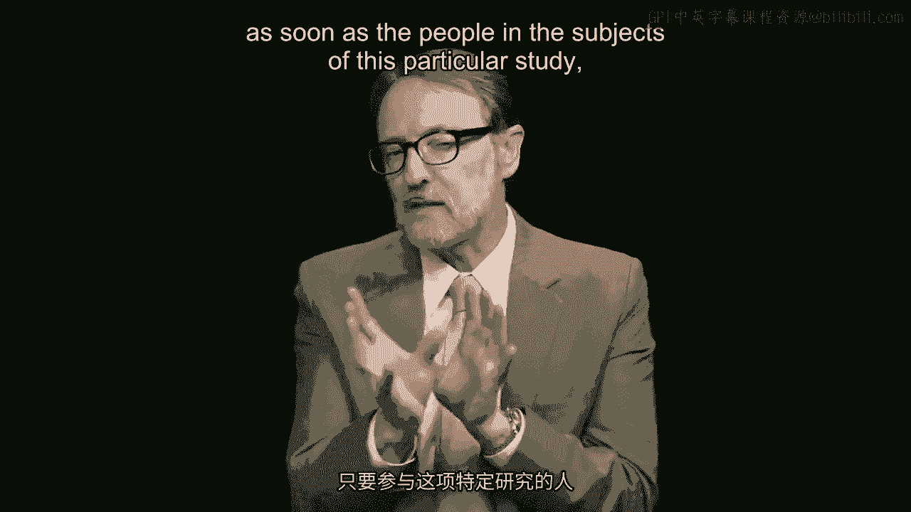
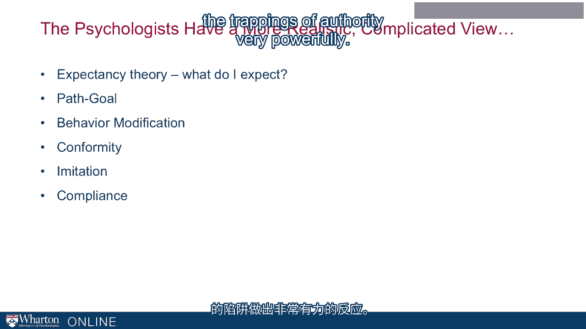
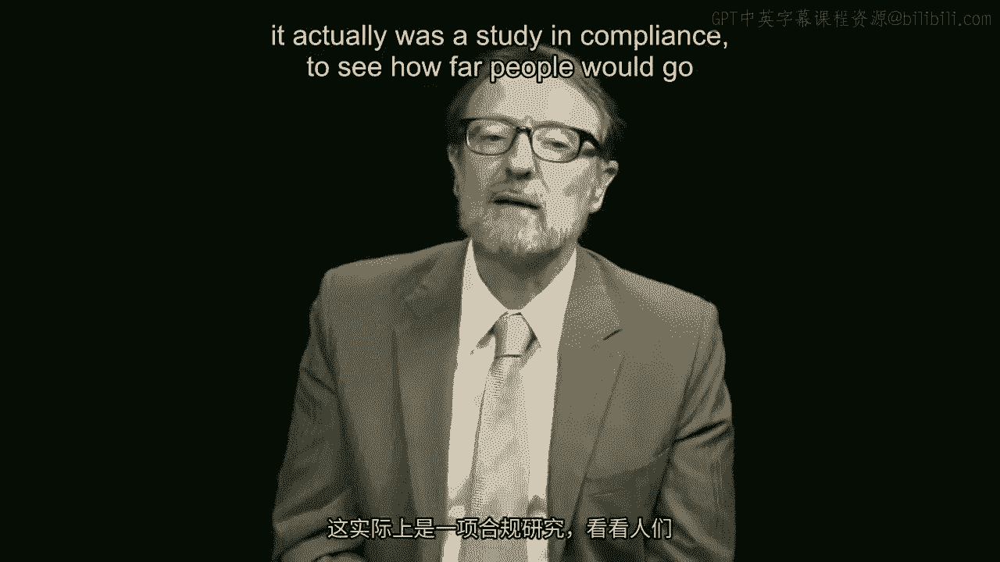
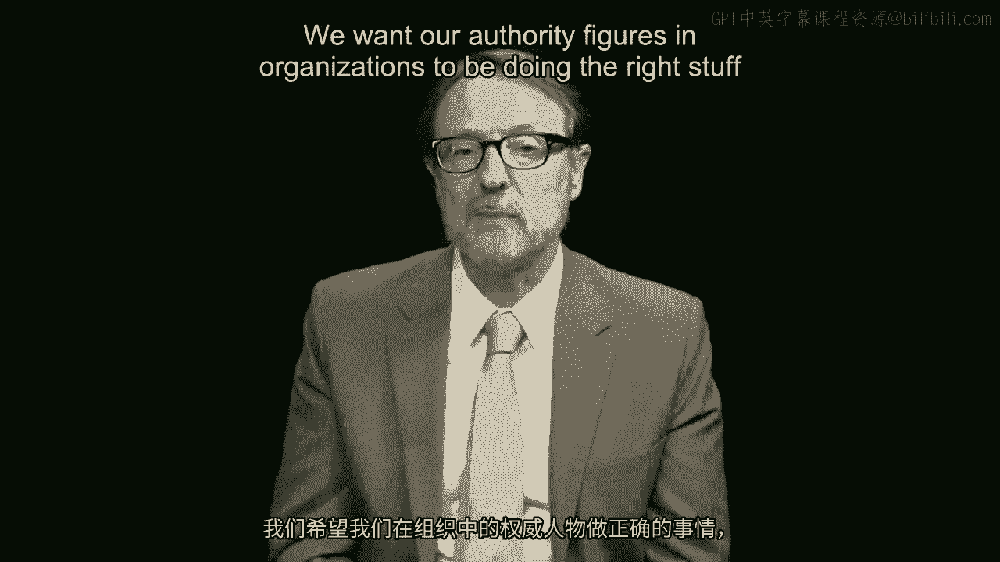
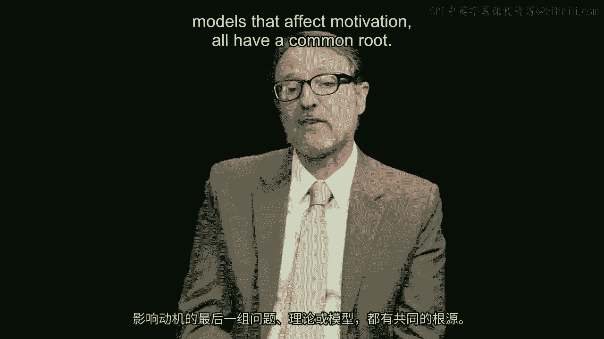

# 沃顿商学院《商务基础》｜Business Foundations Specialization｜（中英字幕） - P82：5_设计激励机制.zh_en - GPT中英字幕课程资源 - BV1R34y1c74c

 more generally when we talk about incentive systems， there's a trade-off， right？ And the。

 trade-off is going to be for employees。 Ideally， you want an incentive system to be based on。

 some measure of outcome that is within my control。 So something about my job。 I do this， I get that。

 right？ If you don't have that， there's really no incentive。 I can't control。

 how much I'm going to get from you。 Then there's no incentive for me to do a good job。 I might。

 do a good job anyway because I'm a good guy， but it's not because of the incentive。 And。

 the problem in lots of jobs is it's very difficult to measure my output。

 If I work at administration， for example， I work in a team or I work in some context where I'm interdependent with。

 people or with idiosyncratic problems， it's very difficult to measure my individual output。

 So another possibility would be to say， well， let's make the output something big like overall。

 firm goal or overall organization performance。 The problem with that is it's beyond my ability。

 to control that。 And the problem with doing that is that I don't feel any incentive。 So。

 if you give me， for example， stock options and I work in a huge corporation， I've got。

 almost zero input into what happens to the share prices。 So I don't really have any incentive。

 There may be other reasons for me to have incentives。 It makes me feel part of the organization。

 but it's not the incentive from those rewards that is making me perform a particular way。 Well。

 how about having that organizational goal anyway？ Well， the other problem with。

 having goals that are maybe within my control and are pretty， even if they're pretty far， up。

 is that it's possible for me to do well at my goal at the expense of the overall business。

 So for example， if I'm a salesperson and you say， we want you to sell more stuff， I could。

 sell a lot of stuff by giving customers a really sweet deal， that's giving them low， prices。

 I could sell a lot of stuff and drive my performance up and my incentive pay up。

 So the problem with that is sub optimization。 I'm doing well at my goal， but it's at the。

 expense of the overall business。 So it's another example of rewarding A while hoping for B。

 So the best solution about most incentive-based pay is to not rely on it too much and to have。

 incentives that are pretty simple。 So if you try to design an incentive system that heads。

 off every incentive to cheat in every possible way somebody might go bad with this， you're。

 going to have to have a rule book that people will have to look up to decide what to do。

 at work all the time and you really don't want that。 Now。

 the one exception we see for incentive-based pay is at the executive level for people whose。

 individual jobs we believe drive the entire performance of the organization and you might。

 be able to tie their pay to overall business outcomes in a way that wouldn't make sense。

 for lower employees because they got no control really over the company's overall share price。

 or overall performance， the agency's performance。 But even here you could get sub optimization。

 We get executives for example whose incentive pay is based on relatively short-term performance。

 and then there's a concern that they are driving up the short-term performance of the firm at。

 the expense of longer-term performance where they're not going to be around。 So it's really。

 hard to get away from these problems of incentives and so the idea that we can simply manage。

 people by incentives is unfortunately just not true。

 Now let's talk about more complicated models of management。 Are these are ones that are。

 developed by psychologists？ So you might think about this as these are more realistic models。

 of how people actually behave but it's much more complicated to understand all these different。

 effects and to also think about how they might be bundled together in any given way of managing。

 people。 So let's start with the psychologist take on the agency theory story of economists。

 The incentive story。 We want somebody to behave a particular way。 Let's pay them if they achieve。

 that。 Well the psychologist added a wrinkle to this which they call expectancy theory。

 Psychologists have a way of calling whatever they do theory and so you'll hear that a lot。

 through this program。 Expectancy theory basically means well what do I actually expect from the。

 employer？ And that might be this if I have got this incentive base plan but I don't trust。

 that if I actually get the performance that I will really get the reward then my motivation。

 falls to zero。 So it's important to have predictability and trust in these models。

 You can't just hand， somebody a contract and expect that that's going to make it work。

 And if you believe that， something might happen change in ownership， change in goals。

 change in compensation structure， then your motivation erodes。

 Another complication created by a different set of psychologists。

 this one particularly by our former Wharton colleague Bob House， is something called path。

 goal theory。 And path goal theory says you could have all the incentives in the world and you could。

 even have a clear goal for people that's unambiguous。 But if they don't know how to get there。

 the incentives aren't going to do you any good。 So for example if you ask me to do something at。

 work that's kind of complicated， solve some particular algorithm or something and here's the。

 reward I get if I do it but I don't know how to do that kind of math， all the motivation in the。

 world is not going to matter much。 So it reminds us of the importance of people having the skills。

 having the training， understanding what to do。 It's not just about incentives。

 The third issue which is where we depart from the economist's soul together begins with a series of。

 what we might call cognitive models that have to do with the way your brain processes information。

 And the simplest one of these is behavior modification。

 An employer or supervisor let's say who goes。

 around a retail store and sees somebody doing good stuff and gives them a spot bonus right there。

 That's a kind of behavior modification technique。 I got a spot bonus for behaving this way。 I start。

 to anticipate that maybe I will get more bonuses if I continue to act that way。 But the beauty。

 of behavior modification is that you don't have to get those bonuses all the time。 In fact some of。

 the strongest motivation， strongest learning about how to behave a particular way from this。

 comes when you don't get them all the time， when you get them almost kind of randomly for doing。

 the right thing。 And it teaches people to behave in a particular way which is unconscious。 It might。

 look like incentives but the difference with incentives is you've got to know it's coming。

 Somebody's got to tell you do this and you get the bonus。 With behavior modification you don't。

 know it's coming and you don't know when you're going to get it。 And it causes you to learn in a。

 different way which is not at the conscious level。 Let's talk about some other ways in which we can。

 manage people to get them to perform the ways we want them to perform。 And these are also of that。

 kind of cognitive variety。 These are associated with social psychology and that is how people behave。

 in the context of other people。 And maybe the simplest one of these is the notion of conformity。

 And that is particularly when there's uncertainty we look around to other people to see how we should。

 behave。 Got a little video clip on this one as well。 So take a look at this and watch what you。

 see the people doing in this video。 The gentleman in the elevator now is a candidate star。 These。

 folks who are entering the man with a white shirt， the lady with a trench coat and subsequently one。

 other member of our staff will face the rear。 And you'll see how this man in the trench coat。

 tries to maintain his individuality。 But little by little。

 He looks at his watch but he's really making an excuse for turning just a little bit more。

 to the wall。 Now we'll try it once again。 Here's the candid subject。

 Here comes the candid camera staff。

 three of them at least。 And this man has apparently been in groups。 [Laughter]。

 Here's a fella with his hat on in the elevator。 First he makes a full turn to the rear and Charlie。

 closes the door。 A moment later we have opened the door。 Everybody's changed positions。

 Now we'll see if we can use。 Now we'll see if we can use group pressure for some good。 Now。

 in a moment on Charlie's single everybody turns forward。 They take off their hats。

 And now do you think we can reverse the procedure watch？

 And what you see here is as soon as the people in the subjects of this particular study see how。

 other people are behaving。 One person two people gets much more persuasive。 Three people especially。

 persuasive。 They conform to what that group is apparently doing。 Now how do you use this in the。

 workplace？ When you hire people into an organization they don't know how it works。 They don't know。

 what the rules are。 You put them in with a group of people who are your high performing people。

 And they'll copy those people。 If you've got somebody who is not doing particularly well。

 maybe for a little while you can put them into a group where everybody is doing the right thing。

 and they start to conform to the norms of the group。 Two other ways in which something similar。

 works。 One is imitation。 Imitation is different than conformity。 Think role models with imitation。

 Right？ Somebody who has power over you like maybe a teacher and somebody who is attractive in various。

 ways。 That is they are what you would hope to be。 Now we find ourselves copying those people。

 That's， what we worry about role models for children especially athletes， actors。

 people who are in the， public eye and are doing glamorous things because young people copy them。

 Same thing happens in the， workplace。 If you've got a supervisor let's say got power over you but somebody who is attractive。

 to you in various ways has what you would want and they're doing the right kind of things at work。

 You're likely to copy that person。 That's good for the organization。 If you've got somebody who's。

 attractive， has some power over you and they're not doing the right things， people are going to。

 copy that person as well。 It's a bad thing。 And compliance is the idea that we really react to。

 formal authority and the trappings of authority very powerfully。 The famous studies in this regard。

 were done by Stanley Milgram in the 1950s showing how people will follow the orders of。

 an authority figure in a medical context。 Somebody with a white lab coat and clipboard telling you。

 in that case to provide electric shocks。 What they were told was a behavior modification study。

 but it actually was a study in compliance to see how far people would go。 Shocking somebody simply。

 because an authority figure told them to do it。 So we have a lot of power that is attributed to。

 people who have authority over us and we tend to do what they say。 And so we need to pay attention。

 to that as well。 We want our authority figures and organizations to be doing the right stuff because。

 if they give people orders we tend to follow them。 And the last set of issues or theories or models。

 that affect motivation all have a common root。 And the common root is something called cognitive。

 dissonance and that means for psychologists who cook this idea up in our heads it's very difficult。

 for us to hold conflicting pieces of evidence at the same time。 Conflicting thoughts about the。

 same thing。 So for example if you've got a kid who you really adore and you think the kid is just。

 wonderful the teacher tells you that your kid is a big problem in school。 Initial response is。

 cognitive dissonance and that means two inconsistent things。 My kid I know is wonderful。

 Teacher is telling me the kid is a jerk。 How do we deal with that？ That's the unpleasantness。

 And in our head we don't like to hold that so we resolve it in various kinds of ways。

 One of the ways in which we might resolve cognitive dissonance plays out in something。

 called goal setting。 The importance of setting goals in organizations or in personal life。

 If you think for example about the models of quitting smoking or other sorts of behavior like。

 that they typically involve you making a promise。 But the promise is often to other people you care。

 about like to your children saying I understand that smoking is killing me and I promise you。

 I'm going to quit。 Okay。 And you give them that letter and they know you've made that promise。

 And then comes the moment soon after that when you want to cigarette what do you do？ Now they're。

 not around they're not going to see you do it so you could sneak away and do it。 The problem is how。

 do you feel about yourself at that point？ I promised my kid I would do this I don't think of myself as。

 a liar and yet I'm going to be doing something which is basically lying to my kids。 The resistance。

 to doing that is because of the skull that you have set and the difficulty of having cognitive。

 dissonance。 I think I'm a good person yet I'm about to violate my promise to my kids that's unpleasant。

 I don't do it。 Another example of this is something known as the pig mailing effect。

 Plays out a very similar way。 It's from the Greek myth and the George Bernard Shaw play and then。

 the Disney Broadway movie My Fair Lady。 The idea that you can shape people's behavior by what you。

 expect of them。 And the pig mailing effect says if you are one of these people especially who's a。

 role model and you convey to the students or the people you supervise high expectations for them。

 it affects how they think about themselves and it affects their performance。 So if you set higher。

 goals for them and higher expectations rather for them they're inclined to achieve more。 Why？

 Because they believe they can do it。 They might say gee I don't think I can。

 finish this race but the coach tells me I can and she believes I can do it。

 Therefore I go back and push a little harder。 So that's how the pig mailing effect works。

 A third example of this which my colleague Mike you seem is going to talk more about later is。

 equity theory and this has to do with unfairness issues。 When we perceive something as unfair。

 it creates a similar problem in our head and we act in ways that try to create equity by changing。

 the balance of our contributions。 If we believe something's unfair maybe we try to make it fair。

 say by not working as hard。 We're going to hear more about that one a little later。 [BLANK_AUDIO]。

