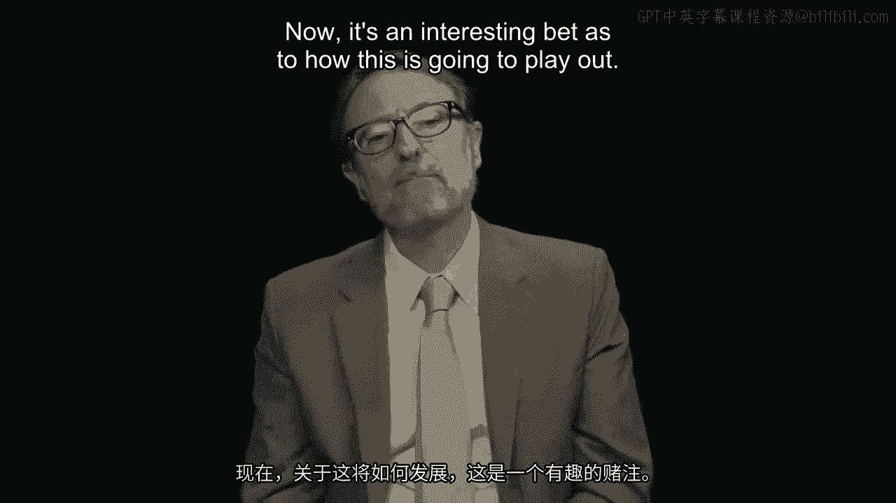

# 沃顿商学院《商务基础》｜Business Foundations Specialization｜（中英字幕） - P84：7_管理绩效.zh_en - GPT中英字幕课程资源 - BV1R34y1c74c

 We're going to talk about a different aspect of management now when it's related to motivation。

 and this is managing performance and the process of performance appraisals。

 This is something which is now ubiquitous in most parts of the world。

 In the US it's been in place for a long time。 Let's talk a little bit about the history of this。

 It started in England in the 1800s when Robert Owens' cotton mills were in business and。

 apparently you got a colored spindle in front of your weaving machine to indicate how well。

 you've been performing。 Everybody could walk past and get a sense of how good a performer you were by the color。

 of your spindle。 The US this was a World War II invention and we started to see a lot of legislation coming。

 in place to require it for the federal governments and also to make sure it doesn't discriminate。

 against people。 There's pretty good evidence that there is something certainly to performance appraisals。

 They do something that's work。 It's not completely biased。 There's a lot of bias in it。

 but it's really unpopular。 Let's talk a little bit about why it's so unpopular， particularly now。

 I think the reason is we've asked it to do a lot of things。

 In the past when it was first started there were three things performance appraisals were。

 supposed to do， supposed to assess your past performance and reward you for it， sort of。

 the incentive model a little bit。 It was supposed to help you get better at your current job and improve your performance。

 It was supposed to in the corporate world help you plan your career path and get better。

 at a bunch of skills so that you could take on bigger jobs and were valuable over time。

 In the 1950s the big focus was on the planning your development part and they weren't paying。

 much attention to your performance at all。 But over time that started to shift toward assessing performance and we started to see。

 again you can look in textbooks now a model of performance management which is pretty mechanical。

 Company sets goals， the goals cascade down to the departments which then move to the individuals。

 or you're supposed to develop individual goals， goal setting。

 For this year which fit into the company's goals for this year then we move toward models。

 of competency base performance appraisal where your supervisor is supposed to assess you。

 not just on your overall performance but the extent to which you manifest certain competencies。

 or skills。 And lots of complex scales and forced rankings which are kind of a tournament based system。

 in order to try to force distributions of people all in the goal of trying to do more。

 to assess your past performance。 There's a lot of reasons why this doesn't work very well and you can look down the list。

 on the slide here and you can see the gap between something you did and what the supervisor。

 tells you about it， concludes about it。 At the end of the year it's kind of like that game of telephone where information is passed。

 around lots of different people。 In this case there's a big time delay especially if the performance exercise is the end of。

 the year。 It's pretty difficult for a supervisor to remember everything you did accurately and let。

 alone to give you feedback about that。 The reason people dislike performance appraisals so much is because it creates conflict or you。

 might say it just brings to the surface a pretty obvious conflict and here's the conflict。

 You can see this is a bell shaped distribution， a normal distribution and if this is performance。

 we're talking about the average employee by definition is in the middle， the 50th percentile。

 zero in this case on the scale on the x axis。 What is the average employee believe they are？

 The average employee believes they are in the 80th percentile so the average employee。

 believes they're well above average。 Why is that？ It's a bias called the overconfidence bias and particularly where we don't know much。

 about what we're doing we are way over confident about how well we are doing it。

 People who are given in a laboratory context a task to perform where it looks like they。

 got a 50% chance of doing it well or winning if it's a game they believe their odds of。

 winning are 75% right。 We're systematically over confident and we're more over confident about the things we know。

 the least about。 So you're a supervisor and you see me after a year and you say you call me in and I'm an。

 average performer and you tell me you're doing fine， pretty okay， you're an average performer。

 and I think I'm in the 80th percentile。 What happens。

 well cognitive dissonance in my head and I'm not happy about it。

 I'm not happy about the fact that you believe I'm average when I think I'm above average。

 and it's easier for me to just blame you for this than it is for me to maybe adjust my。

 view of myself。 So I'm angry at you for the next year right。 So supervisors don't like to do this。

 The employees often believe they're going to be told something that they don't like to。

 hear and so these conversations don't go well。 Nobody wants to do them which is why human resource departments have to bang on people。

 to get performance appraisals done in the first place。

 That's the unfortunate and uncomfortable nature of performance appraisals and it's also worth。

 noting that supervisors are not always completely accurate about their assessments of people。

 There are a bunch of biases that we know affect performance scores。

 Maybe the most important is something called the fundamental attribution error and this。

 is a bias that we have when we look at human behavior to assume that the behavior is the。

 result of dispositions。 If somebody does something bad it's because they're a bad person rather than the circumstances。

 So classic story about this， if you're driving at home in traffic at night and everything。

 is stop and go and somebody comes zip and buy you on the shoulder of the road， what's。

 your first reaction？ I bet you think， oh that guy's a jerk。

 rather than think she's probably on the way to the， hospital it's an emergency。

 We never imagined that it could be circumstance。 We're inclined to write that person off because of what they're doing。

 attribute their bad， behavior， apparently bad behavior to who they are as a person。

 So in the performance appraisal context this means supervisors are kind of inclined to。

 write off poor performance by saying it's the result of the person they're a bad performer。

 and as a result they tend not to manage them carefully anymore and kind of blow them away。

 And a second aspect of bias which is just as important is self-fulfilling prophecies and。

 that means if we've got an employee coming into our workplace who we believe is a very， good worker。

 people tell say great things about them， we tend to manage them differently。

 We give them more opportunities， we don't settle for poor performance from them， we push。

 them harder to improve their performance。 If we think they're good worker coming in we manage them in ways that make them better。

 And the opposite is also true if we get somebody in who we think is not so great， somebody。

 who we don't think cleared the hurdle for hiring by much， somebody says bad things about。

 them when they come in。 We don't manage them the same way。 We're more tolerant of poor performance。

 we don't push them as hard， maybe we think， they're not capable of as much。

 we don't give them opportunities to shine， we don't devote。

 as much attention to them and they don't perform as well。

 So the supervisor is causing the performance differences here。

 And we also know there's a lot of biases related to relationships。

 We give better scores to people who are more like us， we give better scores to people who。

 are physically more attractive， etc。 So the supervisors are not perfect at assessing employees at all。

 which is another part of， the problem。 So we see a model emerging which again is very different than what you might see in。

 contemporary textbooks。 About a third of companies are moving in the direction of they're already there。

 this is， US companies anyway， toward a model which gets rid of formal appraisals altogether。

 The end of the year there's no sit down， there's no form to fill out， there's no score。

 What they've got instead is a model where you and your supervisor are having conversations。

 frequently like all the time about how things are going。

 And they're doing this in part because the model of accountability is just not that important。

 that is holding people accountable for how things performed last year。

 Partly because they're recognizing the incentive model doesn't work all that well， especially。

 in a period that we've been in for decades now where merit pay increases are pretty small。

 a couple of percent。 So how many hoops you're going to jump through for an increase which is not going to be that。

 much different than you would have gotten anyway， at least in terms of dollar amounts。

 And also I think a lot of companies are recognizing that the annual business cycle doesn't make。

 sense anymore。 They don't have annual business plans that matter。

 you can't cascade down to individual， goals from those plans and so forth。

 That a conversational model is much more flexible and helps people talk because the conversation。

 is all the time， not just into the year， about things when they happen and how to fix them。

 Now it's an interesting bet as to how this is going to play out。

 It's a bet the companies are making， there's a lot of big companies in this， Microsoft， IBM， GE。

 that are betting that they can through organization culture get managers to lead these。

 conversations with subordinates and do them all the time in a way that a rule we used to。

 have at the end of the year， one conversation， one scale， one assessment didn't seem to help， us。

 So it would be interesting to watch how this plays out but for a lot of firms and particularly。

 a lot of leading firms， they've given up on the performance appraisal model altogether。

 This alternative model of check-ins but also the model of regular performance appraisals。

 involves giving feedback and that means the supervisors got to give the employees feedback。

 about how they're doing， try to get them to perform better in a way that they can actually。

 take in and listen。 And a key aspect here is the idea of psychological safety as psychologists refer to this。

 We might think of it as kind of common sense。 I'm not going to tell you the boss something that you're going to punish me for。

 So the end of the year when you're meeting at me and we're talking about my performance。

 and you're going to give me merit pay increase as it was after this conversation， you asked。

 me how things went this year， I'm not going to tell you about problems。

 It's like talking to Santa Claus， right？ Your Santa Claus is asking you if you've been good this year and it's going to give you。

 presents afterwards。 I'm not going to tell you I was a jerk this year， right？

 So you don't get much of a conversation at that point。

 So can we create a context where there really is a discussion and I'm going to tell you。

 the truth that only happens if there's no consequences， bad ones for me revealing problems， right？

 And that means not in the context of merit pay increases。

 There's also something called a negativity bias which is hard to get our hands around。

 and that means that people really do worry about bad feedback。

 If there's a piece of negative information about us， we disproportionately focus on it。

 seven times or more as much attention paid to a piece of negative information as we would。

 give to an equivalent piece of positive feedback， right？

 So this means that we ought to think about how people are going to interpret what we， tell them。

 not just give them straight up feedback and then let them worry about it because。

 we know the way they process it is going to be heavily weighted toward whatever negative。

 things we say so we got to be pretty careful about how we code all that up and present。

 it to them。 As a supervisor， there's probably nothing more important than giving employees feedback。

 It's a way of first of all helping them get better at their current job which is really。

 important for the organization。 It is a way to help them build their career and for the business and particularly the。

 belief in the importance of incentives， it is the way in which we let them know how they're， doing。

 So if you're a supervisor， I would say the single most important thing to worry about。

 is getting better at giving people feedback in a way that they can take it in that doesn't。

 threaten them。 They're really listening to what you say and they're going to change their behavior because。

 of it。 So we think about all the topics around management。

 A couple of the biggest ones we've talked about today， motivation and managing performance。

 In our next edition here we're going to talk about some other more macro level organization。

 level issues around managing people。 That is how to bundle a lot of these things together into systems that fit with business。

 operating models and fit with business strategy。 [BLANK_AUDIO]。

