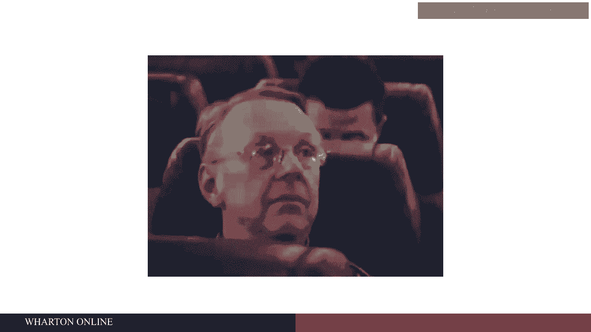
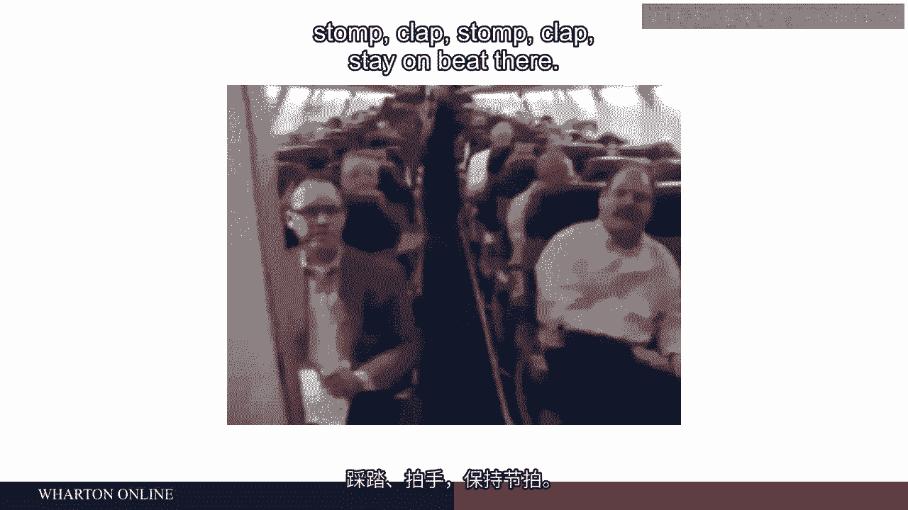

# 沃顿商学院《商务基础》｜Business Foundations Specialization｜（中英字幕） - P88：11_工程师与心理学家-设计工作的战争.zh_en - GPT中英字幕课程资源 - BV1R34y1c74c

 So let's talk a little bit about what job design might look like。

 With an example that we see a lot at the Wharton School， and that's the job of junior analysts。

 these are people who leave college and go to work for investment banks。

 What do those jobs look like？ Well at least in a lot of places。

 the students find them pretty miserable， and the common， theme about them is job design。

 So what they find that they are doing is spreadsheet analysis。

 They get some data and they're told to manipulate it and excel and do some various kinds of。

 calculations with it。 And that might not be bad except that they do that every day， all day。

 usually the same， kind of analysis once they figure out how to do it。

 They just do it over and over and over and over。 There's no variety in that。

 And there's no real control over how they do it either， or when they do it。

 It's dropped on their desk。 We need this by tomorrow morning。 And here's how you got to do it。

 Everything is exactly the same。 This most surprising thing is that they've got no idea what they're actually working on。

 Typically nobody tells them， they just give them the data。

 So this idea of the significance of what they're doing， they might be working on something。

 really big for a country or something， they never know。 And how well they do on these tasks。

 They often don't know that either。 They hear maybe somebody comes in yells at them if there's a problem。

 but otherwise， they never know whether they've done a good job or a bad job。

 And you think about the consequence of that， the fact that they hate their jobs means in。

 order to get them to do these jobs and to stay there you got to pay them a ton of money。

 which was the deal。 You got a really boring job， you're not going to like very much and it's incredibly hard。

 and lots of hours and demanding but we pay you a ton of money。

 Now if you think about how you would fix that job， it's not that hard to do。 Simple way to fix it。

 simple as thing to do is to just tell people what are you working， on。

 It takes 10 seconds to tell them this is a bond issue for the kingdom of Jordan or something。

 like that。 So you know what it is。 And then when you're doing the final presentation maybe you let them sit in the back of the room。

 so that they get a sense of why this matters。 They also get some feedback。

 does the client like this whole project or not。 And maybe if they got to do spreadsheet analysis at least you could have them do different analyses。

 over the course of a week so it's not the same one all the time。

 And could you give them a little control over when they do it at least schedule and maybe。

 to some extent how。 It's not that hard to fix this kind of work in ways that would make people like it better。

 and when they like it better quality goes up and people stay longer and performance improves。

 as well。 So I have a little video here I'd like to show you something that went viral in an airline。

 So take a look at this。 Good evening folks welcome aboard Southwest Airlines flight 372 service to Oklahoma City。

 Those of you that have flown us before know that we do things a little bit differently。

 in Southwest。 Some of us tell jokes， some of us say some of us just stand there look beautiful。

 I unfortunately can do none of those。 So here's the one thing that I do know how to do。

 We're going to shake things up a little bit。 I need a little audience participation otherwise this is not going to go over well at all。

 So here's what I need especially you guys in the front because you know what's coming。

 Alright I need a beat。 All I need you to do is stomp and clap and I'm going to do the rest because I've had。

 five flights today and I just cannot do the regular boring announcement again otherwise。

 I'm going to put myself to sleep。 So you guys with me？ Alright so give me a stomp clap， stomp clap。

 come on stomp clap， stomp clap， they don't。

 be there。 There you go keep that going。 This is right 372 on SWA the flight attendants on board serving you today。

 So recent in the middle David in the back my name is David and I'm here to tell you that。

 shortly after takeoff first things first they're soft drinks and coffee they're quenched to。

 first but if you want another kind of drink then just holler。

 Alcoholic beverage is a B four dollars if a monster finish a drink as your plan that。

 a B three dollars and you get the whole game we won't take your cash you gotta pay with。

 plastic if you have a coupon then that's fantastic。

 We know you're ready to get the new places open up the bins put away your suitcases carry。

 on items go under the seat in front of you so none of you are things by your feet。

 If you have a seat on the road with the exit we're going to talk to you so your mind is。

 well expected you gotta help evacuate in case we need you。

 If you don't want to them we're going to reseach you before we leave our advice is put away。

 your electronic devices fast in your seat belt then put your praise up press the button。

 to make the seat back raise up sit back relax have a good time。

 It's almost time to go so I'm done with the line thank you for the fact that I wasn't。

 ignored this is Southwest Airlines welcome aboard。

 Thank you very much for my be I appreciate that you will not get that on United Airlines。

 I guarantee。 So in that video you could see that the flight attendant was doing exactly what flight attendants。

 always have to do there's certain information they're required by the Federal Aviation Administration。

 to convey to you about the flight and about safety but they get to do it in a way that。

 taps maybe into their own creativity a little bit and they like it better and turns out。

 the passengers liked it better as well。 So I think what we've had is a result of these lessons which began in the 1970s and progressed。

 through the 1980s about how to design jobs differently is a kind of a battle that went。

 on between engineers who designed jobs and psychologists who designed jobs and on the。

 same campus at universities you could go into an engineering department and meet the industrial。

 engineers who were designing jobs as if Frederick Taylor was more or less still around guiding。

 them time in motion studies you know the one best way to do stuff fitting people to the。

 machines and the logic of the production process and then you could cross the campus and go。

 talk to the psychologist who would be explaining to you why that method of designing jobs was。

 a disaster and you had these two kind of fighting and frankly the engineers were winning most。

 of the time maybe because they were already in place but after we started to see things。

 like the Lordstown， Ohio factory and those problems spread across the US economy and into Europe。

 as well started to cost companies a lot of money not just in turnover but especially in。

 quality and having to make up and try to fix quality problems is really expensive but especially。

 competition from foreign producers where they didn't seem to be having these problems really。

 made US companies and then European companies as well start to take all this much more seriously。

 Thank you。 [BLANK_AUDIO]。

