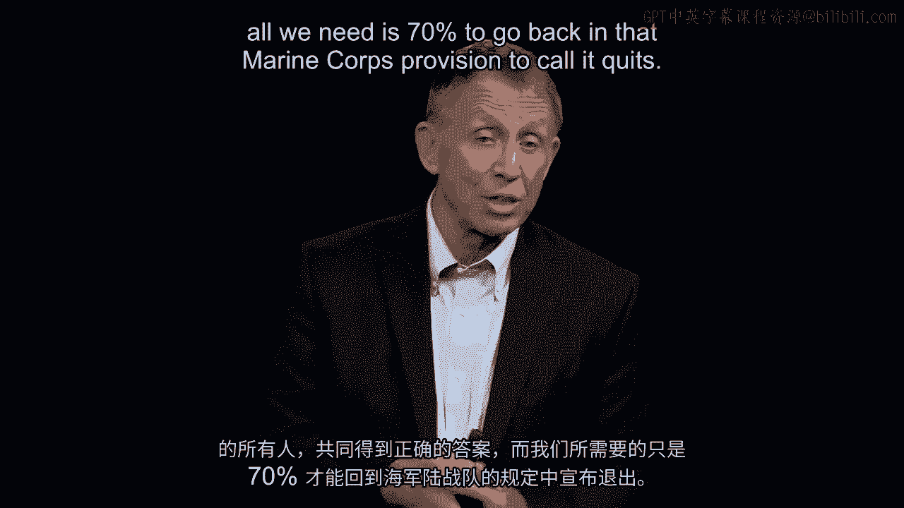

# 沃顿商学院《商务基础》｜Business Foundations Specialization｜（中英字幕） - P92：15_做出及时而明智的决定.zh_en - GPT中英字幕课程资源 - BV1R34y1c74c

 Now that you've had a chance to give very quick thought， our topic here is good and timely。

 On this particular decision， I know from prior experience that some of you have written down。

 $39。 A few of you have $22。 Others， other rooms have $83。

 Remember at $161， and I know from prior experience， they're probably at least if we put 25 people。

 in a room together， there are at least seven or eight different answers。 That's a statement。

 by the way。

 This is a very tough problem。 But if we now took the next step going back to， let's say。

 John Chambers and the work。

 of Kathy Eisenhart， we have made our own decision。 We've written down the answer。

 but at this point we haven't communicated。 We haven't talked with a trusted advisor， a counselor。

 So what I would do， we're not going to do it here， but what I ordinarily would do， I'd。

 recommend in your office that you do this later today， is before you make the final concluding。

 judgment call， turn to somebody else whose advice you know is informed and you trust。

 and try this out with them。

 And we do that in a room pretty quickly。 Discussion explodes as these people， for example， at $61。

 wants to know from the $39， or maybe， from the $161， why the others are wrong in the room。

 But in the process of that consultation， the discussion you're thinking will evolve。

 And let me bring in that， I labeled it strategic intent， commander's intent factor as well。

 As we look at this problem here， my guess is sitting in your office looking at this here。

 some of you probably did wonder， should I take into account a bad check fee， or maybe。

 opportunity costs？ Or what about reputational damage？ And a question back to you is。

 should those be in your thinking or out of your thinking？

 And since I didn't make that clear at the outset， I have failed to be clear in my strategic， intent。

 which makes it tougher for you to make this decision。

 I should have been clear， I'll be clear now， take everything out aside from just cash in。

 and cash out。 No reputational damage， nothing else。 And then finally， my strategic intent。

 not yet fully clarified， here's my final clarification。 If we had time。

 I would have you get into a room with people， share your answers， talk， them back and forth。

 And then I'm going to say， my purpose in this exercise， my intent was not that you get the。

 right answer。 It felt that way， but actually that was not my intent。 My intent was that you。

 the people in the room collectively， jointly， have the right， answer。

 And all we needed is 70% to go back on that Marine Corps provision to call it a， call it。

 quits once we get to 70% agreement， we're done。 And with that statement that the objective。

 the intent is for not for you to be right， but for the organization， the community group。

 the company， the hospital， the university that， you may be managing， to be right， I've noticed that。

 call it human behavior in the room， it。

 materially changes。 Up until that point， people are kind of taking their own counsel。

 kind of puzzling through。

 their own thinking。 As soon as I say， my intent is for you collectively or at least 70% to have the right answer。

 then， people begin to step forward， people will go to a blackboard or a whiteboard， begin to。

 track it through。 With that being said， as you look at the answer that you have written down。

 just keep that， in mind。 And now I'm going to walk us through what is， quote， the right answer。

 This is such a tough problem that we decided to adjudicate， decide what is the right answer。

 by asking professionals who do this for a living to take a look at the problem and give。

 it their best shot。 Thus we arranged for 30 certified public accountants。

 people who look at cash in and cash out， of companies and organizations through their career。

 To take a look at this problem， we gave them one minute to write down their best shot， the。

 30 people working individually。 And at the end of that 60 seconds。

 there were 13 different answers in the room， believe it。

 or not。

 Some were at 22， somebody a couple were at 39， others at 61， some were at 161， one said， zero。

 one said more than 200。 Now we might take that to be a criticism of the profession that there's disagreement among。

 professionals， but we gave them a few more minutes to work this through now collectively。

 And they actually sat and began to cross talk。 I encourage people who didn't agree with others in the room to spend time talking across the。

 room。 We also made it clear that the agenda here was for the 30 CPAs to have the right answer。

 not just individually to have reached a tentative conclusion。

 And with that additional time with strategic intent made clear with discussions among other。

 people， in a sense， metaphorically trusted counselors， the certified public accountants。

 after about five or six minutes， they did say in their professional judgment， the correct。

 answer is $61。 Very briefly， $39 out to buy the necklace， $22 in change。

 the jewelry received $100 from。

 the neighbor， returned $100， put those four numbers together， and it's a $61 loss。

 Now with that， all this is meant to drive home the five points from the work in Silicon。

 Valley comparing fast and slower moving， in this case firms in the software industry。

 Keep in mind those four concepts out of the US Marine Corps。

 Keep in mind what John Chambers said just to amplify that point of having a trusted counselor。

 Several of those factors， not all， but several of those factors we've seen at work here to。

 sum this up once I've clarified strategic intent in several different ways。

 That's an important idea。 That was number two on that Marine Corps list。

 And once we talk with others in a room in whom we have a lot of trust and faith and confidence。

 and one strategic intent that it's not an individual outcome we want but a we want something。

 that's going to benefit the organization， be optimal for the organization， then predictably。

 groups like I just described will end up almost always at $61。

 Most people aren't that when they look at it individually。

 Most call it a team if there's cross collaboration here。 Most cross collaborating teams。

 good people in a room do end up at $61。 Kind of a confidence builder that these factors for the Marine Corps in the Valley。

 Silicon。

 Valley and for John Chambers indeed are practical and in fact impactful。

 [BLANK_AUDIO]。

