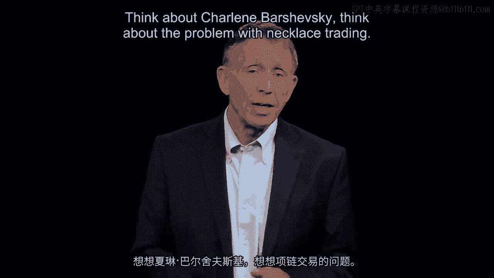
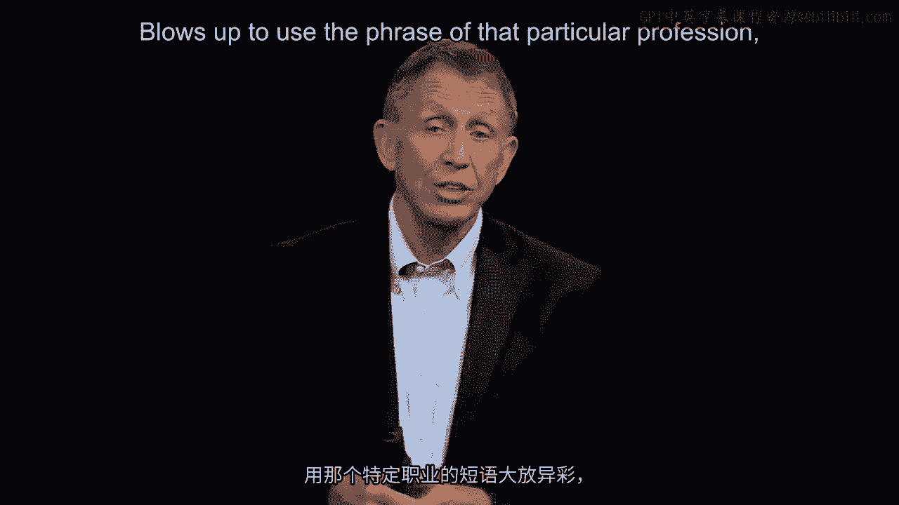
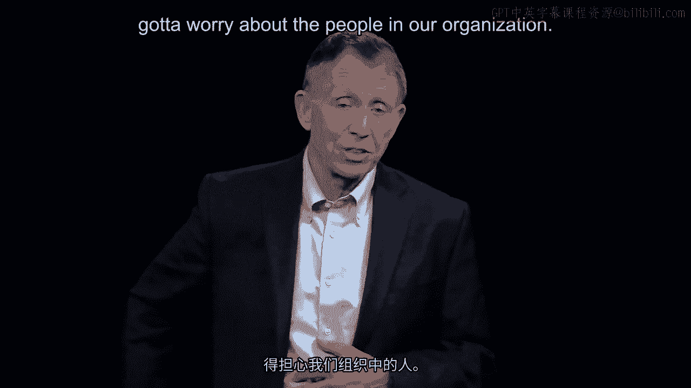
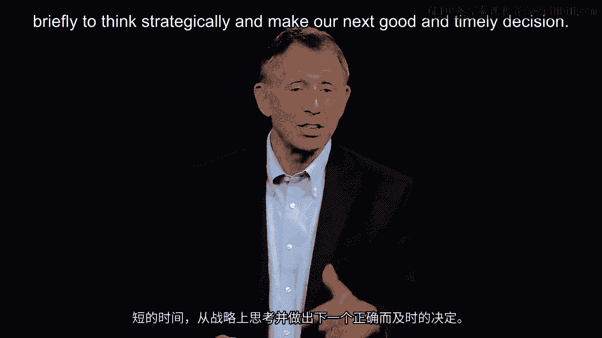
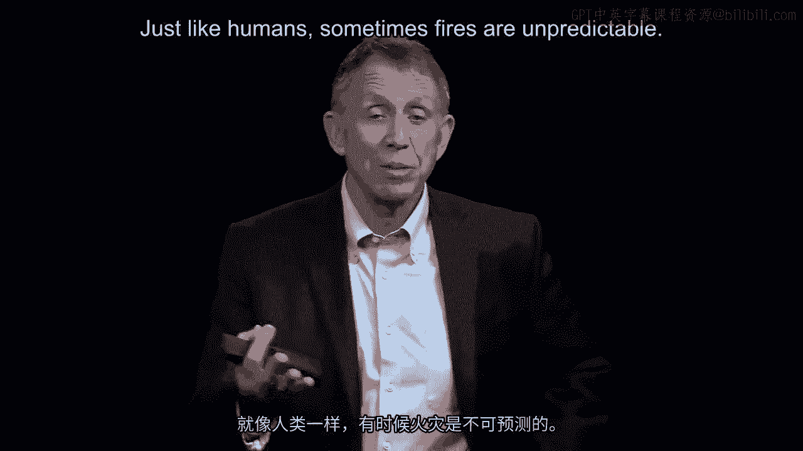
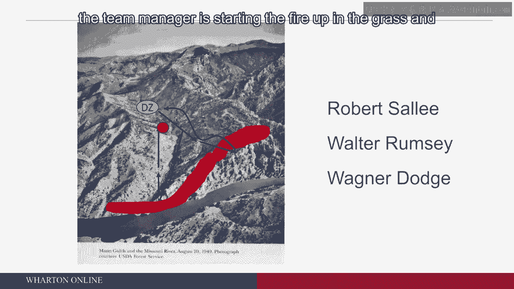

# 沃顿商学院《商务基础》｜Business Foundations Specialization｜（中英字幕） - P94：17_灭火.zh_en - GPT中英字幕课程资源 - BV1R34y1c74c

 Let's go back to John Chambers， Silicon Valley。

 Those four good precepts from the Officer Candidate School of the U。S。 Marine Corps at。

 Quantico， Virginia。 Think about Charlene Barchevsky。 Think about the problem with necklace trading。

 And now we're going to do a bit of a deeper dive into a very difficult circumstance。

 Take me about five minutes to describe it。 And then I've got four or five questions I'm going to throw at you。

 So absorb the information as we go forward in that I'm going to take all that we've done。

 up to this point and ask you to apply what we learned from Silicon Valley， from John， Chambers。

 from the U。S。 Marine Corps， from Charlene Barchevsky， from Ann Livermore， from。

 Charles Iolacchi and beyond to interpreting the good and timely decisions that are going。

 to be made as the team drops。 There's the DZ， the drop zone you see now。

 And as they are on the ground and I'll do this a non-metric， the drop zone is about one。

 mile from the fire。 The fire again scoped very small by Western U。S。 fire standards。

 It's about 30 acres， small fire。 Fires like this start all the time with a lightning strike。

 That's what happened here。 It's a very dry and combustible area。 It's late early August rather。

 And thus as you hit the ground， the drop zone， with a total of 16 firefighters， you're going。

 to be heading towards that fire about a mile away and a relatively routine operation they've。

 been doing this dozens of times across the summer months。 As I said already， it's August 5th。

 And at five o'clock after the team is on the ground at four， the team leader， the team， manager。

 The TU， aged 33， his name is Wagner Dodge， simply turns to the other 15 members of his。

 team and says， "Let's go。 Three words。 Let us go。 Let's go。"， And the team heads down。

 There's the arrow towards the fire about a half mile on its way to the fire area。

 And now the manager of this team， without explaining himself， in fact behind the scenes。

 other firefighters refer to him as a man of few words。 Technically brilliant。

 but very often almost saying nothing。 And true to form when he gets to that one mile， sorry。

 half mile point between the drop， zone and the fire， he turns to the team and he says。

 "All right everybody， stay here。 Eat something。 I'll be back。"。

 And now to add to a point to anybody's good and timely decision-making template， he heads。

 towards the fire， the team leader， the team manager， to do what， to give it a fancy or。

 maybe a more academic phrase， his due diligence。 What that means is nothing more than knowing what our strategy is。

 which is to safely put， out the fire。 I'm now going to check to see， is。

 can we do it from this side？ Out of the fire conditions I should be savvy about due diligence。

 By the way， he's doing that by himself。 Keep note of that。 As he comes close to the fire。

 his name is Wagner Dodge， age 33， nine years of experience。

 He abruptly turns around and goes back to where the team is finishing off their sandwiches。

 And to give that a time point， the lunch spot， that first arrow， they began at five o'clock。

 and they get to the head of that first arrow at about five twenty。

 He's now come back and he says to the team without explaining what he saw， which was， very bad news。

 I'll come to that in just a second。 I want you to go directly down on the chart here。

 I want you to go down the mouth of the gulch to River's edge。 By the way。

 the river is the Missouri River。 It originates in Montana， most Americans， myself included。

 didn't appreciate that until I went， there。 And thus he sent fifteen firefighters without himself down to River's edge。

 In the meantime， he's going back to the drop zone and that's that upper wavy arrow that。

 actually has an arrow head back at the DZ just to the right。 He doesn't explain that。

 He doesn't explain why the firefighters have been sent down to the mouth of the gulch and。

 that's characteristic of Wagner Dodge。 What he says behind his back who worked with him。

 he's a man of few words。 Technically brilliant， nine years of experience for frontline five years now as a team manager。

 and he knows how fire behaves。 But he never seems to really want to put that into words in any form whatsoever。

 And thus the team begins to head down to the mouth of the gulch without the boss。

 The team manager has gone back to the drop zone for reasons unexplained。 That's that upper arrow。

 Now if you were on that team， let's say a person being managed by Wagner Dodge， I'd like。

 you to now calculate or maybe just try to understand why has he sent you down to the。

 mouth of the gulch。 If we had an opportunity to talk about that pretty quickly。

 we're all saying that because， there I didn't mention this。

 I'll mention it now because of a wind very strong gusty blow。

 that's coming from the lower right hand corner heading up to the upper left hand corner is。

 probably hitting 40 miles per hour。 This fire is very dangerous。 Could blow up。

 And what Wagner Dodge also discovered when he got close to the fire doing his due diligence。

 good that he found this out is that the material on the ground is very dry， very thick， very。

 combustible， more so more dangerous than what he could see from the aircraft as he circled。

 twice around the drop zone。 So he's got 16 people now in potentially a lot of harm's way。

 So the firefighters are now heading to the mouth of the gulch to come back to my question。

 I'd like you to think for a second， the first of five questions。

 Why have you been sent down to the mouth of the gulch？ Well。

 some of you are thinking no doubt that it's to get around the call it the leeward， side of the fire。

 The fire is blowing away from you harder to stop it， but a whole lot safer。 Secondly though。

 very important firefighters then knew this。 If you have a stream， a lake， swimming pool。

 an ocean close by， if the fire goes nuts， begins， to spread。

 blows up to use the phrase of that particular profession， then you simply get。

 into the water， become a firefighter ironically at that time， you have to pass a swimming test。

 and you will survive any fire condition。 So the firefighters， they are thinking。

 as I hope you thought too， we're going to the。

 leeward safer side， consistent with the strategy。

 Safety first is the top of the strategy for a firefighter and also we are thinking about。

 worst case scenario。 Part of the manager's template， if you will， got to think about worst case。

 what can go， wrong and we got a guard against that。

 Got to be ready to bring over optimism down so it's extremely realistic。 With that being said。

 I'm going to take us now to the next point。 Wagner Dodge。

 that's the name of the firefighter in charge。 The manager of the steam gets up to the drop zone。

 comes racing back and overtakes the， team at about 5。20 pm。 So there's a final arrow I've drawn。

 a little hard to see there in the middle of the gulch。

 They're almost to water's edge and now Wagner Dodge， the team manager， has resumed his。

 place at the front of his 16， a total of 16 firefighters。 And by the way， for the last few minutes。

 the number two person， momentarily， this is going， to figure into the architecture of the moment。

 the number two person， first name is Bob。 When the incident commander as the title goes。

 when Wagner Dodge went back to the drop zone， the number two person temporarily becomes number one。

 That's the protocol。 The number two person's name is Bob， Robert Sally， French Canadian name。

 is feeling probably， pretty good about the fact that even though he's age 17。

 he's actually the front leading， firefighter， only temporarily。 But for a moment。

 he's the team manager。 But now it's 5。40。 And again， thinking strategically， for strategic intent。

 where does the intent come？ Well， we've got to think strategically。

 I'd like you to take just a couple seconds here。 And if you're the team manager。

 what are you thinking？ Right now it's 5。40 PM on this fateful day， August 5th of summer。

 What are you thinking about in light of what we've talked about so far and even go back。

 to this section of this whole course on strategy？ So just take a second。

 think through what's on your mind or should be on your mind。 Good。 Sure enough。

 you're thinking about the condition of the people behind you。

 Got to worry about the people in our organization。

 Are they fit？ Are they staying with us？ Got to think about where we can hunker down at nighttime。

 kind of forward planning。 Got to understand what the fire is doing。

 I have to appreciate do we have the right equipment？ And is there a need maybe for backup？

 More firefighters because this fire with a 40 mile an hour wind threatens to become a。

 much larger inferno。 And unfortunately， in a few minutes we just paused ever so briefly to think strategically。

 and make our next good and timely decision that fire misbehaved。

 Just like humans， sometimes fires are unpredictable。

 And instead of going up towards the upper left hand corner， that fire has cut off our。

 escape to the river。 We're not getting to that water。 And now speaking of good and timely decisions。

 Wagner Dodge， 540PM abruptly turns and begins， to head actually back up towards the drop zone。

 And in his head now are grave concerns about their， in a sense， entrapment behind a wall， of fire。

 It's about a hundred feet vertical。 It's about a thousand degrees Fahrenheit。

 It's got a big wind coming。 It's up its backside。 And so he doesn't hesitate to take action。

 Good and timely decisions here。 He says to number two， remember his name is Bob。 Bob。

 drop everything。 Get rid of it。 Throw it down and now stay with me。

 It's going to be a run for our lives。 You got that Bob？ Pass it down the line。 Well。

 can you imagine？ Got some summer volunteers。 They're all firefighters。

 but a few people have only been at this business for eight or， nine weeks。

 They haven't heard this before。 Word passes down the line and they are really moving now up towards the drop zone。

 really。 Where else can they go？ And at this point。

 Wagner Dodge though makes a final terrible discovery。 He kind of knew this， of course。

 but just didn't put it all in a broader context that， he's coming out now of a forest。 And so far。

 no problem in a sense because a fire will cut through a forest， a stand of。

 trees， at about four， five， six miles an hour。 Most people can outrun that on a sustained basis。

 even going uphill， which is what they've， been doing， of course。 But now all of a sudden。

 Wagner Dodge， everybody else strung out behind him some feet away appreciates。

 that he's leaving the forest and he's coming into an open area that is populated， covered。

 with thick， shoulder high， bone dry， prairie grass。 I think intuitively we know the problem。

 He knew it technically。 A fire and prairie grass can spread through it at 15 to 20 miles an hour。

 It feels like the grass is blowing up。 It's not。 The fire just moves at a pace。

 Nobody can outrun under the circumstances。 We're uphill。 We've got big boots on。

 If you do a four minute mile， you're doing 15 miles an hour， you've got to do 20 miles。

 an hour going uphill， thick grass， heavy combat boots on。 You're not going to do it。

 And so for the moment， Wagner Dodge stops right now probably 549 PM and takes a match out。

 of his pocket and starts a small fire right there。

 A little red dot fires spreads out through the grass， becomes a burning ring of grass。

 Wagner Dodge steps back， takes a running dive through that burning ring untouched by。

 the flames really。 And now he's in the middle。 He's a man of few words。

 so he's not going to explain his actions。 But Bob， the number two guy， can see that the boss。

 the team manager， is starting to， fire up in the grass。

 And it spreads out very quickly。 And the boss now has gotten inside a burned out area。

 I'd like you to take just a moment to think about what's the purpose of that fire。 Unexplained。

 but you can imagine Bob is trying to understand what's the boss doing。

 We've got plenty of fire coming up our tailpipe。 Why does Wagner Dodge want to put more in a landscape in front of us？

 Couple seconds pass， Wagner Dodge signals to Bob。 Bob， get in here now。 And Bob。

 for reasons I'm going to have you think about， start thinking right now about， this decision。

 decides to go left and he goes up over a cliffside or kind of a cliff crest。

 and plunges into the next valley over to the left of the screen there。

 The third firefighter today in this line， sort of like circus elephants almost， is named。

 Walter Rumsey。 And Walter takes a look。 Does he follow the guy he's been following？

 Does he follow the team manager？ You。 He doesn't understand necessarily what that fire is all about。

 And whatever the thinking is， Walter decides to go with Bob。 So very physically。

 the red dot now has one person， the team manager。 Two people have broken away from the team manager and they're now down on the other side。

 of a crest。 The other 13 with fire increasingly coming up their backside。

 their shirts are beginning， to smolder from the radiant heat。

 And I'm going to sum it up with three final arrows right here。 The final 13。

 represented by three arrows only， take a look at Wagner Dodge and a small， burned out area。

 They kind of appreciate we think that two ahead of them had gone over to the left。

 But they're in a thick prairie grass when the fire does overtake them。 And thus the summary。

 terrible tragedy I'm going to ask you now to interpret what happened， the after action review。

 looking back on decisions so we can make them better next time。 [BLANK_AUDIO]。

