# 沃顿商学院《商务基础》｜Business Foundations Specialization｜（中英字幕） - P98：21_组织设计.zh_en - GPT中英字幕课程资源 - BV1R34y1c74c

 Pulling several strands together of our last 20 or 25 minutes of thinking is through actually。

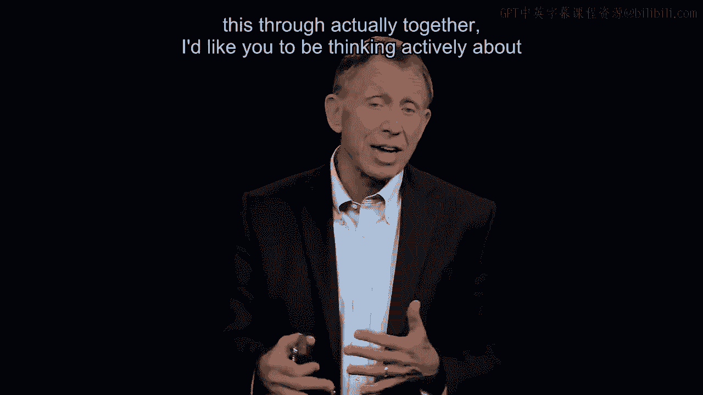

 together。 I'd like you to be thinking actively about your own management and work setting as we。

 go forward。 Of course， that organizational design along with the way we create jobs。

 the way we incentivize， people， the organizational design， think of the people at Howser Foods。

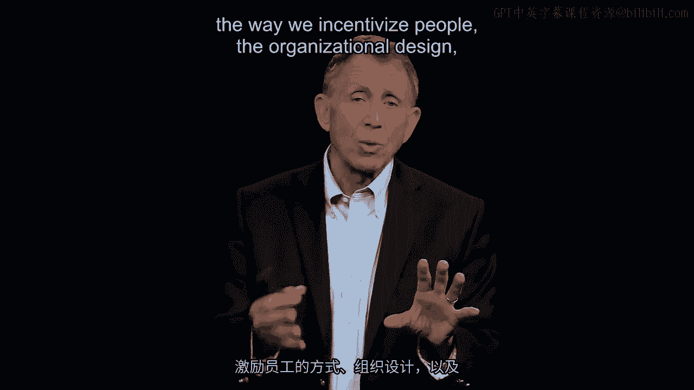

 The Dan Boyer in particular can be altered or misdirected or aligned or maybe in a more。

 positive sense we can get a lot more， pay no more， not really changing the job but just。

 the way we knit all these pieces together。 How people report， how we promote up through a hierarchy。

 all part of the， just to use， the phrase of the design of the organization。

 the architecture of the enterprise。

 With that being said， here's the last problem I'd like us to think about in this general。

 area of putting in place an organizational design that serves you。 Sometimes though。

 what we have serving us well， maybe even not perfectly， a couple years。

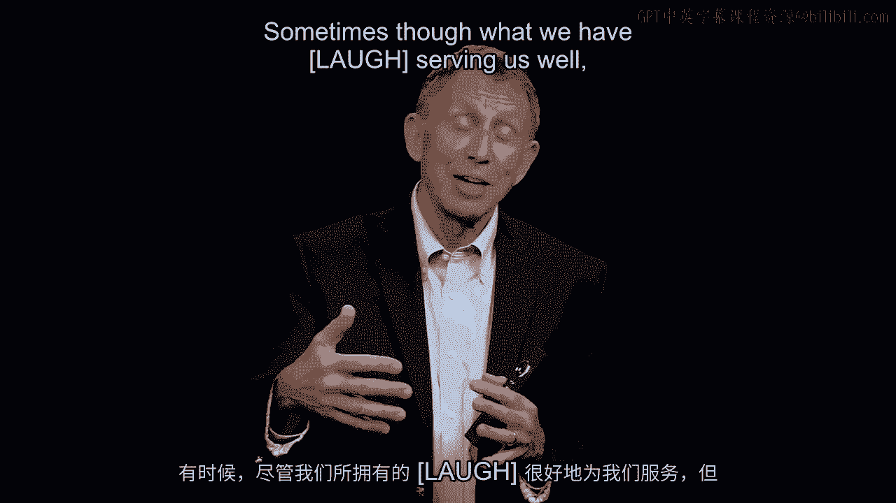

 ago may no longer do so。 And now we run into just a classic problem of organizational life。

 Everybody knows about it。 I'm going to say the blindingly obvious here that as we solve a problem this year and build。

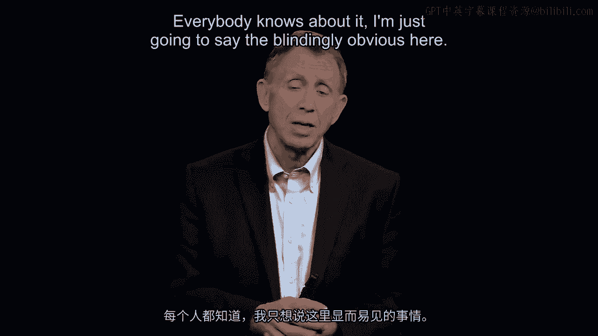

 out， we hire people， build out a design， create jobs， provide an incentive system that seems。

 to solve the problems of， let's say， last year， go ahead five years。

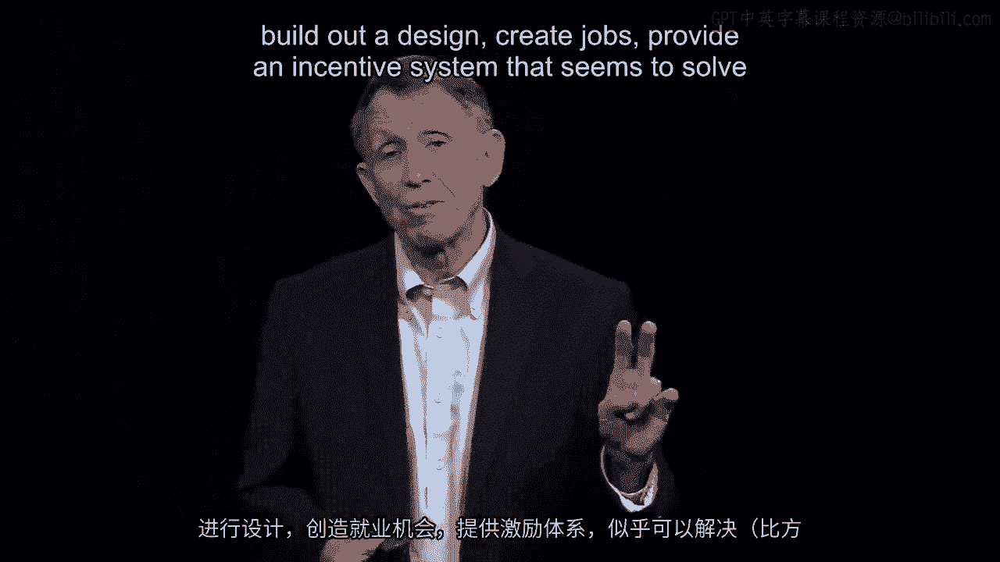

 Market changes， the internet arrives， digital everything is here。

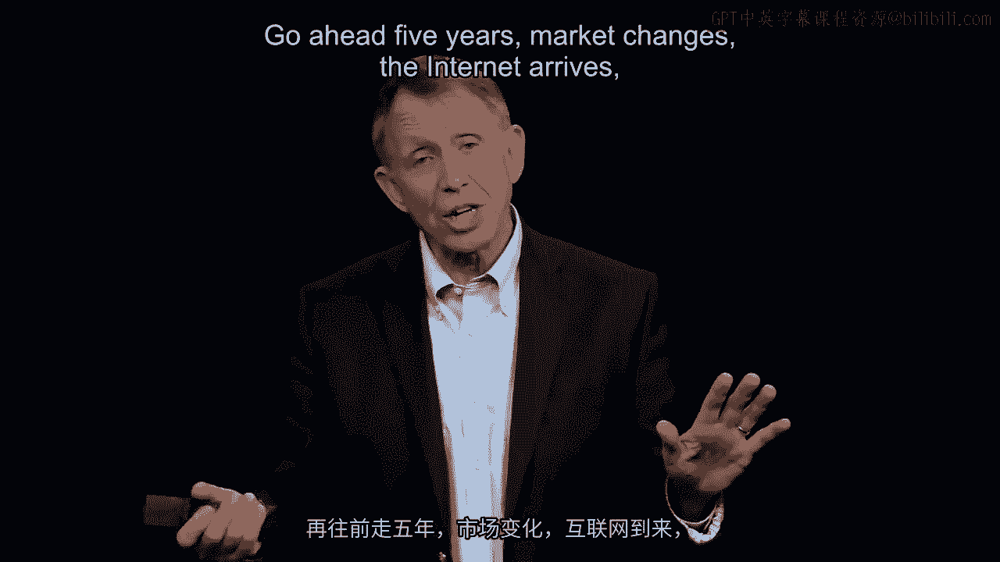

 We now got to serve customers in India and China， not just the US。

 The problem we've got now is we've built an architecture which serves the problem of last。

 year or five years ago。 And an architecture once constructed， add on a culture to go with it。

 a topic that another。

 of my colleagues is going to take up。 We now face the problem of call it inertial guidance。

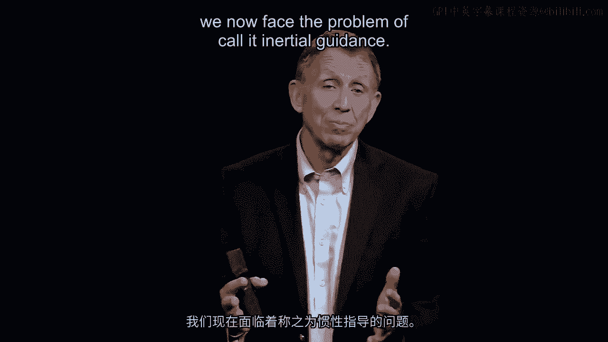

 If you think about a big flywheel， just a big steel wheel is turning。

 This that gets turning very hard to slow it down， it has a lot of inertial momentum to， it。

 And thus， in a sense， once you've got the architecture going for you as the manager。

 you can actually。

 take off Fridays for a while， because it just kind of manages itself。

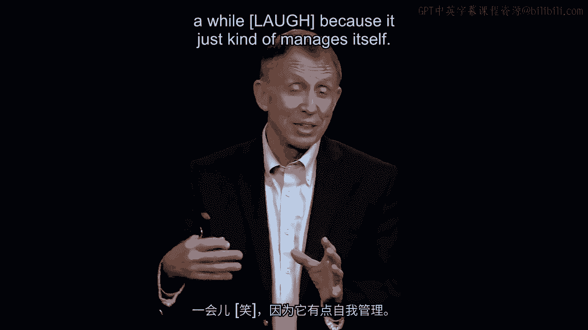

 That's inertial guidance。 That's what good architecture does。

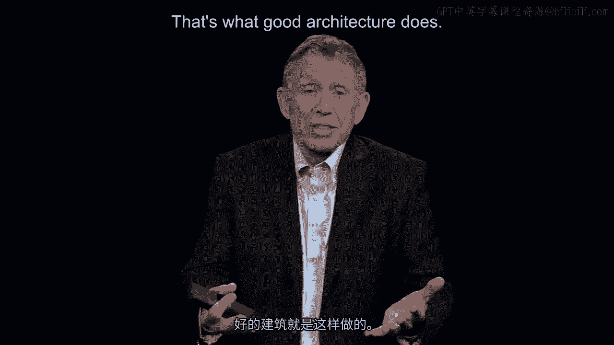

 But when the world changes， that architecture of yesteryear may no longer works so well。

 now we've got just a huge impediment。

 That is just what we do， the flywheel rotating the inertial momentum that's been built up。

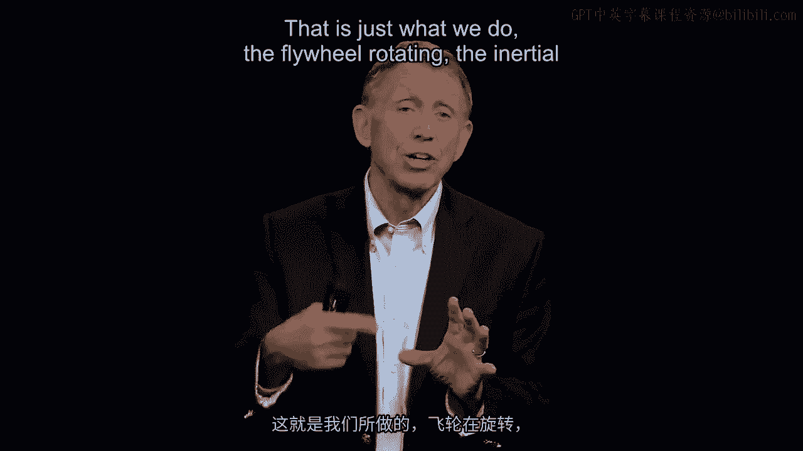

 That makes it difficult to change。

 To say the obvious， we've hired people because we're doing X， we're focused on the US。

 But now we want to open up in India， or let's make it Brazil。

 Well they didn't come to work for you because they thought one day they might be transferred。

 to India。 But now you need people to run the office in New Delhi or Mumbai。

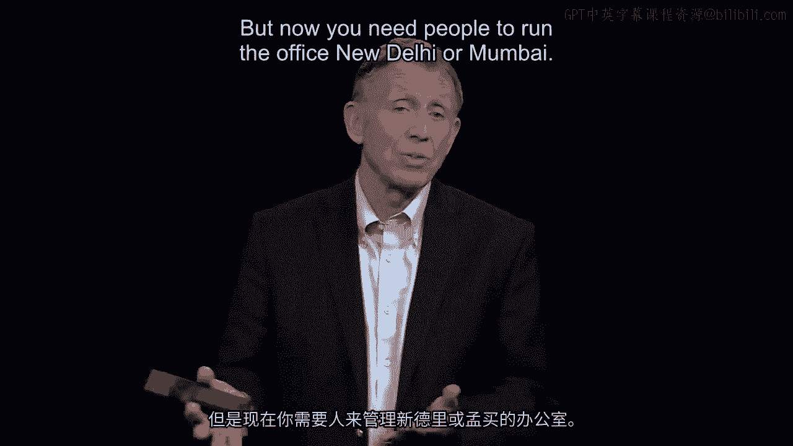

 And if we start going down that particular avenue， the problems multiply quickly， if we。

 don't make the change， aren't ready to have people take on these new tasks。 But the people we hired。

 almost everything we do， militates against that kind of change。

 Change is one of the great enemies of organizational design。

 So we're going to take a few minutes now and think briefly about what gets in the way of。

 the design we've created such that as a manager， once we recognize what gets in the way we can。

 do something about it。

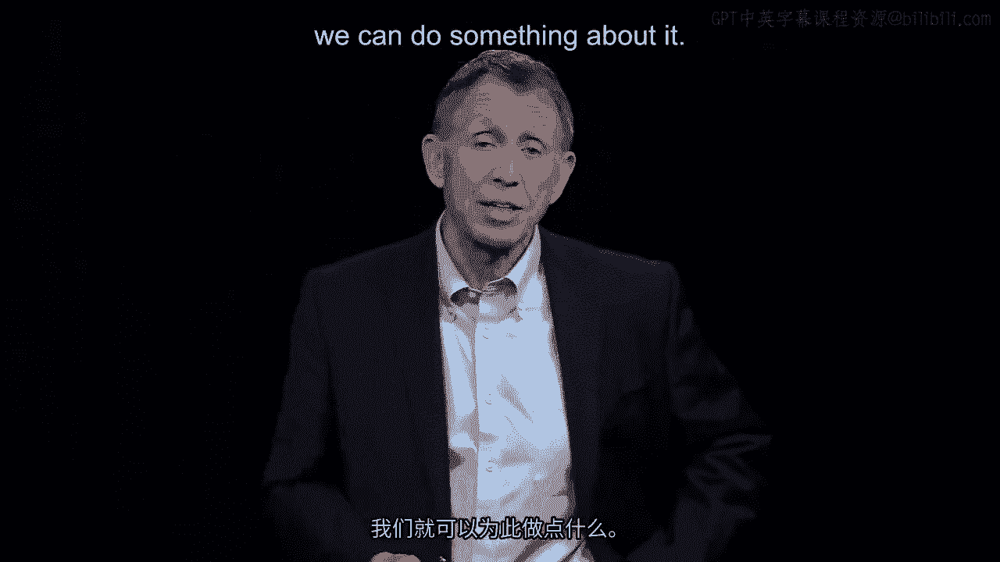

 So let's go right here to the work of a well-known observer and consultant on organizational。

 change。 Again， what does that mean？ We've got a design， we want to make it better。

 John Carter has identified eight forces just to pull them out and make them more managerial。

 irrelevant that seem to get in the way of making changes。

 So take a look at number one here for instance。 You， the manager， don't make a compelling case。

 Look everybody， we've got a change because the world's changing and nobody， everybody。

 salutes great idea and goes back to work the way they've already always done it。

 Let's go down to number four。 He has found， I've seen the same thing myself。

 that for people who are saying we've got to， really just flatten the organization。

 put people more in touch with customers， maybe， reorganize like we saw at that rose company making plants independently responsible for。

 everything， that we have to say what we want again and again because the first time it's。

 not believed or it's questioned， second and third time it takes on a certain traction。

 and people are wondering okay boss， do you really want this because the costs are going。

 to be high making to change。 So that's the number four。 Just briefly take a look。

 I'm not going to enumerate or expand out word wise with the。

 other six say but for our purposes right now we're going to try to do an organizational。

 restructuring or redesign， I'd like you to take a look at those eight factors， ask yourself。

 which of those have you seen， well executed maybe by yourself or others that you manage。

 with but get them much in mind because I want them to inform where we're going the next。

 few minutes。

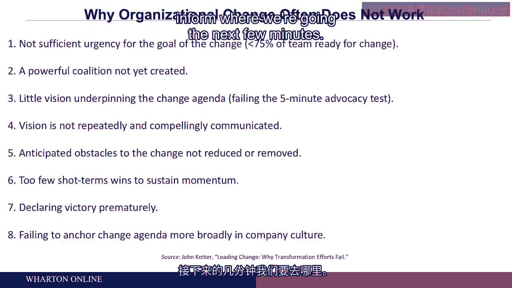

 Thank you。 [BLANK_AUDIO]。

