# 沃顿商学院《商务基础》｜Business Foundations Specialization｜（中英字幕） - P99：22_戴维·波特拉克和查尔斯·施瓦布案例.zh_en - GPT中英字幕课程资源 - BV1R34y1c74c

 Let's go very briefly out to San Francisco。

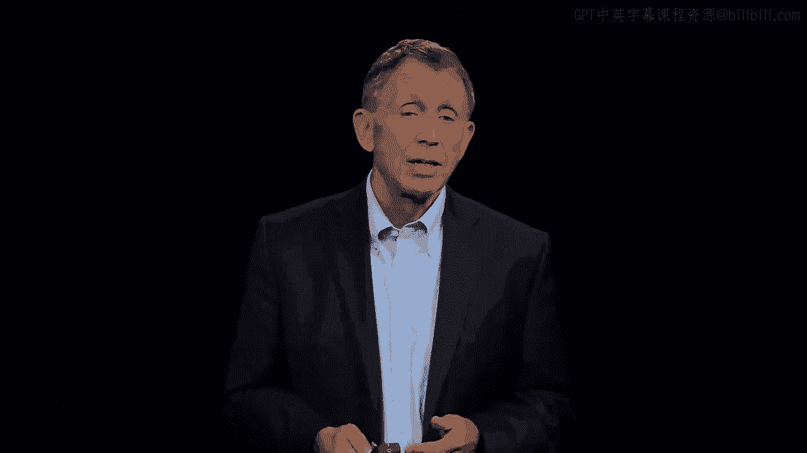

 And we see there the chief executive of a company， well I think we all know it because。

 there are many ads that ask us to talk with Chuck， Charles Schwab， a very， very large。

 what's called discount retail broker。 His famous company historically in this category is Merrill Lynch。

 To make it straightforward if you wanted to buy a thousand shares of let's make it。

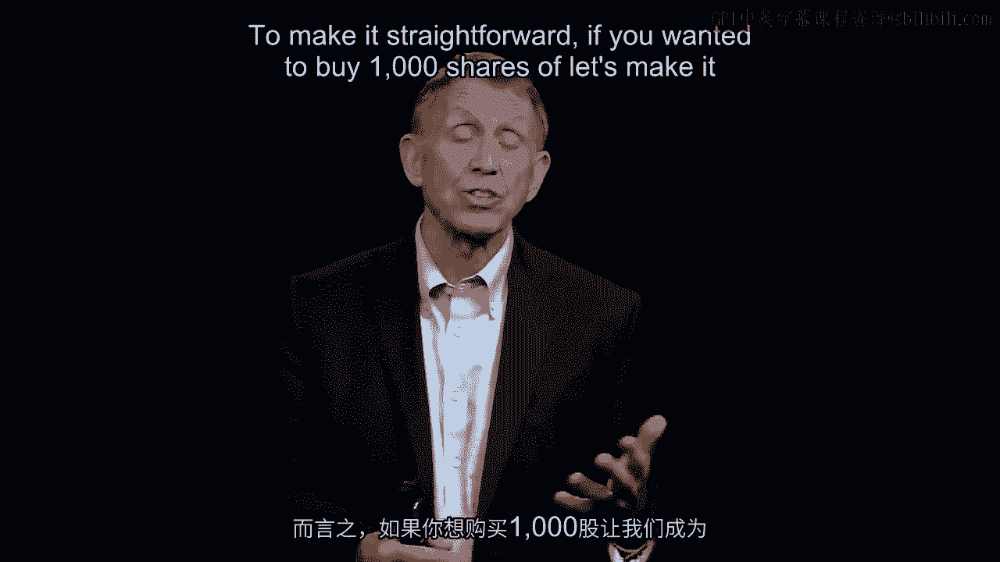

 Cisco can't call up the New York Stock Exchange to acquire the shares you call up Merrill。

 Lynch on one of thousand shares。 Merrill says great。

 At that time cost around $129。 Charles Schwab is a discount broker offering the same services。

 more efficient， a little。

 bit like Walmart that offers high quality goods given the price point they're at very。

 well but they're not a high end retail store。 They do something different。

 That's what retail brokerage here is。 They're providing service that is full but more efficiently and thus less expensively。

 such that Schwab can charge $80 for a thousand share purchase of a given stock。

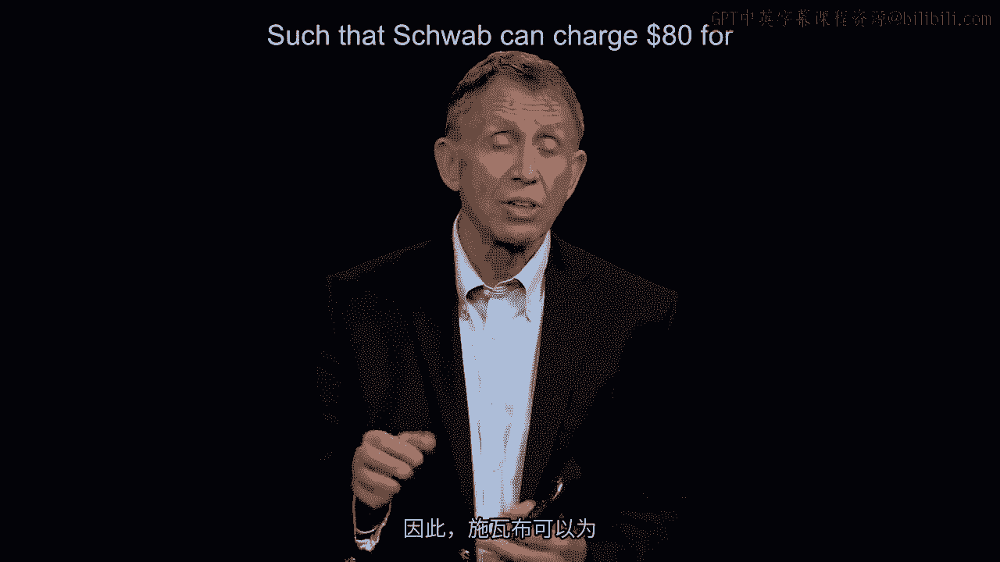

 At the time， David Potruk， a gentleman on the right， chief executive officer， Charles Schwab。

 himself is the executive chair which means he comes to work every day， has a big voice。

 at the table but so much day-to-day action with 15，000 employees goes through this manager。

 that we're looking at， David Potruk in his office in San Francisco。

 What David has begun to mull over is the fact that he had advocated that Schwab develop， a。

 at that time， a very simple internet service where you go on， it's called "E Schwab" order。

 a thousand shares of Make it Cisco and because it's the internet now， $29。

 Who doesn't want to pay $29 when you could have paid $80？ Of course。

 there's less there and that's the business model。 If it's "E Schwab" where you buy your shares。

 you can talk to one of the customer service， experts per month。

 Now if you're a full service customer at $80， you can call them up eight times today and。

 they'll take the call and give you some guidance。 So a little bit less expensive。

 quite a bit less expensive and less service。 There's a logic to that。 David Potruk。

 excellent manager that he is， is acutely sensitive about a past function， that he has performed。

 He comes out of marketing， isn't touched with a lot of customers。

 As a result， always a good idea for anybody， regardless of the kind of organization and。

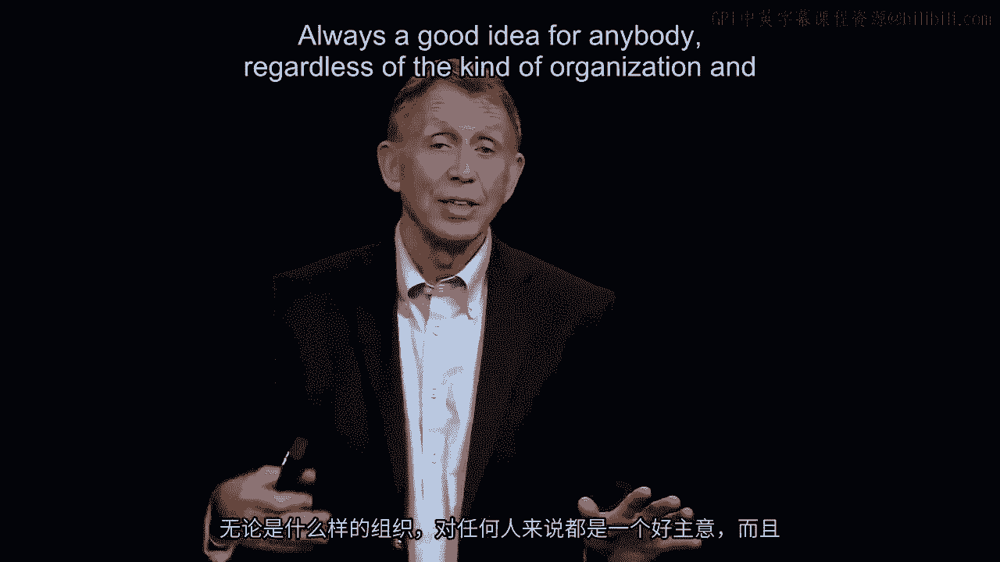

 he's hearing this。 Customers are saying， "David， we've got a problem because with E Schwab。

 we love to save， the money， about a 70% discount over $80 and you're better than some of the competition。

 at the high end。"， That's true。 But since you've already got your customer service representatives well-trained。

 they're， expert， they put out reports， "Why can't we talk to more or why can't we at least read。

 their research？"， And David says， "Well look， if you want the full service， you got to pay $80。

 That's our business model。"， Well， some of the customers are saying。

 "But it says Schwab in both programs， aren't you， one company？"， Even more worrisome is this。

 Most people don't see it。 David's already spotted it because he's a very analytic guy。

 He works the numbers。 He sees that some of the customers， clever people they are。

 are keeping open at full service， account， leaving a few dollars in it， moving $995。

000 into the E Schwab account where they're。

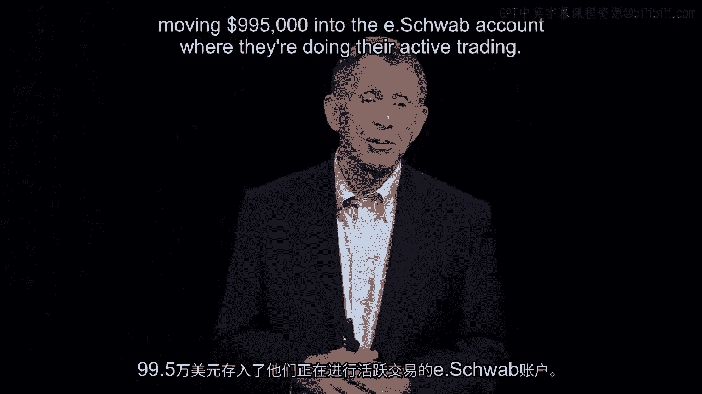

 doing their active trading。 They got it both ways。

 Full service， they can talk to a customer service representative， they can get all the， reports。

 but then they use that information to trade actively at $29。 Just to borrow a well-known phrase。

 we've got cannibalism， but in this case it's internal。

 There's not somebody eating us out from the outside。 As happened， for example。

 to eBay and China was really attacked directly by Alibaba。

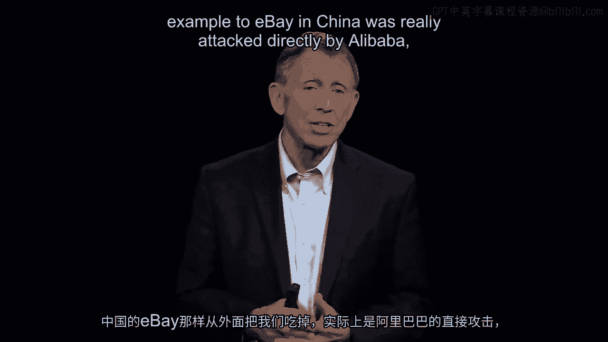

 In this case， we got a problem on the inside， we're cannibalizing ourselves。

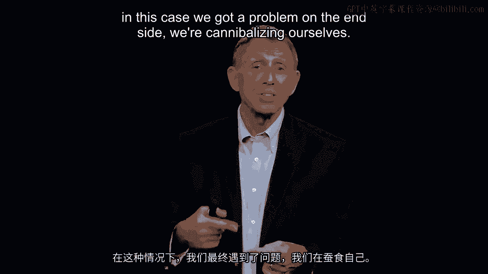

 David turns around though， and being mindful not explicitly with the eight factors they。

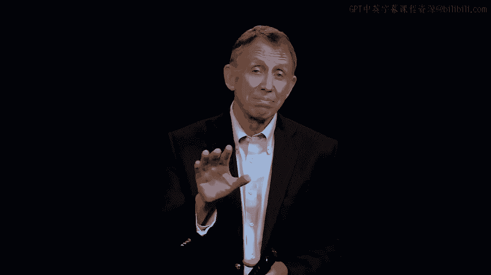

 can get in a way of organizational redesign， knows or is concluded that this company has。

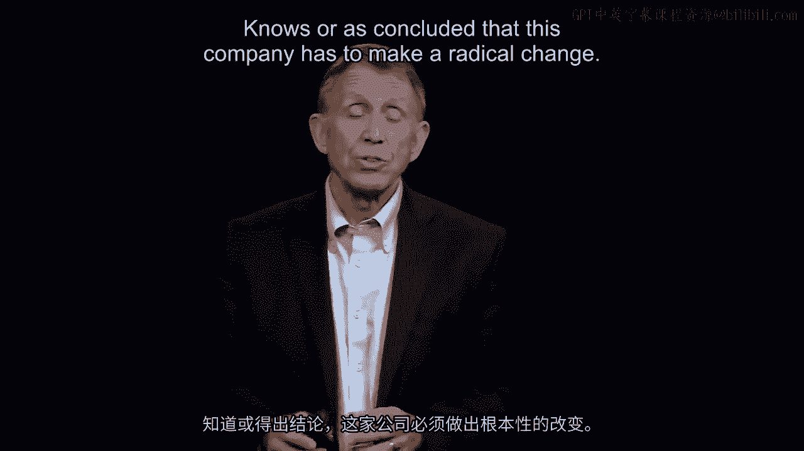

 to make a radical change or somebody else is going to change the company。

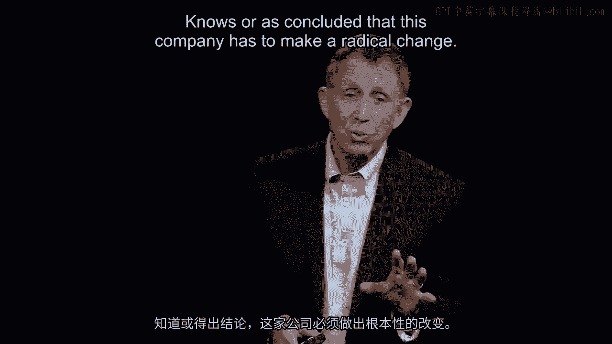

 In particular now， he's worried about a bunch of young upstarts， companies that got names。

 like E-Trade that are full online traders。

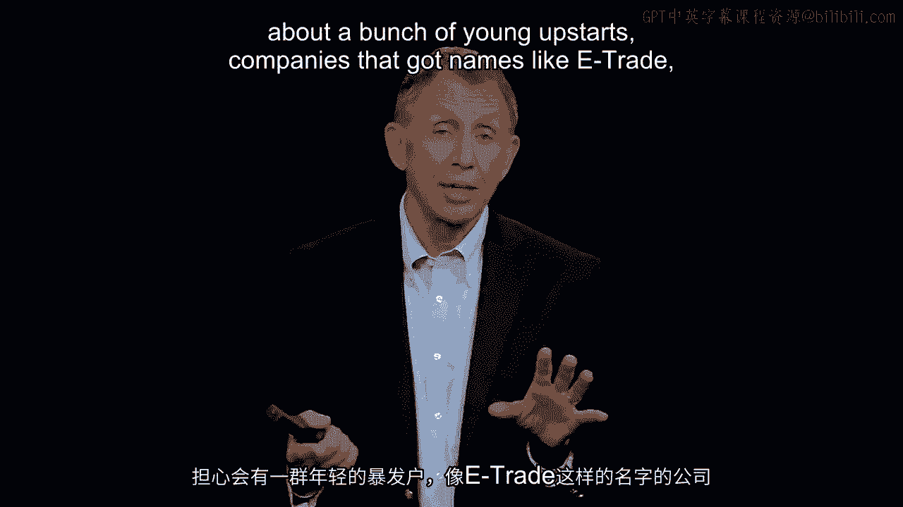

 There's no bricks and mortar to go with them， and they're offering trades often at $19 a。

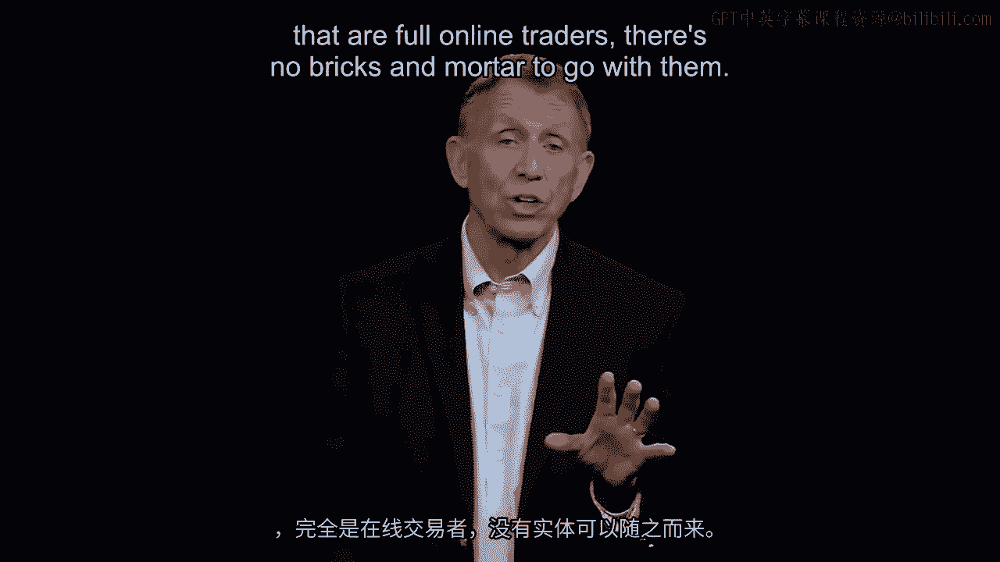

 trade。

 Not much research， not much behind it， but for people who are thinking about keeping a few。

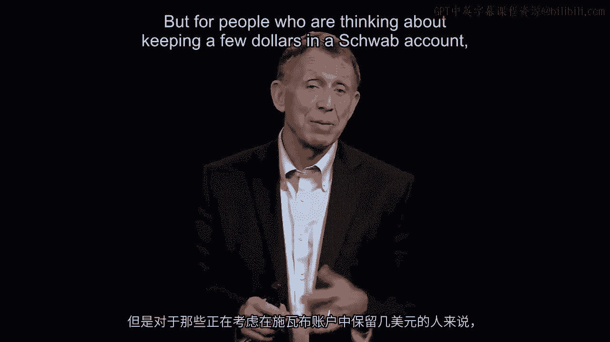

 dollars in the Schwab account， why not even go over to E-Trade sooner or later with the。

 boom of the internet， it's going to change everything as we know so well。

 David figures we're going to be out of business。 Unfortunately。

 being mindful now of the factors on a prior image， he's also thinking， whoa。

 nobody's going to want to change here because I've looked at the numbers for the last four。

 years and we've been doing extremely well。 This goes back to an early idea on good and timely decision making when we're doing well。

 we tend to become more suboptimal in how we think about decisions。

 Well David is saying we've got that problem now。 We're getting 24% year on year in growth and revenue。

 Customer assets are up 40% in the last year。 Everybody is thinking we've got a great business model。

 Don't foul it up。 They would say privately since David's chief executive。

 they probably won't say that to， his face。

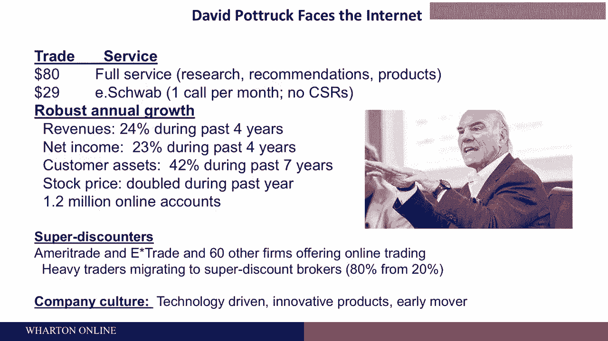

 With that being said， let's move it on now and I'm going to ask you to think ever so briefly。

 after you've decided your David Potrock gentleman in the middle of the screen， Chuck Schwab。

 Charles， Schwab is boss to his right， both smiling before you say what you're about to say， Chuck。

 is smiling because you've decided that this company has to go from $80 full service overnight。

 on one day down to $29 full service。 You've got to take your product you're selling and now imagine an airline discounting a seat。

 from New York to Los Angeles by 70%。 That's going to be a huge draw for customers。

 It's also going to be a huge hemorrhage in terms of money coming in。 Keep that in mind。

 David Potrock decides literally in the privacy of his office， he talks to his direct reports。

 about a dozen people that report directly to him。 As chief executive。

 he's decides tells them and forms them， asks for their guidance of。

 course on how to enact the decision。 He says， okay everybody， January 15th of the coming year。

 we're going to have to go， to cut our service costs。

 We're going to have to cut the price of the service by 70% got to cut our costs as well， obviously。

 By 70%， imagine if American airlines cut by 70% the cost of a seat from New York City。

 to Los Angeles。 Well， there'd be a boom in air travelers。 Of course。

 everybody can see that's a great attraction。 On the other hand。

 you've got 70% less revenue coming in to hire a pilot and put gas in the， aircraft。

 so you're going to have to think about this on both sides。 Even worse。

 when it comes to the way the world works， if you're a publicly traded enterprise。

 and everybody's got a kind of a public to worry about even if you're not publicly traded。

 publicly traded companies are listed on the New York Stock Exchange or elsewhere， I have。

 a particular problem and that is investors have come into you for what you've been doing。

 and not necessarily where you want to go。 And thus。

 David concludes that as they go to a 70% discounted， for all service trade， $29 per trade。

 January 15th， the following year， that the equity analysts that appraise， companies。

 the big investors， some of the big pension funds， for example， that invest。

 in companies aren't going to have any confidence that this 70% cost or loss of income is somehow。

 going to be made up for by the move that David has made。 And as a result of that。

 David Potrock forecasts that the pre-tax drop in profits will be at， least 20%。

 So if let's make it Apple， if Apple takes a 20% sudden drop in its after-tax profitability。

 the market's going to have a lot of negative reaction on that。

 David forecasted it as it turns out correctly here to be about 20 to 25%。

 The day he announces in January 15th full trade， it's going to be a lot of sell orders， going out。

 investors are stampeding to get out of the stock。

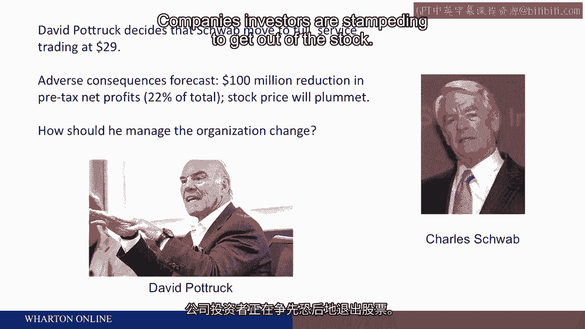

 So he sits down and let's think about now the art of managing， that's our topic， managing， people。

 he sits down with probably the most important person he has to manage。

 Oddly， his boss。

 [BLANK_AUDIO]。