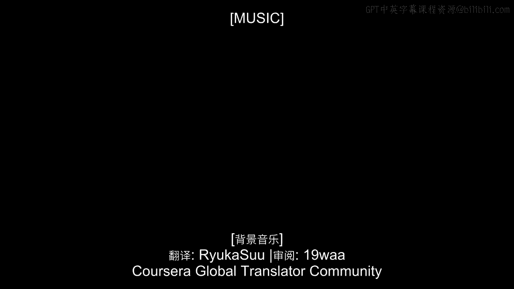
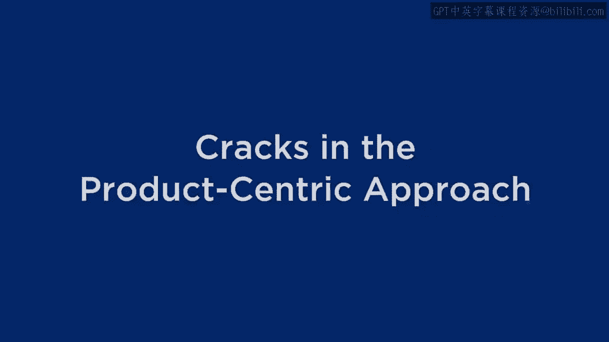

# 沃顿商学院《商务基础》｜Business Foundations Specialization｜（中英字幕） - P9：8_产品中心方法的裂痕.zh_en - GPT中英字幕课程资源 - BV1R34y1c74c

 [MUSIC]。

 Okay， so we've reviewed the product-centric approach to business。

 We understand that for most companies， again， those focusing on performance。

 priority or operational excellence， it's all about coming with that， blockbuster idea。

 reducing a lot of it， keeping the cost down， and， using appropriate metrics for it。

 and we call that product-centricity。 Now， we're going to start talking about some alternative approaches。

 but， I don't want to suggest that product-centricity is doomed to fail。

 I don't want to suggest that all companies must move away from product-centricity。

 I don't want to suggest that that's a recipe for disaster。

 But I do want to suggest that there are some aspects of product-centricity。

 that make it not quite as great as it used to be。 So as you can see on this slide over here。

 I'd like to say that there are some， cracks in product-centricity。

 There's just a number of trends going on today， things that didn't really exist， say。

 15 or 20 years ago， that make the product-centric approach just a little。

 bit less guaranteed successful than it was back then。 In fact。

 I'd like you to just take a minute or two to think about， what are some of。

 the changes today compared to 15 or 20 years ago that make product-centricity。

 just a little bit different that takes some of the shine off of it， that takes。

 some of that automatic kaching away from being product-centric？

 What would be some of the emerging trends， most of which are trends that are， here to stay。

 that might make a company think twice about whether they want to。

 focus on product-centricity or start looking towards a different kind of， strategy？

 Take a moment and think about that， and then we'll run down a list of。

 some of the leading factors that take some of the edge off of product-centricity。

 So I bet first and foremost on everyone's list is the idea of commoditization。 See。

 back in the old days， it was so hard to come up with and manufacture a new。

 product or deliver a service that you would stay steps ahead of all of your。

 competitors for a long period of time before they could come up with an equivalent， idea。 But today。

 because of technology， things commoditize much more quickly。 Product lifecycles are getting much。

 much shorter。 Companies know that as soon as they， launch something new。

 they have to have the next new thing already in process。

 So this idea of commoditization takes away some of the goodness of product-centricity。

 Here's a way of thinking about it。 In the product-centric world， every company is。

 counting on some kind of natural monopoly。 We are doing something that's going to。

 keep us ahead of all of our competitors for a long period of time。 And that's what's。

 going to let us focus on developing the best or delivering the most efficient。

 But as those lifecycles shorten， as things commoditize， it takes away some of that。

 natural monopoly power。 But that's just one reason。 It's a big one， but by no means， the only。

 Another important reason would be changes on the customer side。 Our customers are so much smarter。

 more informed than ever before。 It used to be， that our customers were much more passive。

 They would take whatever products or， services that we would give them and they would say， "Oh。

 that's great。 Terrific。 Thanks very much。 I'll figure out how to use it。

" But today's customers are much， different than yesterday's customers。 They're much more informed。

 they're much， more demanding， and they're much savvier。 And again， a big reason for this is the。

 internet， information technology。 Customers are so much more aware of options that。

 are available to them or options that might not yet be available to them， but。

 that they clamor for than they ever were before。 Again， the customers aren't。

 passive like they used to be。 So smarter customers put much more demands on。

 companies and make it harder for them to extract as much value out of the。

 products and services that they deliver。 And a third way that technology makes。

 life a little bit more difficult for product-centric companies is the idea that。

 products are now available everywhere instantaneously。 If you think about what。

 FedEx or DHL or UPS does， they take away some of that natural monopoly power that， a company had。

 In the old days， companies would rely on the fact that no one else had， a product like them。

 But even if other companies did have a product like them， customers wouldn't be aware of it。

 And even if customers were aware of it， customers wouldn't have access to it。 But today。

 because distribution technology， brings everything， everywhere， overnight if you want it。

 it's much harder to， protect yourself from other products and services that are available in the。

 other regions。 So there's all kinds of ways that technology takes some of the edge。

 off of product-centricity。 But by no means is it limited to technology。 Part of it is， a mindset。

 People are thinking globally much more than ever before。 So customers。

 are much more actively looking for products and services from other regions than。

 they ever were before。 And then there's the issue of deregulation。 Again。

 regulation was a way that gave companies monopoly power， that they were the only。

 game in town and customers had no choice。 But as one industry after another， deregulates。

 companies need to be much more competitive and it's much harder to， stay a step ahead。

 And in some cases， it's not deregulation， but it's， a re-regulation。

 It's regulations that are making markets much more competitive。 So again。

 that's another reason why product-centricity just isn't what it used， to be。

 A sixth reason comes back to the customer again。 Not only is the customer， smarter。

 but as I mentioned before， customers are far more demanding than they， ever were before。

 So in the old days， it was good enough just to let the customer。

 take a bunch of products and services and figure out what they're going to do， with it。

 Figure out how those different products and services are going to help。

 them solve the problems that they have。 Today's customer is much more demanding。

 It's insisting that companies not only deliver them one product or service at a， time。

 but bundle together products and services， sometimes including products and。

 services that the company might not make any money on。 It is now much more。

 imperative than ever was before for companies to be seen as a trusted advisor。

 To be providing full-fledged solutions to the customer and not just piecemeal。

 products and services that the customer will figure out how to combine together。

 One of the great stories along these lines is that of IBM。 IBM， which of course。

 stands for international business machines， used to be one of the ultimate， product-centric firms。

 They were just the best at coming up with and developing， certain kinds of products。

 business machines， computers and so on， better than， anybody else。

 But they had a revelation in the mid-1990s。 They could actually make。

 more money being a trusted advisor instead of saying， "Here， customer， buy our。

 machine telling a customer what set of machines and services to be buying。"。

 That they're actually higher margins， especially as computers and other。

 information technology equipment commoditizes。 They can actually do better。

 being a solution advisor。 And slowly but surely， as many of you know， IBM spun。

 off many of his business machines。 They no longer manufacture personal， computers。

 Their presence in most other hardware areas has diminished。 But。

 where they're making their money today is from being a customer-centric solution， provider。

 It's going to the customer and saying， "Here are the set of products。

 and services you should be buying。" And that kind of expertise doesn't。

 commoditize nearly as much as any one product might。 And so that idea of moving。

 away from just selling products to being a full-scale solution provider is a major。

 change in the last 15 to 20 years。 And there's one more point that I want to， talk about with you。

 And it's not necessarily the most important crack in， product centricity。

 but it's one that I like to think about a lot。 And that's the， data。 See。

 today's technology enables us to collect and manage and utilize data。

 about customers in a way that we just could have never imagined before。 So if you。

 think about old companies， think about Henry Ford， who was one of the real。

 originators of product centric thinking， he had no idea how many customers he had。

 He didn't know whether he was selling one car to each of 10 million。

 different people or whether he was selling 10 million cars to one person。 He， didn't know。

 And frankly， he didn't care that much because he was so product-centric。

 in his thinking that it was just a matter of turning that crank of pushing， products out the door。

 of keeping the volumes up and keeping the costs down。 But， today。

 given these other cracks in product centricity， it's much more。

 important for companies to be using the data about their customers， to be。

 understanding who's buying what and for how long and what other products that， they're buying。

 So the information systems give us the possibility of。

 developing business models that were unimaginable before， but could actually。

 be more successful than the product-centric approach。 And I want to give you a。

 couple of examples of that。 [MUSIC]。

 [BLANK_AUDIO]。