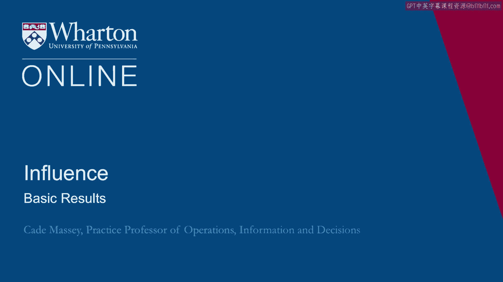
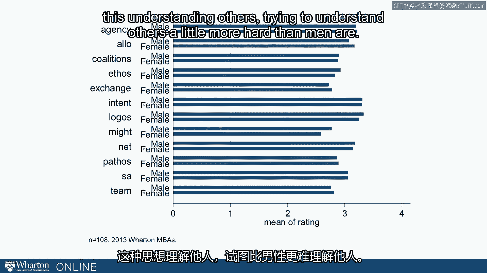
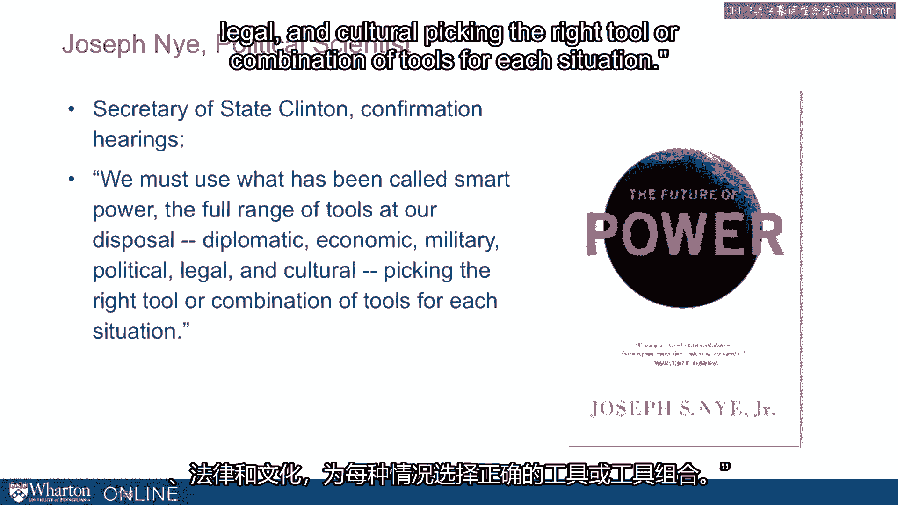

# 沃顿商学院《实现个人和职业成功（成功、沟通能力、影响力）｜Achieving Personal and Professional Success》中英字幕 - P100：36_基本结果.zh_en - GPT中英字幕课程资源 - BV1VH4y1J7Zk

 In this lecture， we'll look at the results of the leverage inventory。

 We've been collecting these for almost 10 years now with MBAs， executive MBAs。

 some executive ed students， and we can make some sense of it now。

 And it'll help you make sense of your results。 To begin with。

 let's remember that the response scale for these is behavioral and， it's about frequency。

 how often you do each of these things。 So the response scale is from one to four， rarely or never。

 to almost always。 And again， we have four to six questions， behaviors that add up to the score for。

 each of these 12 tactics。 So the report looks something like this where we've listed the tactics along。

 the Y axis from allocentrism down to ethos。 And then we've reported your result。

 your frequency along the X axis from rarely to， always。 The first is your self assessment。

 These are your scores according to the four to six items for each of these behaviors。

 The second piece here is the class average or the benchmark， whatever benchmark we happen to use。

 And it might have been the MBAs or the executive MBAs or， the participants in this MOOC。

 but it's some benchmark。 So the intention here is to kind of， this is a self assessment。

 So it's kind of like putting a mirror up in front of you and saying， hey。

 this is what you think is going on。 And yet we're going to put it in the language of the theory and。

 the literature and give you a framework for thinking about it so。

 that if you do want to change these， dial something up， dial something back。

 you'll you can think about it in a more focused way。 We sometimes do more than just self assessment。

 Sometimes we assess people's behaviors with a group of folks they've worked with， bosses。

 subordinates， peers， we call these 360 evaluations or third party evaluations。

 And we've learned some over time about how the third party evaluations。

 relate to the self assessments。 You have the self assessment。

 so we thought we might share with you a little bit about， what the third parties look like。

 The big picture is they're highly correlated。 The correlations across all 12 are on average or something like 0。

57。 Most of the classes we do we see between 0。5 and 0。6。 Correlation between the scales。

 the scale averages for， self assessments versus the scale averages for 360s。

 Here are the summaries for a pretty large sample hundreds of students。

 And you can see that the self assessments lie below the third party assessments for。

 almost every tactic。 And this is this kind of wrinkle we see with every population where people report。

 doing fewer of these things or doing them less frequently。 Then do 360 raters。

 the third party raters who sometimes provide surveys to us。 So we don't know what truth is。

 We don't know whether people are doing more of these things than just not aware of it。

 Or that people believe or infer that others are doing them more than they actually are。

 But we do see a little bit of a bias。 So you could rest assured that the odds are if you had 360 raters that you would have。

 a little bit higher scores across the board。 Some of these are， deltas are bigger than others。

 So for example， on exchange， there's not much of a bias。 On allocentrism， not much of a bias。

 Note that these are behaviors that are a little bit more observable。 On intentionality， for example。

 the gap is higher。 On might， the gap is a little bit higher。

 So you might use this to add little context and adjust or imagine what the results would。

 be like if we ask your peers and bosses and subordinates to rate you。

 You might wonder about differences between men and women。

 Certainly my students often ask me this question。 So here's one sample， one year。

 We have 108 people in this sample。 These are means across the 12。 And what you see is broadly。

 there are no differences。 So where we do see differences， there are the stereotypical differences。

 So for example， on might， men are rated as exercising might a little more frequently。

 than women are。 On allocentrism， the opposite。 Women are rated as exercising allocentrism。

 this understanding of others， trying to understand， others a little more how to be men are。

 This is kind of consistent with this stereotype， right？

 Which underlines the fact that we don't know what truth is。

 We don't know for a fact what they're actually doing。

 It could be that the ratings are just being consistent with stereotypes。 But the big picture is。

 maybe to a surprising extent， that behaviors are rated similarly， across the sexes。

 Men and women aren't seen as acting that differently， at least in the MBA and executive MBA samples。

 that we've primarily collected。 Now we've talked so far in terms of 12 tactics and we built the survey around those 12 tactics。

 That's where the theory is。 But it could be that we can talk about it in a simpler way。

 We can kind of aggregate those。 One way to aggregate them is think about hard power and soft power。

 So traditionally people have talked about power in these ways。 For millennia。

 they talked about one way of one form of power， hard power， military might， the economic might。

 More recently， mostly because of Joseph Nye， people started talking about soft power。

 So Nye has a quote here from The Economist。 He was certainly writing about this before then。

 But in this piece， right after 9/11， Nye writes， "Throughout history， coalitions of countries。

 have arisen to balance dominant powers and the search for traditional shifts in the balance。

 of power and new state challengers is underway。"， While potential coalitions to check American power could be created。

 it's unlikely they'd， become firm alliances unless the US handles its hard course of power in an overbearing。

 unilateral manner that undermines its soft or attractive power， the important ability。

 to get others to want what you want。 So he was writing right on the heels of 9/11。

 basically cautioning the US about how they， used hard power because it might impact their soft power。

 He had been talking for decades at this point about the impact of soft power， the importance。

 of soft power， the argument basically being that one of the reasons the US had been so。

 influential in the world in the 20th century was not just because of economic and military。

 might but because of their soft power。 Other countries， other people wanted to be like the US。

 So others have talked about it broadly this way。 The organizational scholar Jeff Pfeffer who has written a lot on power talks about some。

 individual traits that are conducive to power and he organizes them in two buckets。

 He organizes them as the capacity to garner support and allies in this bucket。

 He puts sensitivity to others flexibility and the ability to submerge your ego。

 And a second bucket is the ability to survive in a competitive arena。

 In this bucket he puts energy and physical stamina， focus， the ability to tolerate conflict。

 This looks a lot like hard power in the second bucket and soft power in the first bucket。

 So this is clearly the way people have been thinking about power。

 We might be able to divide our 12 tactics into that。 But we can also ask the data。

 What is the right way to simplify？ Maybe we can reduce from 12 down to 2。

 Or maybe we can reduce all the way down to 1。 Or maybe we shouldn't go that far。

 Maybe we should only reduce down to 3。 You can answer that question using a technique called factor analysis。

 This is a way to reduce the dimensionality of data。

 We can distill 12 or if we had 20 or 30 we could distill those down to maybe 2 attributes。

 or 3 attributes。 This method will tell us how far down you can go before you start losing。

 before you start， throwing away information。 It will also help us identify key patterns in the data。

 So we're going to use factor analysis to see can we simplify your report for you essentially。

 You have to remember 12 or can you distill it down to something less。

 This is what we find when we use factor analysis on these reports。

 It tells us that there are three factors in the data and this has been robust across a。

 number of samples at this point。 A factor is basically a weighted average。

 So it's going to take each of these 12 tactics and it's going to give each tactic a certain， weight。

 A tactic might have a lot of weight for some factors and not much weight on another factor。

 These are the weights for the three factors in our data。 So factor A。

 big weights on ethos and might， low weights， actually negative weights on。

 alloscentrism and everything else is kind of in the middle。 Factor B， the middle factor。

 Big weights on team， networks， coalitions， pathos， exchange and alloscentrism。

 A little bit on essay and agency but mostly it's those six kind of relationship tactics。

 in the middle。 And on the third factor， factor C， we see most of the weight comes from these bottom four。

 in tensionality， logos， situation awareness and agency。 So what does that look like？

 One of the things about factor analysis， it doesn't tell you what these things are。

 It doesn't give you names for these things。 It just tells you what the weighted averages are。

 So if you look at the first， it looks a lot like hard power。 So we call it hard power。

 If you look at the second， these are all these relationship tactics。 It looks a lot like soft power。

 So we call it soft。 We were expecting those two。 The interesting bit is this third factor。

 It is these three meta tools， intentionality， situation awareness and agency with the addition。

 of logos。 We didn't know that logos would necessarily travel with these other three but it does。

 And we end up calling this smart power and we end up with these three factors。

 We can distill your 12 down to three broader strategies。 Hard power， soft power and smart power。

 We borrowed the term again from Joseph Nye。 So this is more recent work from him in a book a few years ago。

 He published called The Future of Power。 He has a chapter on smart power。

 And it was the first time we were exposed to the terminology。

 It turns out the Obama administration had been talking about that for years。 In fact。

 he quotes Secretary of State Hillary Clinton in her confirmation hearings as saying。

 "You must use what has been called smart power。 The full range of tools at our disposal， diplomatic。

 economic， military， political， legal， and， cultural。

 picking the right tool or combination of tools for each situation。"。

 So this fits very well with our notion of meta tools。

 And it maps almost perfectly onto the three that we have in that bin that meta tool bin。

 And then additionally our data say， "Well， you should also have logos in there， this logical。

 reasoning。"， So that is the first cut on our data and a description of the data。

 And in the next section we'll want to ask， "Okay， fine， but how does that relate to influence？"。

 [ Silence ]。

