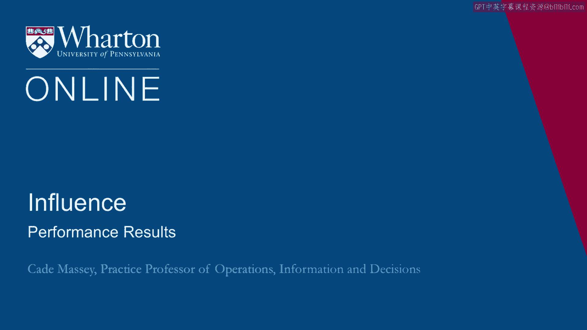
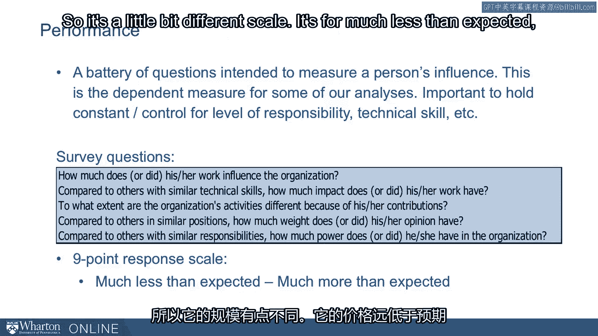
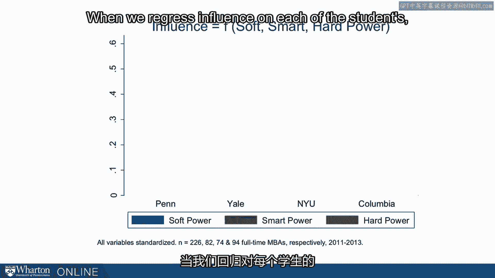

# 沃顿商学院《实现个人和职业成功（成功、沟通能力、影响力）｜Achieving Personal and Professional Success》中英字幕 - P101：37_表现结果.zh_en - GPT中英字幕课程资源 - BV1VH4y1J7Zk

 So far we've looked at summary statistics of the leverage inventory results and how。

 they kind of fit together， how they cohere or don't。

 But we haven't yet related that to anything else。 We don't yet know why it matters。

 The theory is that those behaviors will make a person more or less influential but we haven't。

 shown any evidence of that so far。 In our 360 degree surveys when we ask these third parties to provide evidence we also。

 include an additional few questions。 We consider these performance questions。

 It's a battery of questions that are intended to measure a person's impact in their organization。

 So we want to hold constant the level of responsibility they have， maybe their technical skills and。

 ask given where they were and what their portfolio was， did they have a big impact or。

 little impact on the organization。 So the survey questions are all getting at that and they are very close to each other。

 and together they form this well behaved battery and the responses come on this nine， point scale。

 It's a little bit different scale。 It's from much less than expected to much more than expected。

 We aggregate up to a single performance measure。 This is what it looked like。

 This is our first 400 or so students and you can see a kind of a normal distribution there。

 of impact or performance in organizations。 These students come from MBA programs at Yale and Wharton a little bit Columbia NYU so it。

 perhaps isn't too surprising that they're all almost all above expectations but the。

 question becomes okay there's still a distribution here。

 Can we see anything that helps us understand why some would be on the right side of that。

 distribution with even higher performance。 Some might be on the left side even lower。

 Can we understand and ideally can we help people move from the left side to the right， side。

 So let's look at how those data relate in our survey。

 Now that we have performance measures and these behaviors we can see how they relate。

 Here is a picture and at this point we have this is about 850 MBAs and executive MBAs。

 And what we've done is we've plotted that performance metric that battery of questions。

 that boils down to a single performance metric。 We've plotted that on the y axis in terms of standard deviations above or below average。

 And then on the x we've plotted the frequency with which the participant is reported doing。

 these things。 We have 12 different plots there。 Those are the 12 different tactics。

 Each one shows influence as reported by the third party raters related to their use of， the tactics。

 So for example in that top left corner that is the agency tactic and you can see that。

 well we've thrown little summary curves on each of them。

 These are little lowest non-parametric lowest curves to give you a sense of what the trend， is。

 But what do you see？ This is the first of our really kind of empirical exercise。

 What do you see in these data？ So I think the first thing to see is that they are all positively related。

 That in all 12 cases more of the behavior is related to， is positively related to more， impact。

 There's this positive correlation between doing these things and being reported as having。

 impact in organizations。 The other thing you see is that they're not all equally related。

 So some are steeper than others and that steepness indicates a tighter correlation between the。

 behavior and the outcome， the impact。 So for example agency is quite steep。 The steep is typically。

 Intentionality is quite steep。 Coalition is pretty steep。 And then others are a little bit flat。

 So ethos for example， a little bit flat， might a little bit flat。

 Allocentrism kind of disappointingly flat。 They're positive but not as doesn't seem to be as tightly connected to impact。

 A third thing you might see is that there's less variance on some tactics than others。

 So for example intentionality turns out our MBAs and executive MBAs are relatively tightly， packed。

 They're all pretty intentional folks。 Whereas might and ethos much more variance。

 And then some of them seem to kind of round off。 There might be diminishing returns to some of these tactics。

 Whereas agency and intentionality don't seem to diminish much。

 We see ethos and might and team building kind of kind of topping and not quite turning over。

 but flattening out some。 But again big picture。 We're getting evidence now that the frequency with which people use these tactics is connected。

 to the impact they're seeing is having in their organizations。

 We can aggregate that up to these factors we were talking about。 Soft power， smart power。

 hard power。 Again， we all have positive relations。 And by the time we put them all together。

 we get a pretty tight， pretty positive connection。

 between the frequency with which people are exercising the tactic and the impact they're。

 having on their organization。 Finally we can begin to get a sense of how these tactics matter differently in different。

 situations。 Eventually， maybe in another 10 years， we'll be able to tell you， well， this is kind of。

 a recipe in one industry and this is a different recipe in a different industry。

 We don't have that level of granularity right now。

 But we do have results from multiple business schools。 And we can ask， okay。

 what are the data saying the relative importance of soft power， smart， power and hard power are。

 So in this graph what I'm going to show you is the regression coefficients on smart， hard。

 and soft power when we regress influence on each of the students' soft， smart and hard。

 power scores。 So for each student， we know their impact in their organizations as reported by their。

 third party raters。 And we know their scores for how often they're using soft power。

 smart power and hard power。 And we can just ask， okay， at Penn， what's the regression say？

 How important， what are the returns to soft power among the students at Penn relative to。

 their influence returns to smart power and ask the same for all four schools。 This is what we find。

 Again， what do we make of it？ These are regression coefficients， remember？

 So the first thing you'd say is， well， it looks like smart power and all four schools。

 smart power is reported as being either the most important or tied for the most important。

 of the three。 Terrifically interesting because people hadn't even studied smart power before。

 As far as we know， this is the first empirical study of first empirical operationalization。

 and study of smart power and yet it's popping out as the most important one。

 Then you do see some differences across schools。 So for example， NYU and to a lesser extent。

 Columbia， soft power isn't as important among， the students and where they've worked before they came to school。

 That's kind of stereotypical， especially with NYU。 Most of those folks， not most。

 a large percentage of those folks come from financial services。

 and financial services is not an industry known for the importance of soft power。

 You might flip it around with Yale， for example， where soft power comes in as more important。

 than hard power。 Again， kind of landing right on top of the stereotype since Yale's known for doing more。

 not-for-profit work than other schools。 And then Penn， not to tutor on horn。

 but they do have this perfectly balanced ratio of smart， power and hard power are equally important。

 at least according to the data at this point。

 in time。 So a little sense in how the ratio and the kind of the recipe for optimal influence will。

 vary by situation。 We see it varying even in the situations that students have been working in across schools。

 [ Ambient Noise ]。

