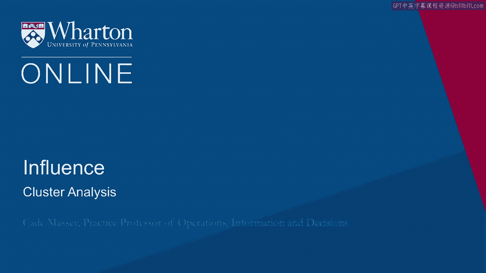
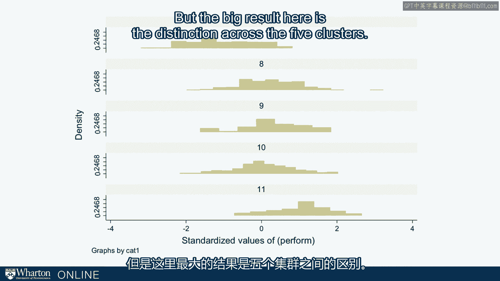

# 沃顿商学院《实现个人和职业成功（成功、沟通能力、影响力）｜Achieving Personal and Professional Success》中英字幕 - P102：38_聚类分析.zh_en - GPT中英字幕课程资源 - BV1VH4y1J7Zk

 A final analysis that we'd like to do with these data is what's called a cluster analysis。

 It allows us to see whether there are groups of students that exhibit similar patterns of。

 influence。 And I held off on doing this for years because we didn't have the power and it's kind of。

 an alluring analysis to do but it can be deceptive if you don't have a big sample。

 But at this point we have over a thousand and it's time to start looking at this kind， of thing。

 So what we find is that there are clusters distinct clusters in our data and I think， it's useful。

 it gives you a way of thinking， kind of a scaffolding for thinking about where。

 you fit and therefore what you might want to work on。 So broadly we see five clusters here。

 I'll describe each one in a little more detail but we see the buddy cluster which is about。

 a third of our population。 We see another third which we call the analyst culture。

 We have about a half of a third， a sixth in the nascent culture。

 About 10% in the multi and a little bit less than 10% about 8% in what we call a hammer， cluster。

 So let's dive into each of these to help you better understand the clusters that are out。

 there and where you might fit among these clusters。 So first is the nascent cluster。

 The visualization here is kind of a beta visualization we're working with where we take each of the。

 12 tactics on the radial here and then the smaller the pie associated with that tactic。

 the lower the percentile on that particular tactic。

 So we've also color coded the pie slices according to the factor whether it's hard power， smart。

 power or soft power。 So in these graphs the two slices might an ethos count as hard。

 We've just kind of simplified the factor analysis into these two are hard power。

 The four green ones are smart power and the six blue ones are soft power。

 And in the nascent cluster this is just a representative participant with the relatively。

 low score on all three factors。 Nacens just aren't really using much of the toolbox。

 They're not getting much leverage because they're not doing these behaviors。

 And again this is something like 16% of our sample。

 The analyst cluster which is a much bigger chunk of our sample something like 31%。

 These are folks who are using smart power extensively。 They're high on smart power。

 They're low on soft power and they're kind of in the middle on hard power。

 This is a cluster that is one of the stereotypes of NBA's。 These are folks。

 you know the caricature of someone who wants to stay with their computer， stay。

 work on the spreadsheet， not really interested or even thinking about these other。

 tactics especially the relationship tactics of soft power tactics。

 The buddy cluster is another one of the NBA's stereotypes。 Again about a third of our sample。

 This one shows a person who is very high on all the soft power tactics。

 They're doing all the relationship behaviors at a high frequency but they're almost doing。

 no smart power whatsoever。 They're below average on that and again kind of middling or ambiguous on the hard power。

 side。 So this is a cluster I did I would have known existed。

 I kind of discovered it over the years when I would do the debrief with students and I。

 would ever now then stumble across a group of them who were really high on these soft。

 power tactics but they really weren't paying attention or even aware of the smart power， ones。

 Hammers are happily a smaller percentage of our students but kind of the most stereotypical。

 in that these are hard power people。 Above average use of might and ethos and then not doing a lot on the soft power and smart。

 power。 Finally we have these multi's。 Multi's are about 10% of our sample。

 These are folks who are above average on all three。 They're making good use of the toolbox。

 These are little budding Abraham Lincoln's who are able to play on all 12 influence tactics。

 You might ask whether it matters and because we have those performance measures the reports。

 of how much impact participants are having in their organizations we can see if it matters。

 and this is what we find。 This is the average impact rating。

 average performance rating in our survey for members， of each of the five clusters。

 So the Y-axis shows the number of standard deviations above or below average。

 The students performance score， their impact score is。

 So you see the students in the nascent cluster， the average impact there was negative one standard。

 deviations and then on the far right the students in the multi， the 10% of our multi's their。

 average impact was something like plus one standard deviation。

 The middle three clusters these are kind of one tool clusters。 The analysts， the hammer， the buddy。

 these are one tool clusters are all near average。 They're very close to zero standard deviations which means their average impact。

 Now this of course is a simplification。 These are just the means for each of the clusters。

 Those are big clusters so there's going to be a distribution。

 So I just want to be more clear about that distribution。

 Here is the full distribution of performance scores within each of those clusters。

 The top is the nascent and you see that even though most of them sit below average the highest。

 impactful the most， the best performers there actually do reach average and get a little。

 bit above average。 All the way to the bottom are the multi's and you can see that almost all the performance。

 scores sit above average but then the left tail there are some people in those multi's。

 even though they're using all those tactics that aren't quite having their impact。

 And then you can see the three one tool factors in the middle all kind of straddle that average。

 line and you have some folks above and some folks below。

 But the big result here is the distinction across the five clusters。

 These are big mean differences across the five clusters as a function of how many tools they're。

 actually using in their influence toolbox。 [ Silence ]。

