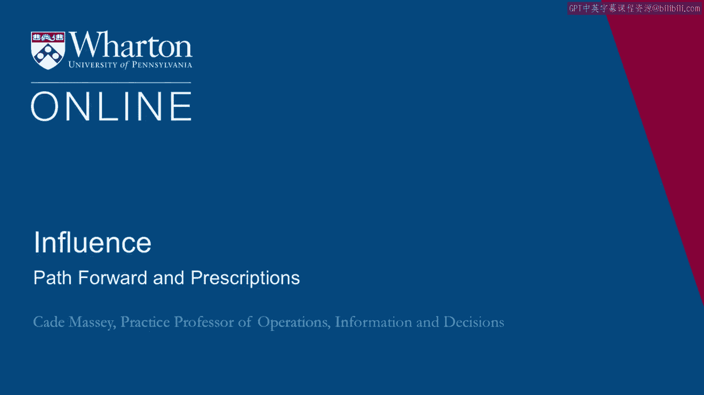
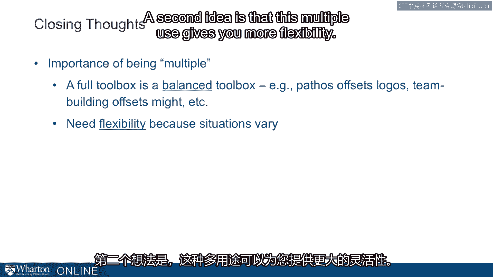
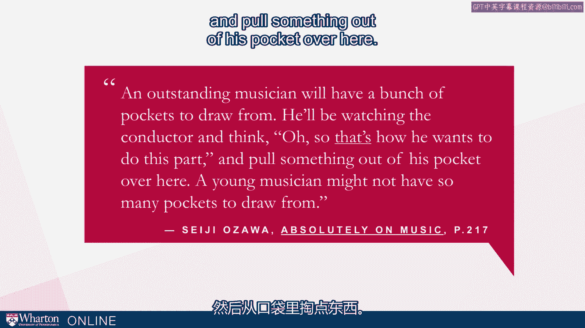
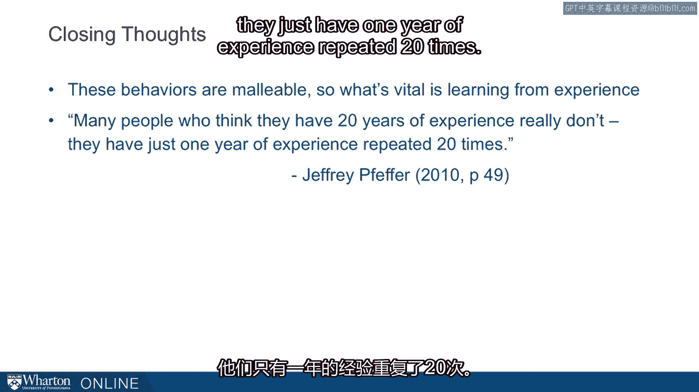

# 沃顿商学院《实现个人和职业成功（成功、沟通能力、影响力）｜Achieving Personal and Professional Success》中英字幕 - P103：39_前进之路和处方.zh_en - GPT中英字幕课程资源 - BV1VH4y1J7Zk

 At this point， you should have a better understanding of your results， what they mean， and how。

 they fit into the data we have from a broader sample。

 We really want to push you to do some reflection on what the results mean for you and where。

 you want to take them。 So， I want to suggest a few debrief questions。 One is。

 what is the strength that you can build on？ Everyone has go-to tools。 At the very least。

 you've got something that you use better than you use the other tools。 What is that strength？

 What is that foothold in your influence toolbox that you can build on？

 We also want to look at the other side of the ledger， and this is where most of the work， is。

 What is one strategy you'd like to do more of？ It may be that there are many strategies you'd like to do more of。

 but we know from， decades of research and psychology that if you try to change everything at one time。

 you're， not going to change anything。 So let's be very focused and push on what is one that you'd like to do more of。

 That kind of focus is going to be helpful in actually making a change。

 A couple of follow-up questions about that。 If you want to do more of this thing。

 why is it you haven't already been doing it？ This is an important insight to have before you can really make change。

 What has been getting in the way？ What is the root cause here that you need to address to actually get over that hump？

 So， some reflection on that is important。 And then finally。

 what is one concrete step you can take to use this strategy more？ What is the plan？

 It's not enough to say， "I want to be more intentional，" or "I want to use might more effectively。"。

 Okay， what's that going to look like tomorrow？ What's that going to look like？

 What is one concrete step？ Again， one concrete step you can take on the path toward making change。

 So this set of debrief questions is important for making these results real in your life。

 and building on them going forward。 So just to wrap up a couple of closing thoughts。 One。

 and these are basically themes across this half module。 One is the importance of being multiple。

 This is one of the initial motivations for this research and this tool is the emphasis。

 on using the full range of tools at your disposal。 A full toolbox is a balanced toolbox。

 Pathos can offset logos， team building can offset might， and so on。

 You're less likely to do too much of one thing if you have the counterbalancing tactic already。

 in your toolbox。 A second idea is that this multiple use gives you more flexibility。

 Situations vary， and so you need a wide range of tools。 In fact， the more responsibilities you have。

 the further you go in your career， the more， those situations are going to vary。

 There's a nice quote from the conductor Azawa in a recent book called "Absolutely on Music。"。

 He's talking about musicians， but it's a good analogy for how power works for the rest， of us。

 He says， "An outstanding musician will have a bunch of pockets to draw from。

 He'll be watching the conductor and think， 'Oh， so that's how he wants us to do this。

 part and pull something out of his pocket over here。

 A young musician might not have so many pockets to draw from。

 We want you to have lots of pockets to draw from。 The more responsibilities。

 the greater your ambitions， the greater the challenges， the。

 more you'll need to draw from multiple pockets。"， Second closing thought is that power accretes。

 It's habits and layers。 It's not one big decision。 It's what you do every day， basically。

 A couple of quotes from Jeff Feffer along these lines， Feffer says， "Building a power。

 base is a process of accumulating leverage and resource control little by little over， time。

 There's only one way to become more effective in building power and using influence。

 That's practice。"， And then finally， just like the principle of compound interest。

 becoming somewhat more， effective in every situation can over time leave you in a very different and much better。

 place。 When I close with the idea and in the reminder that these are malleable behaviors， by design。

 this survey taps into behaviors。 There are actions that you're currently taking。

 There are 67 of them and I challenge you that if there's any one of those you want to change。

 you can change it。 I cannot believe that people aren't able to change any one of those 67。

 That malleability is important。 What's vital because they're malleable is that we learn from experience。

 Again， Feffer gives us a great quote to end on。 He says。

 "Many people who think they have 20 years of experience really don't。

 They just have one year of experience， repeated 20 times。

 Let's not be those people。 We've given you good little foundation to work with now。

 It's up to you to decide where you want to take it。"， [BLANK_AUDIO]。

