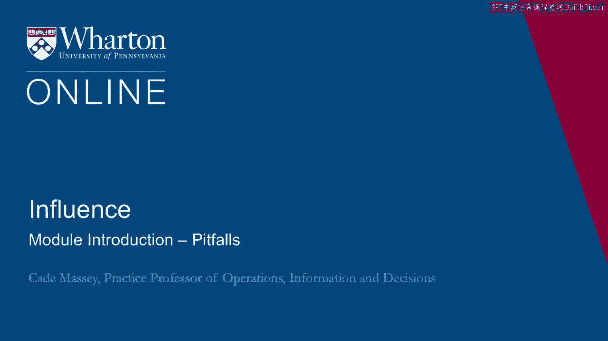
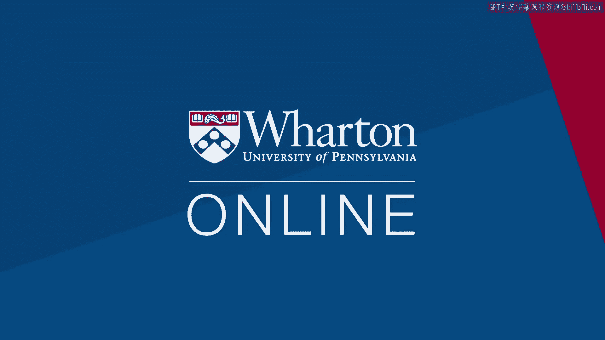

# 沃顿商学院《实现个人和职业成功（成功、沟通能力、影响力）｜Achieving Personal and Professional Success》中英字幕 - P104：40_陷阱模块简介.zh_en - GPT中英字幕课程资源 - BV1VH4y1J7Zk

 Welcome back to the fourth and final week of influence。

 This week is a little different。 We can't let you get out of here。

 without challenging you on a few fronts。 You've noticed by now that ethics comes up。

 it's been coming up really since week one。 And we touch on it， we raise questions。

 we poke a little bit， but we haven't dropped into it。 In the first half this week。

 we wanna talk about ethics。 Wanna give you some frameworks？ Wanna share some data？

 And we wanna push you a little more systematically， to think about your own ethical framework。

 In the second half we're gonna talk about status。 And you might think of this as a warning label。

 on the entire course。 We've spent four weeks now， three weeks now。

 helping you build your influence toolkit， hopefully helping you cultivate power and influence。

 Now we wanna say， "Hold on， "there's some dangers to becoming influential。

 "There's ways in which people change when they have power。"。

 So let's try to understand that a little bit， as a way of inoculating。

 or at least taking the edge off of the risk of building power。 Finally。

 we have a small closing module to wrap things up。 Hope you enjoy。 (silence)， [BLANK_AUDIO]。

