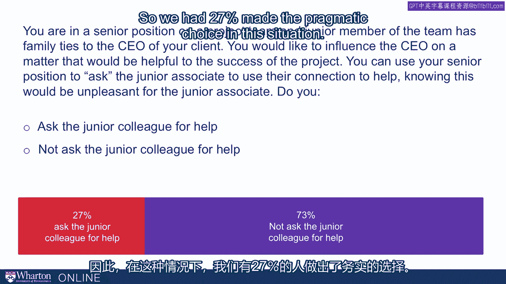
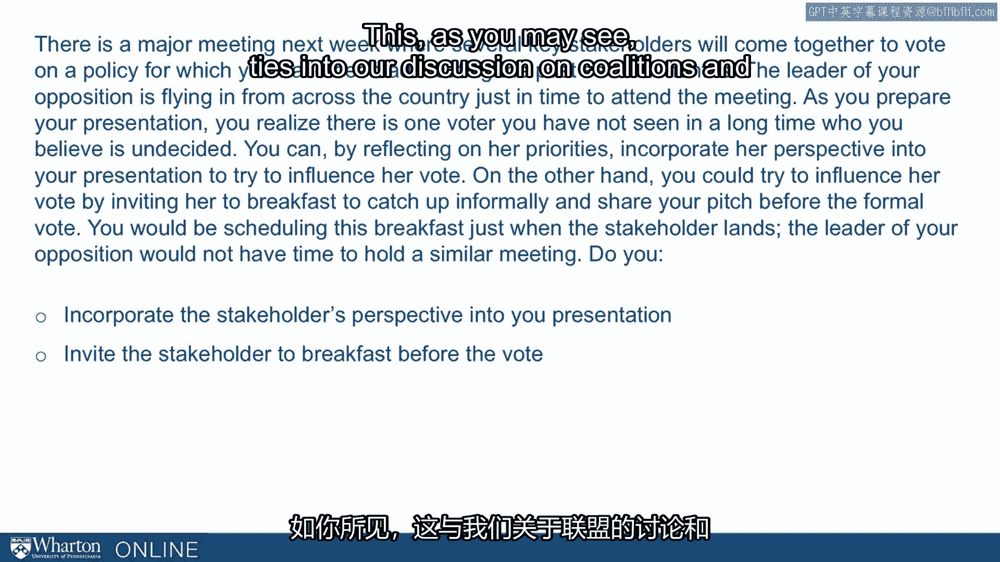
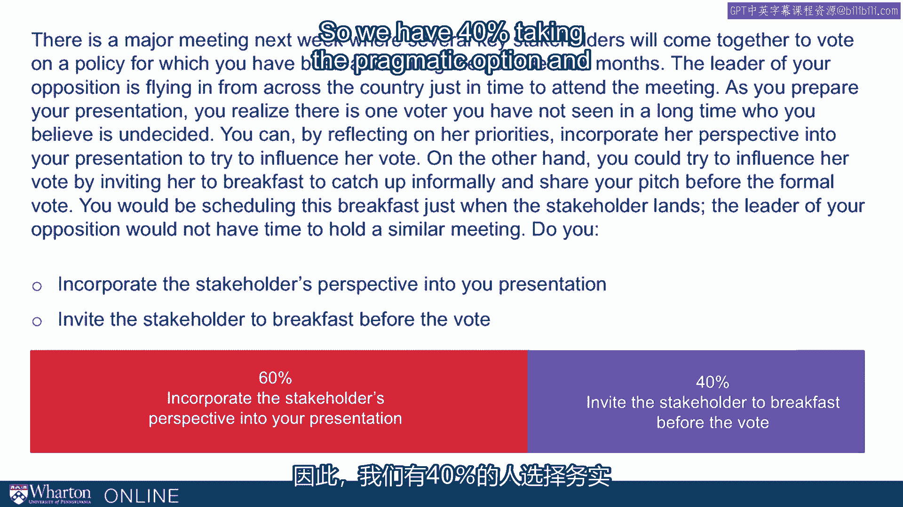
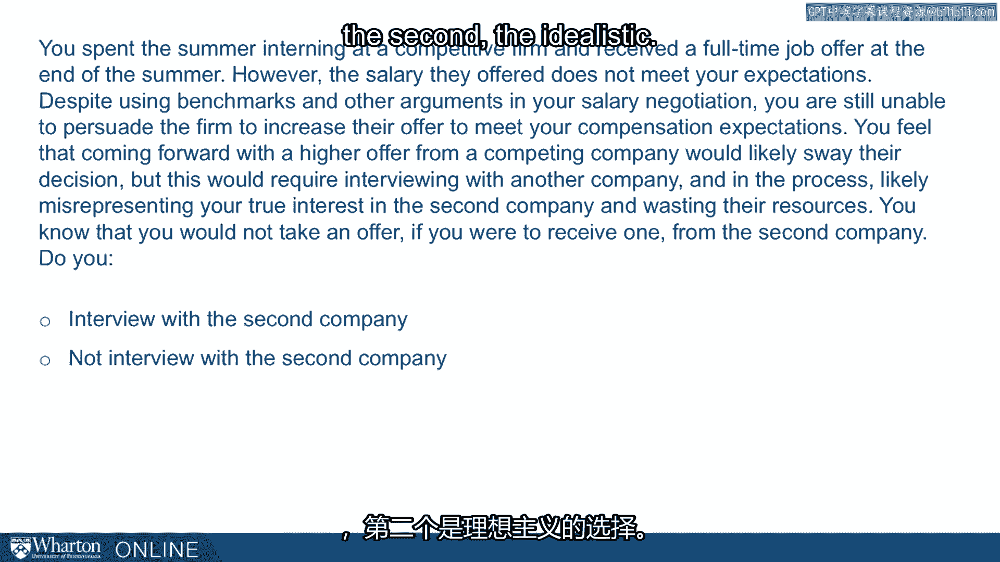
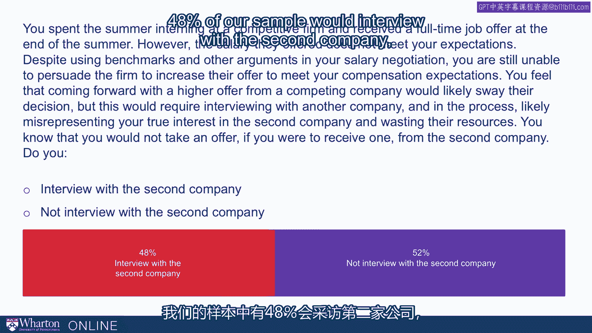
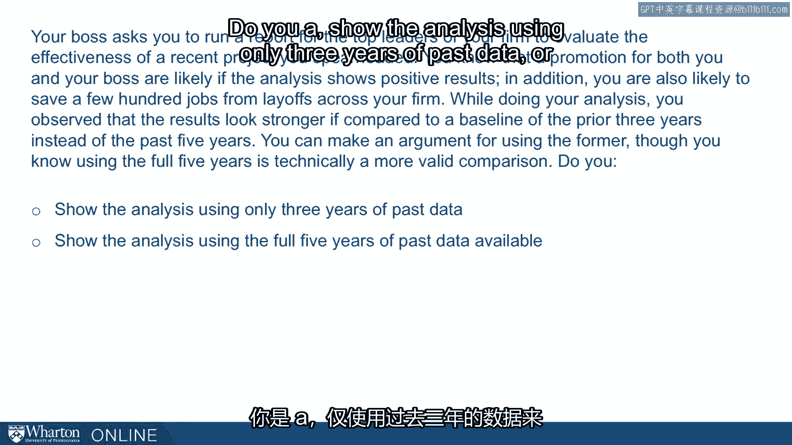
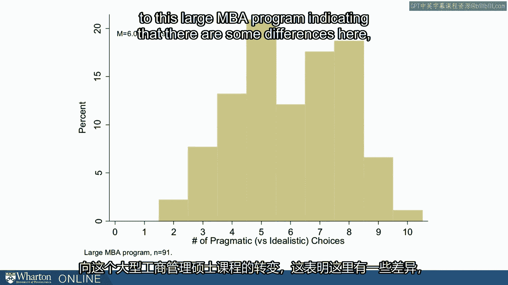
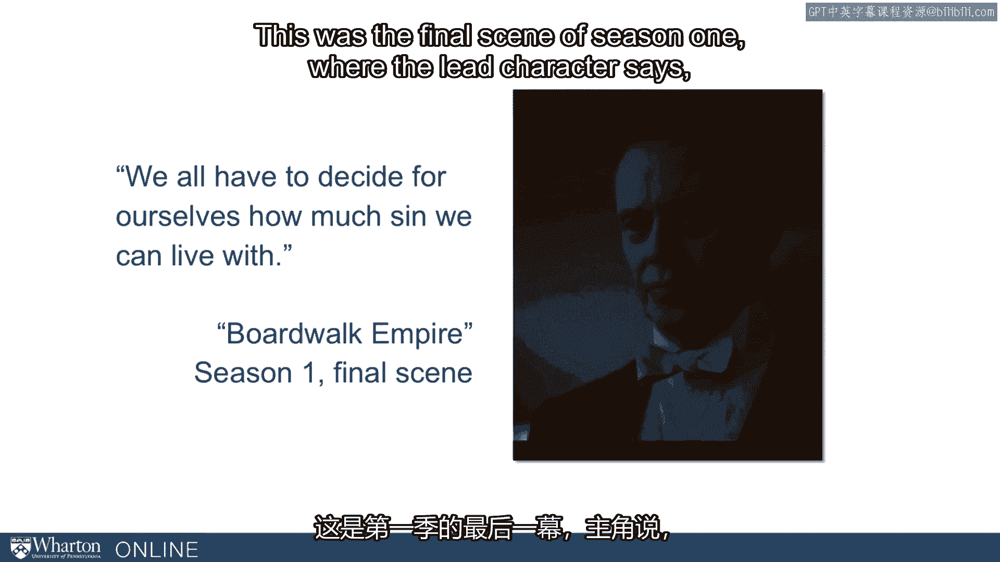

# 沃顿商学院《实现个人和职业成功（成功、沟通能力、影响力）｜Achieving Personal and Professional Success》中英字幕 - P106：42_硬问题调查解读.zh_en - GPT中英字幕课程资源 - BV1VH4y1J7Zk

 In this lecture， we want to talk about your responses to the hard questions survey that。

 we ask you to complete。 The motivation here is to kind of feel our way through the ethics conversation from。

 the bottom up， from the ground up。 Instead of sitting back and talking in only abstract terms or philosophically about ethics。

 let's ask what you would do in situations that you're apt to face。

 Maybe by the time we've asked that in 8， 10， or 12 different scenarios， we'll have a。

 better sense of what principles you want to live by， what principles maybe you're not， living by。

 but we want to reason up from that concrete experience。 So we put together this scenario。

 They were drawn initially from our students in the MBA programs and the executive MBA。

 programs who told us about scenarios where they had a challenge of deciding whether。

 or not to exerting influence or not。 Whether or not I want to use a tactic。 If I do use it。

 how do I use it？ As you know， as we've talked through the course in the last few weeks。

 the use of influence， raises ethical questions at every turn。

 And we want to have our eyes open about that。 So let's ask。

 what would you do in a variety of situations？ So we're going to walk through them one by one。

 As we go， I want you to think about a couple of things。

 One is what principles are guiding your selection in these vignettes？

 You're probably bumping across them。 You find yourself leaning on the same principle again and again。

 or you find yourself sacrificing， some principles that might surprise you。

 But what is it you're discovering？ What principle-based decisions are you making or not making？

 Another is what alternatives could you create？ Would you create if you could？

 We forced you into very stark choice。 Left or right？ Binary。 A or B。 Of course。

 life is rarely binary。 In fact， we think one of the best ways to navigate ethical dilemmas is to come up with。

 to call out these false dichotomies。 In fact， there's a C option here。 There's a third way。

 So one of the things you should be thinking about as you go through here is what would。

 be a third way？ What would be， if you're uncomfortable， as many of you will be。

 with the two choices given， what would be a third way to resolve the question？ And then finally。

 watch for the kinds of rationalizations that banagi at all， the article we just talked， about。

 warn us about。 Many people， as they talk about why they would choose one over the other。

 find themselves， saying the kinds of things that banagi at all report from their research and psychology。

 And that should always be a little bit of a warning sign to us。 Okay。

 Let's go through these questions。 We're going to take them through 10。

 You saw them in a random order。 We're going to give you 10。 And then I'll share the results。

 The data I have here are from a broad representative sample of the adult population in the United。

 States。 Something like 200 people have taken this survey and will share those results with you。

 First question， you're in a senior position on a project team and a junior member of the。

 team has family ties to the CEO of your client。 You would like to influence the CEO in the matter that would be helpful to the success。

 of the project。 You can use your senior position to， quote。

 "ask" the junior associate to use their connection。

 to help knowing this would be unpleasant for the junior associate。 Do you， A。

 ask the junior colleague for help or not ask the junior colleague for help？

 So in each of these questions， we're going to code one of the two alternatives as the。

 pragmatic choice and the other as the idealistic choice。 And it's not a perfect distinction。

 There's a little bit of overlap in some of them。 But broadly。

 we can call one of them the pragmatic choice， one of them the idealistic choice。

 You should keep track as you go through on how many pragmatic choices you make。

 We'll show you the distribution at the end of from zero to ten， how many pragmatic choices。

 people make when they take the survey。 So in this case， asking the junior colleague for help。

 we're going to code that as pragmatic， not asking the junior colleague for help。

 we're going to code as idealistic。 What did people tell us？ Well， in our broad survey。

 we had 73% of our population not as the junior colleague for， help。

 So we had 27% made the pragmatic choice in this situation。

 Number two， there is a major meeting next week where several key stakeholders will come together。

 to vote on a policy for which you've been advocating the past several months。

 The leader of the opposition is flying in from across the country just in time to attend。

 the meeting。 As you prepare your presentation， you realize there is one voter you've not seen in a long。

 time who you believe is undecided。 You can， by merely reflecting on her priorities。

 incorporate her perspective into your presentation， to try to influence her vote。 On the other hand。

 you could try to influence her directly by inviting her to breakfast。

 to catch up informally and share your pitch before the formal vote。

 You would be scheduling this breakfast just when the stakeholder lands， the leader of。

 your opposition would not have time to hold a similar meeting。 So do you， A。

 incorporate the stakeholder's perspective into your presentation？ Or B。

 invite the stakeholder to breakfast before the vote？

 We're going to code the first of these as the idealistic and the second as the pragmatic。 This。

 as you may see， ties into our discussion on coalitions and the meeting before the meeting。

 What do we see from our sample？ 60% incorporate the perspective from the presentation and 40% do the breakfast。

 So we have 40% taking the pragmatic option and the majority is saying with the idealistic。

 Question three， you spent the summer interning at a competitive firm and received a full-time。

 job offer at the end of the summer。 However， the salary they offer does not meet your expectations despite using benchmarks。

 and other arguments in your salary negotiation。 You are unable to persuade the firm to increase their offer to meet your compensation expectations。

 You feel that coming forward with a higher offer from a competing company would likely。

 sway their decision。 But this would require interviewing with another company and in the process likely misrepresenting。

 your true interest in the second company and wasting their resources。

 You know that you would not take the offer if you would receive one from the second company。

 So do you A) interview with the second company or B) not interview with the second company？

 We consider the first of these the pragmatic option and the second the idealistic。

 What does our sample say？ 48% of our sample would interview with the second company。

 48% take the pragmatic choice。 Question four， your boss asks you to run a report for the top leaders of your firm to evaluate。

 the effectiveness of a recent project you spearheaded。

 You know that a promotion for both you and your boss are likely if the analysis shows。

 positive results。 In addition， you are also likely to save a few hundred jobs from layoffs across your firm。

 While doing your analysis， you observe that the results look stronger if compared to a。

 baseline of the prior three years instead of the past five years。

 You can make an argument for using the former though you know using the full five years is。

 technically a more valid comparison。 Do you A) show the analysis using only three years of past data or B) show the analysis using。

 the full five years of past data available。 And here we show 45% of our sample choosing to use only the previous three years whereas。

 55% come in using the full five years。 I want to underscore here where four questions into a 10 question test but I want to underscore。

 that we don't believe there are right answers to this question and the point is not to grade。

 performance as right and wrong。 It's merely to code the inclination to use these influence tactics we've been talking。

 about throughout the course。 So the need for it， the trade-offs will vary across situations。

 We're just pushing you to think this through and see where you lie and more importantly。

 on what principles you rest。 What principles are driving your decisions。

 So let's keep going but you should be doing two things， three things。

 You should be adding up the number of pragmatic choices you're making， zero to ten。

 You should be thinking about what principles you're leaning on as you make these choices。 And third。

 you should be thinking about third ways。 We're forcing you to make dichotomous choices。

 What if there was a third alternative？ What could you come up with？

 What creative alternative could you come up with that might resolve this ethical dilemma。

 if you feel there is one？ Okay。 Fifth question。 If you use a third party for help on a critical task due to a misunderstanding a lot of money。

 was lost in a transaction but it is ambiguous whether you or the third party is a fault。

 Your company is an important client of the third party and as such you have the ability。

 to blame them entirely requiring them to refund the money。 Alternatively。

 you could accept part of the blame which would damage your reputation。

 Do you A) force the third party to accept the blame or B) accept shared blame？

 So we're going to call the first choice the forcing the pragmatic and the second accepting。

 shared blame the idealistic。

 And this taps into this notion of might。 You have authority here。 You can use it if you want to。

 In our sample we find that a minority only 14% force the third party to accept the blame。

 86% accept shared blame。 Question six。 You worked in investment management and your firm has been chasing one high net worth。

 individual who would be the single biggest account your firm has ever secured。

 For months of trying to win this person over she mentions her son is looking for a job。

 in investment management and ask if there are openings in your firm for her son。

 You review her son's application materials and it is clear he does not meet the academic。

 and professional standards typical of your hiring practices。

 Hiring him however will make it likely you secure her as a new account。

 Do you A) make the potential client's son an offer of employment or B) not make the potential。

 client's son an offer of employment where A) is the pragmatic choice and B) we're coding。

 it as the more idealistic choice。

 What does our samples say？ Our sample says 29% to make the son an offer with 71% coming in not making the offer for。

 going the opportunity for that particular client。 I believe this is question seven。

 It is early in a job or career you may sometimes feel the need to downplay your inexperience。

 in an effort to establish credibility。 This is especially true in jobs where you regularly interact with clients or beneficiaries。

 You are in this scenario six months into a new job walking into your first meeting with， the client。

 Your first meeting with this client the client asks for your professional background。

 Do you A) own up to your youth knowing it will make it hard to gain their trust or B)。

 embellish your experience。 We're going to code this second embellishing as the pragmatic choice and A) as the idealistic。

 70% of our sample went with the idealistic owning up to the youth with 30% choosing to。

 embellishing their experience。 Question eight you are working on a startup and you have an important pitch in a few days。

 with your first potential investor。 As the representatives of the investor make their decision about whether to invest in。

 your company you know they'll ask if you have any other investors already committed。

 If you say you do not it will severely hurt your chances of securing this investment。

 Do you A) imply you have other investors already committed or B) acknowledge you do not have。

 other investors。 We're going to code the first the implying as pragmatic and the second the acknowledging。

 is idealistic。 35% of our national sample said that they would imply they already have investors committed。

 with 65 saying they would acknowledge they don't have other investors。

 So again what's your tally so far we've got a couple left but more importantly what principles。

 are you finding。 What are you leaning on as you went through these decisions to decide which way to go。

 What principles are you stepping over or compromising are you finding that don't quite。

 matter as much。 And are you thinking creatively about what other choice you might make if you had the。

 freedom to do so。 Okay question nine you recently found out that a senior manager at your firm just relocated。

 to your town and is also a huge fan of your favorite sports team。

 You're excited to learn this as you think it could be a key lever to build your relationship。

 with him while you have heard negative things about the senior manager he is difficult to。

 work with and does not treat junior team members very well。

 You think the sports connection could be a platform to build a relationship to help propel。

 your career。 You are only interested in this relationship from a professional perspective。

 You realize the senior manager is new to the area and is eager to build personal relationships。

 He would not know your motives for building the relationship are purely professional。

 Do you A) build a relationship and help your career or B) do not build a relationship。

 In this case we had 75% of our samples saying that they would do the pragmatic thing which。

 is building a relationship and helping your career and 25 choosing the idealistic option。

 do not build a relationship。

 Finally question 10 you just started a new job as a product manager。

 Throughout your career you have learned how valuable building a wide professional network。

 is as well as the importance of building personal relationships with your professional contacts。

 This is especially important in a product manager role as part of your responsibilities are to。

 connect disparate parts of the organization。 One of your most critical stakeholders routinely insults team members behind their backs。

 He is also a bigot who is known to use awful slurs and disparaging and disparages others。

 However due to his position in your new company securing his buy-in will be critical to your。

 success。 This individual has taken a liking to you and asked you to grab a drink after work this。

 afternoon。 You anticipate he will try to bond with you by disparaging others which makes you uncomfortable。

 You are also worried that your colleagues will resent you for getting a drink with him。

 Do you grab a drink a) that is the pragmatic choice or b) more idealistically decline to。

 grab a drink。 Our sample goes 33% with the drink and 67% with declining to grab a drink。

 Those are the 10 questions that creates a scale of sorts a pragmatism scale or perhaps。

 an expedience scale to which there is not a right answer or an ideal place。

 But we hope that by going through those questions you start discovering what principles are most。

 important to you and start cultivating the practice of asking what are third ways when。

 you face these kind of false dichotomies。 Let's give you some context for your score。

 We ask you to keep score as you go through 0-10 for the number of pragmatic choices you， have。

 Here is how that looks for our nationally representative sample of adults here in the， US。

 The mean in that sample was 3。7。 With a pretty high standard deviation so quite a bit of variance and you can see the variance。

 in the graph there。 The peak， the mode was 2 followed quickly by 3 but you can see that there is quite a bit。

 of range there in the middle anywhere from 1-6。 Quite a bit of disparity but 1-6 but definitely on the more idealistic side of this scale。

 Now this varies by situation， it varies by population， we have conducted surveys like。

 this with our MBA population， our executive MBA。 In fact we have used this exact survey with a recent group of MBAs and we can give you。

 that as well。 This is a smaller sample but it's notable because it is so different。

 So here's what our MBAs say。 This is a large MBA program， a sample of 91 where the mean is 6。

 Our standard deviation， so a little less variance， much higher mean。

 We still see kind of the full range from 2 from only 2 of the 10 up to 10 and not much。

 on 10 but we see a shift here from the nationally representative sample to this large MBA program。

 indicating that there are some differences here。 Different preferences， perhaps different training。

 We're not entirely sure yet where the differences come from but it's important to place yourself。

 into this distribution and ask is this where you want to be。 Whether it's high， whether it's low。

 whether it's in the middle， whether it's typical of， the population or not。

 are you comfortable with where you are on that？ And are you comfortable with how you got there？

 Are you comfortable with the principles you used to get there？

 We'll end this section with a quote from Boardwalk Empire。

 This was the final scene of season one where the lead character says we all have to decide。

 for ourselves how much sin we can live with。 It's a little dramatic for this。

 we're not really talking sin here but the theme of this。

 particular lecture is deciding for yourself where you want to fit on things like that。

 distribution for pragmatism。 [ Silence ]。

