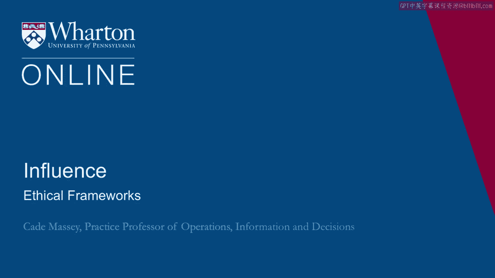

# 沃顿商学院《实现个人和职业成功（成功、沟通能力、影响力）｜Achieving Personal and Professional Success》中英字幕 - P108：44_伦理框架.zh_en - GPT中英字幕课程资源 - BV1VH4y1J7Zk

 In this last lecture on ethics， we want to talk more explicitly about frameworks and。

 we're pushing you to articulate your own framework。 But let's begin with our motivation。

 which is recognizing there's a downside to using， influence but also there's a downside to not using influence。

 You can't avoid the ethical dilemmas by merely opting out of trying to influence things。

 You have to keep in mind your goals， why it is you want to exercise influence at all。

 It could be for personal goals but it also could be for family， for friends， for organizations。

 those you work with， the broader community， public policy。

 You have lots of goals and motivations for exercising influence。

 So merely stepping away is not a good way to navigate it。 Not trying is not a good option。

 So what are your prescriptions？ What principles do you hold most dearly？

 The idea in this section is to articulate an ethical framework that will help buttress。

 you against the world's pressure。 The world's kind of trying to drag you down here and the more you are called on to use。

 influence， the more you're going to have to navigate these ethical dilemmas。

 So what principles are you not willing to violate？ What is your hierarchy？

 What is a framework you can use to help make sure you don't fall into traps as you exercise。

 influence？ So we're going to share a few examples from other people。

 These frameworks that you should adopt hold cloth but they're examples that might inspire。

 your constructing your own。 So Marcus Aurelius for example。

 his philosophy that we've kind of broken out into a checklist。

 here is never regard something is doing you good if it makes you betray a trust， lose your。

 sense of shame or makes you show hatred， suspicion， ill will， hypocrisy or desire for。

 things best done behind closed doors。 So a pretty high standard there with a list of six。

 seven items that might provide a checklist， for you。

 And this shows the particular principles that Marcus Aurelius held dearest and this would。

 constrain， clearly constrain some of your behavior。 It's an example framework。

 Richard Schell who is also doing a course in this sequence in his book on negotiation。

 he says those who value personal integrity。 They do what they negotiate consistently using a thoughtful set of personal values that。

 they could if necessary explain and defend to others。

 Note here that Richard is not telling anybody what those value should be。

 He's not even here arguing high or low。 He's merely saying you'd be consistent。

 you'd be thoughtful and if necessary you could explain。

 and defend those behaviors and those actions to other people。

 Another colleague of mine here at Wharton， Oscar Nakahara gave me a checklist once over。

 a breakfast conversation。 He grew up in industry and had to navigate many of these challenges over his career。

 He said， "Well， one criteria is front page of the Wall Street Journal。

 How would you feel if this behavior was written about there？

 Another is how would I feel about being on the other side of this， kind of in the other。

 person's shoes。 A third is what would you do if you had to make this decision 10 more times。

 say every， day for a week or what about 100 more times？

 Would you always be willing to take this pragmatic step across this principle if you had to do。

 it repeatedly？"， Then finally， what's the long term consequence versus short term？

 Is it better or worse if you take this action？ An interesting thoughtful list from Oscar。

 Then finally， I want to suggest my own and this isn't because I'm selling mine in any。

 means by any means but I want to give you another sample and push you to develop something。

 like this for yourself。 I'm going to give you it in two sections。 One are absolute。

 These are things that I believe are important and could be adopted because I think they're。

 well grounded。 Know your bias， talk about your decisions with others and look for third ways。

 Then finally， a section that are more personal choices but examples of things you might consider。

 Having high standards for honesty， striving for consistency and playing for the long term。

 Let's just talk about each of these briefly as we go through。 First， know you are inevitably biased。

 This goes back to the article we started this half lecture with。 The Banaji et al。

 Harvard Business Review。 How ethical or how unethical are you。

 One of the things they first talked about is David Armour's work on the illusion of objectivity。

 We tend to believe we are the objective ones in these situations that others might be biased。

 We're not biased。 That's a real problem because it can't be that everybody is correct about being the objective。

 ones。 This calls for emotional distance， outside perspectives。

 environmental and institutional design， meaning， you don't put yourself in situations that will bring up these dilemmas or you surround。

 yourself by protections of some kind or warning flags。

 You build environments that are more conducive to good decision making。

 These are the kinds of things you do if you know that you're biased。

 These are the kinds of things you have to think you don't need if you believe you're not biased。

 And I asked him as a quote here， a good quote that captures some of what we're talking， about here。

 We don't see the world as it is。 We see it as we are。

 This is exactly the opposite of what Armour finds in his research。

 People believe they see the world as it is and everyone else is wrong。

 And then the writer knew better。 She said， "We don't see the world as it is。

 We see the world as we are。"， Number two， discuss your decisions with others。

 This is an important and frankly easy check on your biases。

 This is one of the easiest prescriptions you can follow。

 It was merely talk about things with other people。

 It's a pretty bad sign if you're considering a course of action that you don't want to。

 talk about with other people。 And one of the details here is that the more different the background。

 the better。 It's not as helpful to talk about a challenging situation with a bunch of people who have。

 the same background as you， the same interest as you， the same training as you。

 They're not apt to bring a much of new perspective。 But if you can get outside of that bubble。

 talk about it with people who might think about， it differently。

 It's going to be a more robust check on the rightness of your action。 And Obama。

 in talking about putting together multinational alliances， put it this way， he， said。

 "In these situations， we should have a bias towards operating multilaterally， as。

 opposed to unilaterally。"， Because the very process of building a coalition forces you to ask tough questions。

 You may think you're acting morally， but you may be fooling yourself。

 You can't fool yourself if you have to convince other people to come onto your side。

 You really can't fool yourself if you talk about these decisions with other people。 Okay， finally。

 in the absolute category， these are things I do firmly believe in is the third， way。

 As we went through the hard question survey， this is not， life is not a movie。

 There are ways to be both effective and maintain integrity。

 Too often when we read the books or see the movies or watch TV， characters get painted， as。

 you know， all good or all bad or effective， but evil and ineffective， but a good person。

 That's not the way real life is。 Even if these things are kind of correlated。

 there are ways to be effective and maintain， integrity。 It may be rare and demanding。

 but that doesn't mean it can't be done。 One of the things you need to help you along your way is to be vigilant。

 for example。 It's helpful in life to have flesh and blood demonstrations。

 You carry around in your head of people who are living the way you want to live。

 People who have navigated difficult situations in a way that you would be happy to navigate。

 So difficult situations。 So we need to keep our eyes open for these examples。

 but generally we need to cultivate， the inclination to look for third ways。

 to not settle for these false dichotomies， to bring， some creativity into our ethical dilemmas。

 Okay， three more from a category of consider this。

 These are more personal but things to be considered。 They're at the very least examples of things。

 examples of ways of thinking about it that， you might use as you pull together your own framework。

 The first of these is have high standards for honesty。 It impacts not only what you say。

 but what you do。 It is similar at the individual level as transparency is at the organization level。

 An organization which lives by transparency。 They're going to share， for example。

 with their employees salary information， performance， evaluations。

 the reasoning behind their decisions。 You might think about that as having all these downstream consequences。

 Once they do that sharing， people act differently。

 But the interesting bit is that it also has upstream consequences。

 If you know you're going to be that transparent or at the individual level， if you know you're。

 always going to be honest， you're not going to lie， it's not just that it has downstream。

 consequences。 It changes your behavior upstream。 If you know you're going to have to tell your spouse that you did this thing。

 well， you're， probably not going to do it。 Are you going to act differently？

 Or you're going to think about it more thoroughly at the very least。

 It raises the bar and it removes cover that might lead you to take some bad decisions。

 As much of that as you can bake into your life， probably the better off you're going， to be。 Again。

 this goes back to Richard Schills。 Are you willing to defend it in front of somebody？

 It's not saying what you should do。 It's just that you shouldn't be doing things that you're not willing to defend in front。

 of people。 Second， in this category， how consistent is your behavior？

 We might judge and act by considering in how many of our social circles would be comfortable。

 discussing it。 One way we lose our way ethically is that we fall into an organization or an industry。

 that has a certain set of norms and there's nobody in that industry or in that company。

 or in that group that challenges those norms and you begin to think that all that behavior。

 is normal。 You're willing to talk about it outside of your social circle。

 If you're willing to be consistent， not just act one way here in a different way in a different。

 social circle， it's going to provide a check for you。

 We also know that there are psychological consequences to having that kind of compartmentalization。

 There's a toll it takes if you're acting so differently across your domains。 Finally。

 consider the trade-off between short-term and long-term。

 It is often the case that the harder path to take is the one that is better in the longer， term。

 Now， the challenge here is that we're not guaranteed to be around in the long term。

 We don't know what the long term is。 There's a lot of uncertainty。 You may make the long-term play。

 You might make the wise move for the long strategy and then never make it all the way。

 of the long strategy。 We have to have our eyes open about that。

 But if we want you to have not only influence but sustainable influence that typically calls。

 for play in for the long term， not being short term， not being expedient， sometimes sacrificing。

 gains in the short term in order to build that longer term influence， we're not interested。

 in short-term influence in most situations。 What we're trying to help you do is build long-term sustainable influence。

 Thank you。 [end of transcript]， [BLANK_AUDIO]。

