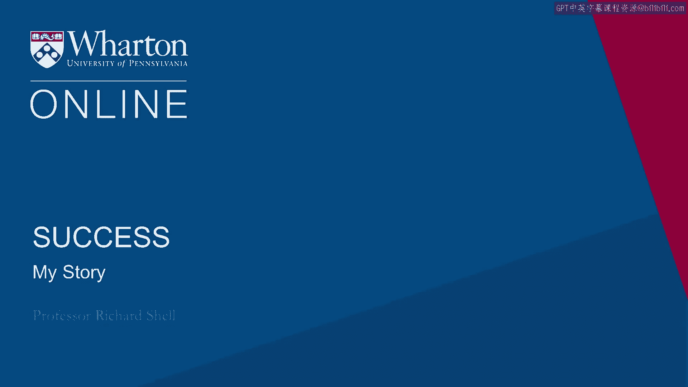

# 沃顿商学院《实现个人和职业成功（成功、沟通能力、影响力）｜Achieving Personal and Professional Success》中英字幕 - P10：9_我的故事.zh_en - GPT中英字幕课程资源 - BV1VH4y1J7Zk

 I was someone who was very， very deeply aware of this at an early age， but almost involuntarily。

 But it is a big reason why this subject is important to me and why I teach it。

 I was raised in the military。 My father was a general in the Marines。

 He was moved every year when I was a kid to a different place， France， Hawaii， South Carolina。

 New Portland Island。 I was taken as part of our family。 I had two older sisters and me。

 That was just the world I was in。 Every place we moved had a base with a guard and as far as I knew。

 everybody lived like， that。 As I grew up， it wasn't a question of whether I was going to go in the military as my career。

 It was just a question of which military academy I would attend and which service I would pick。

 As I got into high school and began thinking about college， I realized I really didn't。

 want to go to either West Point or Annapolis， but I was totally committed to the military。

 as a career。 I ended up making a compromise with my family and I ended up getting a full military scholarship。

 to another college， not to West Point or Annapolis。 So I was signed up。

 I was in Navy Razzi and I was on my way to being an officer in the Navy for at least six years。

 after I graduated。 Everything is normal。 I'm in my water， swimming along。

 And then I was in the Vietnam War era in my college years and in the junior year of college。

 everything around me virtually exploded。 United States invaded Cambodia。

 campuses all over the country lit up with protests。 My own campus had shut down all of its classes。

 And for the first time in my life， I was actually called to try to take a stand on what I had。

 signed up to do， which at that moment I realized was to go kill Vietnamese people that I had。

 no quarrel with。 And I suddenly realized that that was just something I couldn't do。

 And so I faced a big choice。 I realized that my family values were not things that I could endorse in this era。

 in， this context， but I love my family。 So I was in a crisis。 In the end。

 I finally decided to become a war resistor。 I resigned my scholarship。

 but I had to have a very difficult conversation with my father， about my choices。

 And I had that conversation。 He was not angry with me。 And in fact。

 the most upsetting thing about it for me was the fact that he only asked a。

 simple question in my conversation with him。 He said， "Richard， are you sure？"。

 And I absolutely could not be sure at the age of 21 and walking away from everything my。

 family had stood for。 It wasn't just my dad。 My dad's dad had been in the military。

 My mother's father had been in the military。 My older sister had married a career military officer。

 So I was surrounded by these values。 But with him at that moment， I had to be sure。 And so I said。

 "Yes， I'm sure。"， And what I didn't know at the time and what took me over a decade to sort out was that。

 when you break with your family in this way and walk away from everything that you've。

 been raised with that they've stood for， you find yourself in a kind of limbo。

 You essentially cut the narrative chord of your life story。

 And you're no longer the person that you were。 You don't recognize the childhood you had。

 And I can tell you from first-hand experience that if you don't have a past， it's impossible。

 to recognize and imagine the future。 So I finished college。 I became a conscientious objector。

 a pacifist， worked in the ghettos of Washington， D。C。 as， a social worker。 Very。

 very uncertain about who I was or where I stood other than that I was still sure I。

 had made the right choice。 But the kind of alienation between me and my own cultural and family values was such that。

 in the end I just left the country。 I spent almost two years traveling with a backpack living very close to the ground。

 working in， different places where I could work for free just to try to or live for free。

 try to sort， it out。 And over those two years I ended up living in monasteries in Sri Lanka and in South Korea。

 I had some wonderful teachers who introduced me to the actual experience of being myself。

 and the values that I had come to embrace in a much more deep way。 And finally。

 at the age of almost 30， I returned home。 My family welcomed me back。

 I lived in their basement and sold insulation door-to-door in Southwestern Virginia while。

 I tried to figure out what the next thing to do was。

 And that experience I think is a lot of why this course material is so important to me。

 because I recognize that until I had identified those cultural forces that I was living as。

 a result of and taken control of my own life and my own values and stood up for them， embraced them。

 presented them to my family。 My family loved me irrespective of our differences。

 I was actually privileged to be with them。 My parents all the way through their lives was with them each when they died and felt。

 the deep love that comes when you work on your relationships in your family in important， ways。

 So I feel like sooner or later， one way or the other， people come to confront the values。

 that their families have endowed them with， the values that their culture has endowed， them with。

 and come to terms with those as a very important waystation on the journey， to what success means。

 And I feel that way because it's the way it worked for me。

 I didn't start working at Wharton until I was 37。 I was a brand new assistant professor here at that age。

 So anybody who's watching this who thinks that they're kind of a late bloomer， rest assured。

 that they're still properly， plenty of time， just sort this out。

 I genuinely believe it's more important to get this right and to come to terms with who。

 you really are than it is to always be living someone else's life and not be aware of the。

 underlying motivations that are actually powering who you are。 So share that story。

 I think it's important for you to know something about who I am and， where I'm coming from。

 But the course isn't about me， the course is about you。

 So just understand that the structure of this is designed to help you come to your own realizations。

 and come to terms with your own values so that you can feel on a firm foundation for。

 the decisions you make in the years ahead。 [BLANK_AUDIO]。

