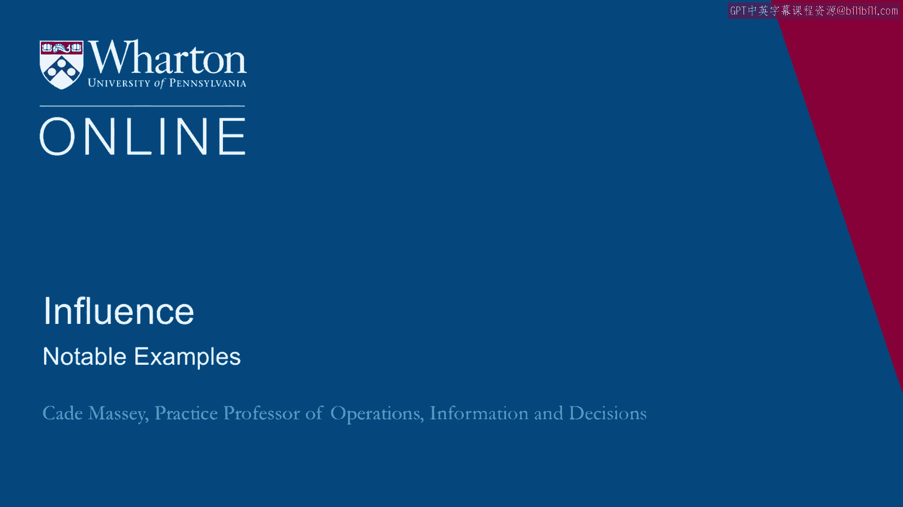
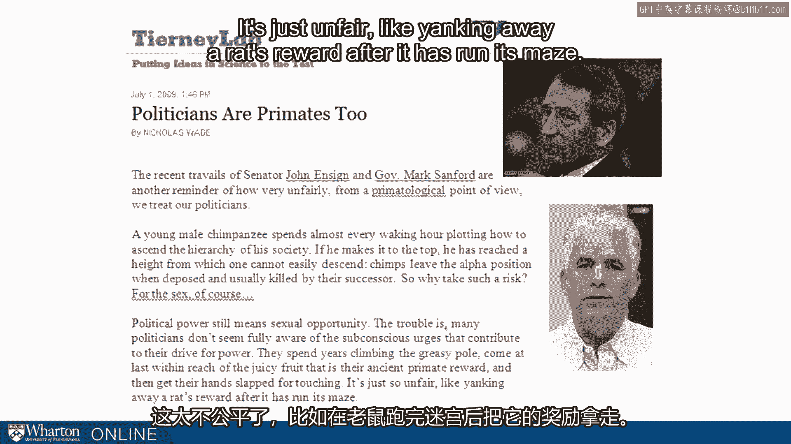
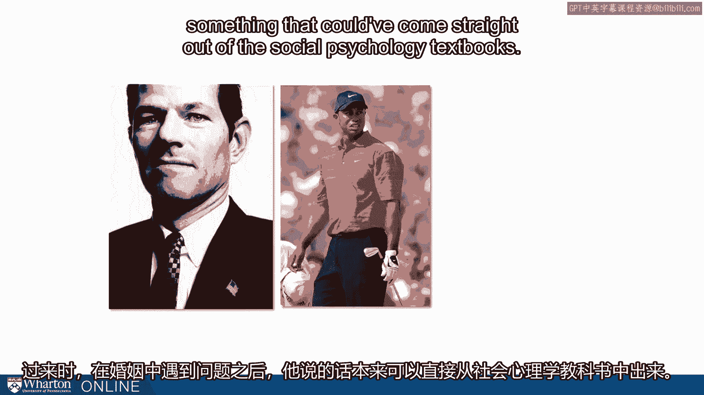
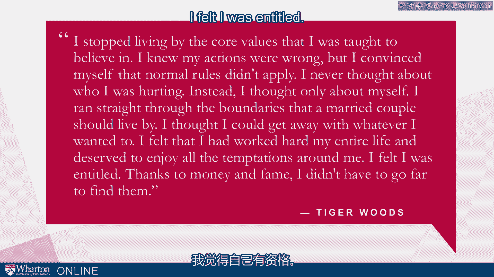
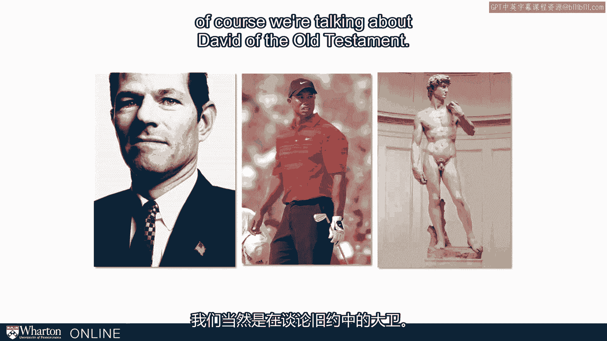
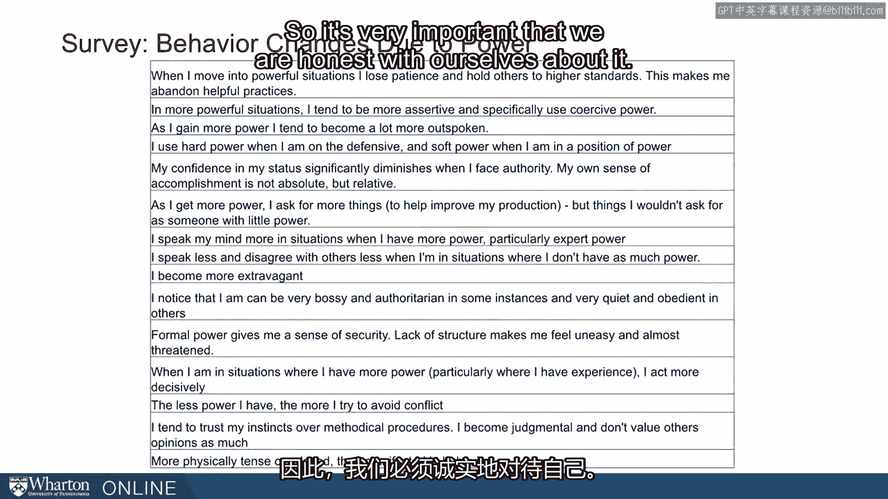

# 沃顿商学院《实现个人和职业成功（成功、沟通能力、影响力）｜Achieving Personal and Professional Success》中英字幕 - P110：46_典型案例.zh_en - GPT中英字幕课程资源 - BV1VH4y1J7Zk

 One of the fun/tragic aspects of teaching this topic is that there's never any shortage。

 of examples。 And in recent years， we've had a rash of bad behavior from high status individuals。

 So taking a quote here from Tierney Lab in New York Times publication a few years ago。

 when Mark Sanford and John Insign ran into some trouble politicians。 Sanford and Insign。

 Nicholas Wade writes， "Polititions are primates too。"， He says。

 "The recent travails of Senator John Insign and Mark Sanford are another reminder。

 of how very unfairly from a primatological point of view we treat our politicians。

 A young male champ spends almost every waking hour plotting how to ascend the hierarchy。

 of his society。 If he makes it to the top， he has reached a height from which one cannot easily descend。

 Champs leave the alpha position when deposed and usually killed by their successor。

 So why take such a risk？ For the sex， of course， political power still means sexual opportunity。

 The trouble is many politicians don't seem fully aware of the subconscious urges that。

 contribute to their drive for power。 They spend years climbing the greasy pole。

 come at last within reach of the juicy fruit that， is their ancient primate reward。

 and then get their hand slapped for touching。 It's just unfair。

 like yanking away a rash reward after it has run its maze。"。

 So Sanford and Insign， but we can keep on going down the list。 Elliot Spitzer， similar。

 just added a little hypocrisy to give extra flavor。 Tiger Woods。

 one of the more prominent examples from the sporting world， ran into some major。

 miracle issues that have contributed to the premature end of his competitive golf game。

 When he came out of therapy after having had issues in his marriage， he said something。

 that could have come straight out of the social psychology textbooks。

 He says， "I stopped living by the core values I was taught to believe in。

 I knew my actions were wrong， but I convinced myself that normal rules didn't apply。

 I never thought about who I was hurting。 Instead， I thought only about myself。

 I ran straight through the boundaries that a married couple should live by。

 I thought I could get away with whatever I wanted to。

 I felt that I had worked hard my entire life and deserved to enjoy all the temptations， around me。

 I felt I was entitled。 Thanks to money and fame， I didn't have to go far to find them。"。

 So Woods found his trouble with marital infidelity， but that rationale is the rationale underlying。

 many status-driven violations that we see by people who have had power and become accustomed。

 to power。 One last one， an ancient example， just to underscore how long this has been going on。

 and how it affects even very accomplished people， very worthy people。 Michelangelo is David here。

 but of course we're talking about David of the Old Testament。

 Let's refresh on David。 So if you don't know anything about David。

 you probably know the story of David and Goliath。 This is when David first entered the world stage as a shepherd boy slaying the giant Goliath。

 He went on to write many of the Psalms in the Bible， and he served as king of Israel。

 for a very long time。 But he also had this incident with Bathsheba。

 Do you remember the story of David and Bathsheba？ So Bathsheba was a woman he fell in love with。

 He saw her bathing on the top of the building next to his。 And unfortunately for him， well。

 first he invites her to his house。 He has an affair with this woman， and unfortunately for her。

 she is married to one of his generals。 So what does David do？

 What is the David who writes Psalms and is the just king？ What does he do？

 He conspires to have his general killed。 He brings in the rest of his generals。 And he says。

 let's go attack the enemy next to us。 Put Bathsheba's husband in the front。

 and then when the enemy starts responding， fall， back to have him killed。 And in fact。

 these guys did this。 Bathsheba's husband was killed。 So now he can have Bathsheba to himself。

 This is David。 This is King David。 King David falling prey to the exact same issues it seems that we've been documenting。

 in more recent studies in social psychology。 But people have been grappling with this for millennia。

 essentially。 And people who are otherwise as worthy as King David was are as susceptible to it。

 So it should be a sobering note for us。 And I want to turn the question to you and ask。

 how are you different when you're in， power？ This is a good time to reflect a little bit and think about。

 You've probably observed that you act a little bit differently when you're in high power。

 situations than in low power situations。 In what way are you different？

 So this is something that we sometimes survey our students on。 And I've got a collection here。

 And this is truly just a random sample。 This is a random sample of survey responses from our full-time MBAs on ways in which they。

 are changed by power。 This is just self-report。 So let's take a look at these。

 And you'll see a wide range of them， some of which are echoed in the social psychology。

 we've been talking about。 Some of which may be a little bit different。

 But you hear people talking about being more extravagant， speaking their mind more freely。

 using hard power。 I become more outspoken。 The less power I have， the more I avoid conflict。

 These are all honest reflections on the ways people are changed by power。

 And these are on average 27-year-olds。 They might have had a little power。

 but they are not having the kind of power they have， to will in the next 10 years， 20 years。

 30 years。 They haven't had a decade or two decades to adapt to the kind of status that they might。

 This is only the beginning of the changes。 This is what we want to stay in touch with。

 This is what we want to have our eyes open about。 This is what we worry about whenever we tool you up to develop and cultivate status and。

 power， because this is what can trip you up。 This in fact。

 these are the seeds power carries the seeds of its own destruction。

 Power brings this change and then these changes can undermine your power。

 So it's very important that we are honest with ourselves about it， that we admit and。

 accept the fact that we are susceptible just as David and Tiger Woods and Elliot Spitzer。

 have been susceptible。 And hopefully that we take steps to try to mitigate it。

 So in the next section， we'll start talking about some of those steps。 [BLANK_AUDIO]。

