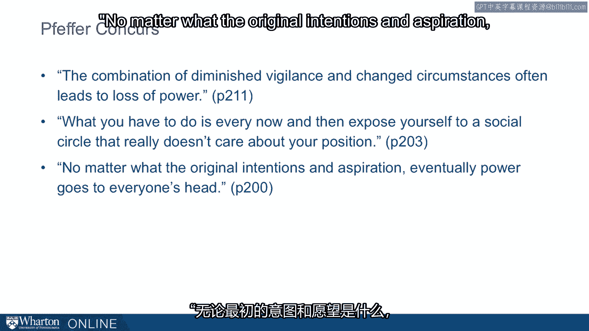

# 沃顿商学院《实现个人和职业成功（成功、沟通能力、影响力）｜Achieving Personal and Professional Success》中英字幕 - P111：47_你能做什么.zh_en - GPT中英字幕课程资源 - BV1VH4y1J7Zk

 Happily， we do have a bit of advice on how you can try to avoid， you help mitigate the。

 impact of these psychological changes that come with status and power。

 Rod Kramer is on faculty at Stanford and has spent his career studying those in power。

 observing business and government leaders， observing many of the problems that we've。

 been talking about， but also some of the ways people navigate those problems。

 He comes up with a list of prescriptions that he calls avoiding genius to folly syndrome。

 the situation of getting power because you're genius and then losing power because of the。

 folly that comes from the status related problems。 His prescriptions are keep your life simple。

 hang a lantern on your foibles， float trial， balloons， sweat the small stuff。

 reflect more not less and recognize trade-offs。 So these are all actually pretty easy to understand and by themselves might be easy to do。

 seems， like that would be easy to do， but you probably find some of them easier than others。

 So a question for you， which of these do you think you're already doing？

 Which of these kind of come natural to you？ Which do you struggle with？ So for example。

 many people that I talk with have trouble with this， hang a lantern on your， foibles。

 Are we really supposed to talk about our problems？

 Are we really supposed to talk about our mistakes？

 This is one of the main prescriptions that Kramer makes。

 He finds that those who are able to avoid this genius to folly problem are those who air。

 their problems earlier。 They don't try to sweep things under the rug。

 They're more okay being imperfect and they expect others to be imperfect and therefore。

 it's going to be okay for themselves to be imperfect。 One another way people。

 another thing people struggle with is reflecting more not less。 So we're very busy。 People。

 very busy society， seemingly busy here all the time。

 Kramer finds that those who avoid this problem are folks who step away from the business who。

 reflect a little bit on their behaviors who aren't going from one activity to the next。

 all the time。 So again， not brain surgery。 Pretty simple。

 but some of us have trouble with some of these。 Some of us have trouble with others。

 Push you to think a little bit about how you can do more of these， how you can bake more。

 of these into your life。 What are you having trouble with already？

 If you're 27 and just getting started and already having trouble with some of these issues then。

 you're going to have more problems when you pick up more responsibilities and more success。

 down the road。 The prescriptions that come from Kramer is to start baking this into your life now to。

 kind of inoculate you against trouble you have down the road。 So others have echoed Kramer's advice。

 Gary Loveman， CEO of Harrah's Entertainment says the higher your rise in the organization。

 the more people are going to tell you that you're right。 His antidote， this is what Loveman says。

 He says he regularly and publicly admits mistakes。 He emphasizes the decision process。

 prioritizing data and analytics and de-emphasizing who makes， the decisions。

 He actively seeks the opinions of outsiders。 This is a great antidote to open yourself to the opinions of outsiders。

 especially those， who come from a different place than you。

 And encouraging debate among his leaders， among his team and critical self reflection。

 within the organization。 So very much in line from this CEO and what Kramer's prescriptions are。

 I had an email from an executive MBA student a few years ago about a year after he took， my class。

 He wrote， "Watch how funny your jokes get。"， That quote made an impression on me because it began happening once I was promoted。

 "I am not a funny person。 I don't pretend to be。 My comedic timing is awful as my wife will clearly attest。

 Yet people laugh。 Fascinating。"， I know that as I become successful I can be lured by the temptations of reading my。

 own press， so to speak。 The slide I find most important actually is how to avoid genius to folly syndrome。

 This rings true。 "Every time my ego runs away with me I make a mistake。

 I know this and am constructing ways to integrate those points in my life for the long term。

 There is a real need and cannot be overstated。"， Lara Teedens。

 another Stanford professor who studies power， says it is this very reflection。

 that she's out for in studying this stuff。 She says she sometimes gets accused of being a little evil for studying the roles of hierarchies。

 and dominant behavior and for the recommendations she makes。

 But in self-defense she says this sorting out behavior is going on between people all the， time。

 And the pernicious effects occur because we don't talk about it。

 Once it becomes an explicit part of our relationship we have a lot more control over how it plays。

 out。 The same thing is going on within ourselves。 If we can be a little bit more honest with ourselves。

 if we can name these problems， if， we can be more explicit with those around us about how we are changing or tempted to change。

 as a result of power and status， we can take the edge off that risk。

 We can inoculate ourselves just a little bit。 One more note from a recent student and one of the more profound examples of people taking。

 steps to avoid these problems。 This student writes that Kramer's prescription to "hang a lantern on your foibles" got her。

 thinking about one of her old managers who had kept a log of his professional missteps。

 for nearly five years。 She says， "What's more， this manager asks his assistant to randomly select one of these。

 eras and send it to him in the subject line of an email every day。

 When I first heard of this ritual I regarded it as very quirky， if not downright masochistic。

 but my manager explained that he had seen too many leaders fall prey to "the power。

 paradox" and cease to acknowledge or learn from their eras once they reached the top。 Instead。

 my manager was taking steps to constantly remind himself that he too was only mortal。

 and prone to mistakes no matter what title level or pay grade he ultimately achieved。

 He remarked that arrogance often led to complacency or recklessness and decision-making and vowed。

 to do whatever he could to avoid letting you risk it the best of him。

 This isn't even one of my students。 We don't know where he picked up this stuff。

 but it's an extreme proof of concept。 You can take these ideas very seriously and bake these prescriptions into your life。

 This is one of the most baked in examples of a prescription I've ever seen。 Jeff Efre can curse。

 Jeff Efre， the organizational psychologist， says， "The combination of diminished vigilance。

 and changed circumstances often leads to the loss of power。"， What you have to do。

 this is one of Efre's prescriptions， what you have to do is ever。

 now then expose yourself to a social circle that really doesn't care about your position。

 This is one of the prescriptions that most commonly comes up in my discussion of this。

 with students， both MBAs and executive MBAs， is staying in touch with people who they've。

 known for years， sometimes decades， staying in touch with people who knew them before。

 they had power， before they had influence to keep them grounded and to keep this outside。

 perspective。 And then finally， Feferens on this very sober note。

 "No matter what the original intentions。

 and aspiration， eventually power goes to everyone's head。"， Unfortunately。

 this is also the way I feel about the field having studied it and taught。

 it for the last 10 years or so。 There is an inevitability。

 There does feel to be an inevitability or at least a big mean tendency towards power going。

 to everyone's head。 And if we're not willing to acknowledge it。

 it only increases the risk that it'll happen， to us。 [BLANK_AUDIO]。

