# 沃顿商学院《实现个人和职业成功（成功、沟通能力、影响力）｜Achieving Personal and Professional Success》中英字幕 - P113：49_有影响力者的七个习惯.zh_en - GPT中英字幕课程资源 - BV1VH4y1J7Zk

 So， I want to wrap up the course with a framework that I'm offering， though it's not the framework。

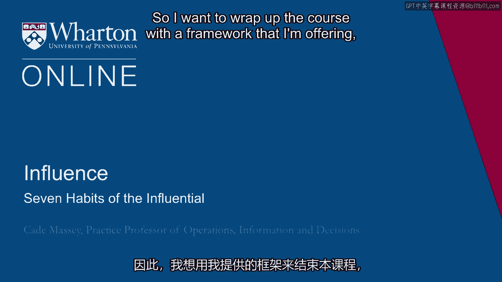

 I think anytime you take a class， you should go through the effort of distilling the key， ideas。

 the ideas that are most important for you to carry forward yourself。 So。

 I encourage each of you to do that。 At some point in teaching this course。

 I decided to do that for myself。 So， as years in， it's now been a few years since I've done it。

 but I still like this， framework and I want to suggest it to you as one way of thinking about some of the themes。

 in the class。 But again， I want to encourage you to do your own。

 I call this seven habits of the influential and I'll unpack each of these in a little bit。

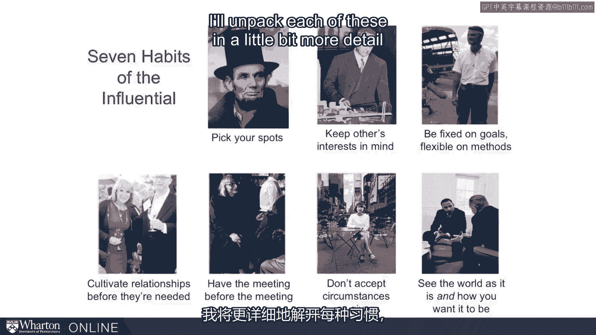

 more detail as a way of picking up on some themes we've talked about throughout the class。

 The first is pick your spots。 This is a picture of Abraham Lincoln。 Of course。

 we could use Lincoln to illustrate any number of the ideas in the class。

 But this first habit we're talking about comes from situation awareness。

 And this is the idea of using multiple lenses to understand a situation， staying vigilant。

 for changes in circumstances， especially changes in risk， uncertainty and importance。

 And knowing when to invest and knowing when to let slide。 Basically。

 you've got to know when it's okay to stay with the daily routines and when it's。

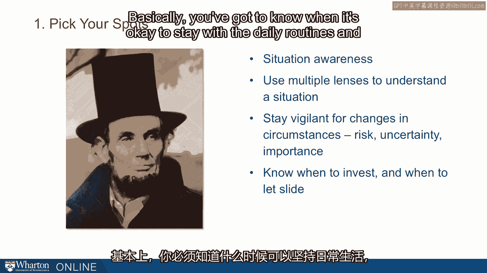

 time to do something different。 Lincoln was a fantastic example of this。

 Information awareness is a general set of skills that will help you。

 And this habit of picking your spots is one that we see in influential people。 Second habit。

 keeping others' interest in mind。 We introduced this fancy term earlier， allocentrism。

 This perspective， one being interested in the other people's perspective， the opposite。

 of egocentrism。 We could use Robert Moses as an example for any number of our ideas。

 But he kind of surprisingly for his forceful a guy as he was， was excellent at allocentrism。

 He realized the more you can give others what they want， the more they can afford to give， you。

 And this involves keeping not only their ideas but their feelings in mind， this notion of。

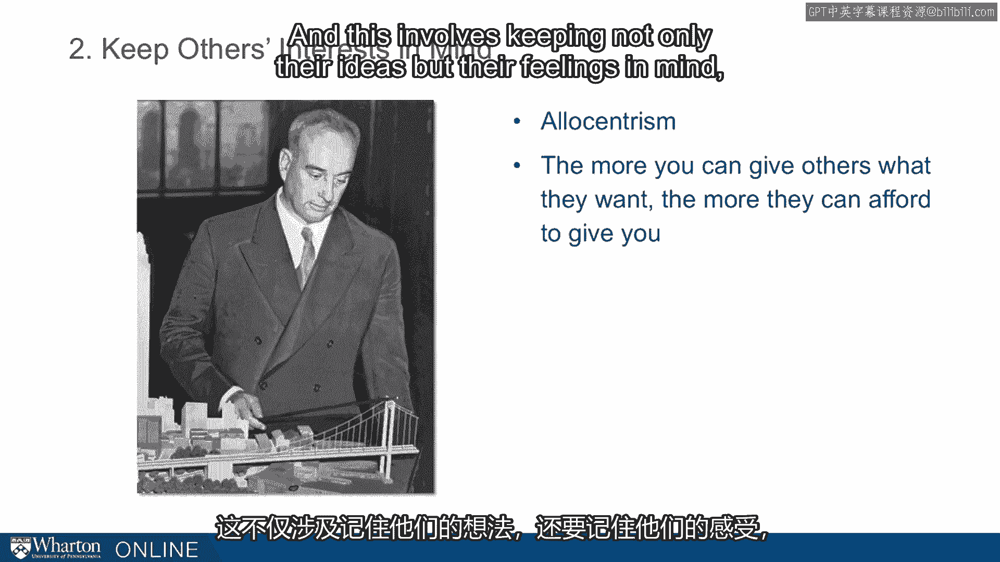

 pathos。 A third habit， be willing to make trade-offs。

 The example we're using here is Sergio de Mello， who was our first example in the course。

 And we used him to illustrate again a number of ideas but something we saw in him was intentionality。

 He placed a premium on flexibility and adaptability。 Samantha Power。

 the author who writes the chapters on de Mello， said that Sergio was ruthlessly， pragmatic。

 We carry away from him and other places in the course this idea that if you're not making。

 trade-offs， you're not really working toward a goal。 Number four。

 the fourth habit of highly influential people。 This is Heidi Royzen， a well-known networker。

 Silicon Valley entrepreneur， venture capitalist。 We talked about networks and the habit here is to cultivate relationships before they're。

 needed。 This is a way of navigating what many people find squeamish about thinking about networks。

 at all as opposed to just thinking about people and relationships。 Well。

 one way to fix that because we need you to be strategic in thinking about how you。

 allocate your time at some level， one way of navigating that is to be intentional about。

 networking but unintentional about relationships。

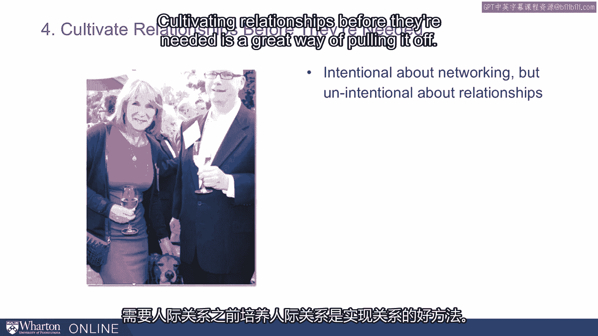

 Training relationships before they're needed is a great way of pulling that off。 Fifth habit。

 have the meeting before the meeting。 For me， this really gets to the fact that these are habits。

 These are daily ways of living， not complicated， just need to be folded into our routines。

 The example here is Jane Jacobs。 This is Jacob sitting in a bar in Greenwich Village where she had the famous showdown with。

 Robert Moses there and she built a coalition， gave us a great demonstration of the value。

 of coalitions。 A couple of ideas here that come out of that literature in these examples are the more。

 disparate the group， the more important， the more valuable it is， the ability to build。

 coalitions within the group。 You use these meetings。

 these meetings before the meetings for gathering information， taking， temperatures。

 laying down groundwork。 These are not love trees。

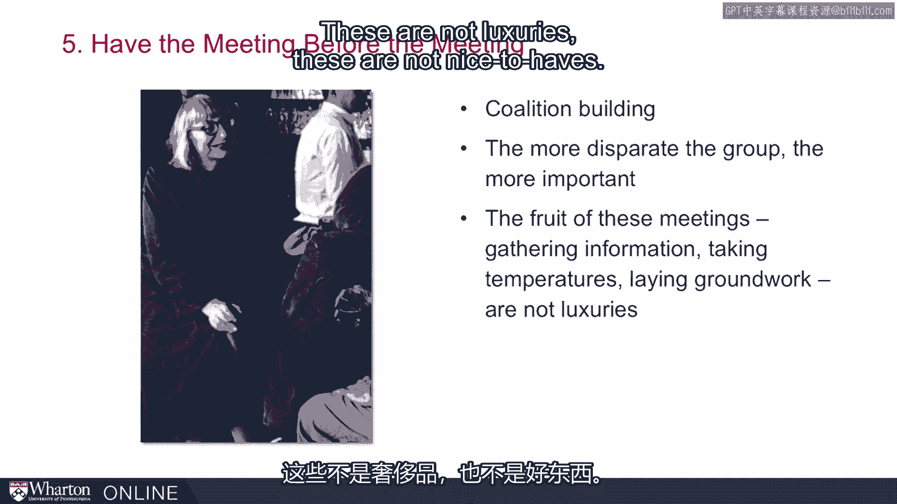

 These are not nice to have。 These are necessary bits to having influence in organizations。

 Number six， sixth habit， don't accept circumstances as given。

 The picture here is of Jadette Saadik Khan who was a more contemporary transportation， commissioner。

 She followed in Moses' footsteps in many ways。 She showed great agency in doing things like getting these pedestrian-only zones in New。

 York City。 Here she is sitting in the middle of Broadway。 She shaped situations。

 She did not accept situations for what they were。 She didn't accept them as set。

 We find in our empirical work that agency is the number one most influential strategy。

 Among people we've studied。

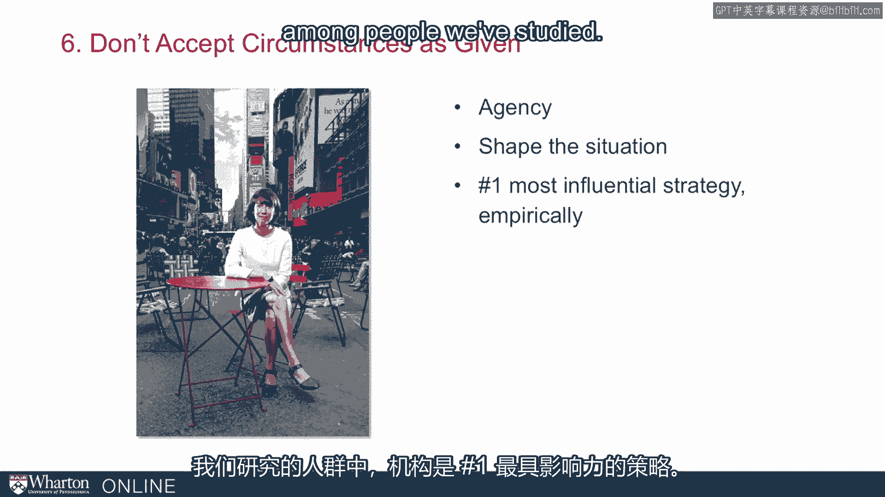

 Seventh and finally， see the world as it is and how you want it to be。

 This is a picture of President Lyndon Johnson and Martin Luther King， Jr。 strategizing about。

 the civil rights legislation that they pushed through in the early 60s。

 Civil rights legislation had failed in the U。S。 Congress since Reconstruction。

 It had been 75 or 80 years since anything had been done。 Johnson， his president， got that done。

 He did it through a rare combination of realism and optimism。 Johnson was famous for sharp elbows。

 getting in the mud， the ability to win a street fight。

 But he paired that at least at this point in his life。 He paired that with clear-eyed。

 inspirational vision of what he wanted to do。 At that point he wanted to advance the civil rights cause。

 So the notion here is that you need both。 That realism without ambition is empty。

 but ambition without realism is feckless。 We're pushing you to bring these two things together。

 We hope that we've tooled you up to be better on the realism side。 More effective。

 but we'd like that to be paired with inspiration。 Because again。

 the realism without that ambition is empty。

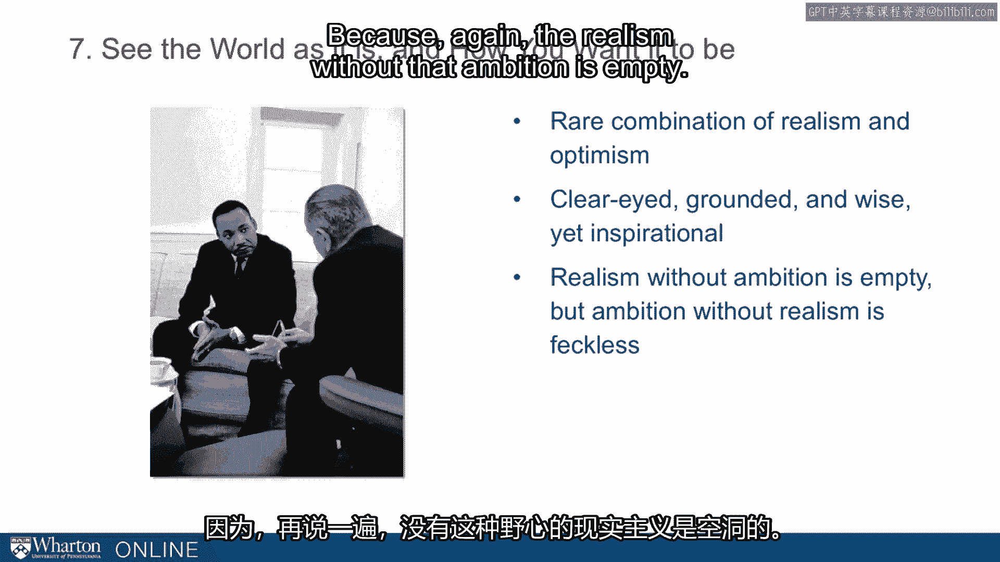

 So seven habits and we call them habits because we really do think they're most effective。

 as ways of living and they need to be folded into your daily and weekly routines。

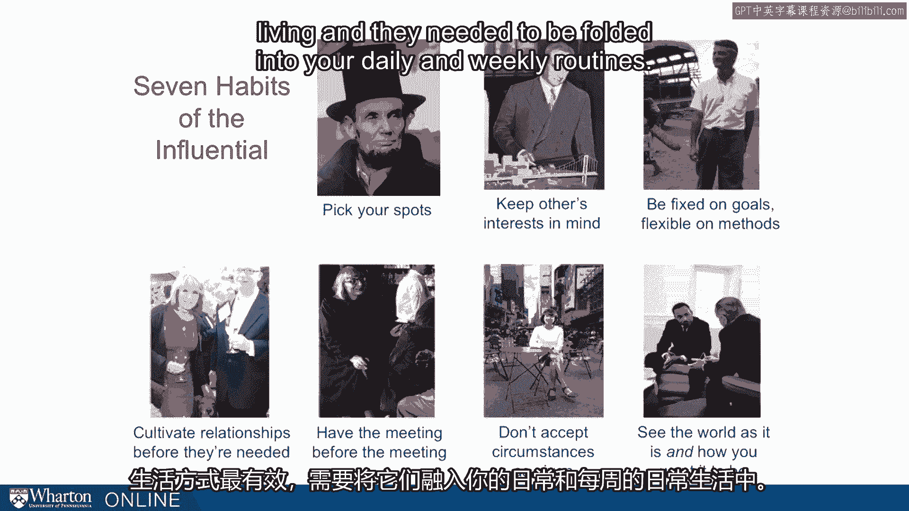

 These are seven。 I hope that you'll distill some for yourself what you find most meaningful and most useful。

 This is just one framework。 One way of thinking about the material we've been talking about。

 Our last note for the class is one more shot from a Heberham Lincoln。

 This comes from a book written by Doris Carnes Goodwin called "Team of Rivals。"。

 It's subsequently made into a movie， at least part of it was made into a movie called "Lincoln。"。

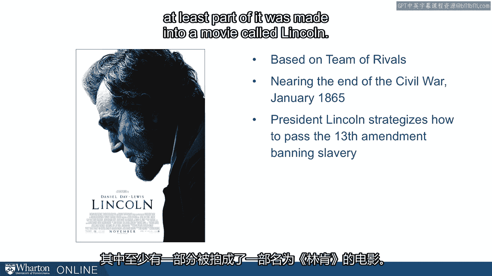

 The particular scene， there's a great scene。 You might track it down if you haven't seen it before。

 I'm going to quote from it here。 I'm going to quote from the book where it was near the end of the Civil Wars。

 This is January 1865。 The Civil War is going to go on a few more months。

 but they've been three and a half years into， the Civil War now。

 It's also near the end of Lincoln's life。 He'll be assassinated in the same month that the war is over。

 They're strategizing at this point on how to pass the 13th Amendment to the Constitution。

 which is going to ban slavery。 This has been a long debate in the North。

 Lincoln has issued the Emancipation Proclamation， but that was just an executive order essentially。

 Now he's trying to codify it in the Constitution forever banning slavery。

 He says at one of these meetings in the final hours before they get the vote on this， he。

 says to his staffers， to his team， "I am president of the United States。 Close with great power。

 The abolition of slavery by constitutional provisions settles the fate for all coming， time。

 not only of the millions now in bondage， but of unborn millions to come。

 A measure of such importance that those two votes must be procured。

 I leave it to you to determine how it shall be done。 But remember。

 I am president of the United States。 Close with immense power。

 and I expect you to procure those votes。"， What do you make of this quote？ For me。

 I'm blown away by here he is with the most noble cause a person can have， more。

 right on his side than anybody's ever going to have， and yet he still has to go basically， by votes。

 Even with the cause， this just， he still needs influence tactics to accomplish his goal。

 The lesson is that being right is not enough。 Being moral is not enough。 Working hard is not enough。

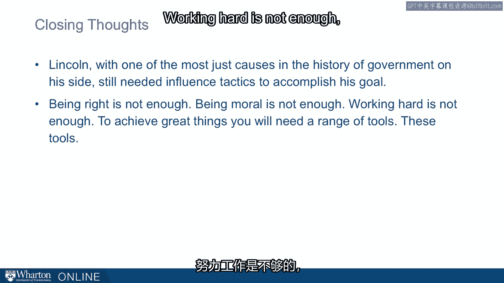

 To achieve great things， you'll need a range of tools。 You'll need these tools。

 We wish you the best with your work。 We wish you the best with your goals。 Thank you。 [BLANK_AUDIO]。

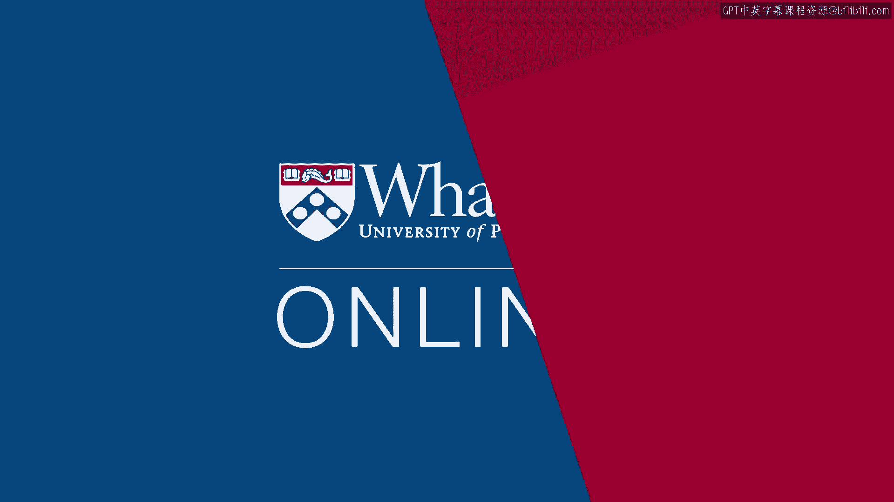