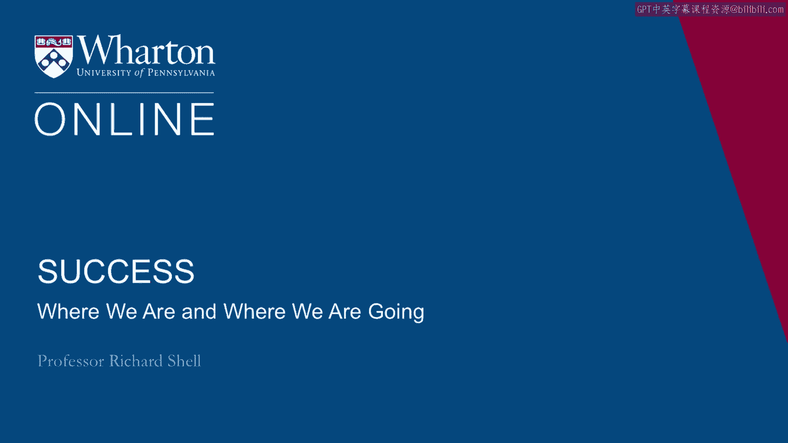
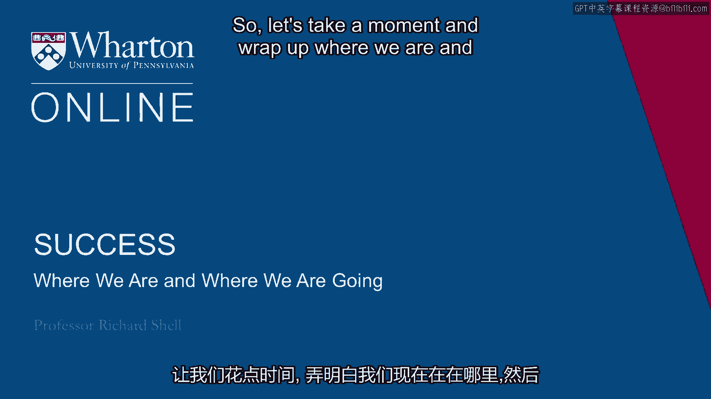

# 沃顿商学院《实现个人和职业成功（成功、沟通能力、影响力）｜Achieving Personal and Professional Success》中英字幕 - P11：10_我们在哪里,我们要去哪里.zh_en - GPT中英字幕课程资源 - BV1VH4y1J7Zk

 So let's take a moment and wrap up where we are and take a look at where we're going。

 next。 You've begun your exploration of your own success values。

 You took a look at the six lives and tried to decide which ones you thought were most。

 really successful。 Began to see that inside each of those lives there was a balance between the outer life。

 of status and achievement and career and the inner life of happiness， satisfaction， love， family。

 and where those two parts are meeting and integrating or whether they're separated。

 And then we looked at the origins of some of those values in your own cultural understanding。

 the family values that you were raised on， perhaps a spiritual or religious values that。

 you've inherited。 And begun to see that there's a moment where you get to stand and examine those values。

 decide where you stand with respect to them， do you embrace them， do you need to modify， them。

 do you need to reject some part of them in order for you to make progress on your， own journey。

 Where we're going to go next is to look at in a little more detail what are the individual。

 ways that you can begin seeing yourself as a success capable individual that are not looking。

 out and comparing yourself to others and saying， "Oh， I'm a failure with respect to that person。

 or I'm not as good as this role model I have， I'm a failure。"， But to look inside and see， "Okay。

 where do I stand today？ Where do I want to invest to make progress for tomorrow and build on the solid foundation。

 of your capabilities and your interests？"， So I'll see you in the next session。 Bye。 [BLANK_AUDIO]。

