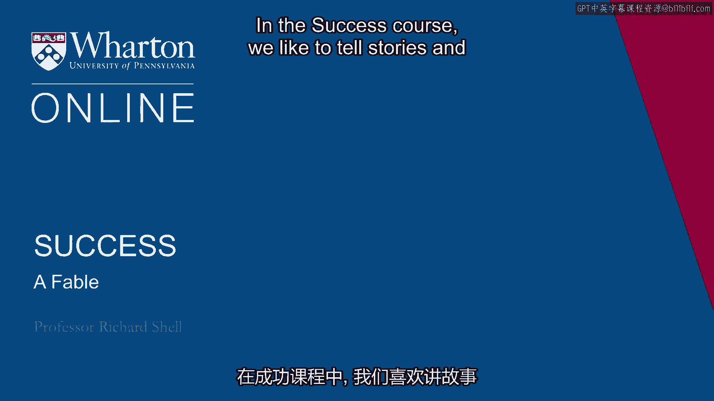
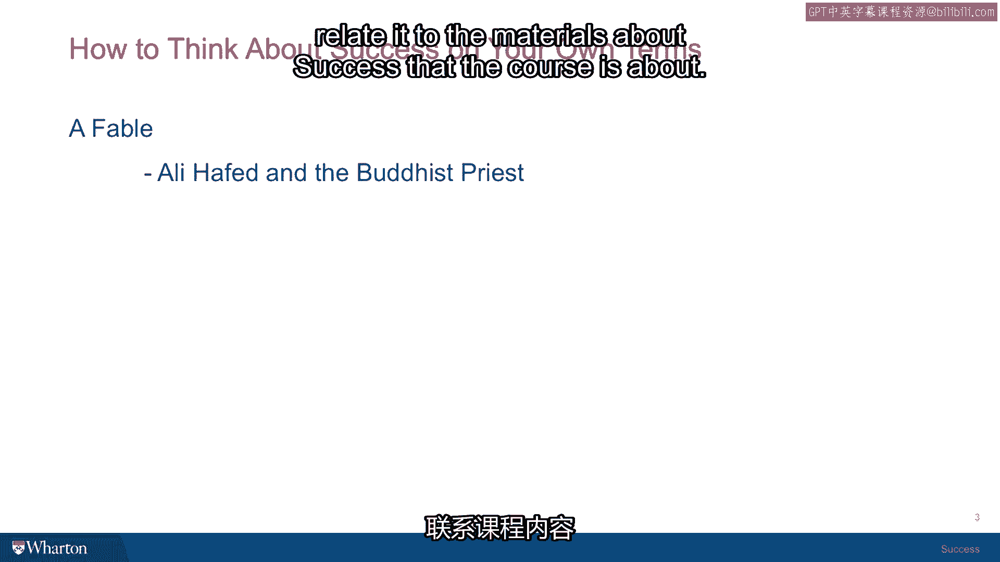

# 沃顿商学院《实现个人和职业成功（成功、沟通能力、影响力）｜Achieving Personal and Professional Success》中英字幕 - P13：12_一个寓言故事.zh_en - GPT中英字幕课程资源 - BV1VH4y1J7Zk

 In the success course， we like to tell stories。

 And one of the ones that's my favorite actually has its roots here in the city of Philadelphia。

 where the University of Pennsylvania and the Wharton School are located。

 There was a Baptist minister named Conwell， who in the 1800s went around telling a story。

 that people paid to hear， because in those days it was no TV， so people paid to go to lectures。

 And he told the story all over the United States， all over America。

 and earned millions of dollars telling it。 And then went ahead and used that money to start one of our great universities here in Philadelphia Temple University。

 So I'm going to tell you the story， and then we're going to pull it back and relate it to the materials about success that the course is about。

 So the story goes to something like this。 There was a farmer named Ollie Hoffed。

 who lived in the Middle East in his own little farm and had a family， and was hard-working。

 struggled to make ends meet， but made a living。 And then one day。

 a Buddhist priest from the Far East， who was on a pilgrimage， came wandering by。

 and asked if he could stay with Ollie Hoffed for a few days， and he did。 And over dinner one night。

 the Buddhist priest began talking about his travels。

 and he said that there were areas of the world where one could find diamonds。

 And they were incredible， these diamonds， and very， very valuable。

 And Ollie Hoffed had never actually heard of a diamond before。

 so he asked the Buddhist priest to tell him more about the diamonds。

 and the Buddhist priest described their wonderful properties， and they glittered。

 and they were beloved by all， and made wonderful jewelry and expensive。

 And so Ollie Hoffed began to get a desire to find some of these diamonds。

 so he asked the Buddhist priest where the diamonds could be found。

 And the Buddhist priest looked thoughtful and said， "Well， you can always tell where they are。

 The mountains in the area where diamonds are， you know， kind of come to a certain peak。

 and then there's a river that flows beneath the mountains， and there's some sandy。

 silver sands that the river flows through。 And then if you look in this clear water。

 the diamonds can be seen under the water， and then there's just， you know。

 unlimited diamonds in these areas that had this characteristic。"， So Ollie Hoffed， you know。

 really got sold on it now， and so he decided he would make a quest and go off and find some diamonds for himself。

 and become wealthy。 And so he left his family， he packed all his goods for a long journey。

 and off he went in search of the area where diamonds could be found， and he searched high。

 he searched low。 And in the end he was a bitter man， he had searched his whole life。

 he'd never found the area where the diamonds were， he had many hardships， and finally in despair。

 he cast himself into the ocean and died。 Meanwhile， back at the farm。

 someone had bought Ollie Hoffed's farm and taken it over。

 and one day the new owner was in the backyard area。

 and of course they were looking up at the mountains that were just behind the farm and they set a certain way。

 and there was a river that flowed back in the back area of the farm that went back through that。

 and there were some very silver sandy areas in the riverbed。

 and this new owner noticed a little glint of a sparkle underneath the water。

 reached down and picked it up， and it was a diamond， and then reached down and picked up another。

 and it was another diamond。 And it turned out that Ollie Hoffed's whole back 40 acres was nothing but a giant diamond field that became the largest diamond mind that the world had ever known。

 So at this point in his story， Reverend Conwell would then say。

 so the lesson is don't go searching in far off lands to find wealth and prosperity。

 it's in your own backyard， and if you live in Philadelphia。

 look in Philadelphia for all the things you can do。 If you live in New York， you would say。

 look in New York for all the things you can do， and build your fortune where you are。 In our course。

 what we like to do is say that you are your own backyard。

 and that the job you have is to look into your capabilities， your interests。

 and discover the diamonds that you have in yourself。

 as the foundation for how you'll achieve satisfaction， happiness。

 and whatever achievements you think are worth having。

 So we locate four different diamonds in the course。

 and that's the subject that we're going to take up in the next session。 [ Silence ]。

