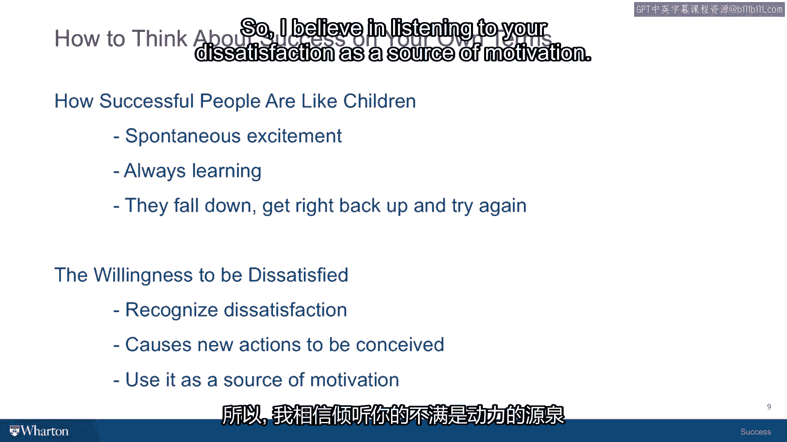

# 沃顿商学院《实现个人和职业成功（成功、沟通能力、影响力）｜Achieving Personal and Professional Success》中英字幕 - P15：14_成功人士的习惯.zh_en - GPT中英字幕课程资源 - BV1VH4y1J7Zk

 So we talked about the four diamonds， the capabilities that are coming from within you。

 that you can access by looking into your past， looking into your personality and so on。

 I want to talk now about two habits that people who you might define as successful tend to have。

 Now， we have to be careful in this course about using the word success。

 So I just want to make sure that you know where I'm coming from。 By successful people。

 I mean people who have somehow integrated these two dimensions。

 the outer life of career achievement and whatever is going on in the social world。

 and the inner life of personal fulfillment and happiness and satisfaction。

 So how are the balances struck？ I think successful people have somehow managed to put the two together。

 So one habit that people who have this combination going for them tend to have。

 is that they are spontaneously excited， enthusiastic and they are people who tend to learn from the mistakes they make。

 Because they are getting the energy from the inner life to apply it to the outer life。

 When they meet an obstacle， the energy tends to power them through the barrier， the mistake。

 the failure。 And they can get up and brush themselves off and keep going because they are pursuing a source of satisfaction。

 that intrinsically motivates them。 So if you think of a kid， a very small child。

 we have two sons and I remember when the first one was born。

 and was just beginning to crawl and then didn't walk and just crawl。

 And I remember thinking to myself， I had this terrible fear that they were going to be the first child who couldn't ever learn to walk。

 because he just kept crawling。 And then one day he got up and sort of held himself up and then he stumbled across and fell on his face。

 and got up again and started walking some more。 And the whole excitement that a child has when they are learning to walk。

 even though it means that they end up falling down， and getting banged around a little bit。

 they have that intrinsic excitement about this autonomy that they are experiencing。

 the mobility they are experiencing， and the huge expanse of what they can explore when they can walk is what I am talking about。

 So successful people have this inner energy that is helping power their outer achievements and it means that they can be resilient。

 and that they are in the learning mode。 So that is habit number one is that spontaneous excitement about what it is that you are doing。

 Habit number two is the willingness to be dissatisfied。

 Now there is a whole school of thought in success studies and psychology that it is the power of positive thinking。

 and everybody is supposed to think positive and be happy and then that is the secret to success。

 I actually don't think so。 In my experience it is when I have been the most dissatisfied。

 the most unhappy with my status quo， that I have discovered the necessity。

 the urgency of making a change and moving myself in a better direction。

 So I think it is certainly helpful to be able to be happy and it is certainly helpful to think positive when you are experiencing a setback。

 and you know that your excitement will take you forward。

 But I think it is just as important to recognize and acknowledge dissatisfaction when it occurs。

 You are not happy with the boss you have。 You are not happy with the neighborhood you live in。

 You are not happy with the opportunities that are available with the education that you have。

 You are not happy with the way the political system is working。

 And it is out of those dissatisfied moments and the emotions that you feel that new actions then begin to get conceived。

 and you begin to see well given this dissatisfaction how can I fix it。

 how can I move in a new direction， how can I power myself out of this status quo。

 and into a change that promises to be better for me。

 So I believe in listening to your dissatisfaction as a source of motivation and I think those two habits are things that I have noticed around me。

 and I think that people who I can seem to be successful in the sense that they have combined this inner and outer dimension in certain ways。

 the first is their kind of resiliency and their excitement and their ability to get up when they fall down。

 and the other is they listen to their dissatisfaction。

 they respect their own dissatisfaction as a source of motivation。

 and then they begin looking to see who is done better than they have or who has done it differently。

 and they seek those people out and start getting new ideas about how they can make their own lives better。

 So for diamonds， two habits and you will be surprised to hear what we are going to talk about next。

 [ Silence ]。

