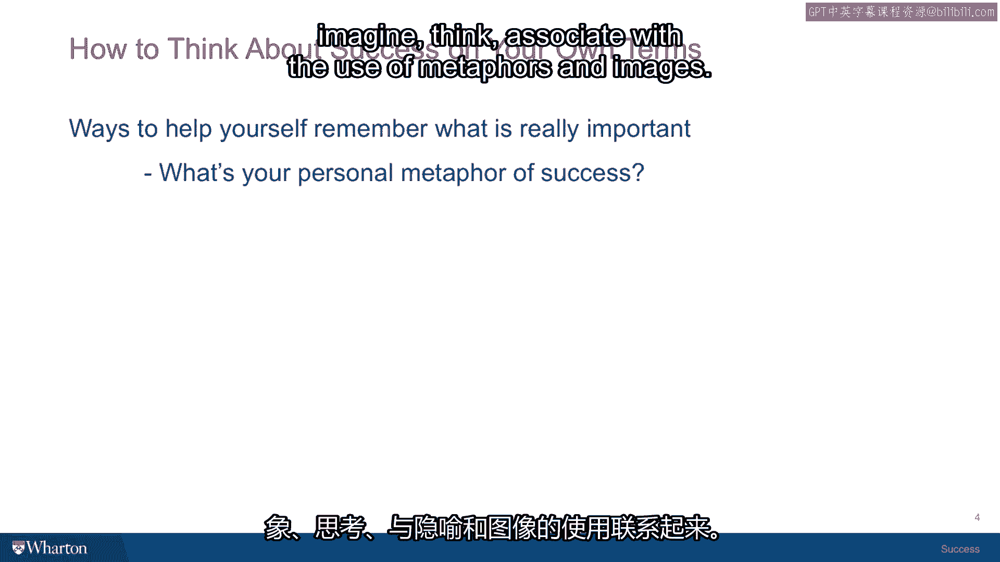
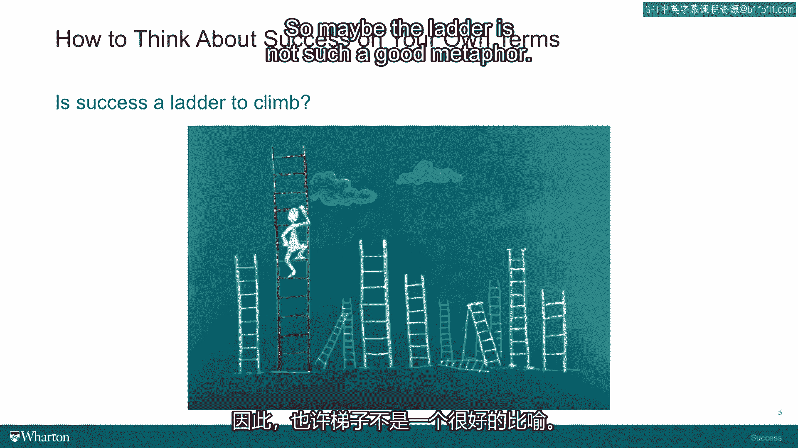
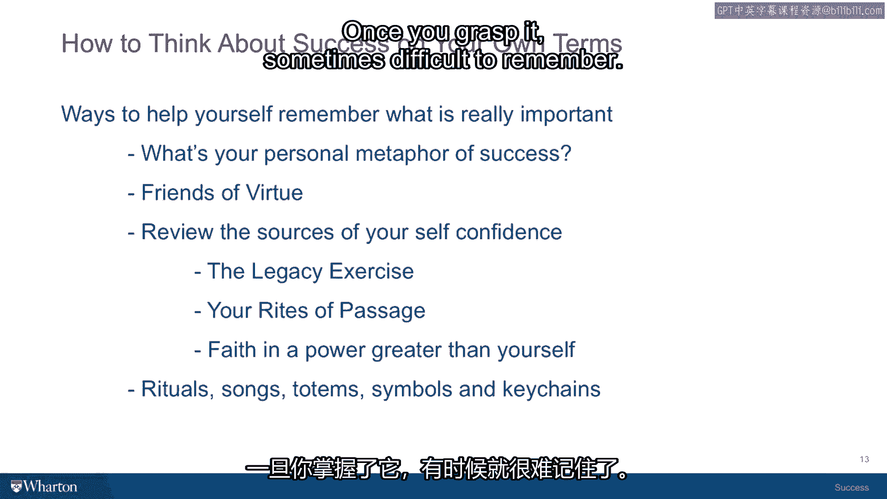

# 沃顿商学院《实现个人和职业成功（成功、沟通能力、影响力）｜Achieving Personal and Professional Success》中英字幕 - P16：15_你的成功价值观为什么这么容易被遗忘.zh_en - GPT中英字幕课程资源 - BV1VH4y1J7Zk

 One of the frustrating parts about beginning to think more carefully and more systematically。

 about what you really mean by success is that even when you discover what you think is the。

 answer or an answer， it seems really elusive and you find yourself forgetting it and having。

 to relearn it and sliding back to other values that you used to endorse but now know better。

 And I think it's really important to realize that one other sort of habit that a successful。

 person has is they realize that they're likely to need things to help them remember who they。

 really are and where they're going and they have processes that they've adapted and sort。

 of created uniquely for themselves to help them remember。 It's not an accident。

 It's not a coincidence that most major religions have services on a regular basis every week。

 sometimes every day and that the reason is that the religious values that they're teaching。

 are also hard to remember and easy to forget and so people come back to the sanctuary or。

 to the sermons or to the symbols of a religion and they need to renew that connection over。

 and over in order for them to keep those values front and center of their lives。

 And the same is true of success values that you devise for yourself。

 There are four different ways that I want to talk about how you can help yourself remember。

 what your success values are and each of them is both a journey of your imagination as well。

 as sometimes a journey back to the past。 People have a couple of assessments that will help you think about these and the first of。

 these four is the use of a metaphor。 The human mind is uniquely wired to imagine， think。

 associate with the use of metaphors。

 and images and the most frequently used image or metaphor for success is a ladder。

 The ladder is so ubiquitous as a metaphor for success that people often forget that that's。

 what they're actually working with and simply start speaking in terms of this metaphor and。

 they're completely unconscious of it。 So people talk about getting to the next step in the ladder of success。

 They talk about getting to the next level。 They talk about climbing metaphors。

 They talk about where they are on the ladder。 And basically the ladder is a metaphor for status。

 And status is an important part of the outer life so it's not irrelevant to success but。

 you have to understand the limits of a metaphor if you're going to be able to take some ownership。

 and control over it。 So take a look at this picture of a ladder and a person climbing it and see if you can figure。

 out any limits that this picture implies。 There's something missing from this picture。

 There's something that feels incomplete about this image as a sort of metaphor for a successful。

 life。 When I conduct programs for executives and students and I show this image very often people immediately。

 identify a number of things。 We'll see how many of them that you picked up on。

 First there are many ladders。 And so which one is this person on and why？

 And I think it's the case that the image of a ladder is pretty arbitrary。

 You may have just started up a ladder at some point in your life and you stop thinking about。

 all the other options that you might have explored and simply just keep climbing the one you're， on。

 And when you look at it from a little bit of a distance you may appreciate that maybe the。

 best move for this person is to actually climb down the ladder there on and to move to another。

 one that might be more suitable for them。 People also notice that the ladder just sort of ends and what happens when you get to the。

 top。 There's no， the metaphor doesn't help you much。

 You get to the top of your ladder what are you supposed to do next？ Doesn't have any continuity。

 So maybe you're supposed to jump to another one or maybe you're supposed to like wave。

 at people and celebrate yourself。 But nothing much there in the metaphor to help you with that。

 And then most importantly probably people tend to eventually notice that this person。

 is all by themselves。 And there's just one person climbing a ladder。

 And I think if you think about your own life for even a short amount of time you'll realize。

 that this is a fundamentally false image of how life works。 Nobody ever does anything alone。

 You began in a family of some sort。 You lived in a community。

 You went to schools where teachers were helping you。

 You have mentors and coaches and all the other people that have kind of bolstered you along。

 the way and energized you and motivated you and helped you find your direction。

 And none of those people are in this picture。 So if this picture were going to be a little more realistic you would have this throng。

 of people all around this person climbing， cheering and providing help and different。

 step ladders to get to that point in the ladder and so on。

 So it's really important to remember the social context of any kind of satisfying human life。

 And this image does not have any of that。 So maybe the ladder is not such a good metaphor。

 So another common metaphor is a race。 We certainly a lot of students that come to the Wharton School are very competitive。

 They want to win。 They won the race in high school。 They've won the race。

 If they're MBA students they've won some sort of race in college。

 They're trying to win a race to find the best jobs and employment。

 And many people model success as essentially victory winning。 And there's nothing wrong with that。

 Competitive energy is really powerful。 If you can channel it well it can get you up in the morning and add some zest and urgency。

 to the activities that you engage in and give you and make it kind of fun。

 So not saying competition is bad。 Again if you take a look at this picture as a metaphor and take two steps back and look。

 at it you may notice there's some problems with this as a theory of success。

 That is the overriding theory that you might want to base a life on。

 Again when I show this to executives and students almost immediately they recognize that for。

 someone to win a lot of people had to lose。 And so is that really necessary condition of your success that you defeat and beat a bunch。

 of other people。 And many people when they think about it say well not really。

 I like winning but it doesn't have to be that others lose in order for me to win。

 There's another problem of course with this。 It's similar to the latter problem and that is which race do you choose to be in。

 And if you're a myler or you're a marathon runner or you're a sprinter you better pick。

 the right race to use your personality to use your skills， your endurance， your passions。

 or you're going to find yourself being very frustrated。

 So picking the race is important and then finally if you don't have some perspective。

 on competition and all you do is win at any cost you're going to destroy a lot of relationships。

 You're going to leave a lot of people injured and you're going to create a fair amount of。

 resentment around you and that's really not the optimal conditions for a successful life。

 I don't think。

 So you have to have a perspective where the winning is something that's more of a game。

 Sometimes you win， sometimes you lose。 The people you're racing with are equally engaged and have an equal attitude that it's。

 more for the fun and for the energy than it is for any comment on their worthiness as。

 a human whether they win or lose。 So add those dimensions to this metaphor and maybe it begins to be helpful but you can。

 see if you're not aware of the fact that you're motivated almost entirely by a metaphor of。

 winning it can get in your way and you can find yourself in places you don't want to， be。

 So another metaphor I'm just going to give you three because really your problem is to。

 find one for yourself just want to inspire you with a few different thoughts on how people。

 think about this。 It's this image。 It's a pond and someone's just dropped a pebble into it and as a result there are these concentric。

 circles that are spreading out from the source of the impact of the pebble in the pond。

 And this might be an image for someone who thinks of success as the number or the measure。

 of positive influences that they're having on the people around them and that every positive。

 influence they have on someone then creates a condition for that person to have a positive。

 influence on someone else。 And so these rings can spread pretty far if you set in motion a positive influence by。

 helping， mentoring， providing information or inspiration， being able to comfort people。

 when they're suffering or when they're down and bringing them to a place where they can。

 come back to be more productive again。

 A little different than a ladder， it's not like you're going up or down， you're just， spreading。

 It's a lot more energy implied in this continuous motion than just winning a race and then lying。

 down exhausted because this energy kind of renews itself， it builds on itself。

 So over the years as I've taught this subject to many different audiences and I've had。

 I've taught to public school teachers， to people in public safety， to people who are。

 in healthcare organizations and I challenge them and I'm challenging you to think of a。

 metaphor that works for you。 Something thoughtful。

 something that embodies who you are and what you are at your best。

 I think a good metaphor for success helps you remember your goals because you're able。

 to think to yourself。 Am I in the right spot？ Am I doing what I should be doing because I can feel the coherence between my activities。

 today and the metaphor for success that I've created for myself？

 Some people have suggested an image of a compass to help people find their direction。

 High school track coach once suggested that a compass was the metaphor he liked to use。

 The person who was a preschool teacher said that her image of success was a big shade。

 tree in Africa where the village can come beneath the shade tree and create community。

 and renew itself and be sheltered from the sun。 And that was what she was identifying as the place she ought to be and why she did what。

 she did。 So， you know， your challenge， find your own metaphor。 Write it down， think about it。

 talk to your friends about it， talk to your loved ones。

 about it and see if you can refine it a little。 That actually segues to the second tool for remembering and renewing your theory of success。

 And that is your social experience。 The people that you choose to surround yourself with。

 And if you choose to surround yourself with people who don't hold your values， who resist。

 or compete with your values or who minimize them， it's easier， much easier to forget。

 what those values are and basically get lost in the values that the social group you're。

 a part of endorses。 So I think it's really helpful to be quite self-conscious about choosing your social。

 group so that it's a reinforcing experience for your values and not something that compromises。

 your values。 You know， when you were a kid， your parents probably wanted to be sure you were hanging。

 out with the right people。 And part of the reason they cared about that was not just your safety。

 but they wanted， you to hang out with people who would have values that they endorsed as the leaders in。

 the family。 And now that you're outside your family circle， you get to make those choices。

 And it's important that you pick your social circles wisely。 First Donald， in one of his books。

 and it's a subject that we talk about in the success， course。

 actually define three kinds of friendships。 And I think this can be a pretty good diagnostic for how you're doing with your friends。

 The three types of friends that Aristotle mentioned were friends of pleasure。

 Basically these are people that you like to have a good time with。 Friends of utility。

 and these are friends that you engage with to get your work done or to。

 advance some outer goal that you have。 And both of those kinds of friendships are very helpful。

 They can provide you with a good social network。 But the real payoff as Aristotle sought for a social relationship is to find and cherish。

 what he called your friends of virtue。 And a friend of virtue is someone who really wants what's best for you。

 Someone who when you're around them， it brings out the best aspects of you。

 They're the people who can gently offer you reminders of your most important values。

 give you a little coaching if you begin to stray from those values。

 But also resonate with and embody themselves the same virtues that you honor。

 So how many friends of virtue do you have？ Not very many。

 They tend to be people who you went through a very important part of life with， who know。

 you when you had a crisis or a conflict and they've stuck with you through a transition。

 And you know their story， they know your story。 They're people who you renew with。

 And it's a good test of a friend of virtue。 And my experience is you haven't seen them for a while。

 you call them， and as soon as， the conversation starts， you pick it up right where you left it off。

 You understand each other that well。 There's no need to go back and do chit chat and feel the formality of renewing a friendship。

 of utility and asking how their jobs are or something like that。

 You each know what the most important issues are that you're working on in your lives。

 And you pick up with a piece of that as part of the background of how you're relating to。

 one another。 So maybe you， different people have different social capacity。

 but maybe you have three or， four friends of virtue in your life。

 They could be your parents or one of your parents。

 They could be a childhood friend or a classmate from college that you happen to room next。

 to your freshman year。 And then you've stayed in touch with them ever since。

 Maybe they're your spouse。 I think if you have a friend of virtue who's your life partner。

 that's a pretty special， combination to go through life with。

 So surround yourself with people that renew and remind you of the values。

 That's a second very important tool。 Third is to remember and renew your sources of personal self-confidence。

 We all have days when we go up and days when we go down and when we're down， we lose our。

 self-confidence。 We are basically losing confidence in the underlying success values that we have come。

 to endorse and we begin to feel that life doesn't have the same meaning or direction or。

 energy as it did。 And so everybody has this happen。

 How do you renew that source of self-confidence that will get you back and in motion in the。

 direction that you know is best for you？ I've got an exercise that we use in the success course that I want to make available。

 It's going to be available for you to download and take。 And it's really a pretty simple。

 thoughtful thing to engage in。 In the course we talk about a Roman emperor named Marcus Aurelius。

 And Marcus Aurelius lived about two or three hundred A。D。 He was a great general。

 He spent a lot of his time fighting wars up in France for the Roman people。

 But he was also a philosopher。 And one day he started a journal and he kept writing it and ended up being a document he。

 called "To Myself。"， And it was basically a diary。 And the very first entrance in this diary。

 he laid out all the people in his life so far， who had endowed him with a legacy that had contributed to his success。

 He talked about an uncle， he talked about a teacher， he talked about his father， he talked。

 about his mother。 And each of the important qualities that each of these people had sort of handed off to。

 him and that had allowed him to become a thoughtful person who was able to sort of consider his。

 own life and have a meaningful one。 We call it the legacy exercise。

 And I think if you take a look at it in between the sessions that we're sharing together， what。

 you'll see is a whole set of lessons about life。 How to love and be loved。 How to set goals。

 How to express gratitude。 All these different things。

 And what I challenge you to do is think of the person in your life who endowed you with。

 the knowledge of that virtue or that practice that allows you to be successful。

 And take a moment to remember a story about that person， to bring them into your memory。

 and feel a little grateful for what it is that they've given you。 And cumulatively。

 when you think about all of the assets that these people have given you。

 what tends to happen is your self-confidence begins to return。

 Because you realize that you've got a lot more going for you and others have basically given。

 you a lot of gifts to help you get along。 And so the legacy exercise can be a great way to renew your self-confidence by thinking。

 about how you came to be the person you are。 Just an extra credit step on this。

 which I advise my students to do。 After you've done it。

 you may discover that there's some people on this list that you。

 haven't thanked recently or adequately。 And there's nothing that will make you feel better than to send an email。

 pick them a， phone， schedule a call， connect with these people who have endowed you with the legacies。

 that they have and express your gratitude to them。

 And that also will help you renew your self-confidence as a final step。

 The second tool for self-confidence renewal is to just remember the rights of passage。

 the difficult moments that have come in your life that you've persevered through and come， beyond。

 Basically， what doesn't kill you often makes you stronger。

 People look back on periods of their lives when they were in the military or when they。

 went through a particularly rough personal crisis in a school or in a relationship。

 And they somehow managed to come through it。 And they remember the feeling of capability。

 of ability that got them past that right of， passage and renewing that can then push you back on top of the situation that you find。

 yourself in。 And finally， for some people， a reminder that they have a faith and a power that's greater。

 than they are。 However you define that， whether it's in religious terms or whether it's in terms of。

 your place in the great scheme of nature， the continuity， the sort of wheel of life， if。

 you have a way to renew that faith， that is often a way to kind of put yourself in the。

 hands of that power that's greater than you and renew the confidence that comes from feeling。

 that someone else of greater power has you in mind and is behind you as you struggle。

 through what is always a challenge in life。 And then the final， we've got your metaphor。

 your friends of virtue， the various tools to， renew self-confidence。

 The final thing that I find useful and that my student's report is very helpful is to。

 have some renewal rituals， some song that embodies your values。 At the end of a semester。

 very often the students will put together a song list， they'll burn。

 a CD or collect songs on a website that are there signature anthems for what each of the。

 means by success。 This can be a really fascinating collection of music because for some people it's a rap。

 song for some people， it's a sentimental ballad for some people， it's a ritual song from a。

 religion。 So things that renew your energy， songs， symbols for some it's a， I had a student who。

 always wore a necklace around his neck and there was a small wooden object that was tied。

 as a kind of totem that he carried。 And I asked him what that was about and he said that in high school he had gone to a。

 Central American country to work with a village to help them build a school and he'd spent。

 the whole summer with this group and they built the school and during the summer he'd。

 gotten to know some of the children in the village very well who were going to actually。

 use the school。 And one of them had made him this little symbol which was related to the country and an animal。

 that is native to the country and had given it to him as a gift and he had decided to。

 wear it all the time ever since to remind him of the overarching goal he had in life which。

 was to help others in developing countries and to bring opportunities and education to people。

 who don't have them。 Now here's a student at the Wharton School obviously surrounded by all kinds of power。

 symbols and success status symbols and wealth symbols and the way that he had of reminding。

 and renewing his commitment to his own success values was literally to wear it around his。

 neck as a way to remember it。 So that can be a very powerful ritual like way to remember。

 So whatever it is that works for you personally I have turtles。 I have turtles all over my office。

 I have turtles on my briefcase。 I'm very fond of turtles。 That's a symbol because turtles are。

 They're long lived。 They are patient。 They are wise。

 My wife is very fond of elephants so we have lots of elephants in our home。

 Elephants also patient also gentle and very loyal and very family oriented。

 So we try to embody our values with little symbols around us。

 So success very difficult to understand once you grasp it sometimes difficult to remember。

 So these tools would be just talked about。 Each of them may have a different role in your life but a very important exercise is to identify。

 them， bring them close to you， cherish them to help you remember who you are and the direction。

 that you're going in。 [BLANK_AUDIO]。

