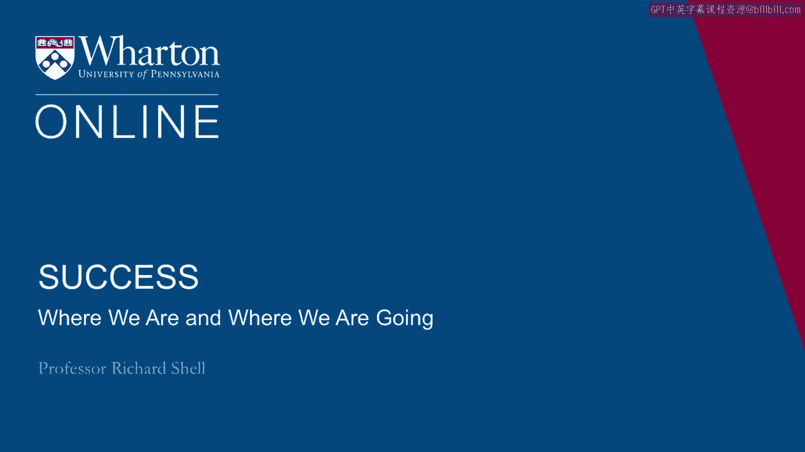
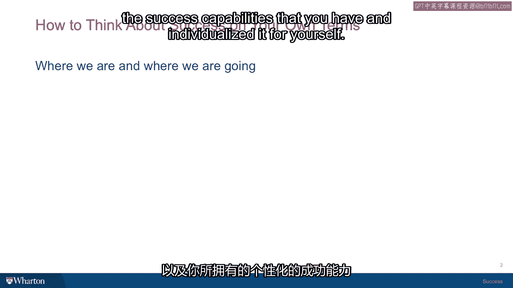

# 沃顿商学院《实现个人和职业成功（成功、沟通能力、影响力）｜Achieving Personal and Professional Success》中英字幕 - P17：16_我们在哪里.zh_en - GPT中英字幕课程资源 - BV1VH4y1J7Zk

 So let's take a minute and just pause and see where we are and where we're going。

 In the sessions that just came before， we talked about how you can personalize success。 What is。

 how to look inside， how to look into the past and find the success values and the。

 success capabilities that you have and individualize it for yourself。

 So we looked at where your four diamonds can be found and talked about the story of Ali。

 Hoffed and the Buddhist Priest。 We looked at a couple of habits that successful people have to persevere。

 have resilience and， be willing to be dissatisfied to motivate themselves toward positive change。

 And we looked at the various ways， four different ways that you can renew your success values。

 identify them， keep them close and remember them as you encounter the turbulence and the。

 chaos of ordinary life out there in the world。 From here， we're going to go into a deeper dive。

 You may remember at the very beginning of the course， we talked about these two faces， of success。

 the two facets， the inner life and the outer life。 And in the next set of sessions。

 we're going to be talking about some research findings。

 and some complications and we're going to dive deeper into each of those two lives and look。

 with a little more detail at what this achievement value really is and what it means and also。

 what this happiness inner value is and what that actually means so that you can begin。

 to better understand how that balance shifts between those two and sometimes when you're。

 deceiving yourself and you may be following or chasing a goal that is more of an illusion。

 than it is a goal and when you end up getting whatever it was you were chasing， your puzzle。

 as to why it doesn't feel all that good。 So if you understand it better。

 you can make wiser choices and that's where we're going， next。 [BLANK_AUDIO]。

