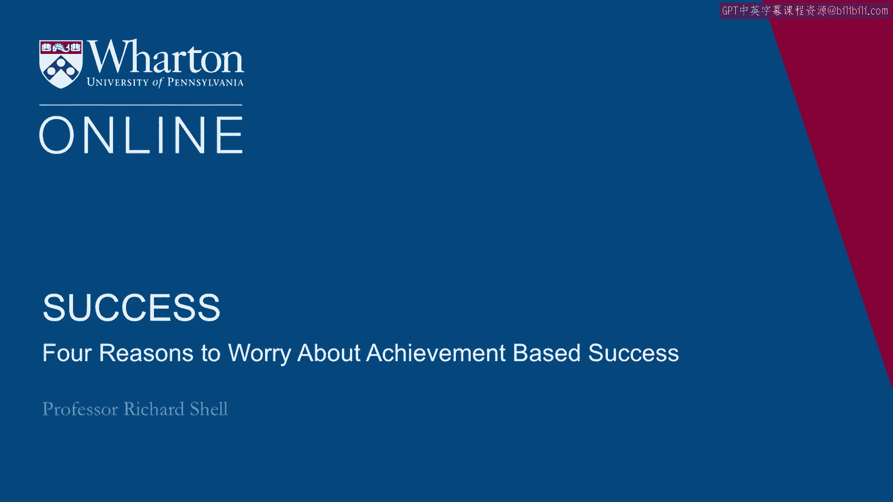
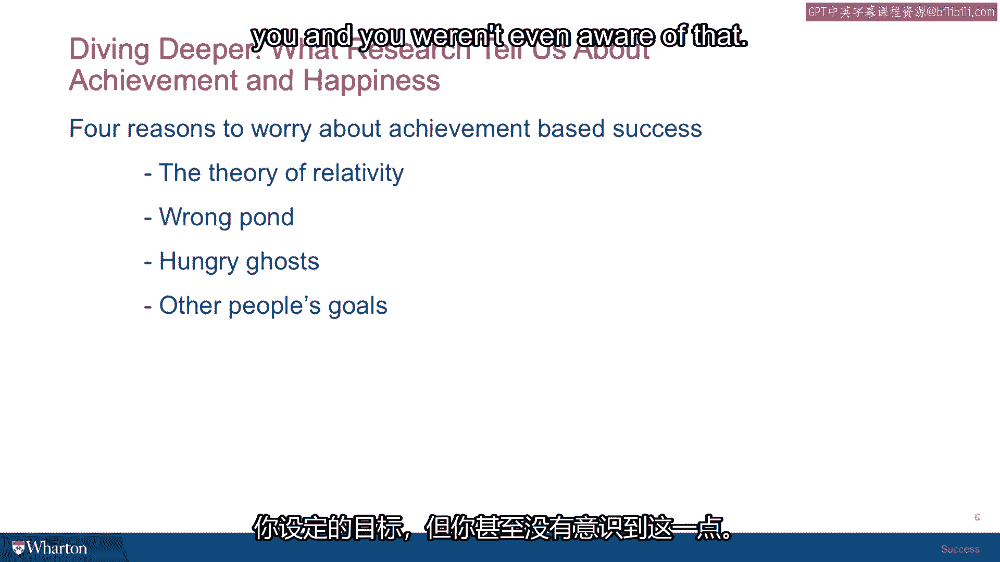

# 沃顿商学院《实现个人和职业成功（成功、沟通能力、影响力）｜Achieving Personal and Professional Success》中英字幕 - P20：19_基于成就的成功需要担心的四个理由.zh_en - GPT中英字幕课程资源 - BV1VH4y1J7Zk

 So there are four reasons that you might find problems。

 If you base your theory of success entirely on achievement。

 The first one is that all achievement is relative。 And we see that a lot here。

 Wharton High School students who have been top students in their high schools come here for their undergraduate studies。

 And all of a sudden they discover that they are with a sea of people who are all valedictorians or got perfect SATs or whatever。

 And they suddenly don't look like they've achieved much at all。

 One of my favorite quotes that sort of sums up this problem when you apply it to your regular life and career。

 comes from H。L。 Mecken who's an American humorist who once said that wealth is any income that is more than one's wife's sisters。

 And this is the great story of keeping up with the Joneses in suburban America。

 If you base your sort of sense of self worth on the achievement there's always going to be somebody who's achieved more。

 Has a better car， a bigger house， more money in their bank account。

 takes a better vacation or whatever it is that you're measuring by。

 So be careful of the theory of relativity as applied to achievement。

 The chances are that that's not going to be a very stable way to measure your successful life。

 The second problem is that very talented people often pick the wrong pond。

 Now what do I mean by that？ I mean your sense of success because it's relative is going to be measured。

 You're going to measure it by how you stand with respect to the people that you're surrounded by。

 And if you pick your pond poorly and you're surrounded by people that you think are outperforming you and there's no way that you can catch up。

 Then you're no longer going to feel very successful。

 In fact gradually you could easily become depressed。

 Again here at Penn that happens to some of our students。

 They suddenly find themselves with all these other high performing high school students。

 The first semester takes place。 They don't do as well in their classes as they were able to do in high school because in high school they were always the top person and almost took no effort at all。

 Here they find themselves getting seized in their first semester courses。

 The self-esteem hit that they take is so powerful that they check out。

 They think they can't win so they stop playing。 And of course as soon as they stop playing they have no chances to win。

 And so they end up going through college in a very mediocre way。

 They get involved in other activities but their academic performance is very substandard。

 That then affects their ability to go to grad school and other options that might come。

 And it's really simple if they had picked a different pond instead of a giant Ivy League college and they'd picked maybe a smaller college where they'd get more attention where they would stand out a little more。

 Their options for the future would be the same。 There are many many very great smaller institutions that students can go to。

 And then they would feel like they were in the right pond。 A little bigger fish。

 a little smaller pond and their confidence would remain high。

 Their performance would be inspired and they would be motivated。

 So sometimes people think they don't get to choose。 The pond is the pond they get。

 But I think that's absolutely wrong。 I think if you're worried about your own success values。

 if you're thinking about what you really want to achieve and how your life ought to work and how to balance happiness and achievement。

 Picking your pond is a pretty important choice because you're going to feel more satisfaction when the pond's the right size than you are by just always chasing the most prestigious pond as you see it to be in and then feeling miserable once you're in it。

 So that's our second problem。 You've got to pick the right pond and people often pick the wrong one。

 The third one is that sometimes achievers are essentially compulsive。 They only know how to achieve。

 They are driven by greed to establish more wealth， pride to establish more power or importance。

 control over others and they can never get enough。

 So no matter every day they wake up and they are driven once again by the same insatiable motivations to accumulate more to have more influence and to feel better about themselves。

 So there's a name for these people。 I spent some time in Asia。

 I studied at some Buddhist monasteries and I was taught there about a very。

 very sad creature in Buddhist mythology that called a hungry ghost。

 And a hungry ghost is someone who in their lives has given way to all their appetites。

 They've been insatiable in their quest for satisfying their appetites for power， money。

 status and admiration and so on。 And when these people die， they are reborn as a hungry ghost。

 And a hungry ghost is someone， a being in the spirit world that has a body the size of an elephant。

 a huge body and a mouth the size of the head of a pin。 So throughout all of eternity。

 their endless quest is to quench this awful aching hunger because they can never eat enough to feel even the least bit satisfied that they've filled themselves。

 And so in the Buddhism scheme of things， their reincarnation into this awful eternity of hunger comes from having spent their lives in the life that we're living。

 Again， on an endless quest to satisfy appetites that can't be satisfied。

 So if you see any hungry ghosts in your world， that could be a boss that can't feel too important or it could be someone you know who's always craving more and more attention or someone else who is always in the throes of trying to get more status or more money and just can never stop and they're stepping all over the people around them to get there。

 Instead of feeling jealous， I suggest you feel pity because these are hungry ghosts walking around in our own midst and life is going to come and go for them and they're always going to be unsatisfied。

 So that's a second trap that people can fall into。

 The fourth reason that putting all of your success values on achievement can be a problem is if you wake up one day and realize that you haven't been achieving any goals that you set for yourself。

 but you've been achieving goals that other people set for you and you weren't even aware of it。

 This can happen when someone is striving to get the approval of their family。

 a father or mother who always wanted them to be a doctor and they go through all the trouble of going through medical school and then they wake up one day and they wonder why they're a doctor。

 They don't even like it very much and it turns out they're just trying to please a parent。

 It could be that they are in a relationship with a mentor who gives them a goal and they stop thinking about whether it's really the right goal for them and just try to please the mentor。

 When I was in college， I had the great good fortune to be tutored by a novelist。

 a guy named Anthony Burgess。 He wrote A Clockwork Orange。

 which became a famous movie and was a famous British novelist。 In the course of our tutorial。

 it was just me and five other students in this semester on course， he gave me an assignment。

 He said， "You want to learn to write？ You should write some verse dramas。"， I went verse dramas。

 Then he said， "You can base them on short stories。"。

 I had to come back the next week and tell him what short stories I was going to write in verse as plays。

 Very complicated assignment。 I ended up writing my senior thesis in college was a couple of plays that were in verse。

 They were based on stories by James Joyce and it was just an enormous problem。 Here's the thing。

 I can see now that I got some value out of that exercise。 But at the time， it took me months。

 literally months of work to craft these things and get them into shape so that I could have my senior thesis。

 I had my senior thesis approved。 At the end of it， I felt completely empty。 No satisfaction。

 no fulfillment， nothing， just exhaustion。 I think that's what happens sometimes when you're achieving someone else's goal and you're not really aware of the reason why you're doing it for yourself。

 We have a video that I want to share with you of Steve Jobs， the founder of Apple。

 co-founder of Apple computers。 It's a speech he gave at Stanford University。

 a graduation speech in 2005。 In this speech， if you listen carefully。

 you're going to discover that Steve Jobs， one of the principal pieces of advice that he gave to the graduates and that he himself lived in his own life。

 was to stop achieving other people's goals and to begin to formulate and set on a journey to achieving ones that you yourself have set。

 [applause]， Thank you。 I'm honored to be with you today for your commencement from one of the finest universities in the world。

 Truth be told， I never graduated from college， and this is the closest I've ever gotten to a college graduation。

 Today， I want to tell you three stories from my life。 That's it。 No big deal。 Just three stories。

 The first story is about connecting the dots。 I dropped out of Reed College after the first six months。

 but then stayed around as a drop-in for another 18 months or so before I really quit。

 So why'd I drop out？ It started before I was born。 My biological mother was a young。

 unwed graduate student， and she decided to put me up for adoption。

 She felt very strongly that I should be adopted by college graduates。

 so everything was all set for me to be adopted at birth by a lawyer and his wife。

 Except that when I popped out， they decided at the last minute that they really wanted a girl。

 So my parents， who were on a waiting list， got a call in the middle of the night asking。

 "We've got an unexpected baby boy。 Do you want him？"， They said， "Of course。"。

 My biological mother found out later that my mother had never graduated from college and that my father had never graduated from high school。

 She refused to sign the final adoption papers。 She only relented a few months later when my parents promised that I would go to college。

 This was the start in my life。 And 17 years later， I did go to college。

 But I naively chose a college that was almost as expensive as Stanford。

 And all of my working-class parents' savings were being spent on my college tuition。

 After six months， I couldn't see the value in it。 I had no idea what I wanted to do with my life and no idea how college was going to help me figure it out。

 And here I was spending all of the money my parents had saved their entire life。

 So I decided to drop out and trust that it would all work out okay。 It was pretty scary at the time。

 but looking back， it was one of the best decisions I ever made。 The minute I dropped out。

 I could stop taking the required classes that didn't interest me and begin dropping in on the ones that looked far more interesting。

 It wasn't all romantic。 I didn't have a dorm room， so I slept on the floor in friends' rooms。

 I returned Coke bottles for the five-cent deposits to buy food with。

 And I would walk the seven miles across town every Sunday night to get one good meal a week at the Hare Krishna Temple。

 I loved it。 And much of what I stumbled into by following my curiosity and intuition turned out to be priceless later on。

 Let me give you one example。 Reed College at that time offered perhaps the best calligraphy instruction in the country。

 Throughout the campus， every poster， every label on every drawer was beautifully hand-caligraphed。

 Because I had dropped out and didn't have to take the normal classes。

 I decided to take a calligraphy class to learn how to do this。

 I learned about serif and sans serif typefaces， about varying the amount of space between different letter combinations。

 about what makes great typography great。 It was beautiful， historical。

 artistically subtle in a way that science can't capture。 And I found it fascinating。

 None of this had even a hope of any practical application in my life。 But ten years later。

 when we were designing the first Macintosh computer， it all came back to me。

 And we designed it all into the Mac。 It was the first computer with beautiful typography。

 If I had never dropped in on that single course in college。

 the Mac would have never had multiple typefaces or proportionally spaced fonts。

 And since Windows just copied the Mac， it's likely that no personal computer would have them。

 [Applause]， If I had never dropped out， I would have never dropped in on that calligraphy class。

 And personal computers might not have the wonderful typography that they do。 Of course。

 it was impossible to connect the dots looking forward when I was in college。 But it was very。

 very clear looking backwards ten years later。 Again， you can't connect the dots looking forward。

 You can only connect them looking backwards。 So you have to trust that the dots will somehow connect in your future。

 You have to trust in something， your gut， destiny， life， karma， whatever。

 Because believing that the dots will connect down the road will give you the confidence to follow your heart。

 even when it leads you off the well-worn path。 And that will make all the difference。 [Applause]。

 My second story is about love and loss。 I was lucky。 I found what I love to do early in life。

 Was and I started Apple in my parents' garage when I was twenty。 We worked hard， and in ten years。

 Apple had grown from just the two of us in a garage。

 into a two billion dollar company with over four thousand employees。

 We just released our finest creation， the Macintosh， a year earlier， and I just turned thirty。

 And then I got fired。 How can you get fired from a company you started？ Well， as Apple grew。

 we hired someone who I thought was very talented to run the company with me。

 And for the first year or so， things went well。 But then our visions of the future began to diverge。

 and eventually we had a falling out。 When we did， our board of directors sided with him。

 And so at thirty， I was out， and very publicly out。

 What had been the focus of my entire adult life was gone， and it was devastating。

 I really didn't know what to do for a few months。 I felt that I had let the previous generation of entrepreneurs down。

 that I had dropped the baton as it was being passed to me。 I met with David Packard and Bob Nois。

 and tried to apologize for screwing up so badly。 I was a very public failure。

 and I even thought about running away from the valley。 But something slowly began to dawn on me。

 I still loved what I did。 The turn of events at Apple had not changed that one bit。

 I'd been rejected， but I was still in love。 And so I decided to start over。 I didn't see it then。

 but it turned out that getting fired from Apple was the best thing that could have ever happened to me。

 The heaviness of being successful was replaced by the lightness of being a beginner again。

 less sure about everything。 It freed me to enter one of the most creative periods of my life。

 During the next five years， I started a company named Next， another company named Pixar。

 and fell in love with an amazing woman who would become my wife。

 Pixar went on to create the world's first computer animated feature film， Toy Story。

 and is now the most successful animation studio in the world。 In a remarkable turn of events。

 Apple bought Next， and I returned to Apple， and the technology we developed at Next is at the heart of Apple's current renaissance。

 And Lorin and I have a wonderful family together。 I'm pretty sure none of this would have happened if I hadn't been fired from Apple。

 It was awful tasting medicine， but I guess the patient needed it。

 Sometimes life is going to hit you in the head with a brick。 Don't lose faith。

 I'm convinced that the only thing that kept me going was that I loved what I did。

 You've got to find what you love， and that is as true for work as it is for your lovers。

 Your work is going to fill a large part of your life。

 and the only way to be truly satisfied is to do what you believe is great work。

 And the only way to do great work is to love what you do。 If you haven't found it yet， keep looking。

 and don't settle。 As with all matters of the heart， you'll know when you find it。

 And like any great relationship， it just gets better and better as the years roll on。

 So keep looking， don't settle。 My third story is about death。 When I was 17。

 I read a quote that went something like， "If you live each day as if it was your last。

 someday you'll most certainly be right。"， It made an impression on me， and since then。

 for the past 33 years， I've looked in the mirror every morning and asked myself。

 "If today were the last day of my life， would I want to do what I am about to do today？"。

 And whenever the answer has been no， for too many days in a row， I know I need to change something。

 Remembering that I'll be dead soon is the most important tool I've ever encountered。

 to help me make the big choices in life。 Because almost everything， all external expectations。

 all pride， all fear of embarrassment or failure， these things just fall away in the face of death。

 leaving only what is truly important。 Remembering that you are going to die is the best way I know to avoid the trap of thinking。

 you have something to lose。 You are already naked。 There is no reason not to follow your heart。

 About a year ago， I was diagnosed with cancer。 I had a scan at 7。30 in the morning。

 and it clearly showed a tumor on my pancreas。 I didn't even know what a pancreas was。

 The doctors told me this was almost certainly a type of cancer that is incurable。

 and that I should expect to live no longer than three to six months。

 My doctor advised me to go home and get my affairs in order。

 which is doctor's code for prepare to die。 It means to try and tell your kids everything。

 You thought you'd have the next ten years to tell them in just a few months。

 It means to make sure everything is buttoned up so that it will be as easy as possible for your family。

 It means to say your goodbyes。 I live with that diagnosis all day。 Later that evening。

 I had a biopsy where they stuck an endoscope down my throat。

 through my stomach and into my intestines， put a needle into my pancreas。

 and got a few cells from the tumor。 I was sedated。

 but my wife who was there told me that when they viewed the cells， under a microscope。

 the doctor started crying because it turned out to be a very rare form。

 of pancreatic cancer that is curable with surgery。 I had the surgery and thankfully I'm fine now。

 (Applause)， This was the closest I've been to facing death。

 and I hope it's the closest I get for a few more decades。 Having lived through it。

 I can now say this to you with a bit more certainty。

 than when death was a useful but purely intellectual concept。 No one wants to die。

 Even people who want to go to heaven don't want to die to get there。 And yet。

 death is the destination we all share。 No one has ever escaped it。

 And that is as it should be because death is very likely the single best invention of life。

 It's life's change agent。 It clears out the old to make way for the new。 Right now， the new is you。

 But someday not too long from now， you will gradually become the old and be cleared away。

 Sorry to be so dramatic， but it's quite true。 Your time is limited。

 so don't waste it living someone else's life。 Don't be trapped by dogma。

 which is living with the results of other people's thinking。

 Don't let the noise of others' opinions drown out your own inner voice。 And most important。

 have the courage to follow your heart and intuition。

 They somehow already know what you truly want to become。 Everything else is secondary。

 When I was young， there was an amazing publication called the Whole Earth Catalog。

 which was one of the Bibles of my generation。 It was created by a fellow named Stuart Brand。

 not far from here in Menlo Park。 And he brought it to life with his poetic touch。

 This was in the late 60s， before personal computers and desktop publishing。

 So it was all made with typewriters， scissors， and Polaroid cameras。

 It was sort of like Google and paperback form 35 years before Google came along。 It was idealistic。

 overflowing with neat tools， and great notions。 Stuart and his team put out several issues of the Whole Earth Catalog。

 And then， when it had run its course， they put out a final issue。 It was the mid-1970s。

 and I was your age。 On the back cover of their final issue was a photograph of an early morning country road。

 the kind you might find yourself hitchhiking on if you were so adventurous。

 Beneath it were the words， "Stay hungry， stay foolish。"。

 It was their farewell message as they signed off， "Stay hungry， stay foolish。"。

 And I have always wished that for myself。 And now， as you graduate to begin anew。

 I wish that for you。 Stay hungry， stay foolish。 Thank you all very much。 [applause]。

 So that's the fourth and final trap that can happen if you put all your success chips。

 on the achievement side of the success values。 [BLANK_AUDIO]。

