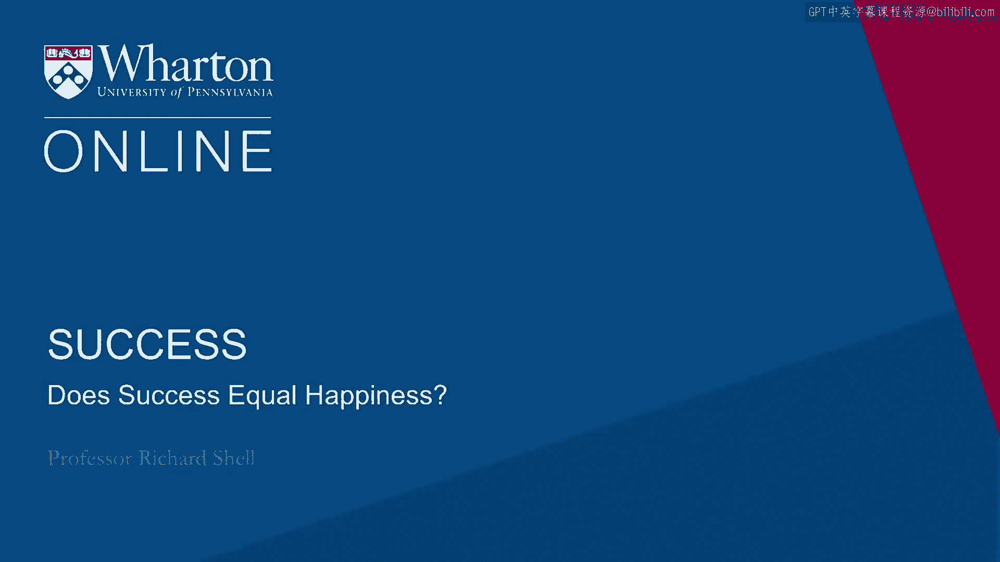
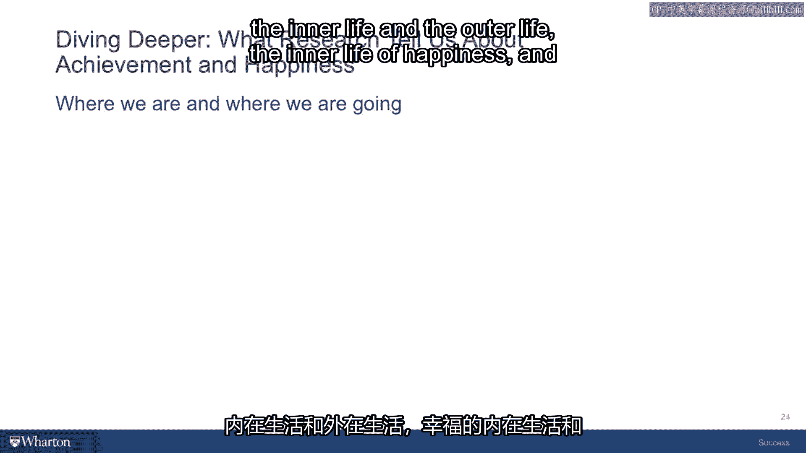

# 沃顿商学院《实现个人和职业成功（成功、沟通能力、影响力）｜Achieving Personal and Professional Success》中英字幕 - P21：20_成功等于幸福吗.zh_en - GPT中英字幕课程资源 - BV1VH4y1J7Zk

 So with the traps that I've just outlined for what can happen if you put your chips。

 on the achievement number on the Wheel of Fortune， I want to conclude by giving you some。

 positive advice because there certainly are things well worth achieving。

 I think you just have to reframe and reset what it is you're shooting for and you'll。

 find it much more sustainable when you're going for a worthy kind of achievement。 So for example。

 instead of untold wealth， seek financial security。

 Look for the amount of wealth that will give security to your family， to yourself， so。

 that you can lead a fulfilling life。 Instead of fame， seek respect。

 Seek people who know you well enough and who are real judges of whether you're excellent。

 at what you do and can help you get better at it。 Basically fame is being known by a lot of people who have very little knowledge of what。

 you are and who you are。 Respect comes from an inner circle that have reasons to judge you in a positive way。

 And so keeping your goal on the search for respect is more likely to lead you in a better。

 direction。 Outside of status， worry about finding roles in the lives of others that gives you a chance。

 to contribute to them。 It could be the role of father， it could be the role of mother。

 it could be the role of， mentor， it could be the role of leader。

 but instead of getting fixated on a title， you， know， chief financial officer。

 ask yourself what are the actual roles that you're playing。

 in the lives of the people around you in the organization and tend to maximize on those。

 roles that will focus you on the contributions you're making。 And instead of。

 and these days this is a really tempting one， instead of a vast social network。

 that follows you on Twitter or is， you know， the number of people that you have on your。

 Facebook page， very relatively shallow relationships based on very little。

 very episodic information。 Make more true friends， friends who you can see， touch， know。

 feel and who can affect you， and you can affect them and you're part of their lives。

 And at the end of the day， maybe some of those will turn into the Friends of Virtue we talked。

 about that Aristotle thought so much of。 So not wealth， financial security。

 not fame and recognition， but rather respect。 Not status。

 but the worthy roles you play in the lives of others and not shallow and numerous， relationships。

 but deeper and fewer true friends。 So if we're going to leave achievement behind for a moment and anchor on the other side of。

 success， the inner life， let's just see whether when you really begin to think about happiness。

 that's really got all the answers in it or if that turns out to be a little complicated， as well。

 And I'm trying to complicate this not to make your life difficult。

 I'm trying to complicate it because if you have the wrong understanding of what happiness。

 is or what achievement means， then you'll chase the wrong goal and you'll end up being。

 unsatisfied by the kind of success that you've achieved。 So we're looking here for the real deal。

 the success that feels deeply satisfying。 Okay， so what about happiness？ Well， again。

 I've been privileged to be here at the University of Pennsylvania。

 I've been in a relationship and interaction with our Positive Psychology Center。

 They are a discipline social scientist who study happiness all over the world and have。

 programs and projects that they are funded to measure happiness in many different ways。

 What they've concluded is that there's more than one kind of happiness and that it's， funny。

 you know， the the the Inuit people who are the people， the native people of Alaska。

 live a life that's surrounded by cold weather and they have many， many names for what we。

 call ice because in their world there are many different kinds of ice and they mean。

 different things and they have different roles in the lives of the Inuit people。

 In the United States， in Western Europe， in Western countries， we make a lot of this。

 word happiness。 It's in the Declaration of Independence that we're supposed to pursue happiness。

 But this one word can often be very confusing and people think they're chasing one thing。

 and they don't get it， they think there's something wrong。

 So I think it's important to at least think about three different kinds of happiness and。

 the research helps us think about this。 If you want to read some more about these some of these forms of happiness。

 Daniel Kahneman， a Nobel Prize winning psychologist from Princeton has a wonderful book called Thinking Fast and。

 Slow has a chapter or two on happiness that distills a lot of this research into a pretty。

 efficient capsule but we're going to talk about it a little bit here。

 So the first kind of happiness that most people think about when they think about the word。

 is what I call momentary happiness。 Now momentary happiness is an emotion。 It's a mood。

 It's a moment that comes and where you're having a positive feeling。

 A good example might be you are at the beach。 It's been a pretty hot day。 You go to the boardwalk。

 There's a soft serve ice cream vendor there。 They have your favorite flavor。 You get into the shade。

 You've ordered your soft serve ice cream。 It's dipped in whatever it is that you love as a little covering chocolate or strawberry。

 or something and you have that first bite of that ice cream cone and it just tastes wonderful。

 That's momentary happiness。 Could be the same thing if you're a fan of drinking beer and it's the same kind of day。

 and they have the favorite beer that you like and you take that first sip of whatever the。

 drink is that you find most enjoyable and it just fills you with this feeling of happiness。

 So momentary happiness is great。 I think the more of it you have the better your days are but there's some problems with。

 momentary happiness as a measure of success in life。

 So research says that there are genetic set points that people have that go into their。

 emotional makeups and some people are kind of positive people and some people are less。

 positive and some people are kind of negative people。

 And your mood state swings on a given day or during a given period of time sort of above。

 that genetic set point when you take that first bite of the ice cream cone but then somewhere。

 a little later dips below that set point as you begin feeling really hot and sweaty on。

 the beach and you wish that the sun weren't so bright and now you're not in such a happy。

 mood state。 Maybe somebody comes along a dog comes along and puts sand in your drink on the beach and。

 now you're really kind of upset and angry with somebody。

 So your genetic set point just tells you whoops going down here but it is arranged and。

 chances are you're not going to have too many moments when you're above the highest point。

 of that range。 You're not going to have too many moments when you're below the low point of that range。

 And my range is different than yours。 My best day may be just in the average domain for your day and you get to be a lot happier。

 than me because your genetic set point is different。 So if happiness of this kind。

 this sort of aggregate number of mood states is set by， our genes。

 it seems sort of unfair to say that you're more successful than me because。

 you have more positive mood states than I do because you're endowed with a different。

 set of genes than I was。 So there's the problem of kind of no free will when it comes to how many happiness moments。

 you get and it seems like success ought to have something to do with choices we make。

 And there are a lot of pretty intelligent people who have thought about the question of happiness。

 and kind of come to the conclusion that these positive momentary mood states really don't。

 rise to the level of kind of nobility or purpose that you would want in a theory of success。

 Albert Einstein once said that a theory of success that's built on momentary mood states。

 was more like the happiness of a cow than something that humans ought to endorse because。

 if you kind of go by a farm and look out at a herd of cattle they're happily grazing， out there。

 They're， you know， in the sun they're well watered， they're well fed， everything's good。 Well。

 you have a pretty happy cow。 But would you really say that that's a successful life that would be something you would be。

 satisfied with at the end of your days？ I'm not sure。 So positive mood states， good。

 But this is the only form of happiness that you might call success， maybe not。

 So second kind of happiness and this again is research based。 By the way。

 the way they measure momentary happiness is with little beepers they put， on people。

 They'll put a little beeper like a cell phone or a clip and you walk around during the day。

 and the experimenters beep you and at the moment they beep you you have to take off。

 the little device and you know put where how you feel you know excellent， bad， terrible。

 and you just put the moment when you feel it and at the end of a week they measure how。

 many positive moments you have and that's how they decide whether you're happy or not。

 So that's the momentary happiness。 Now we go to the second one and I call this overall happiness。

 And overall happiness is not an emotion。 It's a thought。 It's an evaluation。 It's a critique。

 But you may reach a point either a progression in part of your life or an anticipation of。

 another part of your life and look back if you're looking backwards at say your college。

 experience and someone asks you were you happy in college and you don't know whether you。

 can really add up all the positive mood stays but for some reason you feel like yeah you。

 know important things happen。 I met my spouse in college。

 I you know I graduated and so yeah overall I was happy in college。

 But actually if you go back and you had that beeper all the way through college you would。

 find as often as not that you are much more miserable in college than you remember and。

 you only really remember the peak the day you met your spouse to be and the ending which。

 was the graduation ceremony when your family came and everybody applauded you and it was。

 a great moment you got a prize。 And all the rest of it that whole miserable sophomore year all the hangovers and other。

 disasters that occurred that made you miserable pretty much fade out of you and just you know。

 disappear into the past。 So overall happiness is a moment in time when you evaluate but not always accurate。

 In fact the research seems to show that if you give someone a cookie or some other thing。

 that they like and they put them in a positive momentary mood state their memories of the。

 past might actually be colored by the fact that they're in a good mood and they'll rate。

 their overall happiness higher and if you put them in a negative mood state their memories。

 will cast back and select out more negative things and their overall happiness might be。

 a little bit lower。 So it's not that hard to manipulate。

 So we have the problem of selected memory we have the problem of easy manipulation and。

 you know it's all there's always a fundamental problem with any evaluation and that is it's。

 always relative to some baseline expectation。 So if you thought college was going to be miserable and it turned out to be okay that's。

 going to give you a feeling that you're happy。 If you thought college was going to be wonderful and it turned out to be okay then you're going。

 to evaluate it more negatively。 So your overall experience is going to be cast in a frame manipulatable by what your expectations。

 were。 And so again it's just a cognitive phenomenon almost a paradox that we can think about the。

 past and even the future in our anticipation differently depending on what our moods are。

 what our evaluative criteria are and that's all very interesting as a matter of sort of。

 cognitive psychology。 My challenge to you is is this really the way you want to measure success is it just going。

 to be all about some moment in time when you say my overall happiness was X at time past。

 or I anticipated to be Y in time future and it seems like that's a pretty flimsy read to。

 place the weight of your meaning in life on。 So overall happiness interesting probably helps you get motivated and helps you tell。

 stories but not necessarily the final story about how you measure success。

 So the third kind of happiness is something quite different than both momentary happiness。

 and overall happiness。 Like momentary happiness it's an emotion but unlike momentary happiness it has a lot more。

 resonance it has a lot more depth a lot more meaning associated with it than eating ice。

 cream con does on the hot summer day。 I call this deep happiness but it comes with a lot of different names that people have。

 tried to give to it over the thousands of years that humans have tried to grapple with。

 the meaning of success。 Certainly one word in English that might have captured this is joy。

 Joy is sort of the exaltation that you feel say on the birth of a one of your first child。

 or one of your children it might be a kind of feeling of connection when you are in an。

 amazing place in nature and you simply feel the awe and the inspiration of the vista that's。

 in front of you。 It could be the feelings that you have when you fall in love and you just have this mysterious。

 new amazing feeling of connection and depth to the relationship that suddenly blossomed。

 So joy is a good word that might capture it。 The Greeks had a word for this called Yuday Mania it translates from the Greek as good spirit。

 and Aristotle wrote about it in his book on ethics and it's an interesting Greek concept。

 because it's not a state for them it's not an emotion for the Greeks it was a kind of thriving。

 kind of flourishing a kind of activity in which your excellence is embodied in an activity。

 that gives meaning to those around you and that is an end of itself。

 You're doing it because you love doing it you're not doing it for any other purpose。

 So Yuday Mania is a Greek word that captures this sort of thriving sense that I think deep。

 happiness may be about。 There's a Hebrew word one of my students pointed this out to me one semester Simka is a Hebrew。

 word that normally is more like momentary happiness it's a happiness that might be the。

 case if you're celebrating a wedding or a birth but there was a rabbi that defined it。

 especially in a way that I resonated with and he translated as the feeling that comes。

 when you're doing what you should be doing the feeling that comes when you're doing what。

 you should be doing。 So this might be the kind of feeling when you're sitting with someone and you're comforting。

 them or you're being with them when they're in the hospital with an illness and your presence。

 has given them a moment of relief from the suffering that they're feeling。

 I had a student once who came to me and he said he was going to have to miss the next。

 class because his grandfather died and he had been asked by the family to speak at his。

 grandfather's funeral and so this always is a good excuse in my world for not being able。

 to come to classes an event like that but we were talking about how he felt about it。

 and he felt nervous he felt the sadness that his grandfather who he was close to had passed。

 but I predicted for him I said when you're at this funeral and you're speaking about your。

 grandfather I think you're going to have a moment of something like deep happiness because。

 you're going to be doing what you should be doing there won't be any other place on the。

 planet that you shouldn't be more than that place at that time。

 So this very special definition of Srimca might be another definition of deep happiness。

 and then the positive psychology community scholar named Chixin Lehi has come up with。

 a concept called flow written a book called flow and flow might be another dimension of。

 this flow is the feeling that comes when you're engaged with an activity you're absorbed。

 in it it may be the feeling that sometimes comes to runners when they kind of go into。

 the zone happens to me sometimes when I'm writing and I just lose track of time and completely。

 absorbed in the words and where they're coming from where they're going what I'm saying and。

 time just stops you wake up an hour later and you're not even a wow what where was I what。

 was going on and that sense of engagement is also very important maybe component of this。

 thought what deep happiness means this feeling。 So so this seems like a worthy thing to be identifying with success certainly the more。

 moments of thriving joy being where you should be a flow that your life has you'd count that。

 as a part of your definition of success but here's the problem are these moments really。

 moments you can engineer are they moments that you can create or seek and kind of wake。

 up in the morning and say I think I'm going to go find a little deep happiness today I。

 don't think so I think these are much more moments of grace and what I give to us and。

 often the most important thing is to be slowed down enough to experience them Nathaniel Hawthorne。

 the American writer had a wonderful image for this he said if you try to catch a butterfly。

 with your hands it's very difficult but if you'll just sit still sometimes a butterfly。

 will come and light on your shoulder and I think that's the case with deep happiness。

 sometimes if you just sit still and bring awareness to a moment that's when deep happiness。

 visits you and it's not really something that you can pursue in the same way Thomas Jefferson。

 might have been thinking about when he told us that our constitution would allow us to。

 pursue happiness so so happiness turns out to be a little more complicated than just one。

 thing so let's conclude our discussion of happiness as a success factor by just looking。

 at a few of the things we think we know about what happiness is and what its importance。

 is based on the research and as I said there's extensive research on this so and Daniel Kahneman's。

 book thinking fast and slow he makes this point really powerfully and it's really kind of simple。

 what matters most to your happiness is spending time with people you love who love you being。

 surrounded by the community of people who care the most about you who you care the most about。

 is just more likely to end up giving you more of all three of the kinds of happiness we talked。

 about it's not always happy it's not that being around people you love who love you is a bit。

 of roses all the time but that odds are very high that those moments will contain the moments。

 of your most happiness so that's item number one spend time with the people you love who。

 love you never underestimate the importance of that to your overall success secondly it。

 turns out happiness much more often comes from experiences especially experiences you share。

 with others than from material objects and you know oddly the experience of shopping for。

 something that you're going to purchase with your loved one or your spouse and bring back。

 and bring into the home as one of the decorations may actually be the shopping experience itself。

 the choice the decision the variety of things you looked at what was happening around you。

 when you chose that those actually sometimes become more important than the object itself。

 so when it's sitting in your home it's not the fact that the object is there it's the story。

 behind the object that gives it meaning and that brings happiness so think experiences。

 more than material goods third it often comes from your willingness to be unhappy in the。

 pursuit of certain goals that are long term goals or difficult goals you think of an Olympic。

 athlete or someone trying to get through a four-year college experience or a graduate。

 program these are difficult long term commitments to a set of activities many of which are going。

 to task you going to require sacrifices they're going to mean you'd have to take risks there。

 are uncertainties you may or may not achieve the goals you may have setbacks lots of effort。

 is going to be required for you to drill and practice and I exert efforts that aren't always。

 the happiest moments of your life but the reward for having been willing to endure some level。

 of unhappiness turns out to be a much deeper and more satisfying happiness when you finally。

 come to achieve those goals when you come to the moments where there's a fulfillment of。

 whatever those efforts were directed toward so if you only see happiness and unhappiness。

 is your enemy the chances are pretty high that you're not going to risk the effort that。

 it's going to take because there's some unhappiness built in there and you're trying to avoid that。

 and then that just simply means that you're not going to have the depth of satisfaction。

 and fulfillment that could be yours if you didn't think so simplistically about happiness。

 good unhappiness bad that's much more interesting than that and I think your judgments and decisions。

 will be wiser if you consider the role of happiness unhappiness effort uncertainty in your overall。

 life satisfaction the fourth and final thing that we know about happiness is that you can。

 reframe your emotions by the way you set your own expectations and bring more happiness into。

 your life by having expectations more realistically set than simply being over the top with expectations。

 that a certain party or a certain event in the future is going to bring the answer to。

 all your life's woes and and travails and and and moderate a little and when your expectations。

 are set in a more accurate way the actual experience that comes either meets or exceeds。

 them more often and then that becomes a moment where your emotions fall in line with a positive。

 set of emotions about what's happening instead of disappointment you know didn't meet my expectations。

 not as good as I expected and then you're filled with negative emotions so in this part。

 of the course we looked at the two sides of happiness the inner life and the outer life。

 the inner life of happiness and the outer life of achievement and looked at some of the complications。

 that become apparent when you start looking a little more carefully at each of these as。

 a component of your theory of success it turns out that when it comes to achievement it's。

 easy to fall into one of several traps and end up achieving things that don't bring any。

 fulfillment or satisfaction chasing other people's goals chasing a kind of obsessive form of。

 achievement that never brings satisfaction and then on the happiness side we turn turns。

 out that there's more than one form of happiness and that this single word carries some very。

 different meanings and it's very important for you to articulate for yourself what it。

 is you actually are thinking about when you say I want a life that's going to bring more。

 happiness could be momentary happiness this concept of overall happiness and then this。

 mysterious but very important feeling of deep happiness so with all this new understanding。

 in the next part and the final part of the course we're going to look at how you can apply this。

 knowledge that we've gained and your own experiences and memories that you've accessed to begin。

 thinking about a success for yourself in a very concrete very actionable way thinking。

 about how you can apply these tools what are some steps you can take to make them concrete。

 so that you can begin advancing toward the values that you've identified in our work together。

 [BLANK_AUDIO]。

