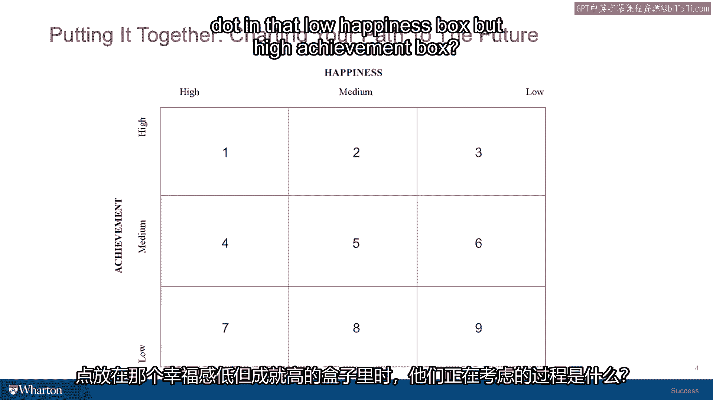

# 沃顿商学院《实现个人和职业成功（成功、沟通能力、影响力）｜Achieving Personal and Professional Success》中英字幕 - P23：22_分析矩阵.zh_en - GPT中英字幕课程资源 - BV1VH4y1J7Zk

 As with all of our assessments and mind puzzles， this one has no right answers， so it's really。

 designed to help you elicit what your current perceptions are， what your inner world looks， like。

 To help you get a benchmark on where you are today with respect to these two dimensions， of success。

 the inner life and the outer life， we've got a matrix that has nine cells and。

 it's on two dimensions。 There's the happiness dimension that's going across horizontally and then the achievement。

 dimension which is going vertically up and down。 You'll notice that each of the cells has a number。

 Reading from left to right as happiness moves from highest level to lowest， the top row， is one。

 two， three which is high levels of achievement but diminishing levels of happiness。

 And if you go to the other side and you see high levels of happiness but diminishing levels。

 of achievement， cells one， four and seven。 And then the other cells sort of fill in the background in between four different moderate。

 levels of happiness and so on。 So what I do is I give my students and executives this cell。

 these nine cells and say just today， summarizing where you think you are at this moment。

 take a pen and just put a dot in one， of these cells that allows you to just sort of take a weight point on where you are in。

 your life and people have different perceptions and they put their dots and then it gives them。

 a chance to assess sort of what's working， what maybe needs improvement。

 I'll say that in general the cells at the outside， three， six， nine， eight and seven right。

 on the outer dimension there are the ones that get populated the least。

 So in a moment I'm going to tell you a couple of stories about some people who put their。

 dot in cell number three。 But most people end up in cells one， two。

 four or five and probably the most commonly， populated one is cell five。

 the one right in the middle where it's a moderate level of。

 happiness and a moderate level of achievement。 So just to give you a couple of quick hits on those cells。

 people who put their mark in， cell number one usually are feeling very。

 very positive about their lives and sometimes feel。

 that they need to have a high perception of happiness and high perception of achievement。

 because it sort of expresses their positive personality and their positive mental attitude。

 about their overall approach to life。 So it isn't。

 they actually never leave cell one every day they wake up and they somehow。

 manage to conceive of their situation as a cell one life。

 Other people see that as very one dimensional and put their dots in either cell two or cell， four。

 the moderate happiness or the moderate achievement。

 In order to motivate themselves toward moving forward on some dimension of their life whether。

 it's the next step in their career or the next invention they're trying to create or。

 they're looking forward to when their child achieves something that they're all hoping。

 for and their happiness level will move up or that they have some new set of relationships。

 in their community that are on the cusp of developing in some positive way。

 So they look at aspirationally at moving one or the other of these two dimensions as the。

 next stage of their efforts。 The people in Group 5 and cell 5 are basically satisfied and interested in moving in any direction。

 And it's an interesting place to be because when you are in that medium place in both。

 sides it's a little harder to identify which of the two areas the inner or the outer life。

 needs to be addressed and what priority。 So if you're in that cell you might just ask yourself which end of the box are you in？

 Are you in the box？ Are you a little closer to the top of that box？

 A little closer to the left of that box。 To again kind of give you a sense of priorities over what your next steps ought to be。

 Should they be steps addressing achievement in the outer life or should they be steps addressing。

 more the inner life and happiness？ I wanted to share a couple of stories with you about these two executives that I interacted。

 with in an important program that we teach here at Borden and tell you their unusual stories。

 because they put their dots in cell number three and they had two very different reasons。

 for doing so。 I teach in a program here at Borden called the Advanced Management Program and we have executives。

 come from all over the world。 They're very senior。 45 to 55 or 60 years old。

 They are in very irresponsible positions and global firms and we give them this problem。

 as part of a set of exercises where they get to kind of benchmark their own success and。

 where they think they're going when the program's over。

 And one year I had two people in that program。 They're about 50 each time we teach it。

 You put their dots in the high achievement， low happiness。

 I thought that was interesting enough to ask them in front of the group because they get。

 to trust each other quite a lot and they're very candid with each other。

 What was the process they were thinking about as they put their dot in that low happiness。

 box but high achievement box。 They gave two different people。

 gave two answers that I think are interesting and give you。

 a sense of the variance that can happen to different people in different stages of their， careers。

 So the first person explained that he was a very senior executive。

 He was the head of the North American Division， Canada， the United States， Mexico of a major。

 fortune 500 company and he said that he had given himself a high achievement ranking because。

 he had so far exceeded any position that he ever expected to achieve。

 So he had always been someone who wanted to achieve a lot but he just had never thought。

 that he would be in the position that he was in at the time we were discussing it。

 So he gave himself credit for a high level of achievement。

 But then I said well why the low happiness check and he went well。

 As I was sitting here today listening to the discussion and thinking about myself I suddenly。

 came to realize that for the last three promotions that I've gotten I have promoted myself further。

 and further away from what I actually love to do。 And so whereas I was very passionate about efficiency and factories and getting everything。

 to run smoothly and to be highly productive and operations related。

 The last three promotions I've ended up doing more and more politics， meetings， internal conflict。

 and almost none of the things that really you know just me and get me excited about work。

 So I suddenly realized that I've been successful on the career side but I have actually gotten。

 away from and it's hard to imagine how I'm going to get back to the thing that I actually。

 motivated me to get in this career to start with。 So I felt some compassion for this guy because it's really hard if someone offers you a promotion。

 to turn it down because you want to stay at some activity level or responsibility level。

 that you feel you're well suited for。 In fact I think in most companies they might take that as a sign that you're unmotivated。

 and they might move you along。 I've taught a lot of teachers and school administrators here in the United States and very often。

 teachers have this problem。 They love children， they love education。

 they enter the career of teaching， they show some， administrative talent。

 they get promoted to be an assistant principal， they're still， teaching a little。

 they get promoted to be a principal， they're not teaching at all。

 They get promoted to be a school superintendent， they're not even in a school anymore and their。

 happiness level goes down as each promotion level goes up and I think it's something you。

 have to pay attention to if you want to achieve the kind of full success that you aspire to。

 The other person who had put their dot there was entirely different。 He was very young。

 he was about 35 years old for young for this group。

 He was from South America and he had he said recently been given an award as the top lawyer。

 in his country in South America and the youngest person ever to achieve this honor and so he。

 felt that he deserved to put himself in the high achievement cell and I said well that。

 sounds great so why the low happiness score？ He said well I hate law and so although I'm very good at it it really doesn't give me。

 much your satisfaction at all so I put myself down there and it was interesting because when。

 I heard him say that I realized for him at a young age where he's got a skill or a mindset。

 like legal training that's easily ported from one area to another his ability to move from。

 the low happiness up to a higher level by changing jobs， by changing functions， by changing。

 firms is going to be much easier than the first gentleman who had basically undertaken。

 a huge degree of responsibilities that were going to make it impossible for him to go。

 backwards to the factory floor that he loves so much。

 So just a couple of examples of how people end up where they do and the challenges at。

 liehead once you've identified the area that you think you need to focus on next whether。

 it's the next step in a career which might mean that you're focused on the achievement。

 side or whether it's the next step in moderating or understanding your emotions， your personal。

 relationships， your hobbies or things that you do because you love doing them and how。

 you can do those more which might help you move up to happiness scale。

 So this is just a little bit of a diagnostic on what your agenda is and what you need to。

 be working on and now we're going to look at some tools to help you begin concretely working。

 toward those goals。 Thank you。 [BLANK_AUDIO]。

