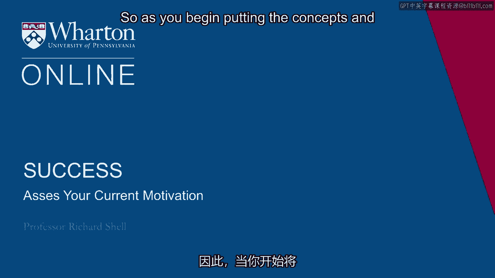

# 沃顿商学院《实现个人和职业成功（成功、沟通能力、影响力）｜Achieving Personal and Professional Success》中英字幕 - P24：23_评估你当前的动机.zh_en - GPT中英字幕课程资源 - BV1VH4y1J7Zk

 So as you begin putting the concepts and materials to work that we've been covering。

 in this whole course， one of the things that's very important that we haven't talked about。

 yet is assessing the kind of motivation that is primarily driving you。

 Now there are two kinds of motivation that people usually talk about which is intrinsic， motivation。

 doing things just because you love doing them and not for any kind of reward。

 and extrinsic motivation which is doing things primarily for a reward and whether you like。

 them or not is sort of indifferent。 My own feeling is that those two generally mix。

 everybody has some level of intrinsic， motivation and extrinsic motivation that is getting them going on whatever their projects。

 are and depending on the part of your life that you're working on， happiness tends to。

 be more correlated with intrinsic motivation activities， hobbies， time with your children。

 work often more associated with extrinsic motivation， things you get paid for， things。

 that you kind of process in the ordinary way of getting a paycheck。

 But I'd like to talk about one other cut on motivation that I think is most intimately。

 related to your success concept and that is to ask a question。

 In terms of your situation now and we just looked at the matrix to help you assess that。

 do you feel like you're more running toward your goals at this point or do you think you're。

 more running away from your fears？ The two dominant drivers in the human psyche are desire and fear。

 Even a snail will move forward to get food with desire but withdraw into its shell if。

 it feels threatened and has fear。 So humans have the same two principal motivations and I think it's important for you to assess。

 which of these and in what mixture you're currently working on your success goals with。

 Because if fear is an issue and sometimes when I ask this question to students， they。

 almost look startled because although they've been thinking that they've been moving toward。

 the goal of say graduation， what they realize is they've just， they've been motivated almost。

 as much by the fear of disappointing their families or the fear of failure if they don't， graduate。

 And to the extent that you've got these backwards and you're motivated more from fear than you。

 are from the desire to achieve something， the chances are that it's going to be a much more。

 haunting sense of success， a much less satisfying sense of success because all you're going。

 to do is keep your fear at bay and you're not going to feel the fulfillment of having。

 actually grasped something that you were pursuing。

 So it's important to get this oriented in your mind。 We have many fears。

 You can be motivated by simply a fear being alone or a fear of being a failure or fear。

 of being not taken seriously or being unimportant or disrespected。

 And those fears are dominating your life。 I think it's really important to stop and turn and face them and try to identify them。

 and try to grapple with their causes。 If you don't。

 it's a pretty strong chance that any efforts you make toward any kind。

 of substantial achievement are going to be kind of two steps forward， one and a half steps。

 back because you're not having taken care of the fear。

 The desire part doesn't have the freedom to exercise all the skills and talents that you， have。

 And underlying all fears in my view is one really big fear that all humans face and it's。

 a big mystery and essentially it's the fear of death。

 And I think it's important that everyone at some point come to terms with this important， fear。

 It is sort of fundamental to the human question。 I once did a calculation and basically if you're lucky enough to be 90 years old and。

 you're 90 years of filled with days of full awareness， you will live for 32，850 days， 32，850， days。

 And that's all you're going to get in this life。 Now if you believe in an afterlife。

 then there's another plane of existence and something， else will happen。

 But it's still the case that 90 years gives you 32，850 days。

 And I think it's important to understand that your time is limited and that you have to。

 accept that as one of the constraints that you're living with。

 Some people come to terms with their fear of death because they lose a loved one and。

 they have the experience of losing them and they sort of become profoundly aware of the。

 fact that they themselves may or will someday face this。

 Others come to it because they have some personal experience of their own mortality。 For myself。

 I was on a world journey of trying to find myself after college and seeking some。

 sort of wisdom that would allow me to figure out how to put my life back together again。

 in the wake of my crisis with my family and the Vietnam War and my separation from their， values。

 And I was living in a Buddhist monastery in Sri Lanka and I was under the tutelage of。

 a wonderful Sri Lankan teacher。 We meditated pro pretty much from six in the morning till about nine at night。

 It was an hour of sitting meditation and a half an hour of walking meditation。

 We only had two meals a day， breakfast and lunch and then no more food until the next， morning。

 And being a Westerner and not having grown up in Asia， I had a terrible time sitting in。

 the posture that you have to sit in to meditate。 And so I was in a great pain。

 You only got to speak for about fifteen minutes a day and you spoke only to your teacher。

 And I was finally at my wit's end one day and I went to my teacher Venerable Seavaly and， I said。

 "Venerable Seavaly， I'm doing nothing in my meditation except being aware of pain。

 My legs are in pain， my back is in pain， my feet are in pain and this can't be very meaningful。

 for me to be sitting hour after hour and nothing but pain is happening as far as my mental。

 experience。"， And he looked very compassionately at me in a very wise sort of way and he said。

 "I think， it's time for you to take a walk in the forest。"。

 And so he gave me leave to forgo my meditation practice for the afternoon and there was a。

 great big forest outside the back of the monastery in the Port of Sri Lanka where we were located。

 And so I just took a walk in the forest and it was a remarkable experience for me because。

 I was simply walking along wondering why the monk had sent me back there and then all of。

 a sudden I noticed that the whole forest floor was covered with dead leaves and then I noticed。

 that there was a dead bird under a tree and then I noticed that the soil was filled with。

 insects and animals that were sort of basically reprocessing the forest floor from all this。

 detrus of nature into something that would give rise to new life。

 And it just hit me that I had been reading a book and that someone had just given me the。

 key to translating it and that the book was the book of life and that the main message。

 was that life and death were connected and had to be with one another in order for either。

 one to be。 And that hit me like a ton of bricks。 I sat down under a tree。 I wept。

 I just realized that I would die just like everything in the forest and I just mourn the。

 fact that that was what lay ahead for me but it was a very cathartic kind of pain at that， point。

 And so I went back to my meditation and the truth is from there I marked that point in。

 my life as basically a turning of the page up until that point I think I had been running。

 from a certain fear of death and after that day I understood it in a kind of visceral way。

 and it meant I could confront the death of my parents with a very different perspective。

 It meant that I see suffering in a very different way my own and others and so it's been I。

 noted for myself as a big turning point in my understanding of what life is and essentially。

 what success means。 I had a student who had confronted this very differently in her experience。

 She once she's a very religious person。 She was an Orthodox Jewish woman and as a child when she was about ten years old she was jumping。

 into a lake near her home and she said that she hit her head on a rock that was not far。

 below the surface and she felt herself drifting underwater down toward the bottom of the lake。

 and she said as she drifted she felt a very warm， full， enormous presence surrounding。

 her with love and that there was this embrace that she was conscious of and then the next。

 thing she remembers is she was on the shoreline next to the lake and there were people pushing。

 on her chest and shouting and they had located her and brought her back to the side of the。

 pond and had brought her back to life and she said that this experience of almost dying。

 very personal， very intimate had completely eliminated for her the fear of death because。

 she now knew in her own experience that death was going to be something very different than。

 she had expected and something much much more overwhelmingly positive for her。

 So everything about her life had changed after that she， her concern for things like being。

 alone or her concern for the death of a loved one that she of course felt compassion and。

 a sense of loss but not a sense of fear and I think that fundamentally changes how you。

 approach the success that you want to achieve in your life。

 So I guess I'd need to ask you where you stand with this big fear and if you have confronted。

 it then you've definitely overcome a major challenge that your life will hold for you。

 If you're uncertain about it then I think it might be something that you want to look。

 at and try to understand more deeply don't be afraid of the fear of death。

 That's something that is a stage in your maturity， a stage in your growth and a stage in your。

 ability to help others。 So once you transition from running away from your fears then you have the opportunity to。

 run with all of your energy toward the future and toward the goals that you want to achieve。

 and I just have a quick exercise that I think might help you imagine that。

 We call it the lottery exercise。 It's inspired by a woman named Cynthia Stafford that I read about in my studies on success。

 Cynthia Stafford was an office worker， or still is， she's alive still and she always played。

 the lottery and she reported that over and over and over she would visualize this winning。

 lottery ticket that she imagined she was holding and she had this amazingly vivid picture in。

 her head of the dress she was going to wear， the ticket and the number on it and everything。

 about the situation when she won the lottery。 Then she played this number of course over and over and then lo and behold it was a California。

 lottery she won and she won on a day when she was wearing the very dress that she had。

 imagined herself wearing and she ascribed it to a kind of miracle mind power that she。

 just imagined that her mind had created this winning lottery ticket。

 Now I think Cynthia's story is important because that's a kind of magical thinking that actually。

 doesn't work because if you imagine that there are eight or ten million people playing the。

 lottery at least several thousand of them are imagining that they have the winning ticket。

 and the mere imagination of something is not likely to affect the lottery machine that's。

 punching out the tickets。 But what I admire about Cynthia Stafford is she had this experience it was a little spooky。

 I think for her but rather than turn it into some sort of motivational speaker career where。

 she went around trying to convince people that magic is what makes you win a lottery。

 She actually looked inside found what she was really passionate about took care of her。

 family first of course set up trust funds for her kids to go to college and you know。

 did some traveling。 But after that she became very passionately involved in theater she helped found some community。

 theater projects in Los Angeles she partnered with David Geffen a famous theater person。

 out there to start to get a program for disabled people and elderly people to come to the theater。

 on the weekends when they were free and she even started a television and movie production。

 company where she could make films and tell stories。

 And so here's a person who won the lottery but turned it into her life streams and she。

 partnered with people that helped her become successful。

 So here's your challenge imagine you've won the lottery maybe you weren't wearing the same。

 color dress or the same color suit that you imagined but you won the lottery anyway。

 Now what would you do with it？ Let's assume you would take care of your family let's assume you would travel to your heart's。

 content but let's also assume that you now have the problem of figuring out what to do。

 with all this opportunity and I think if you take a minute and dream a little and write。

 down what you would actually do we're money not a problem for you。

 What you'll find is that you'll get some directional signals maybe you would want to。

 work in education maybe you would want to work in the media maybe you would want to provide。

 educational opportunities for people in your community or work in developing country or。

 get involved with politics but if money were not the option what would you do and I think。

 that begins to sketch out the kinds of goals that are good goals that will be inspiring。

 goals to run toward。 So I'm going to give you a final exercise as part of this sequence and I want you to。

 take it very seriously and it's going to have several steps。

 Step one I want you to write down four or five goals that you currently have for your。

 life could be short-term goal long-term goal relationship goal career goal but any kind。

 of goal you want it's up to you but write down four or five of them and pause this video。

 while you do that and come back and I'll have your next instruction。

 So having written down the five four or five goals here's your next problem I want you。

 to circle the one that is the one that you have to achieve before you can achieve the。

 others so which of those goals is essentially the precondition for you to achieve the others。

 if you wrote down a goal that was become a college teacher or you know write college。

 textbooks or something getting a graduate degree a PhD would be a first goal that you。

 have to achieve before you could achieve any of the others。

 Maybe you wrote down something about a family and children finding a life partner would。

 be a goal that you would have to achieve before you could achieve any of those other goals。

 So note the goal that you have to achieve before you can achieve the others and then。

 put a circle around it and then the final step of this is really simple at the bottom。

 half of the page where you've written your goals write down two things that you can do。

 this week to take steps toward advancing on that goal you put a circle around。

 Two things to concrete actions you can take today tomorrow Friday that would advance you。

 toward that goal that you put a circle around that is the precondition for being successful。

 in any of the other goals。 I think that's the kind of commitment that you need to make it's the humility that you。

 need to have in order to get your life going in the direction that your own theory of success。

 suggests that it should go。 I have a home in summer place kind of down in Virginia that I first encountered as a。

 child and it's a place cabin it has four bedrooms in an outhouse no bathroom and it's on a river。

 pass and there are lots and lots of stones in front of it with a rushing river that's。

 going by and as I was a kid because my father bought it early in my life and then I've been。

 going back ever since as a kid I used to have a game and I would try to see how far down。

 the river I could get on these stones that littered the river pass without getting my。

 feet wet and see how many different ways you could do it and the river changed every time。

 and it went up and down with the weather。 So these life goals are like the stones in the river you have to take action to get to。

 the next step and then once you're there you survey the situation and then decide what's。

 the next best jump you can make to keep your feet from getting too wet and get make progress。

 to the next step and then you get to the next step and then survey the situation again and。

 take action on the next option that you see is the best option。

 So this is very concrete I think one of the things we're trying to do here is not just。

 give you a theory of success but give you some tools and some motivation to take action。

 toward that theory and making it a reality。 [BLANK_AUDIO]。

