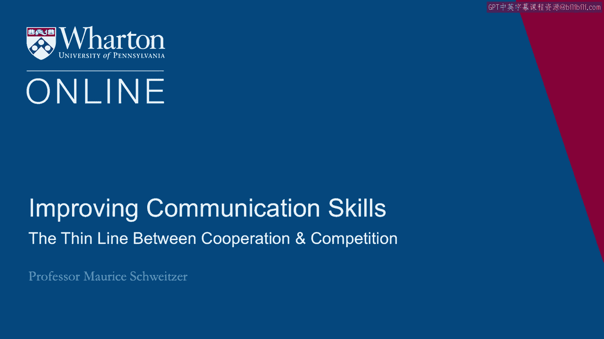
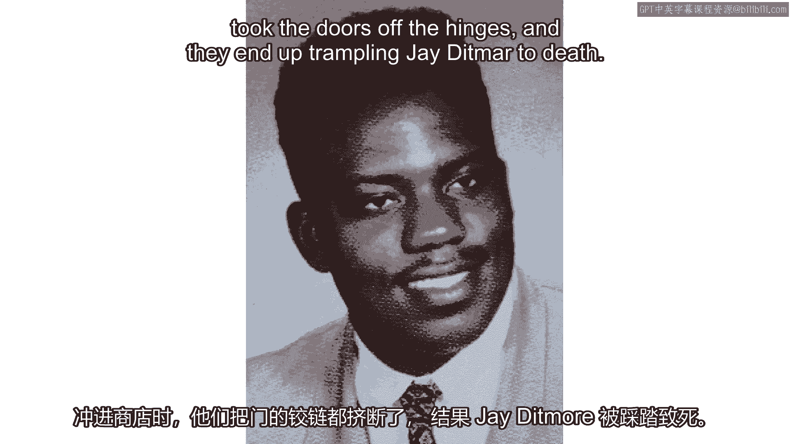
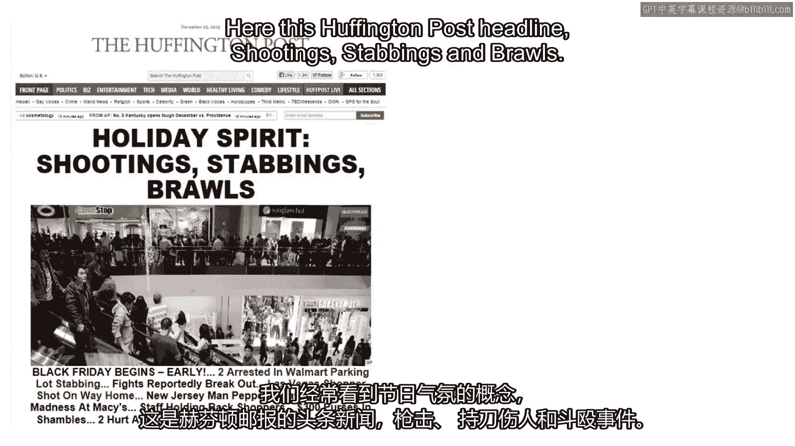
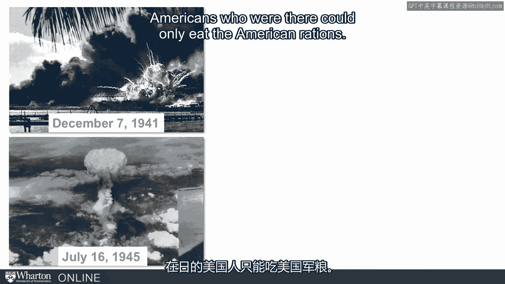
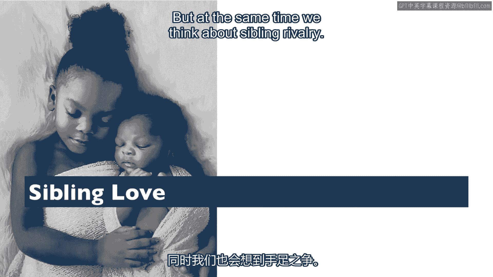
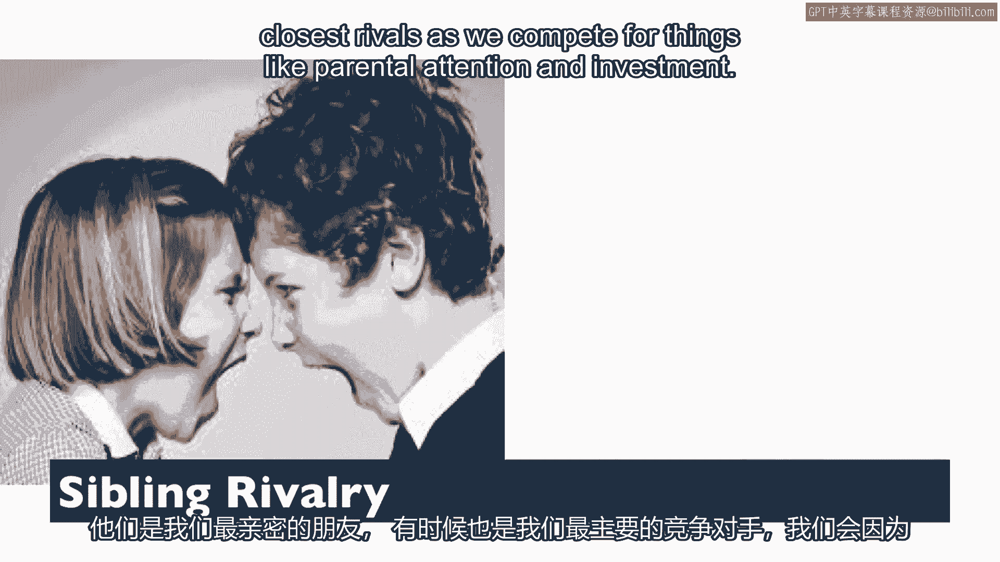
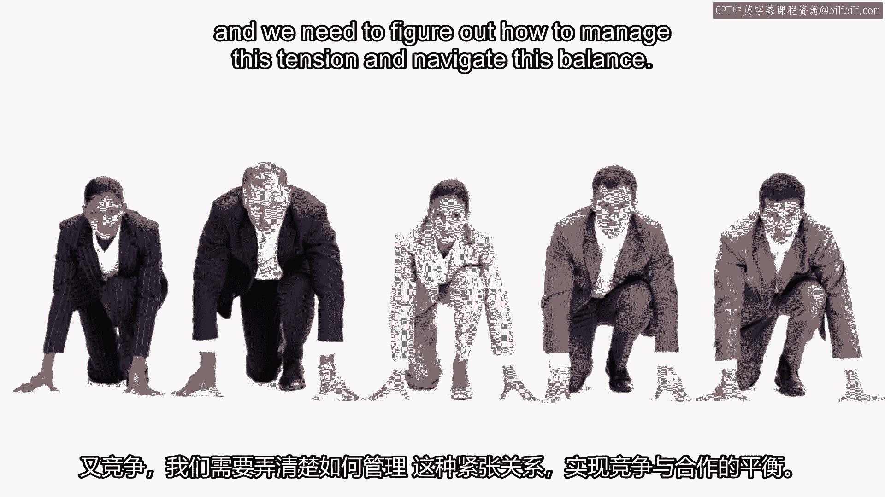

# 沃顿商学院《实现个人和职业成功（成功、沟通能力、影响力）｜Achieving Personal and Professional Success》中英字幕 - P29：1_合作与竞争之间的微妙界限.zh_en - GPT中英字幕课程资源 - BV1VH4y1J7Zk

 The line between cooperation and competition is surprisingly thin。

 As an example， think about what happens in Thanksgiving。

 We have black Friday sales here in the United States that really trigger the holiday season。

 and sometimes you see huge crowds， mob stores， in anticipation of a great sale。

 So outside of these stores， here's one mob that was mobbing a store。

 People often end up in fistfights。 One particularly sad occasion when black Friday really took on a different term was in 2008。

 in upstate New York。 There was a crowd of people that had gathered outside of a store。

 They were literally chanting， "Tear the doors down， tear the doors down。"。

 Eager to get into this store。 Well， the employees had formed a human chain trying to hold the shoppers back and as the。

 customers stormed into this store， they literally took the doors off the hinges and they ended。

 up trampling Jay Dittmar to death。

 Now many of the employees end up scampering up on vending machines trying to get out of， the way。

 People were injured and in one case killed。 Now what's ironic here is that the Thanksgiving holiday celebrates cooperation。

 We think about the historic cooperation between the early American settlers and the Native。

 American Indians。 And here we celebrate this time of family and cooperation and yet we juxtapose this with。

 these sales and often a big， mad rush that creates a lot of conflict。

 And the ciccation in 2008 and that early photo that I showed you before is not an isolated。

 incident。 We routinely see this idea of holiday spirit here， this huffeting post headline。

 shootings， cabins and brawls。

 And then here in other cases， people actually stealing from each other trying to get the。

 best deals。 So what I want to think about is how we navigate this tension。

 What pushes us from cooperation to competition or from competition to cooperation。

 And this Thanksgiving example， we have the cooperative meal and then this competitive。

 dash for these holiday sales。 But I think a more dramatic example of a shift from competition to cooperation is represented。

 in the relationship between the United States and Japan。 As we all know。

 the conflict in World War II was intense。 Here this is a photo of firebombing in 1941。

 We had intense conflict， the United States firebomb 67 Japanese cities in addition to。

 dropping two atomic bombs， culminating in 1945。 And the Japanese ultimately surrendered。

 So the conflict between the United States and Japan could not have been more intense。

 And yet immediately after that conflict， there was a pivot to cooperation。 And General MacArthur。

 when they took over in Japan， shifted immediately to cooperation。

 made it illegal for any American to strike a Japanese person， even made it illegal for。

 Americans to eat Japanese food because there's such a food shortage on Japan， Americans who。

 could only eat the American rations。

 Now we move forward。 We ended up cooperating， rebuilding factories。

 And here you see this cooperation through the 1950s， culminating in this declaration of。

 cooperation signed in 1960。 And today you'd be hard pressed to find citizens that are more pro-U。S。

 than those in Japan。 So we see this remarkable shift from competition to cooperation。

 Now this happens not just on the global stage， not just in terms of shopping malls， but it。

 happens in our most intimate relationships within about parenting。 Parenting。

 you think you can't be more intimately cooperative with someone other than your partner。

 and think about the cooperation that goes into raising a child。 And yet even with raising a child。

 there's competition。 There's competition with your spouse of who's going to sleep。

 who's going to change or feed， the baby。 And we have competition even within our most intensely cooperative relationships。

 So the idea is that we shift between cooperation and competition and we often balance cooperation。

 and competition even in our most intense relationships。 Now think about siblings。 So with siblings。

 we often think about sibling love。 But at the same time we think about sibling rivalry。

 Now here's one example of sibling love。 We think about it with humans。

 but it turns out the ground squirrel teaches us something， really important about siblings。

 Ground squirrels are actually incredibly altruistic。 When a predator is nearby。

 say a bird overhead or another large animal， ground squirrels will。

 screech to warn others to get out of the way。 Now by screeching。

 they're drawing attention to themselves。 It makes them， it puts them at risk。

 it makes them vulnerable to some attack。 As scholars have looked at the volume with which ground squirrels screech。

 it turns out， they screech loudest when a predator is near their sibling。

 So we see sibling love even among ground squirrels。

 And so we have this incredible relationship with our siblings。

 And yet sibling rivalry can be incredibly intense。

 These are our closest friends and also sometimes our closest rivals as we compete for things。

 like parental attention and investment。 For twins， it starts particularly early， even in the womb。

 twins start competing for， resources。 Now more generally we think about collaborating at work。

 We need to collaborate with our colleagues at work to accomplish joint goals。

 But then we're also competing for things like recognition， promotion and raises。

 So both at home and at work， we're both cooperating and competing and we need to figure out how。

 manage this tension and navigate this balance。

 So the idea is that we're competing and cooperating all the time and often within the same relationships。

 at the same time。 [BLANK_AUDIO]。

