# 沃顿商学院《实现个人和职业成功（成功、沟通能力、影响力）｜Achieving Personal and Professional Success》中英字幕 - P30：2_合作与竞争的三大原则.zh_en - GPT中英字幕课程资源 - BV1VH4y1J7Zk

 I want to think about three principles that cause us to shift between cooperation and competition。

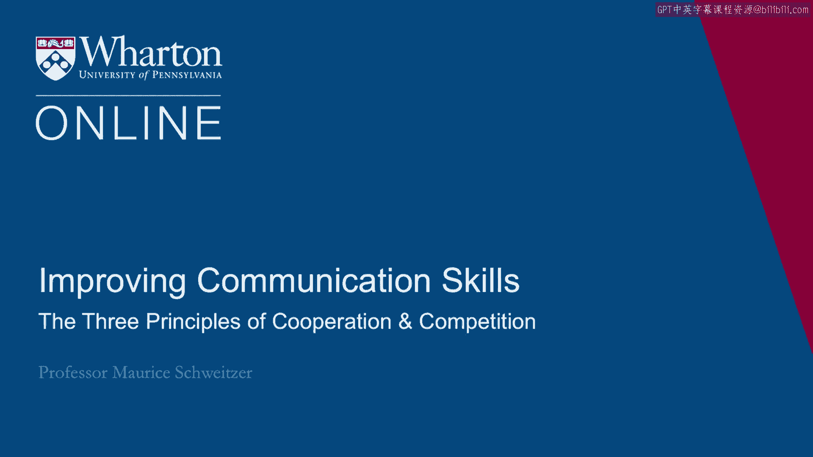

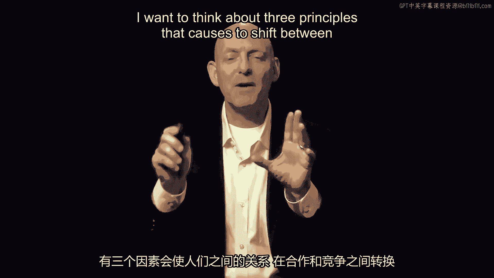

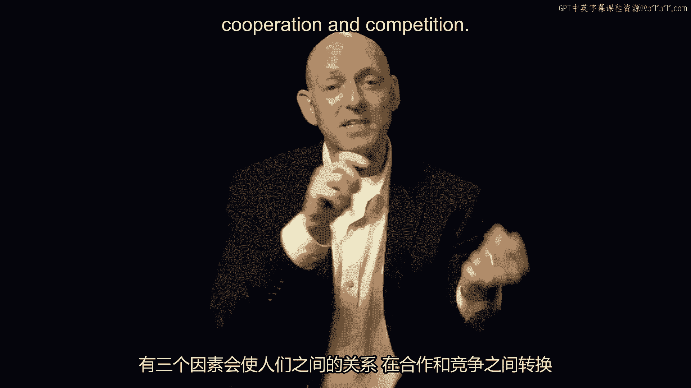

 They transform us from friends to foes and back again。

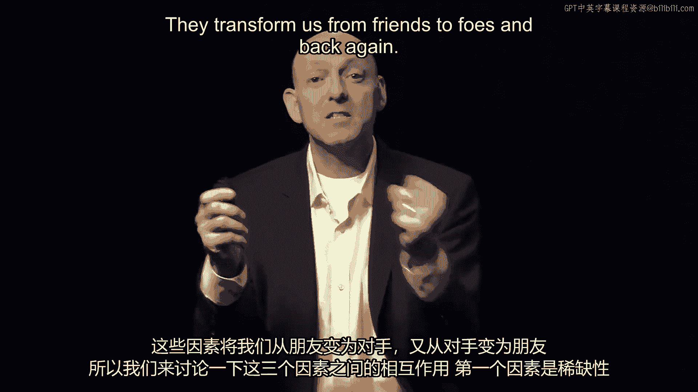

 So we think about the interplay of these three principles。

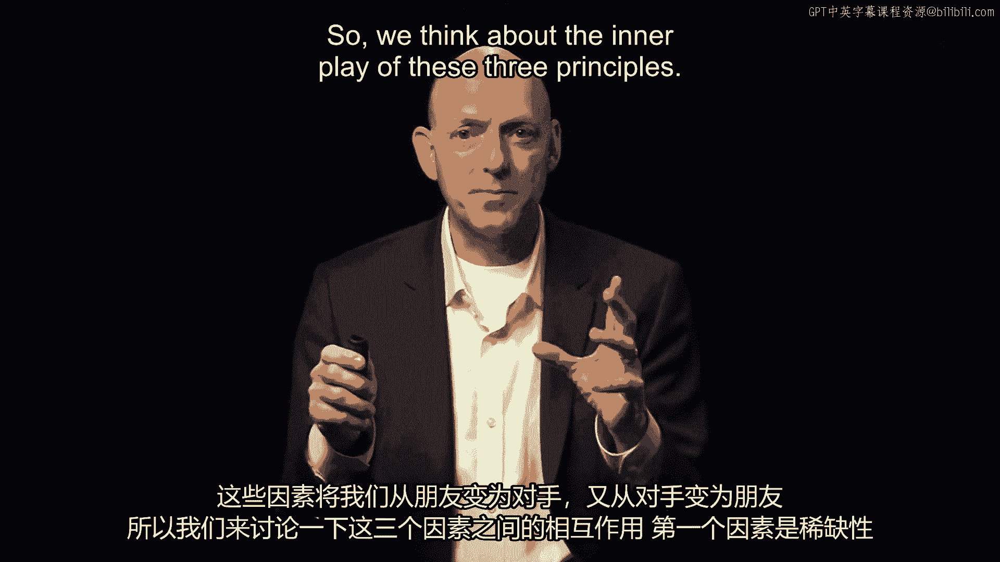

 The first principle is scarcity。 The resources in our environment can either be scarce or plentiful and that's what drives。

 us from friend to foe。 We think about scarcity and this is exactly what happened in Thanksgiving。

 So Thanksgiving with this feast we have abundant resources and we're celebrating a cooperative。

 event。 But then we go out into the marketplace and these scarce deals cause us to compete fiercely。

 for these scarce resources of low price TVs and other things。

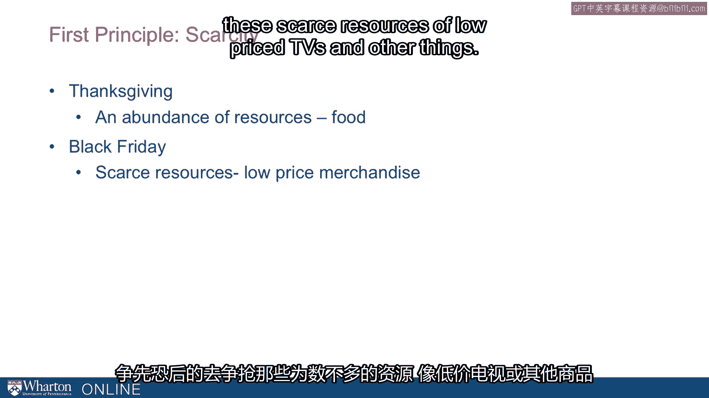

 Now we see scarcity not just in humans shifting up to cooperation and competition but in studies。

 of animals we see the same thing。 A study of Grevy Zebra's found that the zebras actually behave differently as a function。

 of how much water was available in their environment。

 When water was abundant they formed one type of collectives and when water was scarce they。

 formed a very different kind of collective。 That is their social relationships shifted dramatically as a function of how scarce this。

 very precious water resource was。

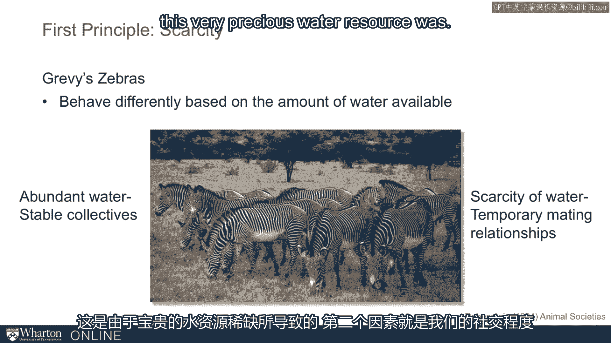

 Now the second principle is how social we are。 We're inherently social beings。

 The crave companionship in fact one of the worst forms of punishment is solitary confinement。

 After just a few days the human mind begins to decay in solitary confinement。

 People experience hallucinations， spasms of anger， malaise and apathy。

 We both crave human contact after being in solitary confinement and we're also unfit， for it。

 The human mind needs to be socially connected。

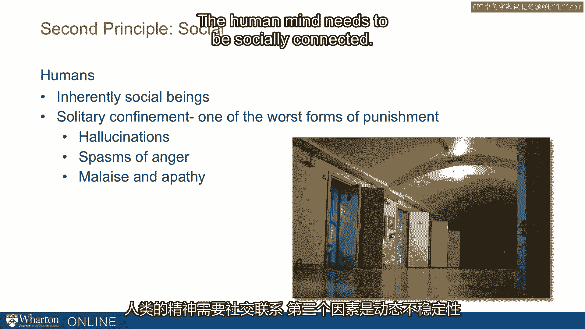

 The third principle is dynamic instability。 The world around us is stochastic， it changes。

 it's unstable。 Just like the stock market things are shifting all around us and we need to quickly change。

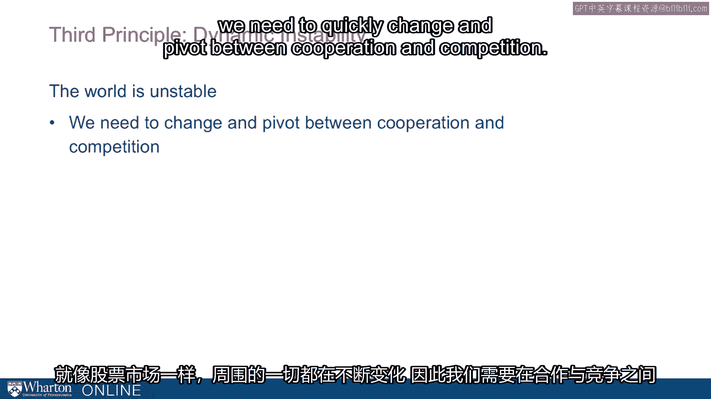

 and pivot between cooperation and competition。

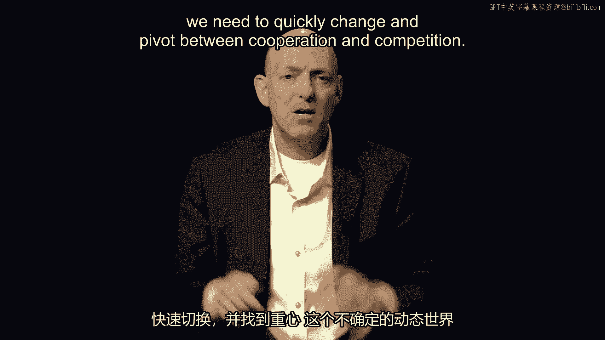

 So this unstable and dynamic world as we learn new information we try to gather new information。

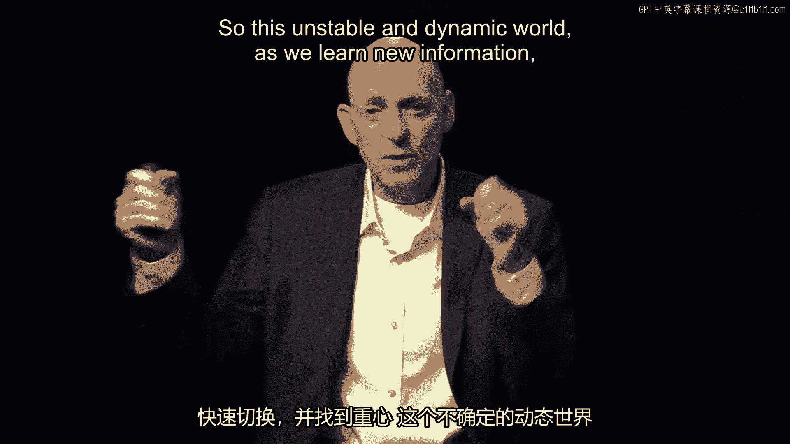

 it causes us to both cooperate and compete。

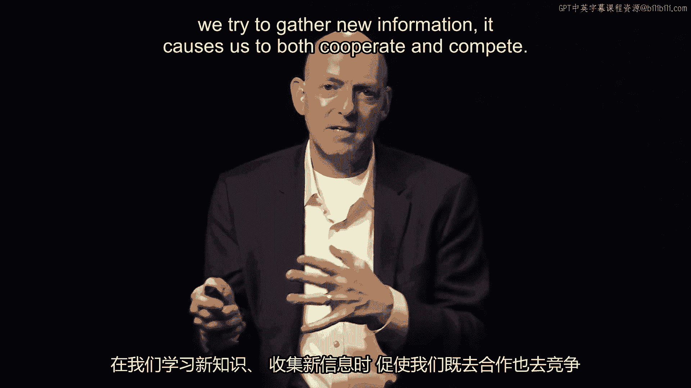

 And it's really the interplay between these three principles。 Scarcity。

 the sociability and dynamic instability that causes to pivot back and forth between。

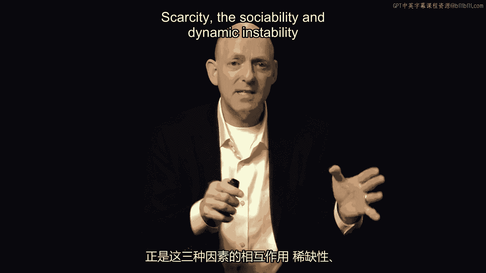

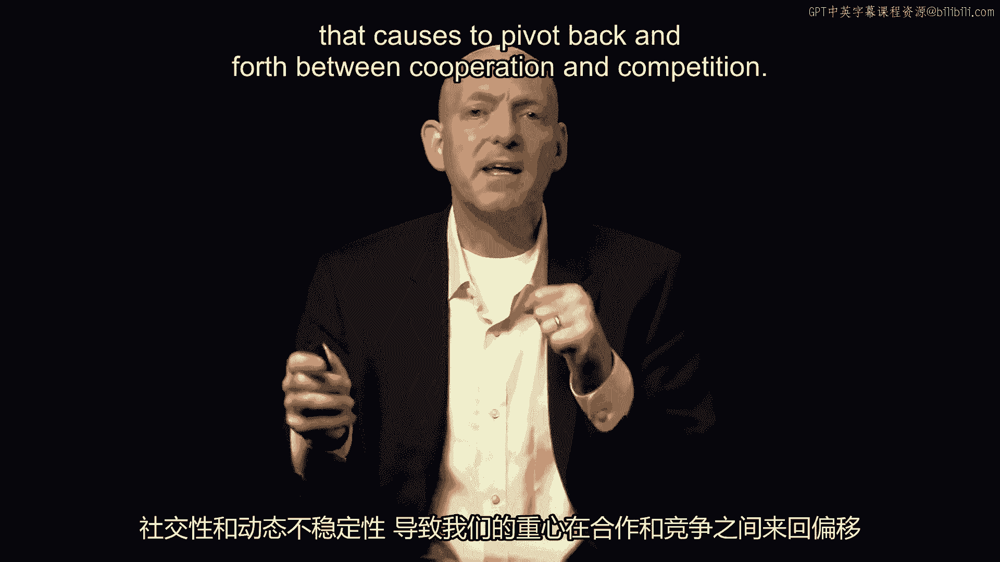

 cooperation and competition and sometimes we're engaging in both at the same time and。

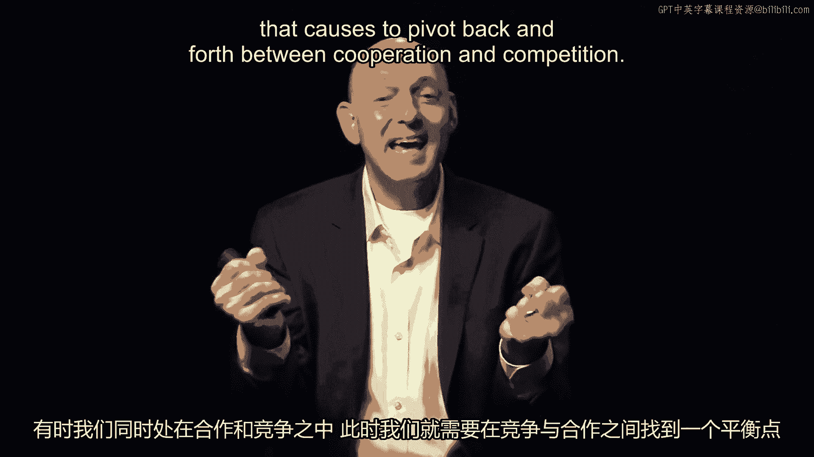

 we need to find our balance as both competitors and collaborators。

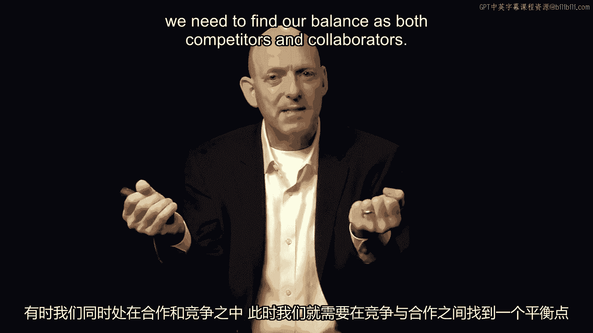

 [BLANK_AUDIO]。

