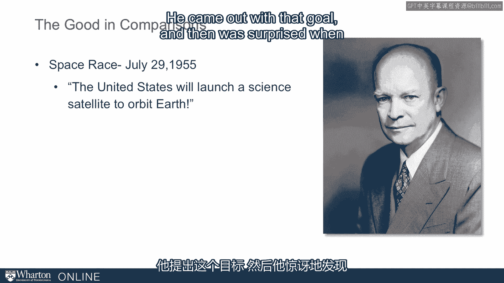
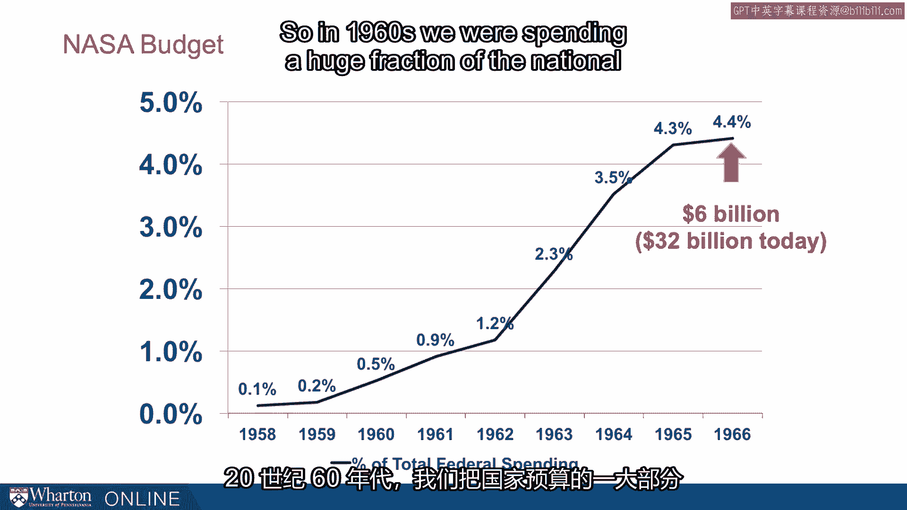
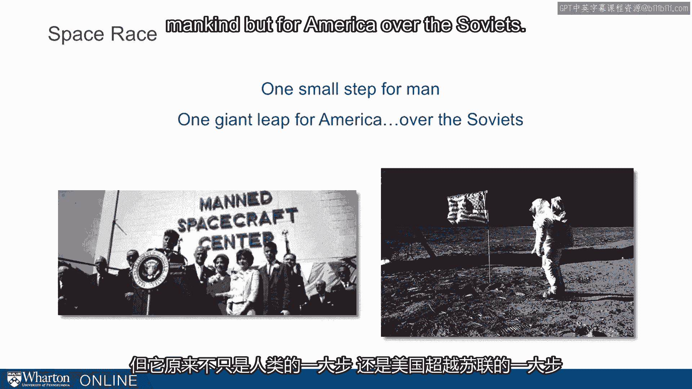
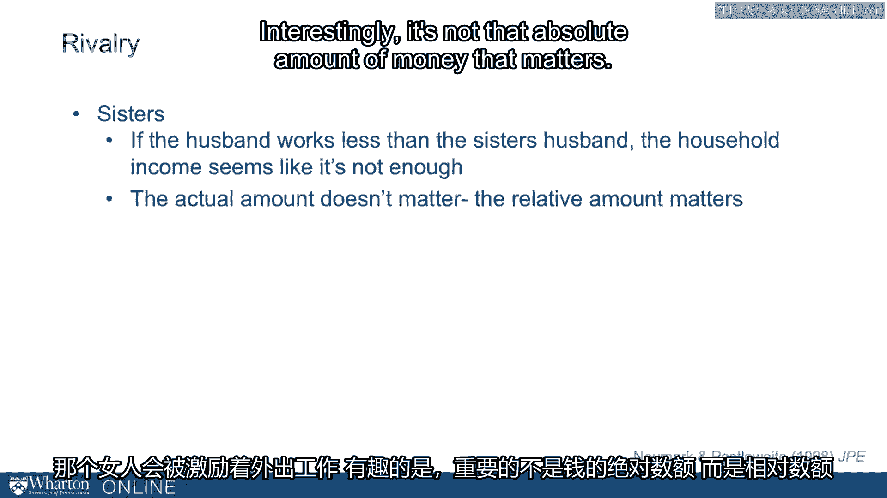

# 沃顿商学院《实现个人和职业成功（成功、沟通能力、影响力）｜Achieving Personal and Professional Success》中英字幕 - P33：5_比较与动机.zh_en - GPT中英字幕课程资源 - BV1VH4y1J7Zk

 I want to think about some of the consequences of comparisons。

 And here I want to focus on the way comparisons can actually lead to very good outcomes and。

 I want to focus on the link between comparisons and motivation。

 So here's one of the things that can be very good and constructive about comparisons。

 Now start off with a story about a Duke Michigan game。 Duke was down by one point at half time。

 You can imagine what happened in that locker room。

 You can think about the motivational speech the coach might have given them。

 Duke came out roaring in the second half。 They exploded and what had been a really intense close game became a blowout。

 It turns out it wasn't unique to this Duke Michigan game。 It turns out that if we looked at 18。

000 NBA games， which Jonah Berger and， Denovent Pope did， they analyzed over 18，000 games and。

 they found a discontinuity where teams down by one point at the half were actually。

 more likely to win。 And that is in general if one team is winning by a lot。

 they're likely to win the game。 So if you're ahead at the half time。

 it generally helps predict who wins at the end of， the game。

 except for if you're down by just a very little bit。 Because when you're down by a very little bit。

 you're motivated by that comparison and that motivates you。

 it increases effort and people down by one at half time are actually more likely to win。

 Now， here we find that it's not just in sports， we can see this on the global stage。

 we think about the space race。 Now if we're to go back in the space race。

 we're to go back to the 1950s。 And in July 1955， Eisenhower came out and said。

 the United States will launch a science satellite to orbit Earth。 That was his goal。

 He came out with that goal and then was surprised when the US wasn't the first。

 to launch a satellite， but the Russians were。 We were in a space race with the Russians and Russians launched Sputnik and。

 that Sputnik crisis has actually carried forward for decades。

 And we still invoke Sputnik to think about how we're falling behind and need to catch up。

 So here the US felt like they were behind and needed to catch up。

 And it motivated an incredible government action。 So we had the National Defense Education Act。

 it led to scholarships， Narpa， NASA， we invested an incredible amount of money。

 The NASA budget alone took off。 You see this budget growing incredibly。

 where at the time it was $6 billion， today that would be $32 billion。 So in the 1960s。

 we were spending a huge fraction of the national budget just on a space budget。

 If I were to ask， what's the right amount to spend， it's hard to tell。

 But we knew that we were falling behind and in that comparison。

 by comparison we were down relative to the Russians。

 they had launched Sputnik to orbit Earth before we did。

 And that motivated us because of that comparison。 And it challenged us in a motor race to accomplish great things。

 So we can think about if we were to recast this one small step for man。

 but it turns out to be one giant leap， not just for mankind， but for America over the Soviets。

 Now， social comparisons matter in a lot of cases， but no more so than in rivals。

 Rivals are special comparisons。 Rivals are people with whom we have an extra psychological rivalry。

 We get a benefit from beating a rival in a way we don't with anybody else。 And in fact。

 Gavin Kildoff has studied rivals in running races， analyzed lots and lots of rivalries。

 and found that runners run faster， when they have a rival in that race。

 So if you're racing against a close rival， you're likely to get a better time。

 It's not just runners， we find this in many different contexts。 And here。

 for those of you that are big basketball fans， you'll remember the Larry Bird Magic Johnson rivalry。

 And here， Larry Bird said， the first thing I would do every morning。

 was look at the box scores to what Magic did。 I didn't care about anything else。

 This is intense focus， intense focus on a rival。 So here， we can see and think about motivation。

 And I already alluded to the Tar Heels and Blue Devils before。

 These are rivals that are in close proximity to each other。

 Both of them have won national championships。 And to win a national championship。

 you need a lot of things。 You need good coaching。 You need great players。

 You also need a lot of motivation。 And what you see is here in '92， Duke wins in '93， UNC wins。

 Now that would be remarkable if it happened once。 But then you see the reverse happening in 2009。

 UNC wins， and then Duke wins the following year。 So here， we can see rivals motivated。

 highly motivated by each other。 Now， it happens in all kinds of relationships。

 If you look at sisters， a study of sisters where one's in the labor force and one stays， at home。

 one of the things that drives whether or not one of these women works outside the。

 home is how much their husbands make。 And we find that if the husband earns less than the sister's husband。

 that household income， seems like it's not enough。

 and that woman is motivated to work outside the home。 Interestingly。

 it's not the absolute amount of money that matters。

 It's the relative amount that really matters。 So here's the broad idea。 That is。

 comparisons can motivate us。 And in many cases， it can be very constructive motivation。

 But when you think about it in check， that is not all that motivation is good。

 And we'll think about some of that next。 [BLANK_AUDIO]。

