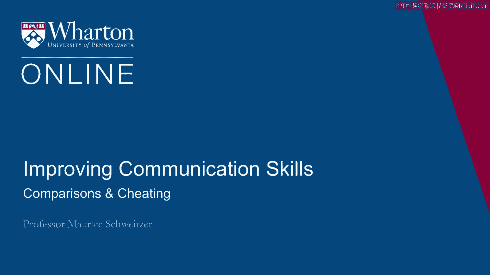
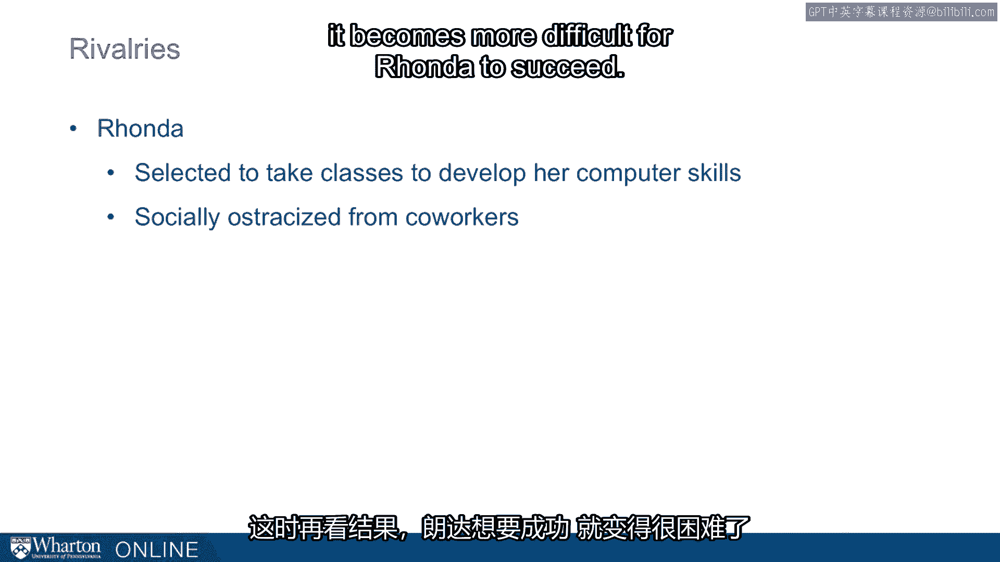

# 沃顿商学院《实现个人和职业成功（成功、沟通能力、影响力）｜Achieving Personal and Professional Success》中英字幕 - P34：6_比较与作弊.zh_en - GPT中英字幕课程资源 - BV1VH4y1J7Zk

 It turns out that comparisons can only make us miserable。

 They can also motivate us to engage in behavior we really shouldn't be engaging in。

 Let's think about two skaters， Nancy Kerrigan， who in 1992 was the Olympic bronze medalist。

 and Tanya Harding， the only American to have ever landed a triple axel in competition。

 The two arrivals competing for spots in the US Olympic team。

 They both trained incredibly hard and yet something terrible happened。

 It was termed the whack heard round the world。 A man came up and after practice came up to Nancy Kerrigan and with a pole whack turny。

 growing out of practice for weeks。 It turns out it wasn't just anybody。

 It was somebody that Tanya Harding had hired to take out Nancy Kerrigan。

 So not only were they competing by working extra hard， they're also competing by trying。

 to pull somebody else down and comparisons can motivate unethical behavior。

 Let's talk about a different rivalry。 This is a rivalry between Virgin and British Airways。

 where British Airways invested heavily。 They supported the London Eye and then Branson paid to have a blimp fly over London with。

 the words be a can't get it up。 Taunting British Airways。

 This rivalry ended up spilling over not just to trash talking and constructive competition。

 but it ended up British Airways was hacking into Virgin System， looking at their reservations。

 engaging in unethical practices to try to steal customers away in a way that ended up。

 getting them in real trouble。 Now it happens broadly that is in a study of professional soccer rivalries that Adam。

 Galinsky and others have done。 They found that in analyzing matches and these are matches between soccer teams playing。

 in other cities as well as co-located cities that is teams that are both have home teams。

 in that match。 Those are likely to be the most intense rivals because of the co-location and there they found。

 more yellow and red cards a measure of unethical behavior。

 Here's another example and this involves something a little bit closer to my heart， academics。

 Academics we try to publish articles， but the publication process takes a long time。

 In the meantime we can upload our articles onto the web and there are websites that track。

 how many times articles have been downloaded。 When articles have been downloaded a lot of times it means or suggests that articles。

 really important and in fact a lot of our peers look to see how often articles have been。

 downloaded to see if that's something we should be reading， something we should be paying。

 attention to and we use as a measure of what's important。

 It turns out the one really funny thing about that as a measure of importance is that sometimes。

 you can manipulate these numbers。 You can for example download your own article and in fact some faculty have even written。

 programs to download their own article。 Now who would do that？

 Well it turns out comparisons help us understand that。

 So when you have peers who have high download counts that's actually an important factor。

 in determining how tempted and how likely you might be to download your own article。

 And there are also some reference points and goals that matter too if you're close to reaching。

 the top 10 that also is more likely to push people to engage in this kind of behavior。

 We can think about this more broadly。 So this is a story about Rhonda。

 She was selected from a pool of people in her company who seemed to have great promise。

 and she was selected by a manager to take additional classes， develop her computer skills。

 she was being groomed for promotion。 Now this is exactly what companies should be doing that is we should be looking to look。

 at the people who have promise and we should develop them for promotion。

 But there's a comparison problem and here's that problem that is her coworkers looking。

 around are engaging in comparisons and they're engaging in comparisons they don't like。

 She began ostracizing her， not inviting her to parties， not passing on messages to her。

 So her work was suffering and here as a result it becomes more difficult for Rhonda to succeed。

 and it's also less pleasant for Rhonda。 It's like being the employee of the month that nobody wants to talk to and here in some。

 cases it could be people like Rhonda to take their foot off the gas and end up investing。

 less effort because they don't want to be that teacher's pet that employee of the month。

 or that selected employee。 So when you think about how some of these comparison processes can actually erode the。

 very behaviors we're actually looking to accomplish。

 Now this tells us that comparisons can make us not just miserable but they can also increase。

 cheating。 [BLANK_AUDIO]。

