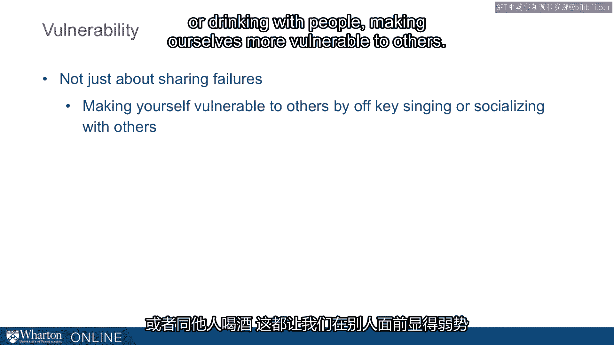
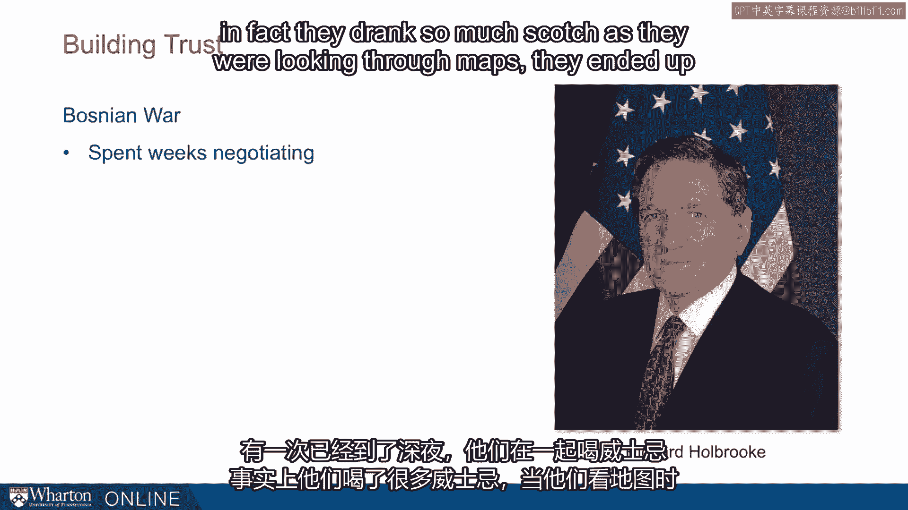
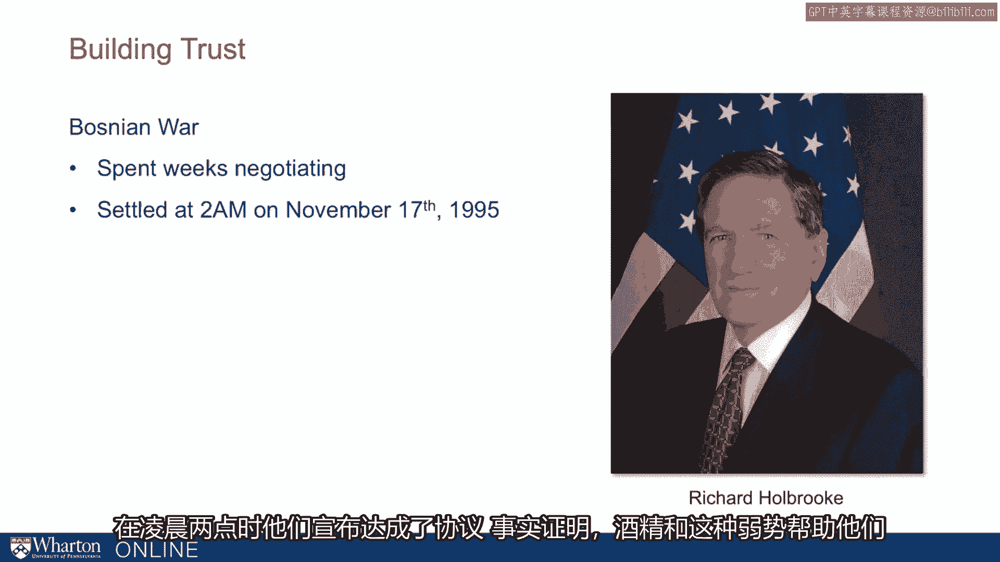

# 沃顿商学院《实现个人和职业成功（成功、沟通能力、影响力）｜Achieving Personal and Professional Success》中英字幕 - P37：9_建立信任-脆弱性.zh_en - GPT中英字幕课程资源 - BV1VH4y1J7Zk

 We often think that once we trust somebody， we can become vulnerable， but it turns out。

 that becoming vulnerable is one key ingredient for actually building trust。

 And I'll start off with an example of somebody that wasn't trusted and whose trust was hard。

 to build。 Her Elizabeth Patrakis just days before her wedding was asked to sign a prenuptial agreement。

 and her husband had a large real estate holding， and she was guaranteed in this prenuptial。

 agreement $25，000 a year for every year they were married。 Now in her words。

 this prenuptial agreement was a thorn in her side， and this is one。

 of the things that led to her divorce。 So here prenuptials demonstrate low trust。

 and that represents a lack of vulnerability， and that's an impediment to building trust。

 It turns out we can actually make ourselves more vulnerable， and when we do that we can。

 actually end up building trust。 And one way that we can do this is through pratfalls。

 By doing things like spilling coffee or spilling pens， we make mistakes that make us seem warmer。

 more approachable。 Now we have to balance that with competence。 So here's a question。

 Who do you trust more？ Someone who spills coffee or someone who doesn't spill coffee？

 Now we might think， hey， why would I trust somebody who's demonstrated lower competence？

 And it turns out that by spilling coffee we demonstrate a humanity， a humility， a vulnerability。

 that can make us more likable。 And in fact， this is exactly the study that was done a couple of decades ago with students。

 preparing for a quiz bowl competition。 And here's the important twist。

 It turns out the person who's demonstrated high competence， who gets these questions， right。

 and then spills coffee， is the most liked。 If you're not very competent。

 then spilling coffee doesn't really help。 Now it turns out this exact problem is the one that psychiatrists face。

 In a very short period of time， they need to walk into a room and gain the trust of someone。

 to spill their innermost secrets。 Now to spill those innermost secrets。

 it turns out it helps if they spill coffee or spill their， pens or tell a bad joke at the beginning。

 And this demonstration of warmth is exactly what people are trying to do， whether it's。

 Obama getting a dog， Ron Klein talking about his son， or the rest of us making some mistake。

 or disclosure。 Now vulnerability is not just about sharing failures。

 but it can also be done doing things， like off-key singing as we might do in karaoke or drinking with people making ourselves more。

 vulnerable to others。 Now I'll talk about drinking in a much more serious context。

 And here we're going to take us to the Bosnia War， where Milosevic was in the midst of a。

 war and the US worked very hard to try to negotiate a peace。

 Now here they pulled the lead people out to Dayton， Ohio， and Milosevic faced off one。

 of the great negotiators of all time， Richard Holbrooke。

 So Holbrooke negotiated and they spent weeks negotiating and it was late into the night。

 they were drinking scotch and in fact they drank so much scotch as they were looking。

 through maps they ended up naming one of the corridors scotch road as they partitioned the。

 former Yugoslavia。

 Now they announced that here we found our road scotch road and it soon the morning they。

 announced a deal。

 It turns out this alcohol， this vulnerability helped them bridge that gap gain trust to。

 reach a deal but there's a downside。 Milosevic here wasn't thinking through the full range of consequences and shortly after。

 this he ends up getting pulled to the Hague and prosecuted for warm crimes。

 So when we think about building trust， vulnerability is actually really important。

 By making mistakes like spilling coffee or spilling pens we demonstrate that vulnerability。

 but we can do it by self-disclosure or admitting failures but there's a risk that when we demonstrate。

 vulnerability we could like Milosevic not think through all the different consequences we should。

 be thinking about or you want to think about making sure you don't demonstrate vulnerability。

 or self-disclosure in a way that harms your credibility。

 So a psychiatrist can spill pens and say I've never been very good with my hands but a surgeon。

 can't。 [BLANK_AUDIO]。

