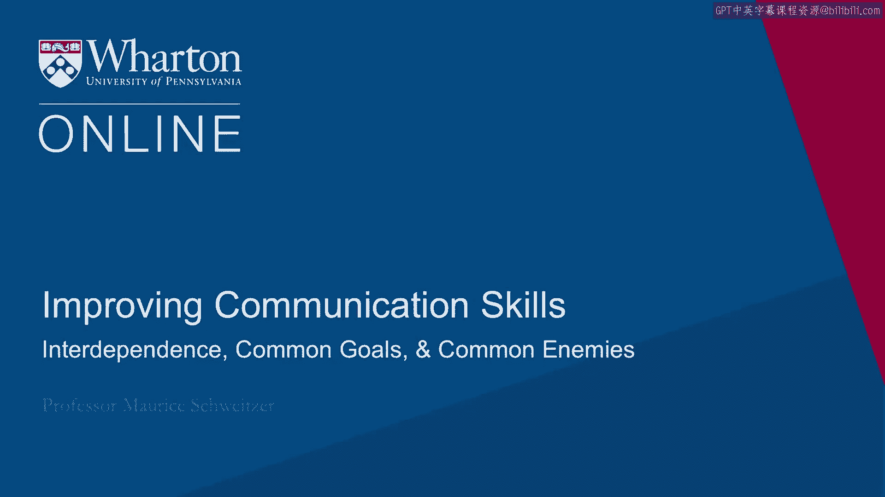

# 沃顿商学院《实现个人和职业成功（成功、沟通能力、影响力）｜Achieving Personal and Professional Success》中英字幕 - P39：11_建立信任-相互依存、共同目标、共同敌人.zh_en - GPT中英字幕课程资源 - BV1VH4y1J7Zk

 Common goals play a profound influence in building trust。

 Part of this comes from interdependence。 When we rely on each other， we end up building trust。

 Now there's something interesting that Tatchfeld found in the 1970s where just even nominal。

 groups in these experiments assign people to a blue group or a red group and just calling。

 them red or blue cause people to favor their group trusting their group members more than。

 they trusted our group members。 Here's what's profound。 If we do this with nominal groups。

 that is you've only been part of the red group for。

 five minutes and doesn't have any particular meaning， you could imagine what it means when。

 we think about things in terms of a tribe， a religion or a country。

 That is the groups that were in profoundly influence how we treat both the in-group and。

 the people outside of our group。 Some great work that Tae Cohen has done looked at loyalty within groups and from the more。

 loyal we are to our group members， the more we're accepting of warfare and violence against， others。

 So there's something profound about how we think about and how we identify what is our。

 group and what is somebody else's group。 Now one thing that can influence how we think about our group membership are common enemies。

 And when we have common goals they bind us together and there's nothing quite as profound。

 as a common enemy in doing that。 We saw after 9/11 Pakistan and the United States grow far closer。

 There's that hadn't been well aligned before， began to coordinate incredibly closely on。

 security issues afterwards。 And it's not just these two countries。

 you think about Russia and France after attacks， in the Middle East。

 how they changed their dynamics。 And we see this in modern politics but the same has been true for a long period of time。

 in the past。 So we saw for example the formation of the United States was profoundly influenced by。

 this sense of group where initially in the French Indian War the British were fighting。

 against the French and the British used the colonists to fight against the French。

 This is the first time the colonists had actually acted together and in concert and the British。

 ended up training all the colonists including somebody named George Washington。

 And here the George Washington actually fought against the French。

 The dynamics completely changed just a couple years later when it was in the American Revolutionary。

 War George Washington again used the colonists as a collective， that group of colonists， they're。

 fighting against the British and who helped them。 Well the French jumped right in because the French were so eager to now fight the British。

 So we see these shifting sands of competition where we think about the groups and these shifting。

 alliances between groups and one of the profound ideas here is that common enemies can help。

 us find superordinate goals and these superordinate goals are what drive us together。

 So we can think about competing with some other outside competitor， some other outside enemy。

 or if we think about something that we need to tackle together like solving a problem for。

 our organization or solving an environmental issue together those superordinate goals turn。

 out to be incredibly important in helping us build trust。

 In summary I want to think about the building blocks for trust and so across this module。

 we've thought about warmth and competence， we want to demonstrate high warmth and high。

 competence but we also want to think about vulnerability if we've demonstrated competence。

 vulnerability can help us demonstrate warmth。 The communication process is very important and we can have trust in institutions that can。

 in some cases substitute for trust in individuals。

 So for example we might trust a contract we signed if we don't trust the person as much。

 And reputations have helped us solve a lot of our key problems we used to think about。

 gossip as a tool for building reputations but now we think of online reputations being。

 incredibly important。 And then the common goals we have bond us together and help us build trust。

 [BLANK_AUDIO]。

