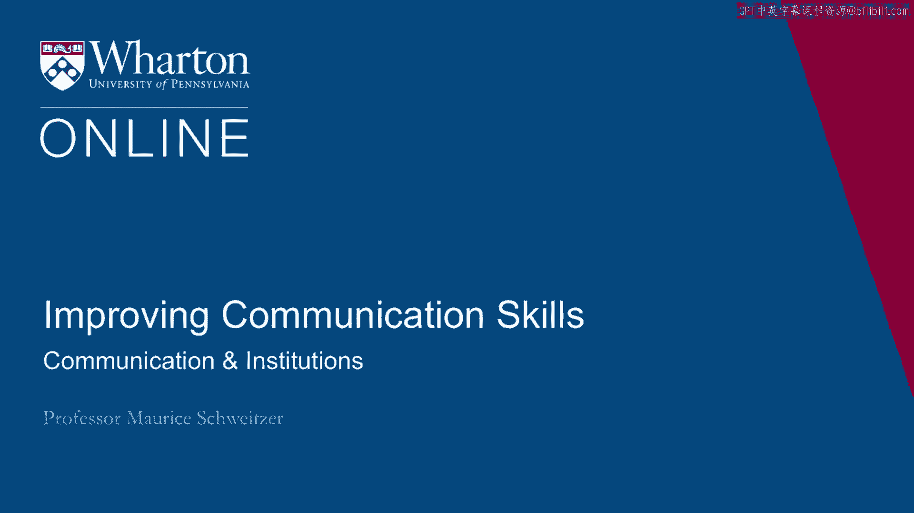
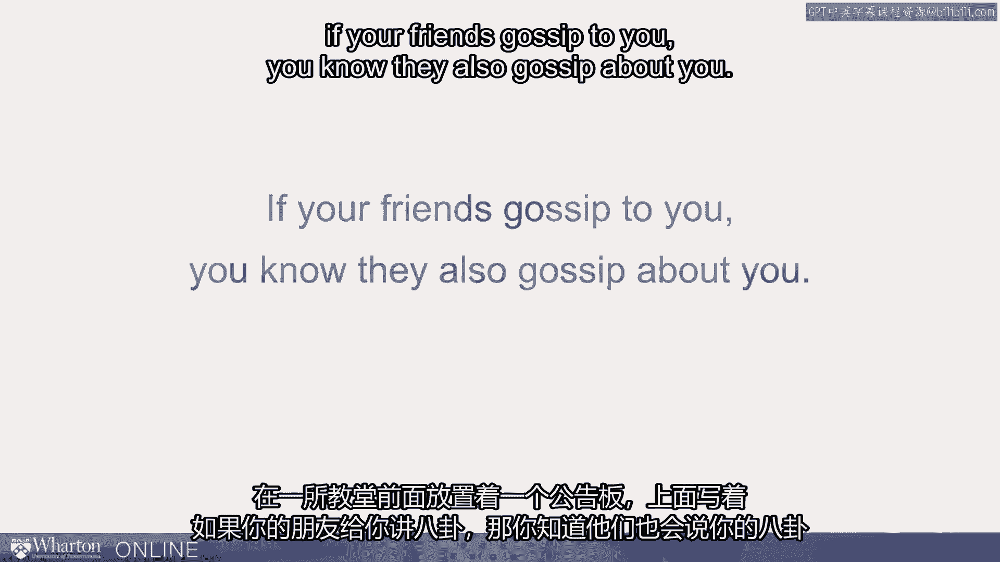

# 沃顿商学院《实现个人和职业成功（成功、沟通能力、影响力）｜Achieving Personal and Professional Success》中英字幕 - P40：12_建立信任-沟通与制度.zh_en - GPT中英字幕课程资源 - BV1VH4y1J7Zk

 I actually want to think about communication and institutions as we build trust。

 When it comes to communication， one of the key ideas is to make sure our words match， our deeds。

 I'll tell you a story about 2008 when the three big American car manufacturers came， to Washington。

 DC asking for federal loans。 They were asking for $25 billion in loans and it came out that all three of them。

 the， three CEOs who came to DC， had all flown on separate corporate jets。

 Now this is how they usually traveled。 It just seemed incongruous to say we desperately need money when they'd flown separately on。

 their private jets。 And so the next time they came for their second trip。

 they went in hybrid vehicles。 You want to think about how your words match your deeds to affect the most trust。

 Another key idea about communication is you want to communicate as equals。

 And by communicating as equals， what that means is that we show up on time。 That is。

 we're not signaling that our time is more important than somebody else's。

 And we can minimize other differences like in the seating， in the clothing and so on。

 So language matters， not just in how we communicate， but the terms that we use。

 There was a study that was done that Varda Lieberman did looking at the same economic。

 incentives but calling it the community game versus the Wall Street game。

 It turns out with the same incentives， people cooperated far more in the community game。

 than they did in the Wall Street game。 And they call somebody a partner versus an opponent。

 When you call an employee a team member versus an employee， you're triggering a different。

 mindset and that mindset shifts the way we relate to each other。 It's not just in language。

 I talked about deeds before。 And that's manifest in how we sit。

 So when we're sitting together on the same side of the table， that seating， we're tackling。

 a problem together communicates an idea that we're working together and that can help， build trust。

 It's not just in communication or think about institutions。

 So we can trust other people but we can also trust institutions like the court system。

 And the way we trust the court system has profound consequences。

 We often have this reverence for institutions but they're not universally shared throughout。

 the world。 I want to tell you a story about Alton Logan and I've put up a picture here of Andrew Wilson。

 to suggest that the two of them， you have to imagine 20 years earlier， they look pretty， similar。

 It turns out there was a shooting in 1982 in Chicago to McDonald's。

 It was a chaotic crime scene and there was eyewitness testimony and that testimony was。

 enough to convict Alton Logan。 There was one problem。 Alton Logan wasn't even there。

 He had nothing to do with that shooting。 It was Andrew Wilson。 Now making matters worse。

 lawyers for Andrew Wilson representing him for another crime and， he does。

 she committed other murders。 Andrew Wilson admitted to his attorneys that he had committed that murder in the McDonald's。

 Meanwhile Alton Logan was convicted and remained in prison。

 The lawyers begged Andrew Wilson to come clean。 He was after all already convicted of murder。

 Wouldn't he confess to that crime too？ Alton Logan they knew was wrongfully imprisoned。 However。

 there's a problem。 In the United States we have attorney client privilege。

 The attorneys couldn't laterally disclose that information。 They would harm their client。

 Information that was disclosed in secret。 This principle is important because to get the best representation we need to ensure。

 that criminals or suspects can disclose information to their lawyers without the fear。

 of having that being used against them。 That's an important principle and it turns out that principle guided the lawyers behavior。

 They actually wrote an affidavit but they sealed it away。

 They hid it away and Alton Logan was in prison for 26 years。

 It was only after Andrew Wilson died in prison they came forward and disclosed that information。

 and Alton Logan finally went free。 Here's the most amazing part about the story。

 His aunt on receiving him said they did what they had to do。

 Demonstrating an incredible reverence for this institution。

 Now I want to think about institutions in other ways too and here's a funny institution。

 It's the institution of gossip。 Here's a billboard that was put in front of a church that read "If your friends gossip。

 to you， you know they also gossip about you。"。

 Now we think that gossip gets a bad rap。 Gossip of course has some very negative characteristics but it does other things too。

 It helps us communicate what the norms are， what expected behavior is。

 It communicates information about reputations。 Now gossip isn't a great thing but it actually helps us police behavior in a more profound。

 way than we typically acknowledge。 We've now begun to formalize that with rating systems。

 So if I ask you this question， would you let a complete stranger sleep in your home？

 And the answer turns out to be a resounding yes and we've solved that with rating systems。

 and if you were to look at Airbnb's website they have a website devoted to trust throughout。

 their materials they talk consistently about trust and they find that people are in fact。

 incredibly trustworthy and their rating system makes a profound difference。

 And the same is true of other key questions like would you let your kids drive in a car。

 with someone you don't know and the answer here again is yes and Uber's figure this out。

 again with rating systems that help us trust other people。

 And this is true with eBay and other electronic commerce sites that have figured out that。

 reputations can be effective in helping us solve the trust problem。

 [BLANK_AUDIO]。

