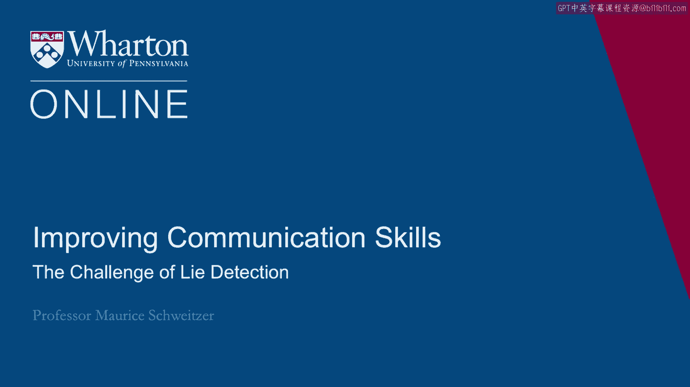
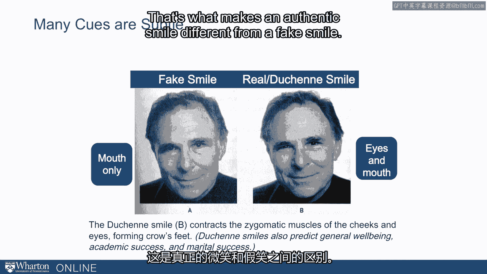
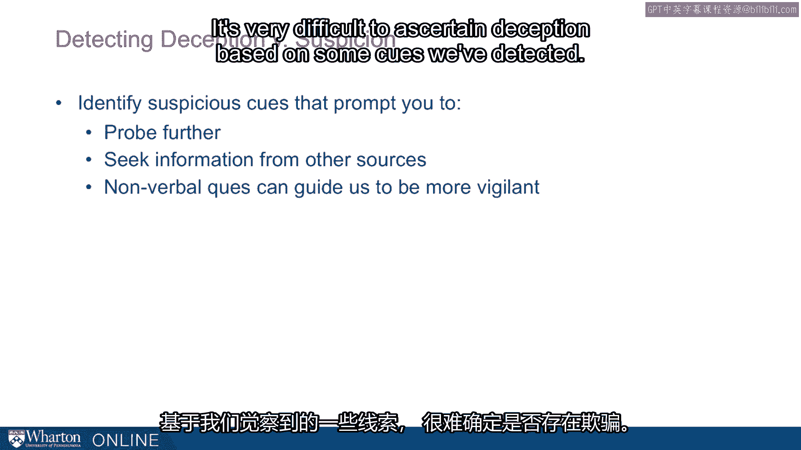

# 沃顿商学院《实现个人和职业成功（成功、沟通能力、影响力）｜Achieving Personal and Professional Success》中英字幕 - P44：16_侦测欺骗的挑战.zh_en - GPT中英字幕课程资源 - BV1VH4y1J7Zk

 [ Silence ]。

 Detecting deception poses a real challenge。 It's a challenge because we're mostly not very good。

 at detecting lies。 We start off with a very trusting stance。 Most people believe what we're told。

 And this is functional。 That is， we need to gather a lot of information。

 from other people and we're going to ask questions。 We're going to listen to what people are saying。

 And in the main， it's going to be truthful， useful information。

 And so we start off with a stance where we're open， receptive。

 and trusting of most of the information we get。 So that's the first idea。

 And so when deceptive information flows in， we typically incorporate it as true。 Second。

 we tend to be overconfident in our ability， to detect deception。 So that is， we think that， oh。

 if somebody were lying to us， we would know。 I'd know if my kids were lying to me。

 I'd know if my spouse were lying to me。 I'd know if my coworkers were lying to me。

 That's the assumption that we have。 And we know from a lot of evidence it's just not true。

 It's not true in experimental studies that have looked at this。 And it's not true empirically。

 We know that there are many spouses who have been misled， and never learned about that。

 So it's also particularly true this overconfidence， of professionals。

 So maybe police officers or judges， believe they're going to be better at lie detection。

 than they really are。 And relational partners are particularly overconfident。 So in light of this。

 what can we do？ Now it turns out that there are cues， but that most of them are subtle。

 They're so subtle that we often fail to appreciate it。 So for example。

 we can look at faces of people， who are smiling。 And I can ask you， well。

 who's authentically smiling， who's really happy， who's pretending to be happy？

 And it turns out that there are important differences。 And we can guide our focus and attention。

 to those differences， but we don't naturally go there。 So for example。

 one of these smiles here is fake。 One of them is real， or what's called a Duchenne smile。

 Now what's the difference？ Well， it turns out the difference。

 is that the real smile has not just the smile in the mouth。

 but also has crow's feet around the eyes。 That is， we're essentially smiling with our eyes。

 That's what makes an authentic smile different from a fake smile。

 So one question we have is where we should direct our focus。

 And one idea is we can think about the content of the message。

 So is there something that didn't make sense， or wasn't consistent？ Was something odd or unusual？

 And that should cause us to probe further， to investigate something more carefully。

 We can also look at how a message gets delivered。 What are the nonverbal cues around it？

 When and where is something getting said？ And then we can think about the match between the content。

 and the delivery。 So does this message make sense in how it's delivered？

 If I'm saying something is important， am I acting as if it's important？ And if there's a mismatch。

 it should also， cause us to probe further。 This is related to the idea of detecting deception。

 versus suspicion。 The idea here is that we'll often feel suspicious。

 It could be some non-conscious cue， some very subtle cue， we might have picked up on。

 but we're not sure about。 And the idea is that when we feel suspicious。

 it should cause us to probe more deeply。 To collect additional information。

 we should seek information from other sources， that is we should be paying attention to how suspicious。

 we might feel。 It's very difficult to ascertain deception， based on some cues we've detected。

 And instead， my argument is that we， should feel a sense or gauge our sense of suspicion。

 If we feel suspicious， that's caused to dig deeper， probe further。

 and investigate something more carefully。 [BLANK_AUDIO]。

