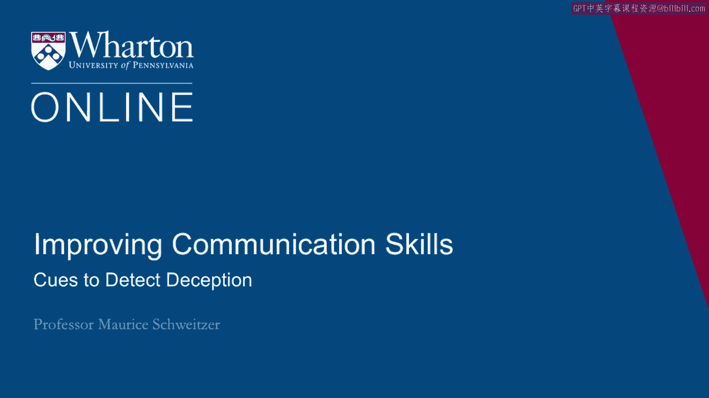
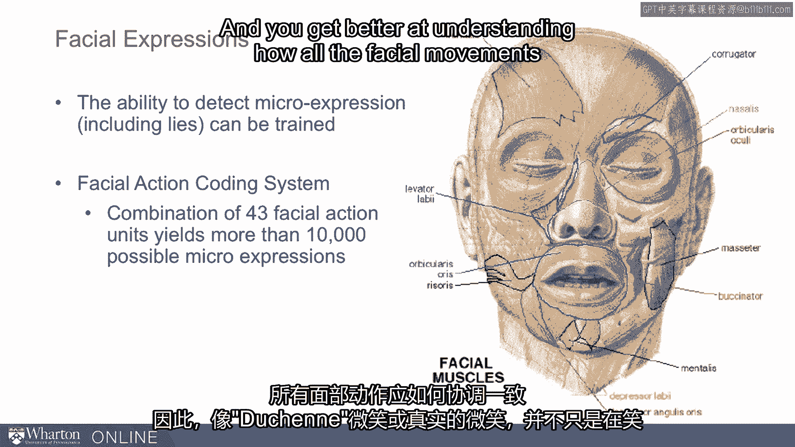

# 沃顿商学院《实现个人和职业成功（成功、沟通能力、影响力）｜Achieving Personal and Professional Success》中英字幕 - P45：17_侦测欺骗的线索.zh_en - GPT中英字幕课程资源 - BV1VH4y1J7Zk

 Let's think about some of the cues we can use to detect deception。

 So what changes when people start telling lies and what can we do to try to detect those， changes？

 It turns out one of the most important things that changes is how we feel。

 So our emotions change when we engage in deception。

 We have some emotions like fear and guilt and sometimes also happiness with what's been。

 called duping delight。 So our emotions are different when we're lying than when we're telling the truth and sometimes。

 we can attend to those differences。 Second， we have what's called cognitive load。

 We have more on our minds。 We're just thinking about a lot。 As Mark Twain said。

 the difficulty of telling lies is you've got to keep track of the truth， and the lie。

 So we just have more on our minds。 We have to keep two stories straight and we have to control our own behavior and we have。

 to monitor others to try to gauge how gullible they are or how suspicious they are。

 So we're engaging in more cognitive effort and there are cues because of that that can。

 also help us detect deception。 So one key emotion that changes when we lie is anxiety。

 So when we're telling lies， we often feel greater anxiety and in fact that's a lot of。

 what the polygraph is designed to test。 The polygraph has been called a lie detection machine but it's really an anxiety detection。

 machine。 So we do things like with a bicep cuff， we're measuring heart rate。

 Now while at our heart rate go up when we're lying， it's because we feel anxiety。

 The electrodes on their fingers that measures perspiration。

 Now perspiration is another sign of anxiety。 We have pneumatic tubes around the chest。

 Those measure breathing。 When we're breathing faster， it's because we're feeling anxious。

 So often when people are lying， they're feeling greater anxiety and that's what the polygraph。

 can help us detect and we can try to look for some anxiety cues in natural communication。

 So the face for example gives off some anxiety cues。 People tend to press their lips together。

 They tend to blink more quickly。 Their voice tends to be higher in pitch and we often engage in some movements that reflect。

 anxiety。 So we might rub our foreheads， we might squeeze our face or rub our neck， we might engage。

 in some sort of flash frozen that is a frozen kind of expression。 We might bite our lips。

 These are all cues of anxiety。 We might ask ourselves why would somebody be so anxious telling us this story or giving。

 us this information。 And one reason why they might be anxious is because it's not true。

 So anxiety is one place to look to help us detect deception。

 Now it turns out that there's often so much anxiety around telling lies that if we scare。

 people a little bit， they're actually likely to spill the beans and be more honest。

 So polygraph testing， the mere prospect of it is often enough to get people to confess。

 Now some people will just be so scared of participating。

 They will refuse a polygraph because they're so afraid that it's going to be so diagnostic。

 of their deception。 It turns out it's just anxiety but the polygraph is actually a useful tool not only because。

 it detects anxiety but also because it actually scares people into often confessing。

 Next we think about disrespect。 When people lie to you， it is often a sign of disrespect。

 So people who are lying sometimes also use sarcastic responses， they'll talk down to。

 a target or they exhibit some sort of contempt as they're engaging in deception or they're。

 doing things that demonstrate a disregard for the target。

 So they'll be picking lint off their clothes， they'll be rolling their eyes。

 they'll be demonstrating， disrespect and that often accompanies deception。

 So deception is an egotistical move。 I think I'm better than you。

 I think I can keep the truth from you and disrespect is sometimes。

 accompanying that deception and we can look for those cues as something to cause us to。

 probe more deeply。 Now often what we lie about are emotions themselves。

 So I'm really happy to have you join us。 Oh I'm happy you asked me these tough questions。

 Sometimes we leak out the right or our authentic emotions。

 So you're telling me something and I need to look at how you're saying it。 And I might feel like。

 hey wait a minute， you said you're really happy to see me but。

 you don't look like you're happy to see me or I saw a flash of a grimace or an uncomfortable。

 expression and I'm suggesting that we should pay attention to that。

 That is there's sometimes these cues of mismatching emotions or even quick expressions of emotions。

 that can lead us to engage in further sort of careful examination of what's really going， on。

 So often people leak emotions。 Now there's also sometimes a mistaken emphasis。

 So as we're trying to think very carefully about what we're saying， I might put an emphasis。

 on the wrong word。 Like I'm really happy to see you。

 The emphasis shouldn't be on I'm really happy to see you。

 That might be a sign of deception because we're cognitively loaded and we're not getting。

 the emotions quite right as we're speaking。 Another related cue is a lack of synchrony。

 That's related to this cognitive load idea is that I might say， oh， I've never done that。

 before and then shake my head as opposed to I've never done that before。

 When we're doing things asynchronously that is I'm saying something and then doing the。

 corresponding body movement that nonverbal cue might come later because I'm cognitively， loaded。

 I can't keep track of everything at once。 I've got to control myself from not nodding like， oh。

 I do that all the time。 What I'm telling you that I don't do it ever。

 So the lack of synchrony is another cue of deception。 It turns out leakage is part of this。

 So micro expressions are expressions that are less than a 20th of a second， sometimes。

 as long as a 5th of a second， but very fast。 Again， with video， we can see these very clearly。

 but in natural communication we often miss， them totally。

 But nonconsciously we might process and say， hey， you know what？ I know Maurice was telling me this。

 but I don't feel quite right or it。 He didn't seem completely authentic and it could be because there was a flash where I。

 said， oh， I'm really happy you came by， but if we actually saw it in slow motion， we'd。

 see that there was a grimace in there for maybe a 20th of a second that conveyed my real。

 happiness or lack of happiness that you actually stopped by。

 And sometimes leakage just means that our expressions are incomplete。

 So my smile isn't a full smile。 It just goes part of the way。

 So sometimes we leak out emotions that convey some uncertainty about how we're really feeling。

 And that we should be paying attention to。 There are many facial expressions。

 People have documented these pretty carefully。 And so there's a facial action coding system and there are ways to get trained to actually。

 detect these micro expressions and to get better at understanding how all the facial movements。

 are supposed to move in concert。 So like the dishein or authentic smiles， it's not just the smile。

 but it's also the movement， around our eyes。 So there's a lot that we can do to try to figure out how to focus our attention in。

 ways that guide us to detect deception more effectively。 [BLANK_AUDIO]。

