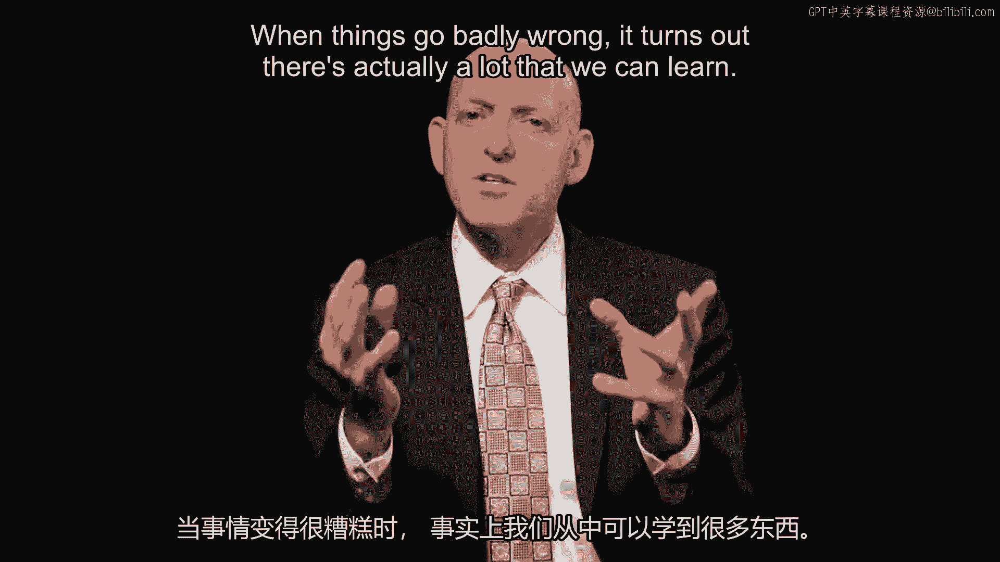
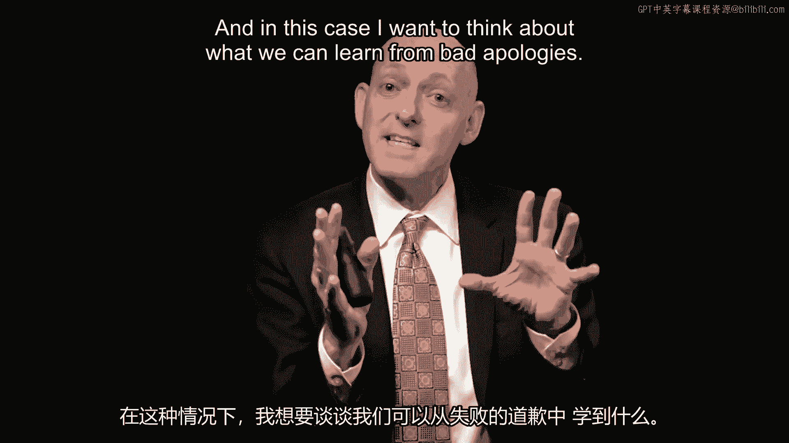
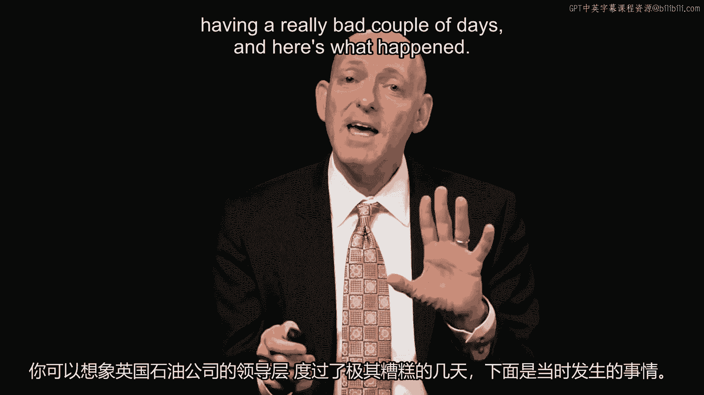
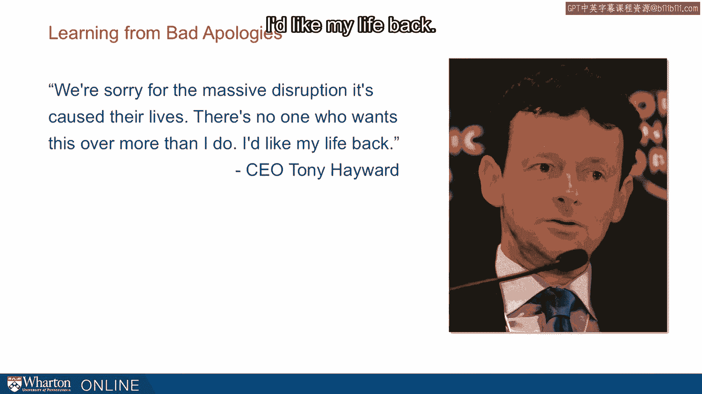
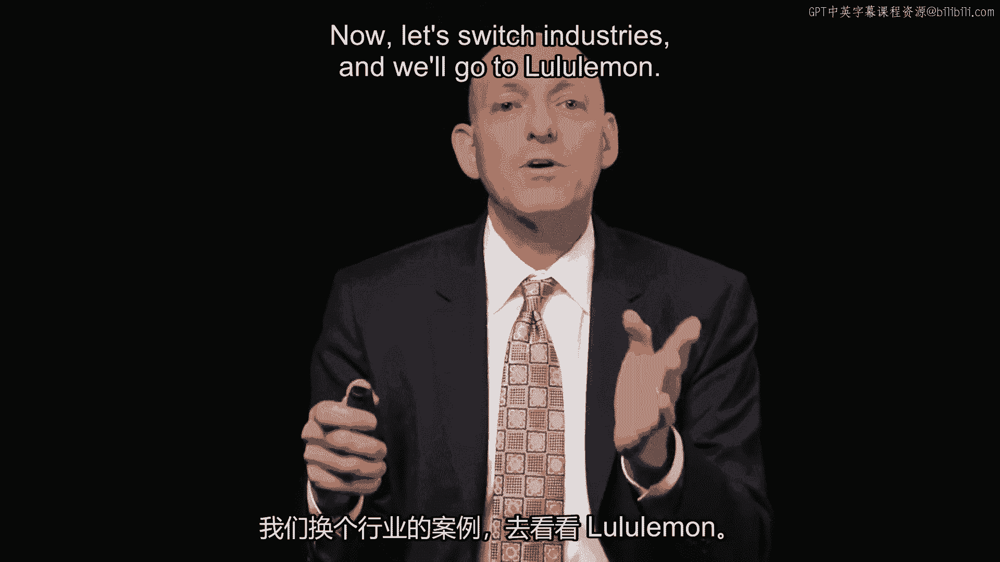
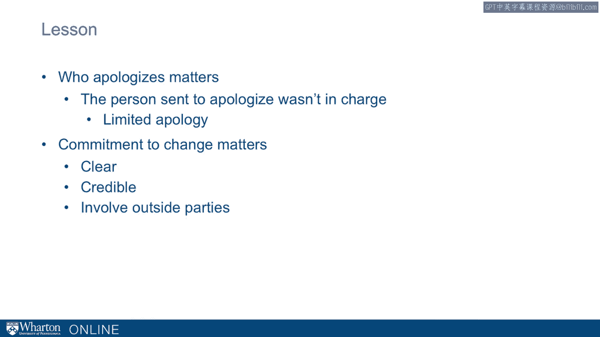

# 沃顿商学院《实现个人和职业成功（成功、沟通能力、影响力）｜Achieving Personal and Professional Success》中英字幕 - P49：21_从糟糕的道歉中学习.zh_en - GPT中英字幕课程资源 - BV1VH4y1J7Zk

 When things go badly wrong， it turns out there's actually a lot that we can learn。

 And in this case， I want to think about what we can learn from bad apologies。

 In 2010， we saw one of the worst environmental disasters of our generation。

 The Deepwater Horizon oil spill gushed oil for 87 days。 They didn't know how to cap this oil spill。

 In the initial explosion， 11 workers died。 Just an incredible disaster。

 Now， you can imagine the leadership of BP was having a really bad couple of days。

 And here's what happened。 The CEO， Tony Hayward， said。

 "We're sorry for the massive disruption that's caused， their lives。

 There's no one who wants this over more than I do。 I'd like my life back。"， So that's Tony Hayward。

 Now on the one hand， we can kind of appreciate he's having a rough day。 On the other hand。

 this apology falls far short because it's so self-focused。

 And the reaction was pretty swift。

 Even from employees at BP， here's someone working in PR who said， "The only time Tony。

 Hayward opens his mouth was to change feet。"， Now， not grammatically perfect。

 but it really captures this essence of how bad this apology， is。

 And there were calls from Capitol Hill for Hayward to resign。 And in fact。

 he does end up losing his job。

 The lesson I want to draw from this experience is we need to take perspective。

 That is， when things are going bad for us， they could be going badly for others。

 And that perspective taking is hard but essential for delivering an effective apology。

 Now， let's switch industries and we'll go to Lulu Lemon。

 So Lulu Lemon in 2013 had a problem with the density of their fabrics。 And here's what Chip Wilson。

 the chairman and founder said， that some women's bodies just， actually don't work。 Now。

 it's kind of funny that is we usually think that pants are supposed to fit the person。

 but he's suggesting， "Well， maybe the person is supposed to fit the pants。"。

 And he later apologizes to employees， "I'm sorry to put you through all of this。"， Now。

 this apology is to the employees but not to the customers。 So here。

 the lesson I want to draw is that， again， perspective taking is hard and we want。

 to think about the other side's perspective and the audience matters。 That is。

 who is getting that apology really matters。 Okay， let's switch gears again。

 And here we're going to talk about Tiger Woods。 Tiger Woods had some problems with his marriage and he lashes out at the media in his apology。

 I've been dismayed to realize the folks down of what tabloids going to do really means。

 He goes on though and at the end， he does， you know， I offer my profound apology。 This is 2009。

 Now here's what's interesting about this apology and where it falls short。

 Right after he delivered this apology， when things seemed badly wrong for him， he then。

 ends up sailing off on his yacht and a lot of the media attention then gets focused on。

 this $22 million yacht。 It's on her feet five feet long。

 It has a private jacuzzi and elevator and so on and ironically named the privacy and we。

 end up with focus on the yacht and his escape there。 And one of the problems。

 one of the shortcomings with this apology is that it ends up falling。

 short precisely because we care about penance。 That is， when somebody is truly remorseful。

 we expect them to suffer or pay for it and， hear this is the exact opposite of what Tagore would seem to be doing。

 Okay。 Now I'm going to jump to 1999， Coca-Cola。 Here in Europe。

 it started off with a young boy that reported feeling dizzy and a little， bit nauseous。

 It turns out other people soon began to file similar reports after drinking Coca-Cola。

 And these reports of dizziness spread and it seemed to be that there was some problem。

 with carbon dioxide at a plant in Antwerp。 Now what do you do if you're Coca-Cola？ Now the CEO。

 Douglas Ivester said， "Well， we want to take a lower profile。

 We want to see if this thing would blow over。"， Now meanwhile as he's dithering。

 he's sort of waiting。 It turns out the media picks this up。 It becomes sensationalized。

 And by the time this is over， 50 million products are drawn off the shelves。

 They're thrown out in France， Germany， and Belgium。

 What I want to think about is that here in terms of lessons， the speed matters， you can't。

 just wait for things to blow over。 You can't wait for the results of a final internal investigation。

 You need to be more proactive and your image matters。

 There's something about a psychological contract responsible not just for the letter of the。

 contract but for people's expectations too。 And in this case people are expecting more。

 They're expecting to understand that you care， you're concerned， that safety comes first and。

 it didn't seem that way to customers drinking Coca-Cola products。

 Fast forward。 Here's another failed apology。 This is VW。

 VW turned out to be cheating emissions testing。 Then the head of VW was dragged up to Capitol Hill。

 While he was there he offers an apology but it was really a half-hearted failed apology。

 First of all， who goes， it's the head of the US division， not the head of the company。

 And I would have argued we want the head of the company。

 We want to really figure out what's going on。 We want a candid， clear apology。

 This apology falls short in a couple of ways。 One is it's defecting blame。

 This wasn't a corporate decision。 The cars are safe to drive。

 We don't really know exactly what's going to happen。 The recall and process could take years。

 The other thing that happens is first of all he's saying look I'm not really in charge。

 and so it comes across as a limited apology。 It's not the head of VW that's going there。

 And the second part is there's no commitment to change。

 What we really want to do is understand what VW is going to do and we want that clear。

 credible commitment to change and in this case it would almost certainly involve bringing。

 an outside party for oversight。 So here are some of the lessons we can draw from failed apologies。

 [BLANK_AUDIO]。

