# 沃顿商学院《实现个人和职业成功（成功、沟通能力、影响力）｜Achieving Personal and Professional Success》中英字幕 - P50：22_道歉公式.zh_en - GPT中英字幕课程资源 - BV1VH4y1J7Zk

 Let's put these pieces together and think about what the apology formula should be。

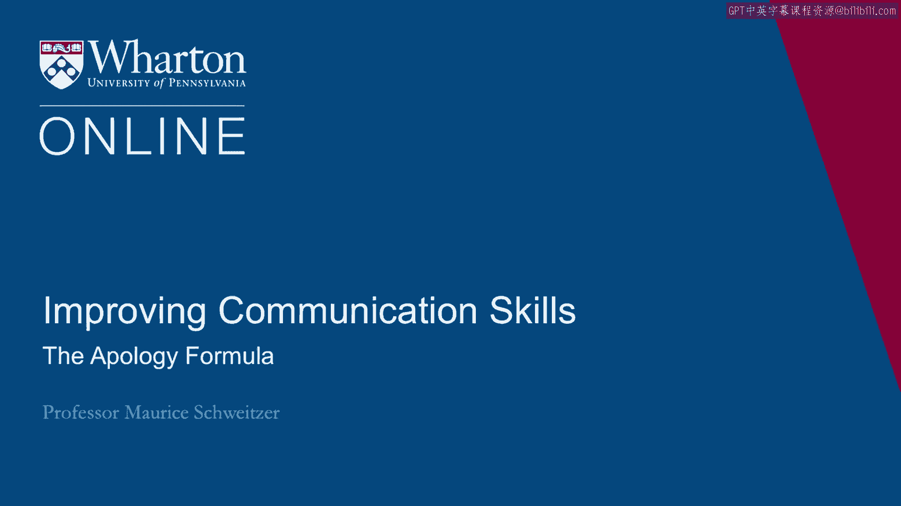

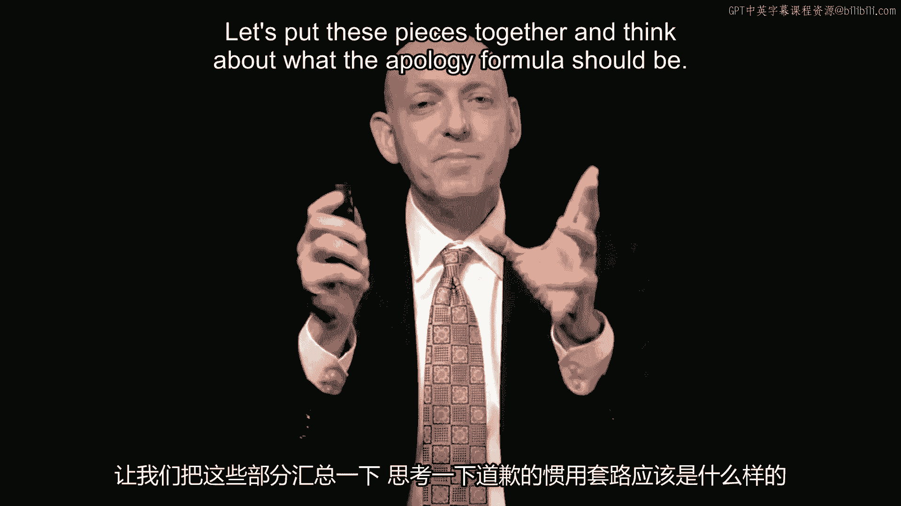

 I'll start with a study。 The study that was done with German eBay users。

 Here 632 customers had posted some negative feedback。 And as most of you know。

 negative feedback on an online system is pretty bad。

 And these customers were contacted and asked to remove that negative feedback。

 Now half of them received an apology。 The apology read。

 "I would like to apologize and ask whether you might withdraw your evaluation。"。

 And 45% removed that critical rating。 The other half didn't receive that apology。

 but they received a cash rebate。 They were offered this as a good will gesture and then asked if they would withdraw their。

 evaluation。

 And here only 21% did。 What's funny is from an economics perspective， we think， "Well。

 isn't money better than the。

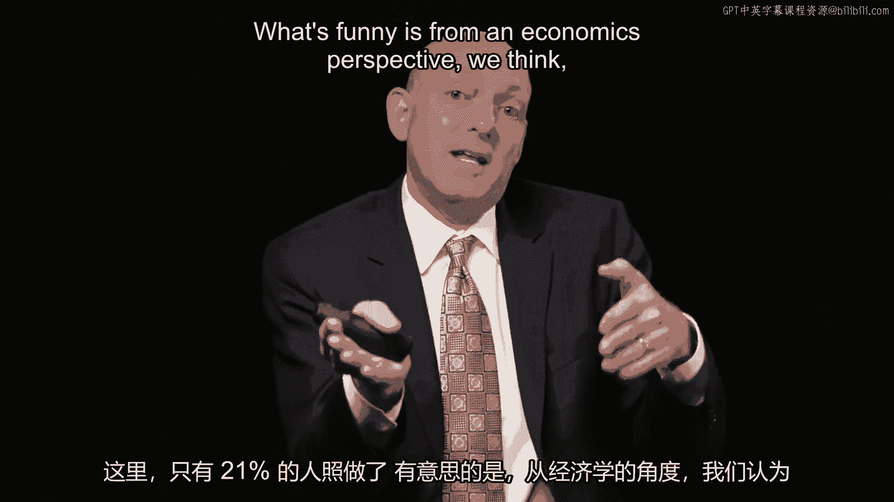

 apology？"， But it turns out asking for that removal works better with an apology。

 People sometimes， all they really want is an apology。

 So what we learned from this is that money might help， but an apology is sometimes even。

 more effective。 I want to think about another case that was incredibly powerful。

 Here Southwest Airlines， their first fatal accident， this involved a crash at Midway。 It was icy。

 The airplane has landed tore through the runway。 There was a gate。

 it blew past the gate and into an intersection striking cars below。

 And here in this first fatal accident， the Southwest CEO， Gary Kelly， apologized and he。

 apologized effectively and swiftly。 And it was unusual at the time for the CEO to deliver this apology。

 So here he comes out and his response is quick within hours。 He expresses condolences。

 He flies with his go team， 94 go team employees fly with him to Chicago and he comes out with。

 his heartfelt apology， "They're no worth to adequately convey our grief and sorrow。"。

 Now his response was characterized in the media as swift and caring and by all measures。

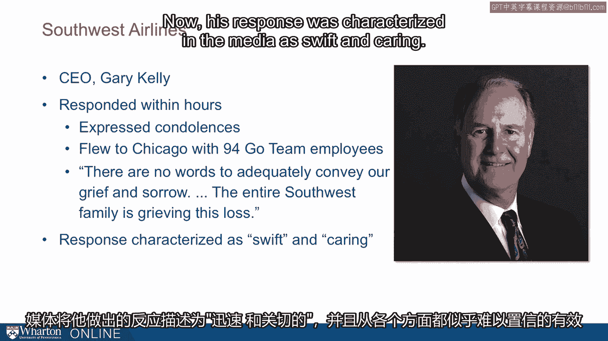

 seemed to be incredibly effective。 What I want to just want to think about the lesson here that is who apologizes matters。

 We talked before about the VW case。 Here it's the CEO。

 the leader that's apologizing and speed matters。

 I mentioned before， Kaleen Sosa。 Now what I want to suggest is that here it was this ER nurse that first noticed the problem。

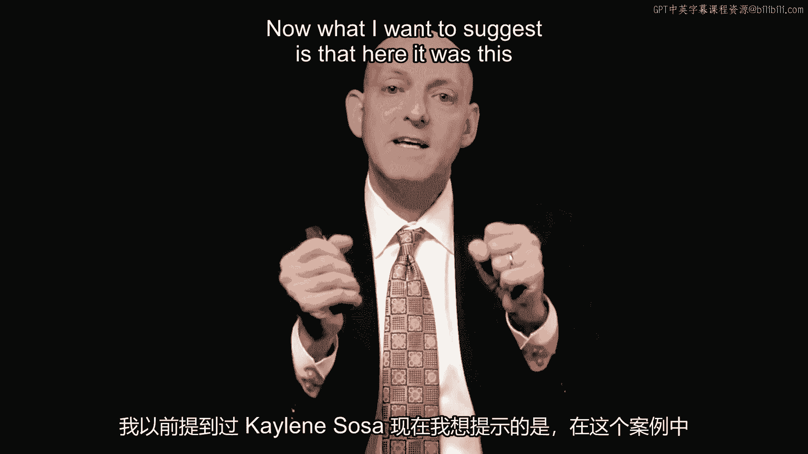

 and what happened with Kaleen Sosa as she had this breathing tube that became dislodged。

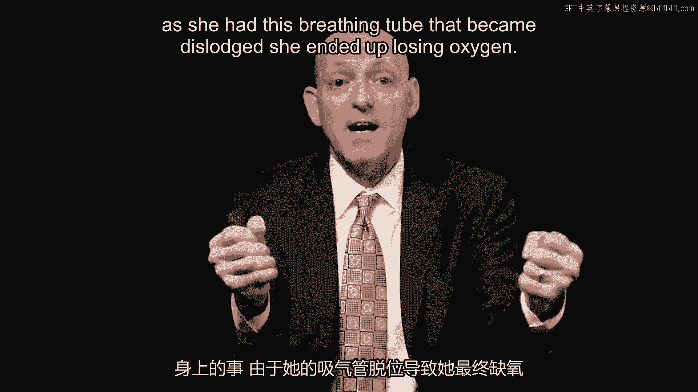

 she ended up losing oxygen and what the apology was able to do in this case was repair that。

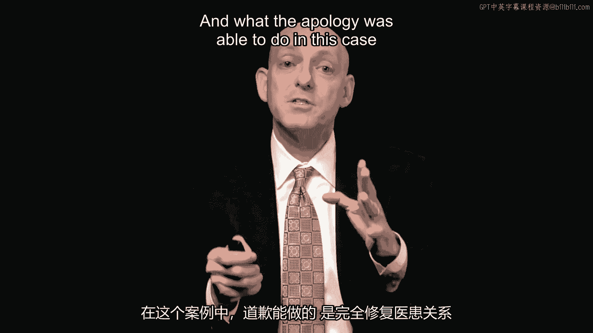

 relationship completely。 Now why？

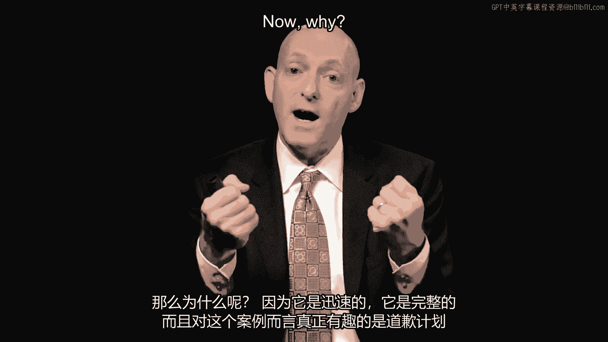

 Because it was swift， it was complete and what's really interesting about this case is that。

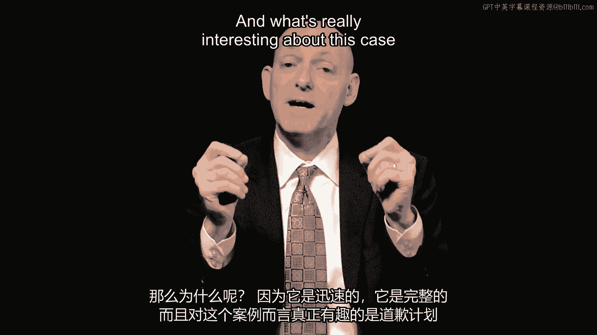

 the apology plan was instituted at the institutional level。

 That is the organization admitted commitment。 They had a checklist of what people should do。

 If there's a failure， people should quickly apologize， be candid about the entire procedure。

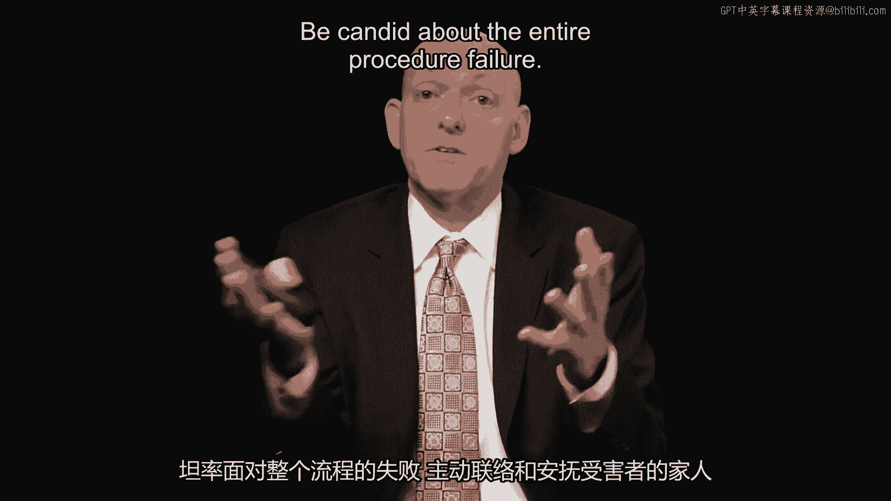

 failure， reach out， get to know the family and that's what they did and as they changed。

 procedures， Aussie Sosa actually came back and said， "I'm impressed by the changes" and。

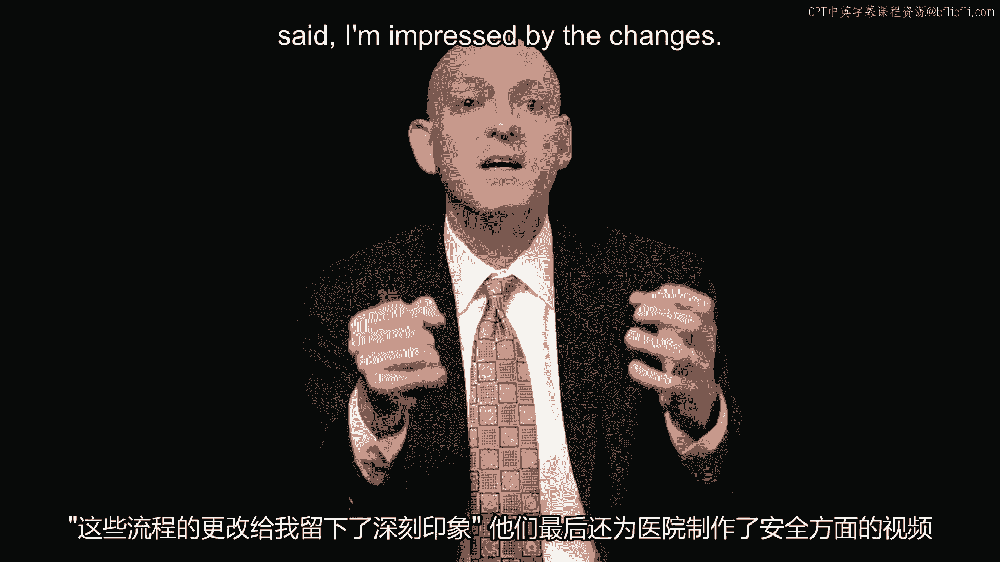

 they ended up making safety videos for the hospital。

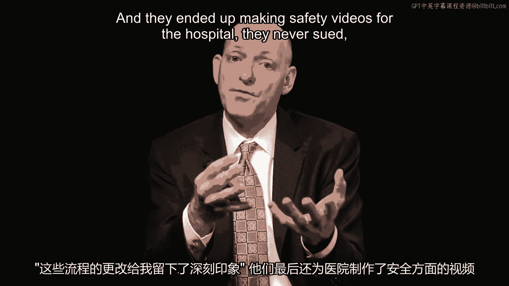

 They never sued， they mediated a settlement with the Sosa family。

 So here's what a good apology can do。 They can fundamentally change perceptions。

 words matter and as we saw with the eBay study， words are surprisingly effective but then the deeds matter too。

 So like at Baptist Hospital changing procedures。 Now here's what Baptist did。

 They had a full disclosure。 They explained what happened。

 They immediately came to the family to deliver full accounting。

 They mediated a settlement that included free physical therapy for life。

 They created video with the families and when Aussie Sosa the father came back to witness。

 all the changes he said， "I completely forgive the hospital。"， So what makes an apology effective？

 I wanted to still three key ideas。 The first is candor。 So we want full disclosure。 So Baptist did。

 it's the opposite of what VW did。 We want a speedy apology。 So Southwest quickly apologizes。

 Coca-Cola's are waiting for things to blow over。 The second key idea is remorse。

 Who apologizes helps convey that remorse？ So is it the CEO or somebody less authoritative？

 We want to see an expression of regret。 Southwest Airlines does this。 Lulemon doesn't。

 Is it other focus？ That is， are we focused on the person who's been harmed？ Again。

 Southwest Airlines does a beautiful job at that。 British Petroleum's wrestles with that。

 And penance。 Who's paying for something？ So Baptist Hospital's paying for lifelong care？

 Tiger Woods doesn't seem like he's suffering very much。 So that's remorse。

 And the third piece is a commitment to change。 We're here at Baptist Possible committed to change。

 they enacted changes。 VW has yet to do that。 [BLANK_AUDIO]。

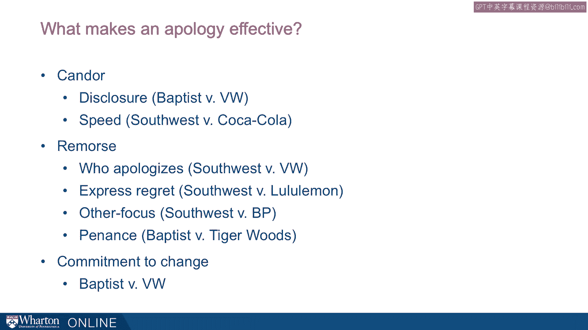

