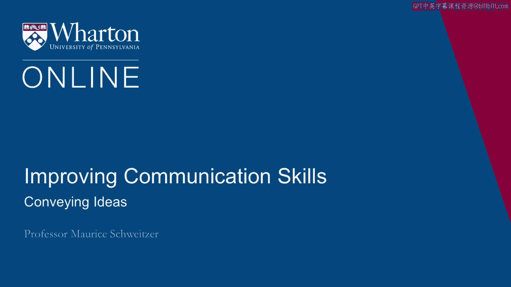
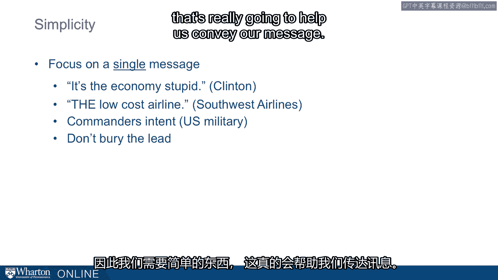

# 沃顿商学院《实现个人和职业成功（成功、沟通能力、影响力）｜Achieving Personal and Professional Success》中英字幕 - P52：24_传达思想.zh_en - GPT中英字幕课程资源 - BV1VH4y1J7Zk

 We think about communicating effectively。

 There are three goals that we often have。 We want to convey our ideas。

 We want to gather information from other people。 And we want to change relationships。 And first。

 let's think about how we convey ideas。 So if we're trying to communicate with someone。

 part of the challenge we have is conveying what's in our mind， and getting it out to other people。

 How do we do that？ Well， the first challenge is to grab attention。

 So how do we gain somebody else's attention？ We do that when the message is simple。

 It's persuasive and it's memorable。 And often you see some advertisements that really。

 exemplify this。 So here， this is an advertisement for a helmet。

 We have a chicken that's coming down the conveyor belt。 All the other chicken has been packaged。

 but this one， is coming down with a helmet。 It's surprising。

 It's also humorous and it grabs attention。 So things that grab attention are surprising。

 They offer some sort of puzzle or they pull on our emotions。 Often it's the individual stories。

 And Frank is a story about an individual that grabs our emotion。

 and helps tell a much broader story。 As Mother Teresa said， "If I see one， I will act。"。

 Often we think about a multitude。 We tend to lose our focus and it doesn't grab our attention in the same way。

 So ironically， a story about an individual is often more powerful， than a story about many people。

 And Chippith， for example， describes an example where a doctor。

 created a video from the patient's perspective。 And in showing that video。

 it actually helped people take that perspective。 There's a story here that grabbed attention。

 You saw something from a perspective you weren't really anticipating。

 So step one is to grab attention。 Next， once we have someone's attention， we want to be credible。

 So to be persuasive， people have to know that we're saying is real， truthful， and important。

 So we can evoke authority figures。 So people who are experts or in positions of power。

 we can rely on what they're saying。 We invoke that authority。 We might rely on their experience。

 So we have experience and we want to use sources that are trusted。

 So things that come from authority or experienced people or people we trust。

 are going to be more credible than we want to think about using those tapping into that。

 to create a message that's persuasive。 Now， simplicity is another key idea。

 For messages to be understood and remembered， we need them to be simple。

 So we can think about things like when Bill Clinton was running for president， guiding his campaign。

 it's the economy stupid。 That was the core idea。 So everything kept coming back to the economy in Bill Clinton's campaign。

 Or Southwest Airlines， the low-cost airline， by using that guiding principle。

 its simple message guides people's decisions so they can line up with that one goal。

 In the US military， they have something called the commander's intent。

 There's a short line at the top of the message。 Here's the goal。

 There are a lot of other details that are going to follow。

 but there's that one key idea at the beginning。 And the same thing's true in journalism。

 We don't want to bury the lead。 We want the key idea to be upfront。

 So we want something that's simple that's really going to help us convey our message。

 [BLANK_AUDIO]。

