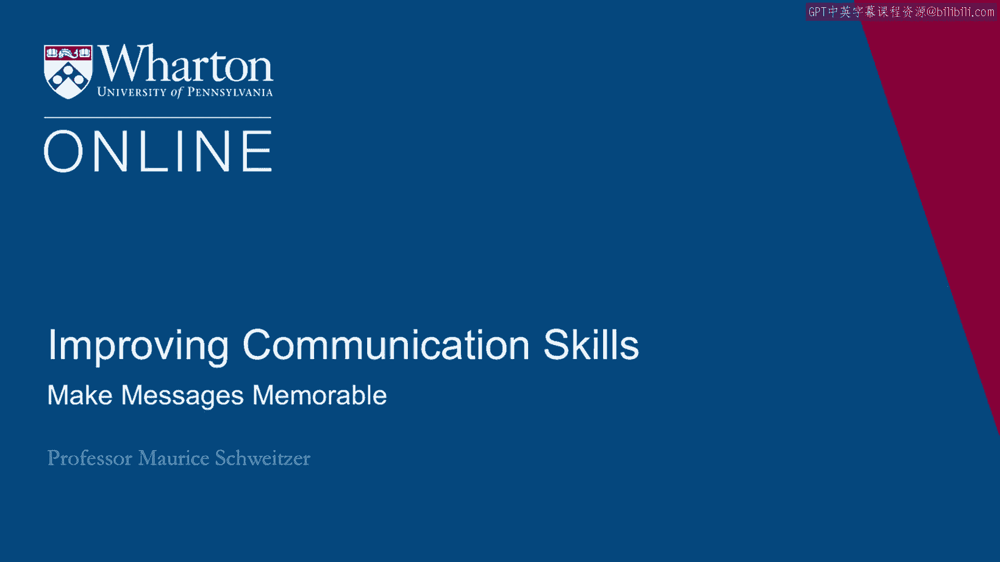

# 沃顿商学院《实现个人和职业成功（成功、沟通能力、影响力）｜Achieving Personal and Professional Success》中英字幕 - P53：25_使信息令人难忘.zh_en - GPT中英字幕课程资源 - BV1VH4y1J7Zk

 How can we make our messages memorable？

 Well one key idea is to tell a story。 And I'll tell you a story about Willie Horton。

 It turns out the story of Willie Horton took over the political campaign as George Bush， Sr。

 was campaigning against Dukakis。 This is a very difficult campaign。

 The two candidates were different but they were both polling very similarly。 And for much of this。

 a Dukakis was ahead。 Now Lee Atwater was a young politician who became George Bush's campaign manager。

 And he said， "By the time we're finished， they're going to wonder whether Willie Horton。

 is Dukakis' running mate。"， Now it turns out Willie Horton was convicted for a life sentence for murder。

 And there was a program in Massachusetts that allowed people， furloughs， allowed these prisoners。

 furloughs for good behavior。 And the reason why you do this is to encourage good behavior in prison。

 People were allowed furloughs。 And Willie Horton on a weekend furlough。

 now remember he was in prison for murder。 On his weekend furlough。

 he ended up engaging in rape of a woman and stabbed the husband。 Now that event。

 it wasn't Dukakis that had personally furloughed him。

 But Dukakis had said he was in favor of the furlough program and he had defended the furlough。

 program。 And it turns out this issue and the story of Willie Horton ended up derailing Dukakis in。

 1988。 So this story took on such an impactful part of the campaign。

 It eclipsed other key events at the time and other key economic and other social issues。

 So here's a story that ends up becoming very memorable and very impactful。

 Lee Atwater actually later apologized on his deathbed。

 He apologized for the use of the story and he apologized to Dukakis。 It was a very effective story。

 but it turned out to be not very pleasant campaigning。

 But the idea I want to convey is that it's very vivid， that is it's memorable。

 And then generally we want things that are vivid。 So when we thought about Afghan refugees。

 there's one photo that comes to mind。 We want to keep stories simple。

 We want things to be in chronological order that is easier for a memory。

 So the more vivid the example， the more accessible the example， the easier things are to remember。

 So ideas like copyrights are property or we're only as strong as our weakest link。

 These ideas are easy to access and the analogies， it's like closing the barn doors after the。

 cows have gone out。 These analogies allow us to access ideas much better。

 Now sometimes it's a figure of speech。 So fingers of speech like at the OJ Simpson trial。

 one of his defense attorneys famously， stated， "If the glove doesn't fit， you must acquit。"。

 Many people who watched the OJ Simpson trial， which was broadcast on television， thought。

 that OJ Simpson was guilty， the evidence seemed to point that way。 And yet this idea。

 if the glove doesn't fit， there's a glove that didn't fit over OJ Simpson's， hand。

 it seemed to suggest that， well， maybe not all the evidence is consistent and that。

 ends up with this rhyming figure of speech being a very compelling idea。 Or another one here。

 loose lips sink ships， this idea that we should be careful in what， we say。

 this rhyming simple idea becomes very memorable。 So we want our messages to be memorable and stories and analogies and short expressions。

 will help us do that。

 Now another idea to make things memorable is to keep them very concrete。 So the idea。

 this sort of goal， we're going to put a man on the moon within a decade。

 So when Kennedy set out this ambitious agenda， it creates a very concrete idea for us to align。

 behind。 Or in the 1960s， Boeing had a very concrete goal。 The 727 must-seat。

 hundred-thirty-one passengers fly nonstop from Miami to New York and land。

 on a specific runway in LaGuardia。 Now this runway was less than a mile long。

 We could have specified things with more abstract terms， but the idea here， the ideas。

 that were conveying， offer a very concrete set of attributes that allow us to focus on， that。

 So we want to avoid vague claims or vague ideas like our goal here is to maximize shareholder。

 value or we want to engage in continuous improvement。 Those are nice ideas。

 but they're not very concrete and they don't guide very concrete， actions。 Now one concern， however。

 is that sometimes when we narrow focus， we can do it too much。 So when Lee I。 Coco was a CO Ford。

 he did a lot of great things， but one of his goals was to create， in his words。

 a car that was under 2，000 pounds and sold for under 2，000 dollars。 So this is very concrete。

 That's a very specific goal and in 1974 introduces the Ford Pinto。

 Now here's another， another expression that is also very vivid。

 It was called the barbecue that seats for because of the fuel tank placement。

 Rear end collisions could sometimes cause the fuel tank to burst into flame and 56 people。

 ended up dying in Pinto fires and Time Magazine included the Ford Pinto as one of the 50 worst。

 cars of all time。 Now there's still some debate whether Ford was aware of the design flaw or not。

 There was a concern that maybe they decided it was cheaper to pay off the lawsuits than。

 redesign the car。 But the key idea here is that we have a concrete idea that is the 2000， under 2。

000 pounds， under 2，000 dollars， that's a concrete idea that guides action。 It's very memorable。

 And similarly， these very vivid expressions like the barbecue that seats for is also very， vivid。

 So when we're trying to convey ideas， we want people to remember them and these short expressions。

 the concrete and the use of analogies are all key tools， they're vehicles for making our。

 ideas very memorable。 [BLANK_AUDIO]。

