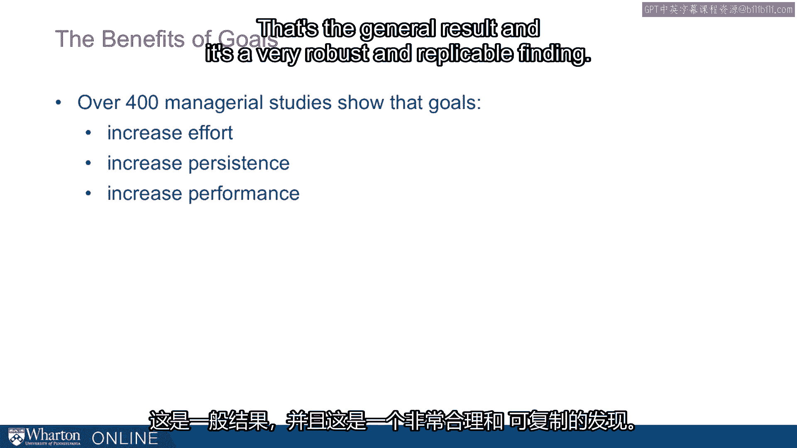

# 沃顿商学院《实现个人和职业成功（成功、沟通能力、影响力）｜Achieving Personal and Professional Success》中英字幕 - P60：32_目标的益处.zh_en - GPT中英字幕课程资源 - BV1VH4y1J7Zk

 Goal setting turns out to be an incredibly powerful tool。

 It's a fundamental part of motivation。 Goal setting can drive us to do great things。

 Goal setting can also drive us to do very bad things。 But first。

 I want to think about the benefits of goal setting。

 There are over 400 managerial studies that have looked at goal setting。

 And there are dozens and dozens more that have looked at behavior and goal setting。

 whether it's delivering mail， it's welding， it's sewing， in athletics。

 When people have specific challenging goals， they increase their efforts， they increase persistence。

 and they increase performance。 That's the general result。

 And it's a very robust and replicable finding。

 In fact， some of the most foundational goal setting scholars have said。

 the beneficial effects of goal setting on task performance is one of the most。

 robust and replicable findings in the psychology literature。

 And indeed it is。 That is psychologically just setting a challenging goal will boost performance。

 And the relationship between goal difficulty and task performance over a wide range is almost linear。

 That is the more difficult the goal， the higher the performance。

 This is particularly true for effort-based tasks。 So tasks where we just need people to work a bit harder。

 greater goals will boost motivation and often boost performance。

 We also know the goal proximity matters。 So you want to break down goals in smaller pieces when people are close to reaching that goal。

 So the end of the month， and we're almost at the goal。

 that's when people are particularly motivated。 So close to that goal， people work extra hard。

 You can look at this。 There are studies of runners。 If you look at a marathon race。

 there are big spikes right by round numbers。 People are racing to get in under a specific time。

 Now goals work by focusing our attention。 They're increasing our effort and boosting persistence。

 So what we wanted you to harness the benefits of goal setting is to set clear specific goals。

 They should be challenging but also realistic。 If we have past performance。

 so how fast we've run on prior races， or how much people on this factory line can perform。

 or sales goals based on past performance， we want to set goals around the 80th to 90th percentile of performance。

 So challenging， but also credible。 And if we can set a series of short-term goals。

 like goals every month rather than goals for the whole year。

 we're likely to see greater benefits to setting goals。 The next part involves committing to goals。

 And this is one reason why the goal has to be realistic。 People have to believe they can get there。

 So if they visualize it， they write it down， they tell other people。

 And sometimes if I tell other people， it'll be embarrassing if I fall short。

 so that'll steal my resolve to that goal。 We also want to think about developing a plan。

 How can I achieve that goal？ What steps do I need to take to get there？

 That action plan will all help us get to the goal。 And of course clear feedback is important。

 That is， we want to make sure we're getting feedback along the way。

 And remember that when we're particularly close to the goal。

 that's what's going to boost performance the very most。 [BLANK_AUDIO]。

