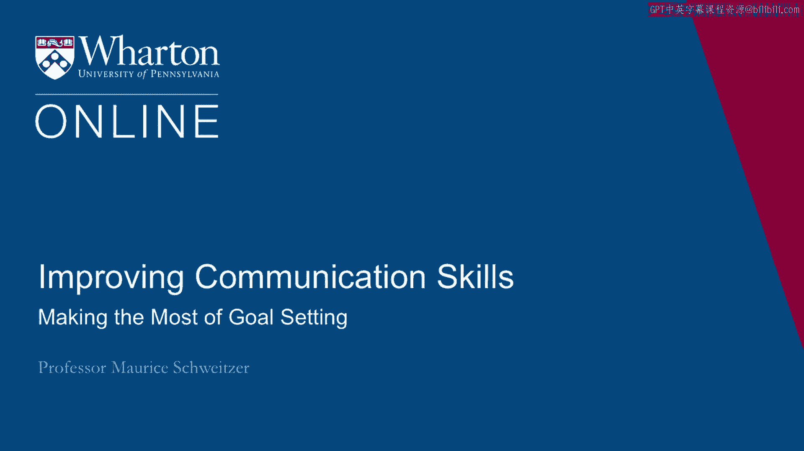
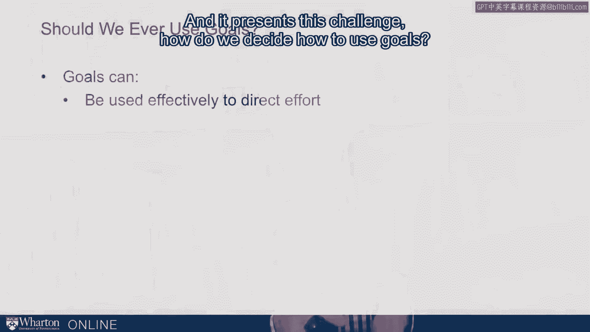
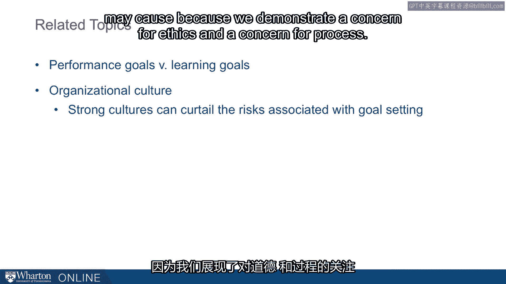
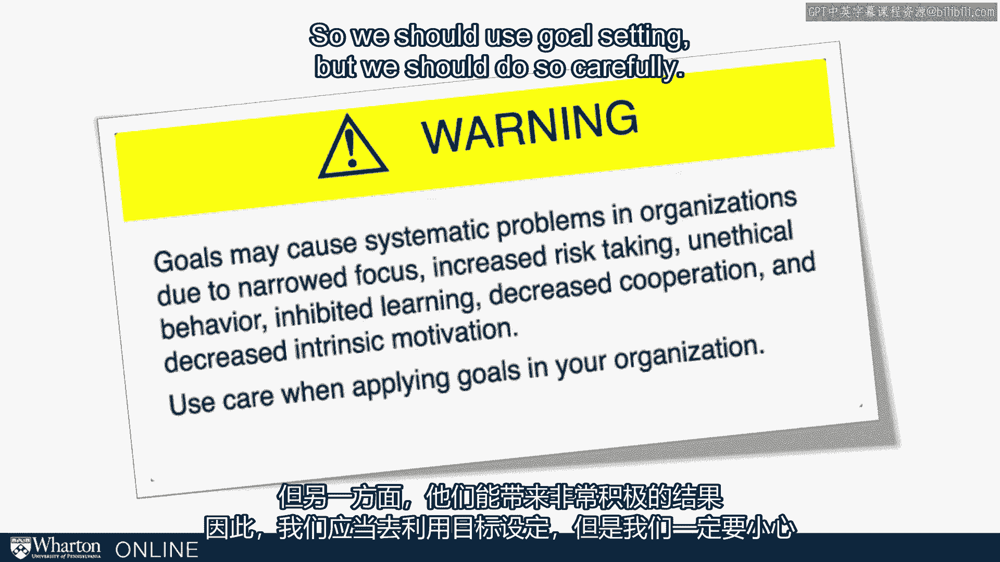

# 沃顿商学院《实现个人和职业成功（成功、沟通能力、影响力）｜Achieving Personal and Professional Success》中英字幕 - P62：34_充分利用目标设定.zh_en - GPT中英字幕课程资源 - BV1VH4y1J7Zk

 So how do we make the most of goal setting？

 Sometimes goals can motivate us to do great things， but goals can also lead us astray。

 to do unethical and terrible things。 So should we ever use goals？

 Notice that in some of those examples we talked about before， executives come in and。

 just decide to remove the goal setting process。 That will as far go at Sears and it presents this challenge。

 How do we decide how to use goals？

 We know that goals can be very effective for directing effort， particularly when it's。

 an effort based task， when the parameters are clear and we can accurately incorporate the。

 key dimensions of what we're trying to do。 Goals are also very powerful for informing and communicating what we care about。

 And they're very useful for straightforward tasks。

 So in many cases goals are really important and they really are a foundational part of， motivation。

 They're one of the key mechanisms for communicating and getting people on board to drive in a。

 pillar direction。 But goals should be used carefully and I'm going to argue that we should demonstrate a。

 concern for the process and also monitor the behavior that people are engaging in as they're。

 pursuing that goal。 This is particularly true when people get close to that goal。

 So if it's a sales goal， the end of the month， should be when we're very mindful and watchful。

 vigilant of what people are doing。 So when people get close to the goal。

 that's when goals can be most intense in their motivation。

 and we want to be careful about what people are doing。

 We want to demonstrate that we care about the process。

 So we care about the process like the Atlanta school teachers that we do care about the integrity。

 of the test taking。 If that's how we're measuring goal performance。

 we want to be very careful that we're caring， about that process。

 Now there's some related ideas here。 We could have performance goals versus learning goals。

 So when we go out， let's say you're going out to play tennis， the performance goal is。

 winning the tennis game。 The learning goal is improving so that your backhand becomes the best that it can be。

 And the same is true in any domain， whether it's educational or at work， we're doing a， project。

 Is the goal performance or is there a learning goal？

 And the upshot is that the more we can get to a learning goal that is we're constantly。

 trying to improve， we're trying to get this to be better and better。

 The closer we are to a learning goal， the better off we're going to be in a long term， situation。

 We find that people are better， they react better to feedback。

 They actually do end up learning and performing better over time。

 So we want to move away from a performance mindset to a learning goal mindset。

 Another key idea is organizational culture。 The culture in the organization really matters。

 And this is related to the idea that we care about process and strong cultures that care。

 about ethics can really curtail the risk of unethical behavior being driven by goal setting。

 The idea here is that if we have an organizational culture， we can limit the damage that goal。

 setting may cause because we demonstrated concern for ethics and a concern for process。

 So in short， I want to issue a warning that is goals may cause systematic problems in。

 organizations because they narrow focus， they increase risk taking， they can promote unethical。

 behavior and harm learning， harm cooperation and decrease intrinsic motivation to pursue。

 what we really want people to do。 But on the other hand。

 they can also have very positive consequences。 So we should use goal setting。

 but we should do so carefully。

 [BLANK_AUDIO]。

