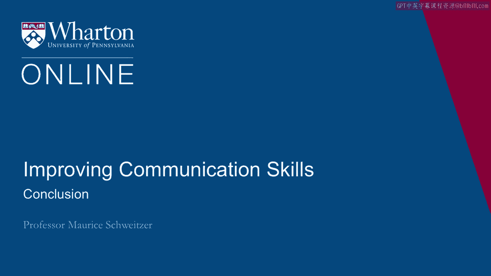
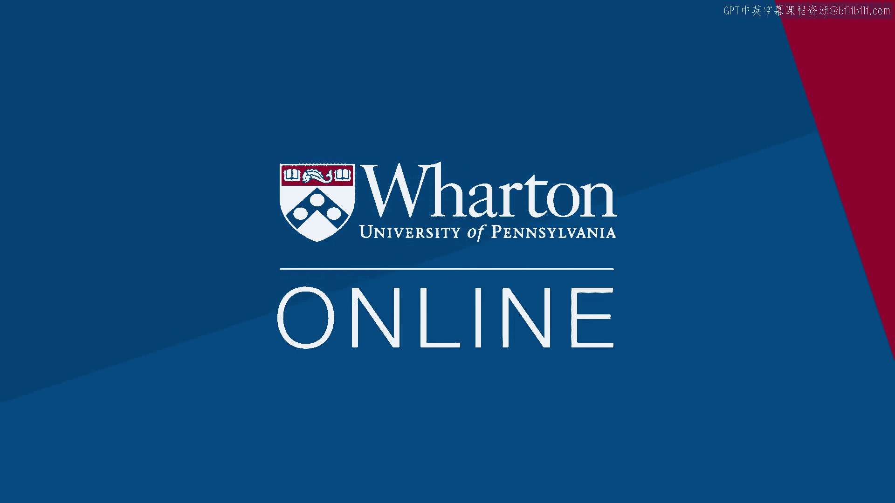

# 沃顿商学院《实现个人和职业成功（成功、沟通能力、影响力）｜Achieving Personal and Professional Success》中英字幕 - P64：36_课程总结.zh_en - GPT中英字幕课程资源 - BV1VH4y1J7Zk

 Thanks for joining me。

 I enjoyed thinking about these topics of cooperation and competition， how things like。

 social comparisons can tip us into a competitive mindset， how we can think about trust and in。

 whom to place our trust， and deception as it hijacks our trusting systems。

 We talked about apologies and putting those pieces back together， as well as some communication。

 topics more generally and crafting effective messages， messages that are memorable and， effective。

 We also talked about asking questions and the whole questions play not only in eliciting。

 information but also conveying information and guiding the kinds of responses that we， can get。

 And finally goal setting when it goes right and when it can drive us to engage in behaviors。

 like unethical behaviors that we really want to avoid。 I've really had a great time。

 Thanks for joining me and best of luck using these ideas as you go forward。 [BLANK_AUDIO]。

