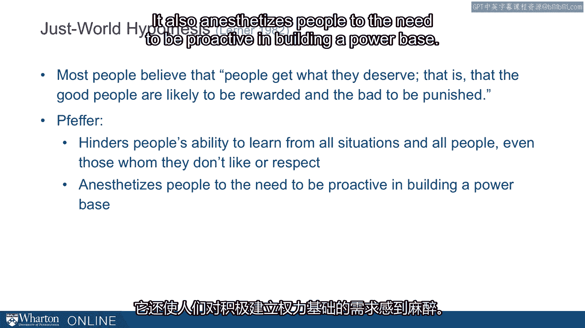

# 沃顿商学院《实现个人和职业成功（成功、沟通能力、影响力）｜Achieving Personal and Professional Success》中英字幕 - P66：2_公平世界谬论.zh_en - GPT中英字幕课程资源 - BV1VH4y1J7Zk

 How does an appreciation of power and its dimensions really affect a person in their。

 career and their lives？ To begin getting a sense of this。

 let's start with an example of a former student。 So Noah， let's call him Noah。

 graduated from a top business school in 2005， mechanical。

 engineering background that was his undergrad， well liked by his peers in business school。

 some quotes about him， one of the smartest kids around， great teammate， nice guy， coming。

 out of school， takes a product manager role， this is one of the most desired roles these。

 days coming out of business schools with a startup， about a hundred person or so tech。

 startup out in Northern California。 So this is a challenging work environment he drops into。

 his firm is under big pressure， to hit venture capital milestones。

 His direct supervisor was not the most experienced manager in the world and is often the case。

 in these startups was over committed。 And the founder CEO who was still involved with this firm had difficulty making the hard。

 decision。 So an exciting situation but challenging situation as well。 Early on out there。

 some successes， so he had great rapport with his business side， colleagues。

 The marketing and sales folks were very much like the classmates he had had at business。

 school so that worked really well。 But of course as a product manager。

 he's got the other side as well， he's got the technical。

 side and he didn't have a great rapport on that side of things。

 He was known as a hard worker so he established that reputation early on。

 But he continued to have some challenges。 He argued with the lead engineer about product specifications perhaps leaned a little heavily。

 on his mechanical engineering background and he was intimidated by questions from some。

 of the higher ups。 In particular the lead venture capitalists had a rep on the board out there that he had。

 difficulty interacting with didn't quite seem to know how to address the concerns that。

 that person had。 And then he was repeatedly stymied by management's reluctance to commit to a course of action。

 Between the overextended manager and the indecisive owner， he often felt kind of left。

 in the lurch and unclear on what course of action to take。

 So as he moved into the second half of the year out there， his challenges seemed to multiply。

 He started working harder and he hoped his bosses were noticing that he was working harder。

 He was too busy to attend the periodic gatherings that their investors had of their portfolio。

 companies and he eventually lost support even of his big allies out there on the market。

 on the business side because he was unable to move and persuade the people on the technical。

 of the engineering side。 When he came up just before his first anniversary。

 his product missed the second deadline in， a row and one morning he walked in and he was unceremoniously let go from this firm。

 From this very promising beginning just a year before in this very exciting situation。

 he had utterly failed。 And this is a story， I don't hear these stories that often but we do hear them。

 With some regularity we have the most talented kids， the most talented students go into these。

 new environments and fail。 Others have more muted versions of these stories。

 They go into environments and just kind of tread water。 They don't ever seem to get traction。

 Some of the patterns in these stories， I've started to notice over the years。

 Some of the patterns are， many of them are dealt a difficult hand。 Chance happens。

 bad bosses happen。 This is the thing about political ability and understanding power and influence。

 Sometimes you need that political ability just to get the job done。

 It may not be about getting a promotion or running the company。 In some situations you just。

 you need it just merely to get the job done。 Another pattern is first impressions。

 A lot of folks who have trouble that trouble begins in the beginning。

 There's a real premium on what happens early in a firm。

 There's trouble fostering good relationships。 This is one of the most central patterns that we see。

 A humbling share of what we do happens through other people。

 That means there's going to be a real premium put for people who are on people who are good。

 working through others。 In this case， and in many of these cases。

 we see former students who don't understand， the cost of passivity。

 That there's a high return to a willingness to bend circumstances to not accept the status。

 quo as a given。 Finally， some folks are hampered by their belief system and in particular a notion of a just。

 world that the world's hard work， the world rewards good intentions。 That if you're a good employee。

 you keep your head down， things are going to work out okay。

 This is a surprisingly robust pattern among folks who have this kind of trouble。

 It's been documented in the psychology literature since learner in 1982。

 There's research on the just world hypothesis that many people believe that people get what。

 they deserve， that is good people are likely to be rewarded and bad to be punished。

 This is a mindset that we see in children。 It's seen in developmental psychology。

 but a surprising number of adults have this belief， as well。

 I could spend quite a bit of time mustering evidence that this isn't the case， but it。

 should be the kind of premise that doesn't need to have evidence。

 There's just no evidence that the world is a just place。

 The problem is that this belief hinders people's ability to learn from all situations， especially。

 learning from people who they may not like or respect。

 It also enesthesizes people to the need to be proactive in building a power base。

 We in this course are very much trying to give you the tools for building a power base。

 We want to knock down any beliefs in a just world as a starting place because it is the。

 absence of the just world that kind of motivates the need for these tools。 [BLANK_AUDIO]。

