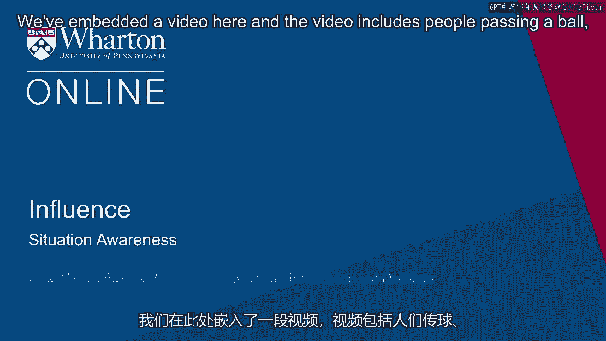
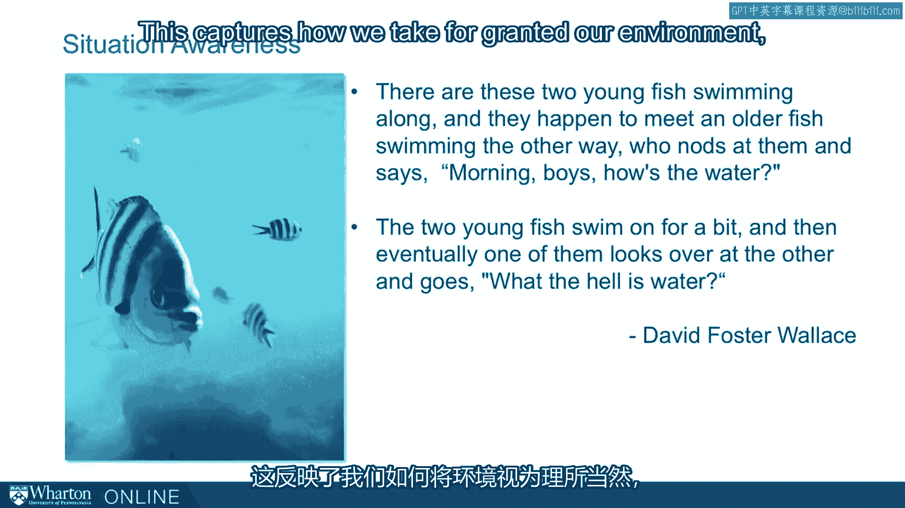
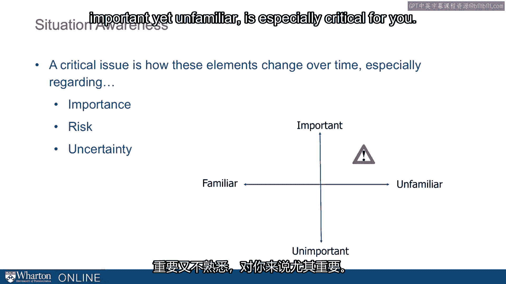
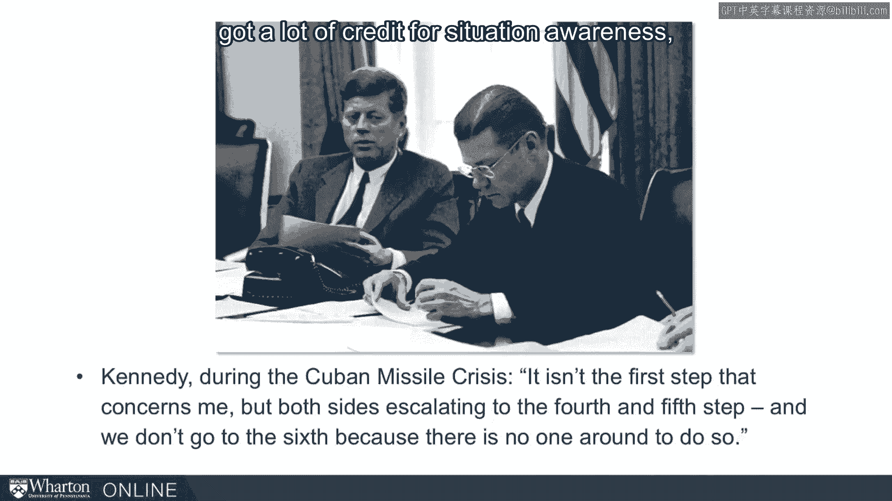

# 沃顿商学院《实现个人和职业成功（成功、沟通能力、影响力）｜Achieving Personal and Professional Success》中英字幕 - P71：7_状况感知能力.zh_en - GPT中英字幕课程资源 - BV1VH4y1J7Zk

 We're going to start this section with a quick test。

 We've embedded a video here and the video includes people passing a ball， bounce passing。

 a ball to each other。 And we want you to count the number of passes you see by people in white shirts。

 That's your task。 Watch the video， only last about a minute， minute and a half。

 Count the number of passes you see by people wearing white shirts。 Here we go。 [BLANK_AUDIO]。

 So how many passes did you see？ It's a hard task， people vary， come up with different numbers。

 But in fact， this test wasn't about counting passes。 This test was what else you might have noticed。

 Did you see anything else？ Anything interesting happen in that video？

 Let's go back and look at a particular segment。 And this time， look more broadly。

 what happens in here besides passing balls。 [BLANK_AUDIO]。

 That time you surely saw that there's a person in a gorilla suit that walks out。

 beats his or her chest and walks off the screen。 Amazingly。

 a high percentage of people who watch this video trying to count passes， don't see the gorilla。

 It's a remarkable demonstration。 Simon's and Shabri re-prized this demonstration from a classic study in the 70s。

 To show and to investigate this issue of change blindness。

 How people can neglect change that happens in their environment because they're so。

 focused on a particular task。 This， we think， is important to understanding what happens in organizations。

 And so it's a good starting place for us and introduces this concept of situation， awareness。

 To dive into this， let's take a quote from David Foster Wallace at a commencement。

 speech a few years ago who told the following story。 He said。

 there are these two young fish swimming along and。

 they happen to meet an older fish swimming the other way。 Who nods at them and says。

 born a boy's has the water。 They go on， the young fish swim on for a bit and。

 then eventually one of them looks over at the other and goes， what the hell is water？

 This captures how we take for granted our environment。

 Even essential elements like the water that fish live in。 If we're not paying attention。

 it can fade into the background。 And importantly， this can dramatically affect our ability to function and。

 understand what's going on。 So we're going to dive a little bit more deeply into this。

 There's a concept of situation awareness。 Quote here from the former CEO of Delta Airlines。

 Richard Anderson。 He says， leadership is like flying an airplane。

 You have to have your head up and you have to have situational awareness of。

 everything that's going on around you。 He didn't use that term accidentally。

 It's a phrase that has been around for decades now。 And the definition sounds a little technical。

 but bear with me， situational awareness is the perception of elements in the environment。

 within a volume of time and space。 The comprehension of their meaning and。

 the projection of their status into the near future。 So this was originally a military concept。

 If you've been in the military and know some of the military， you may have heard them talk about SA。

 They get drilled on SA all the time， situational awareness。

 Because of how important it is in their operations。 It went from military to aviation and on and。

 heavy operations and increasingly we're seeing industries like hospitals for， example。

 emphasize situational awareness among their employees。

 So we're going to extend it from military and， industrial navigation to political navigation。

 Because it is such a useful concept and understanding what happens in organizations。

 So one way of simplifying the concept is to think about how elements in your。

 environment change over time。 How do they increase or decrease in importance？

 How do they increase risk？ How does uncertainty change？

 These pieces are going to be critical for surviving and navigating well in an， organization。

 So one way to think about it， just think about situations along two dimensions。

 Important to unimportant and familiar to unfamiliar。

 Some situations are important but familiar so you're on pretty solid ground。

 Some situations really aren't that important so it doesn't matter that much。

 But there are those situations which are both important and。

 unfamiliar where SA becomes terrifically important。

 And you need to be sensitive to when you're in those kinds of situations。

 So you can take a little more care to understand risk， uncertainty。 What is moving around？

 What is driving actions in those situations？ So this particular quadrant。

 important yet unfamiliar is especially critical for， you。

 There was a study a few years ago by Lawrence Gonzalez， an author who was。

 interested in why accidents happen in natural environments。

 How people die in avalanches are quite water rafting。

 These situations in seemingly recreational areas that go wrong in some way。

 And he wrote a very interesting book called Deep Survival。

 And towards the end of that he quotes a survival instructor who says。

 we come from cities and learn to expect things to stay the same。

 But they don't and it kills us quickly or slowly。 So this was more or less his summary of why these things went wrong in the wild。

 That people weren't aware that situations could change。

 They weren't accustomed to situations changes as the survival instructor says。

 In our cities and our day to day lives they don't change。

 Yet out here they do and because people aren't paying attention it gets them in trouble。

 This is why we want to emphasize situational awareness。

 This is why we want to start out emphasizing situational awareness because it's the。

 changes in your organizational environment， your political environment that will really。

 get you in trouble。 It's the complacency that sets in and kind of decreases your vigilance that will get。

 you in trouble。 You counterbalance that by emphasizing situational awareness。

 A leader who was well known， got a lot of credit for situational awareness is John Kennedy。

 At the height of the Cuban Missile Crisis he said about trying to figure out what to。

 do with the Soviet Union。 He says， it isn't the first step that concerns me but both sides escalating to the fourth。

 and fifth step。 And we don't go to the sixth because there's no one around to do so。

 It was this kind of reasoning that helped Kennedy navigate the Cuban Missile Crisis。

 And it's that kind of situational awareness we want you to pick up on。

 So in the next section we'll drop more deeply into the Cuban Missile Crisis。 Thank you。

 [BLANK_AUDIO]。

