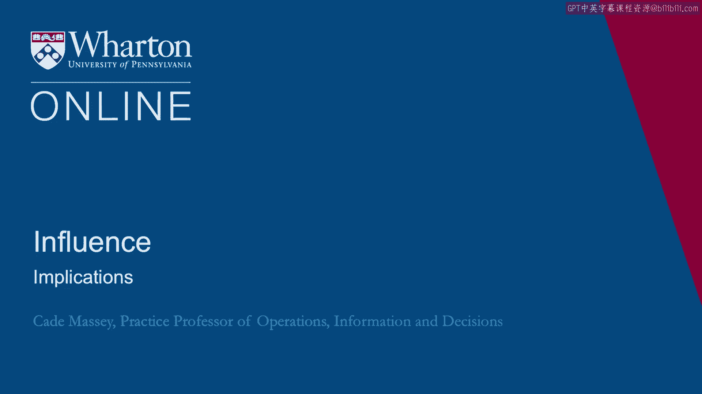
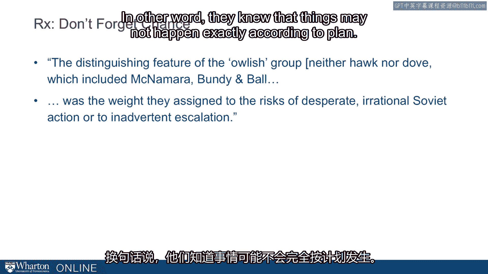
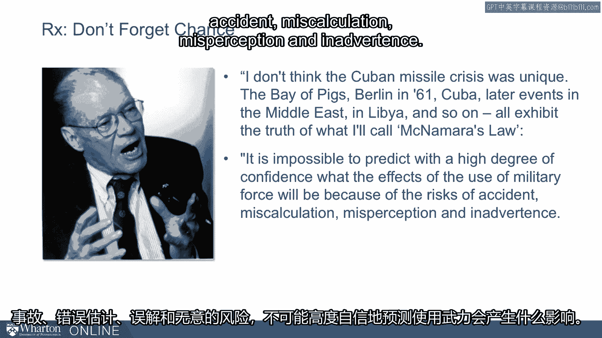

# 沃顿商学院《实现个人和职业成功（成功、沟通能力、影响力）｜Achieving Personal and Professional Success》中英字幕 - P74：10_启示.zh_en - GPT中英字幕课程资源 - BV1VH4y1J7Zk

 So， what are the implications of this model for you as you think about your organization。

 and the organizations you're trying to navigate and negotiate with？ So first。

 the models reveal sources of power and constraints on power。

 So each of these models point out ways in which decisions get made。 Those are opportunities。

 but they're also limitations。 So this suggests that savvy analysis requires using multiple perspectives。

 One of the reasons this is so important is that we tend to bring a particular lens to， situations。

 We tend to have chronic ways of thinking about situations。 So。

 Allison's entire motivation was to push the field of political science away from their。

 chronic lens of rational analysis。 What is your chronic lens？

 Do you tend to think of organizations and actions as rational actions？

 Some of you might have a chronic lens of bureaucratic politics。

 You think all of it is fed up from the individual bargains that are cut at the lower levels。

 And then few of us， and we're going to emphasize this more， few of us have this middle model。

 this model to， this routinized process where a lot of organizations' behavior is just， inertia。

 It's just routine。 But it's not a very interesting one。 So it usually doesn't draw our attention。

 We don't tend to explain behavior that way。 Allison's point is we're going to better understand organizations if we bring multiple perspectives。

 if we move from one to the other as we try to understand what happened or predict what。

 is going to happen in the future。 This is connected a little to some recent research by Phil Tetlock。

 Tetlock is now here at the University of Pennsylvania。

 This book was written when he was at Berkeley。 And it was a unique study of judgment in the field of psychology。

 Usually when judgment study in psychology， especially historically， it's done with experimental。

 research， often using students。 And they're short， they're short little stimuli。

 Tetlock did something quite unusual。 He decided to study the judgment of real world experts。

 economists， political commentators， political scientists about real world problems。

 Things like what's going to happen in South Africa， what's going to happen with the dissolution。

 of the Soviet Union， what's going to happen in future elections， where is the economy going？

 So over a 10-year period of time， which at the time was unheard of to study judgment this， way。

 over a 10-year period of time， Tetlock captured people's predictions and then followed。

 what actually happened in the world to figure out how good they were at making these predictions。

 And what he found was that there is rampant overconfidence。

 The overconfidence we observe in the lab， we also observe in the real world。 And importantly。

 he was trying to understand what distinguishes those who are overconfident。

 from those who are well calibrated。 And he couldn't find anything。

 Nothing that you might think would predict that。 Education， political orientation， gender。

 these things don't relate to that。 He did find one difference though。

 and he called it cognitive style。 And he differentiates what he called foxes barring framework from Irving Berlin。

 foxes， from hedgehogs。 This actually differentiated those who are overconfident from those who are better calibrated。

 What does he mean by it？ Hedgehogs， Tetlock says， are thinkers who know one big thing。

 They aggressively extend the explanatory reach of that one big thing into new domains。

 They display bristly impatience with those who don't get it and express considerable confidence。

 that they are already pretty proficient forecasters， at least in the long term。 Foxes。

 on the other hand， are， Tetlock says， thinkers who know many small things， tricks， of the trade。

 They're skeptical of grand schemes。 They see explanation and prediction not as deductive exercises。

 but rather exercises in， flexible ad hocory that requires stitching together diverse sources of information。

 And these judges are rather different about their own forecasting ability。

 This is the big distinction， and this is the only distinction he found that predicts good。

 judgment in these real world， meaningful situations。

 We bring it up now because foxes are exactly the kind of folks that would use all three。

 levels from Allison's models。 Foxes are those who don't go to the map believing in Model 1 or go to the map believing in Model。

 3。 They think， "Well， I need to look at these situations from multiple perspectives。

 I'm going to be a better judge of what happens next if I bring multiple lenses to this situation。"。

 Finally on the implications for Allison's models， not all models are equally appreciated。

 My hypothesis is that while Model 1 has been long dominant in political analysis and many。

 of us obsess on Model 3， especially in our own organizations， we're all too familiar。

 with the bureaucratic negotiations that go on in the hours。

 We sometimes might neglect what happens in other organizations， but we tend to think。

 some about Model 3。 What really gets neglected is Model 2， these organizational processes。

 You might think just to make it a little more real， what are some examples in your organization。

 where routinized processes are driving what you guys are doing？

 Routineized processes would be the best explanation of why some outcome occurs or some decision。

 is made。 Over time， I've collected some examples from students of these things。

 They talk about things like the British Petroleum oil spill in the Gulf a few years ago， how。

 BP responded to that， some of the MMS licensing issues that led to it in the first place， how。

 the government responded after Katrina， Hurricane Katrina in 2005。

 A lot of it was just routinized behavior， not well adapted to the circumstances that were。

 taking place then。 The intelligence gathering that took place before and after 9/11。

 these are all governmental， examples， but there are non-governmental examples as well。 In hospitals。

 many routinized procedures in hospitals and for good reason， sometimes they。

 have those procedures in order to protect downsides， but so much becomes routinized as， a result。

 An example some students gave a few years ago was campus recruiting。 At the time。

 I was at Yale and some students said， "I'd like to think that these organizations。

 come and they recruit at Yale because we're the best school， but it could just be， in。

 fact I'm sure it is in some cases， just because that's what they've been doing。"。

 Or somebody said it in motion 10 years ago because they were close or they knew somebody。

 and now it's just the way things are done。 We have examples of students who work in newspaper。

 how much of newspaper's operations are just， built around that daily cycle of producing the newspaper。

 So again， pushing you on this kind of underappreciated aspect of what happens in organizations。

 It's underappreciated model for why organizations do what they do， what organizational processes。

 are driving your organization， what organizational processes might you attend to if you want to。

 influence what happens in organizations。 We have one more implication and it doesn't flow as immediately from Allison as from all。

 of the psychology research that's come since Allison and that is don't forget about chance。

 A danger of the framework that Allison is suggesting is that you can fully explain what happened。

 but if you fully explain what happens， you're going to leave out the role of chance and that's。

 going to make you a bad predictor of what happens in the future because there's always。

 a lot of uncertainty in chance in what happens in the future。 So one last admonition。

 don't forget about chance。 So it turns out that even those in the administration at the time were thinking about chance。

 There was a group， I mentioned before that this was where the terms hawks and doves comes， from。

 but in subsequent analysis people have talked about there's kind of an owlish group。

 neither hawk nor dove。 This included McNamara， Bundy and Ball and it came from the weight that they assigned to。

 the risk of desperate irrational Soviet action or inadvertent escalation。

 In other words， they knew that things may not happen exactly according to plan。

 They knew that there was chance of accident that would lead to disaster or the initiation。

 of nuclear war and that consideration of chance informed their decision making。

 McNamara late in life they did a documentary on him and he talked about this， the crisis。

 This is 50 years， 40 years， 45 years after it happened and he says， "I don't think。

 the Cuban Missile Crisis was unique。 The Bay of Pigs， Berlin in 1961。

 Cuba and then later events in the Middle East and Libya and。

 so on all exhibit the truth of what I'll call McNamara's law。

 McNamara's law is it is impossible to predict with the high degree of confidence what the。

 effects of the use of military force will be because of the risks of accident， miscalculation。

 misperception and inadvertence。

 In my opinion this law ought to be inscribed above all the doorways in the White House and。

 the Pentagon and it is the overwhelming lesson of the Cuban Missile Crisis。 Again。

 he's talking about military but we know that chance applies to non-military situations。

 as well and the last implication is we've got these perspectives， we've got these models。

 but we need to also account for chance。 [BLANK_AUDIO]。

