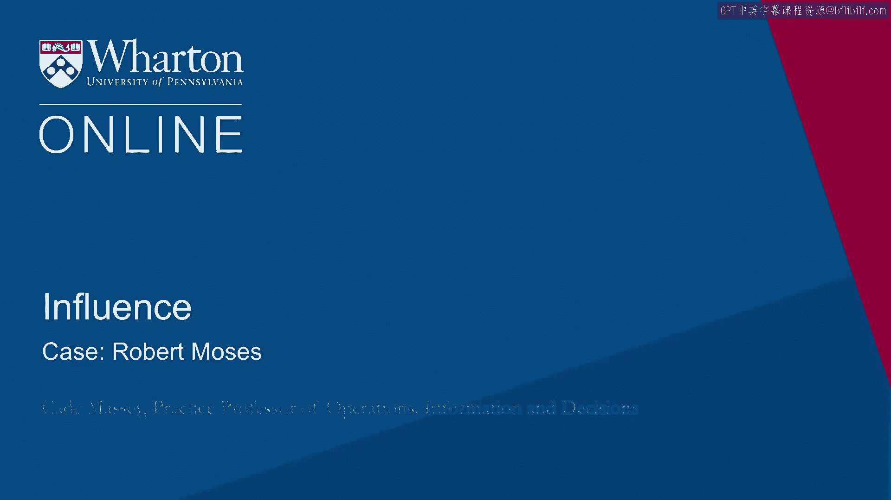
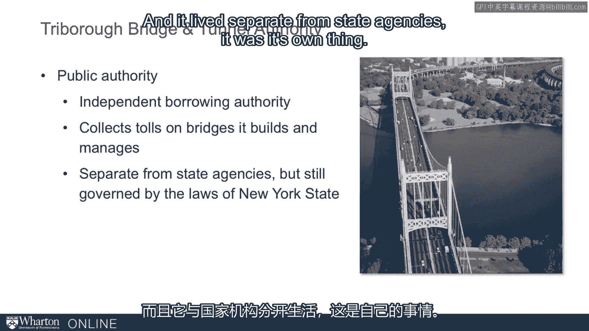
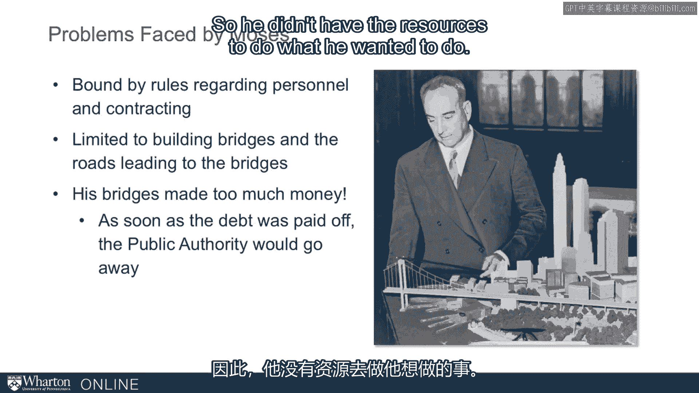

# 沃顿商学院《实现个人和职业成功（成功、沟通能力、影响力）｜Achieving Personal and Professional Success》中英字幕 - P75：11_罗伯特·摩西案例.zh_en - GPT中英字幕课程资源 - BV1VH4y1J7Zk

 Earlier in this module， we emphasized the importance of organizational processes。

 This model to that Graham Allison introduced us to。

 And a master of organizational processes is Robert Moses。

 He is a big figure in the field of power and influence and for good reason。

 We'll understand more of that as we go through here。

 But it's also a perfect place to start coming out of the Cuban Missile Crisis because one。

 of his biggest sources of power was his mastery of organizational processes。

 I want to tell you a quick story about that。 And this story comes from The Power Broker。

 Much of what we know about Robert Moses comes from Robert Caro's book about him in the early， 70s。

 This was Caro's first book。 Caro's gone on to write a four volume。

 about to be five volume biography of Lyndon Johnson。

 He writes essentially a thousand page book every ten years。 And his first was on Robert Moses。

 So Moses was transportation commissioner in New York。

 He was actually a commissioner of many different agencies around the New York area in the 30s， 40s。

 50s and 60s。 Into the early 70s， Robert Moses held power in New York。 It is an amazing run。

 People have called him the most influential figure in New York City in the 20th century。

 And there's no example across the US of anyone in another city who held power as long as， he did。

 So how did he hold power that long？ What can we understand about power from observing what Robert Moses did？

 So a quick story from The Power Broker and especially tapping into this issue of organizational。

 processes。 So one of Moses's responsibilities included the Triboro Bridge and Tunnel Authority。

 So this was the early 30s。 This was the dawn of the use of authorities in the US。

 And authorities were very focused on particular causes， particular needs。

 You need a new bridge built？ Well， we'll organize an authority。

 They can collect tolls on the bridge。 Once the bridge is paid off， the authority goes away。

 So it was an independent borrowing authority。 And like the other ones。

 it was for the purpose of collecting tolls on the bridges built and， managed。

 And it lived separate from state agencies。

 It was its own thing， but it was governed by the laws of New York state。

 And Moses was happy to have this way to build a bridge， but Moses was a man of great ambition。

 Moses wanted to build lots of bridges and lots of roads and lots of parkways。

 He wanted to transform the infrastructure of the New York area and he was very， very good， at it。

 So this was limiting that this thing was so focused and limited in time it would go away。

 So he faced a number of problems。 He was also bound by the state laws。

 He could only contract personnel in a certain way。 He couldn't hire people to do long term planning。

 For example， he couldn't work them。 And over time。

 he had to live by these state laws which didn't fit with the way he wanted， to work。

 He was also limited to building bridges and roads that led to bridges。

 So it's very focused on bridges。 That's kind of the whole concept of authority。

 At least early in the US was around bridges。 There was one exception with the New York Harbor。

 Otherwise， it was around these very precise infrastructure projects。

 And then the last problem was that the bridges made too much money。

 The tolls paid off the bridge in no time at all。 And the maintenance required for the bridge was pretty low。

 And so the authority would be up， built the bridge， and then it went away。

 And all this revenue that he could produce disappeared as well。

 So he didn't have the resources to do what he wanted to do。

 So what does he do about this？ How does he navigate these problems？ Here's Moses。

 He's not an elected official。 In fact， he had run for office early on to realize he wasn't going to win office and。

 took this other route to influence。 He had developed expertise in drafting laws。

 He was well known in Albany。 He had a good track record。 He had gotten many things built and done。

 And so he had the confidence of the lawmakers in Albany， the state capital of New York。

 And so his trick was to change the rules， essentially。

 He got the law regarding the powers of authorities and the nature of bonds changed。

 He did this by literally writing legislation and Albany on it。 So under the new rules that he wrote。

 the authority could retire and issue new bonds。 Under the new rules。

 the authority could build projects not inconsistent with bridges。

 So remember previously they were limited to bridges and roads leading to bridges now。

 They can do anything they want to， as long as they're not inconsistent with bridges。

 This is as liberal as one could write that。 And then finally。

 the authority was not bound by the civil service rules that applied to， the government agencies。

 So how do you do this？ How do you pull this off？ So Carol walks us through this amazing story of if the legislators and the public officials。

 had known that he was doing this， they wouldn't have let it go。 Right？ So how did he do it？

 He did a couple of things。 Mostly he surreptitiously dropped the verbiage into the back of the bill。

 Or he would use a clause late in the bill that directly contradicted the obvious clause。

 in the front of the bill in this direction。 So partly because he was good。

 partly because they trusted him， he was able to do that。

 But that wouldn't be sufficient if once it came to light they could change it。

 That was a real trick here。 How could he keep it from being changed？

 He did that because he wrote this not just into legislation。

 He wrote it into the contracts that went with the bonds。 This is something he saw。

 a capability he saw of authorities that no one else had seen。

 that bonds once issued are contracts from the bond issuers to the bond holders。 It's a contract。

 And contracts are protected by the Constitution of the United States。

 Nobody can supersede a contract。 No state authority。

 no nothing less than the Constitution can contradict a contract。 So once he wrote these specs。

 these changes in regulations into the contracts associated， with the bonds。

 he had a contract that the state officials had no power over whatsoever。

 So that was a trick。 And then there was one last element。 And that was， well。

 what about the fact that the funds go， they pay off the bridge too， quickly。 Therefore。

 you issue the bonds， fine， but you've got to retire the bonds as soon as the thing， is done。

 This was his last trick here。 He wrote， this was an example of his bearing deep in legislation terms that completely contradict。

 the obvious one。 At the top of the legislation， the existence of the authority， it says。

 same as it always， did。 Once this thing is paid off， it goes away。 It's buried deep。 It writes。

 "The authority shall have power from time to time to refund any bonds by the， issuance of new bonds。

 whether the bonds to be refunded have or have not matured and。

 may issue bonds partly to refund bonds then outstanding and partly for any other corporate。

 purpose。 Basically， he could do whatever he wants to。 He can issue bonds anytime he wants to。

 And remember that in those bonds are these contracts that give him these rights that can't。

 be superseded by local authorities or state authorities。 They're protected by the Constitution。

 It is a remarkable power grab and it protected him。

 It gave him the power essentially to do what he wanted to do for a lifetime。

 It's really not much of an exaggeration to say for a lifetime he secured his power by。

 mastering the organizational processes that govern the authority。

 People didn't realize this for a while， but once he had done this， he didn't hold back。

 And the mayor in New York at the time was Fierrilla Ligardia。

 He had been working with Ligardia and he was going to go on to work with Ligardia。

 And Ligardia of course was a very popular mayor。 But when he heard that Moses had started hiring people in a very different way。

 hiring people， he wanted to， running them in a way that conflicted with municipal guidelines。

 Ligardia wrote him。 And he said he basically protested and Moses said， "Look。

 I'll take it up with my lawyers， and the bondholders。"， And Ligardia's going， "The bondholders。

" he says。 Ligardia says， "The mayor established that。 That's just the policy for the city。

 And the authority bondholders have absolutely nothing to say。"， Moses's reply was quite succinct。

 He said， "I think you'd better read the agreements and contracts。"， He had check-made Ligardia。

 He had check-made Ligardia for his lifetime。 And with that power。

 he went on to exercise extraordinary influence over the New York， area。 Thank you。 [BLANK_AUDIO]。

