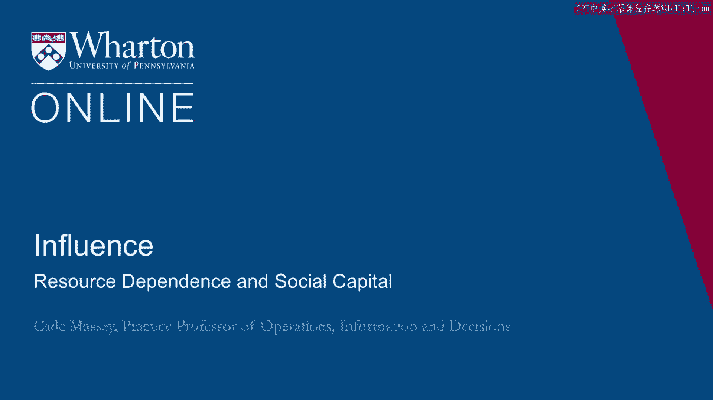
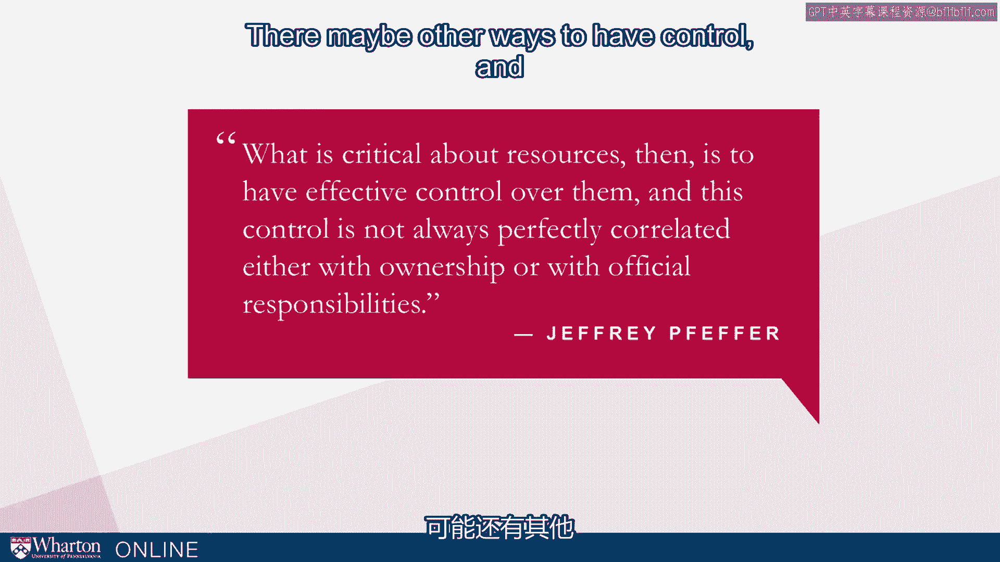
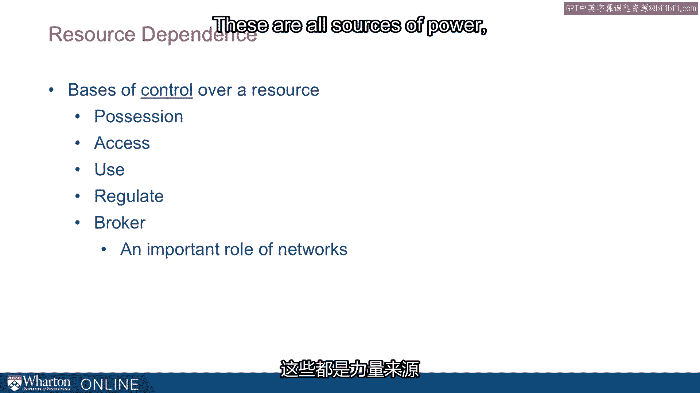
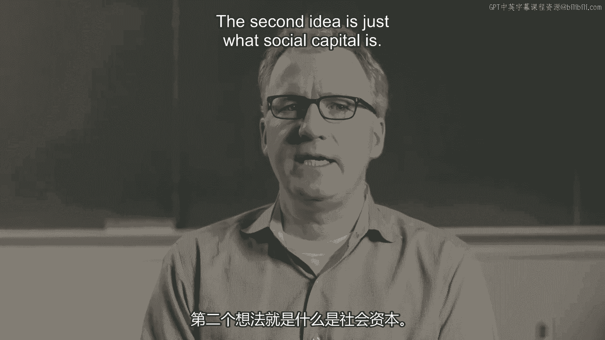
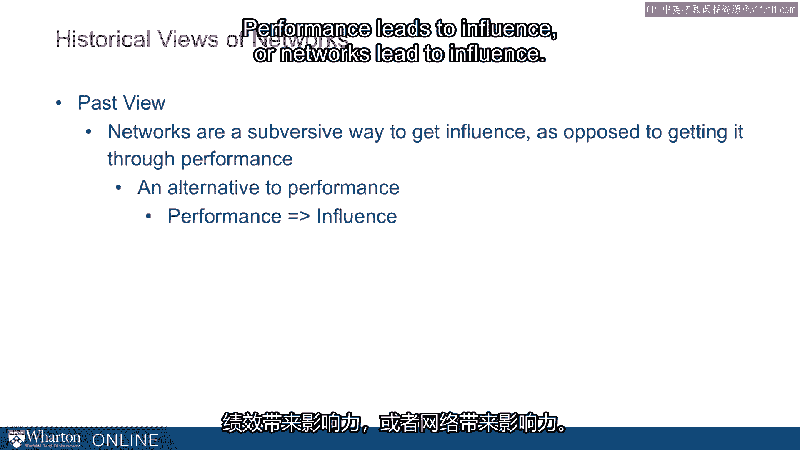
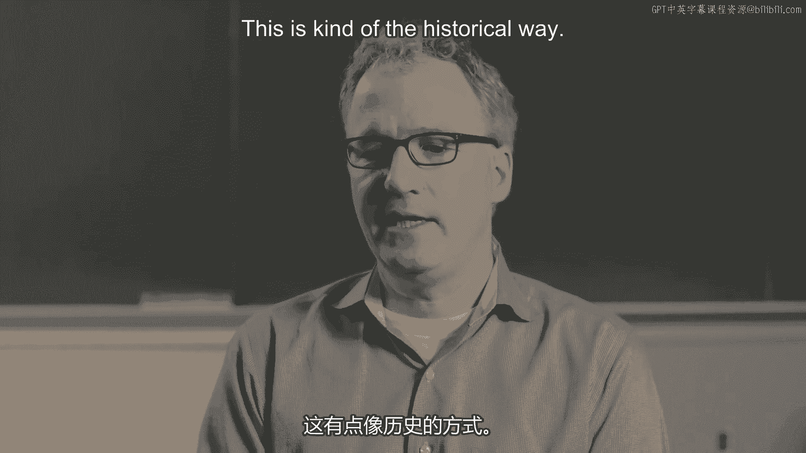
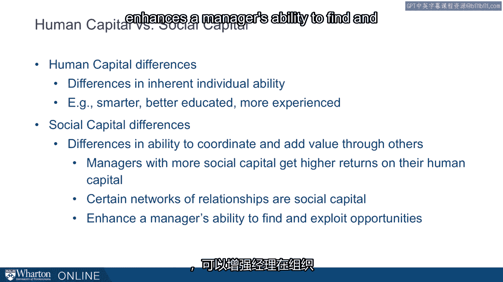
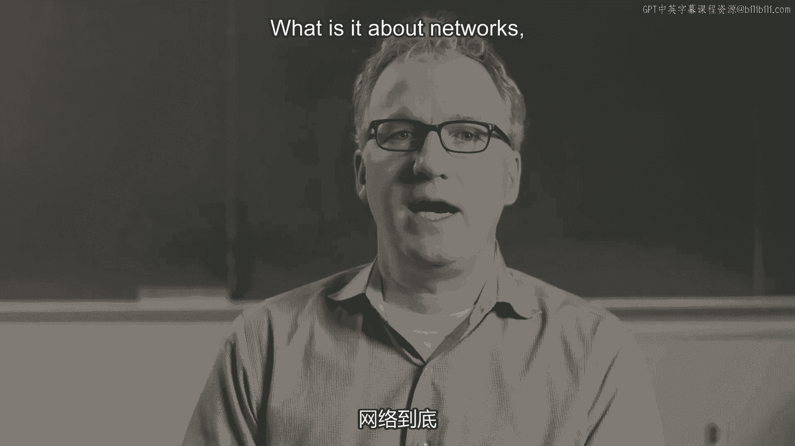
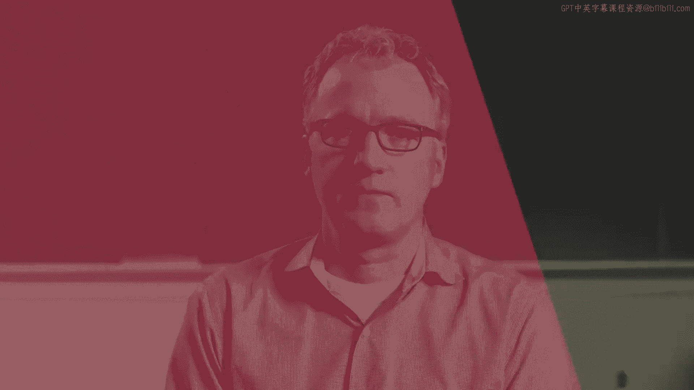

# 沃顿商学院《实现个人和职业成功（成功、沟通能力、影响力）｜Achieving Personal and Professional Success》中英字幕 - P80：16_资源依赖与社会资本.zh_en - GPT中英字幕课程资源 - BV1VH4y1J7Zk

 I want to get two basic ideas out before we dive into the details of informal networks。

 One is resource dependence。 This is an idea that really began Jeff Efres career。

 Jeff is someone we're going to talk about multiple times。

 We're going to quote multiple times in this course。

 And he began his work looking at this notion of resource dependence。 He summarizes it this way。

 "Power is vested in us by the dependence of others。"。

 And that dependence is a function of how much others need what we control， as well as。

 how many alternative sources for that resource there are。

 So it's really putting the heart of power on what other people need from us。 And therefore。

 what it is that we control that they can't get somewhere else。

 One thing he goes to some effort to elaborate is that this doesn't mean you have to own。

 the resource。 You just have to have effective control over it。

 So it's not always perfectly correlated ownership and control。

 There may be other ways to have control and therefore power that don't involve ownership。

 Some of those include possession， of course， but also access。

 If you can control access to a resource， you have power over it。 If you can control how it's used。

 if you can regulate。 And then a very important idea for our discussion of networks。

 if you can broker， if you can， bring together those who need it with those who actually have the resource。

 These are all sources of power and they're going to be very relevant as we talk about。

 networks。 The second idea is just what social capital is。

 Historically， we have thought about networks as kind of a subversive way to get influence。

 It's an alternative to performance。 You can be good at your job or you can have a network。

 You can think of it this way。

 Performance leads to influence or networks lead to influence。 This is kind of the historical way。

 In other words， networks and social capital had a bad reputation。

 This old view has been replaced by a newer view which says that networks actually drive。

 performance。 It's through networks that we perform。

 Networks become a means of performance as opposed to an alternative。

 You can think of it as networks， driving performance， then driving influence。 Very different take。

 This says， look， it's not an alternative。 We know you have to be a good performer， but in fact。

 part of being a good performer is， having that network。

 You can think about this as two broad buckets， human capital and social capital。

 We're accustomed to thinking about our employees or our talent as we manage it in terms of human。

 capital。 Those are typically thought of as inherent individual ability。

 Some folks are smarter than others。 Some are better educated。 Some are more experienced than others。

 Increasingly， we recognize that what folks bring to an organization or bring to the table。

 is their social capital。 In fact， people differ in their social capital。

 They differ in their ability to coordinate and add value through other people。

 Managers with more social capital actually get more returns on their human capital。

 Certain networks that people have are of higher social capital than other networks。 In general。

 having a good social network， having high social capital enhances a manager's ability。

 to find and exploit opportunities inside the organization and outside the organization。

 This is a more current view of thinking about networks and social capital。

 It motivates us to dive more deeply into， "Okay， that's interesting。 What is it about networks？

 What is it about social capital that makes some more valuable than others？"， [BLANK_AUDIO]。

